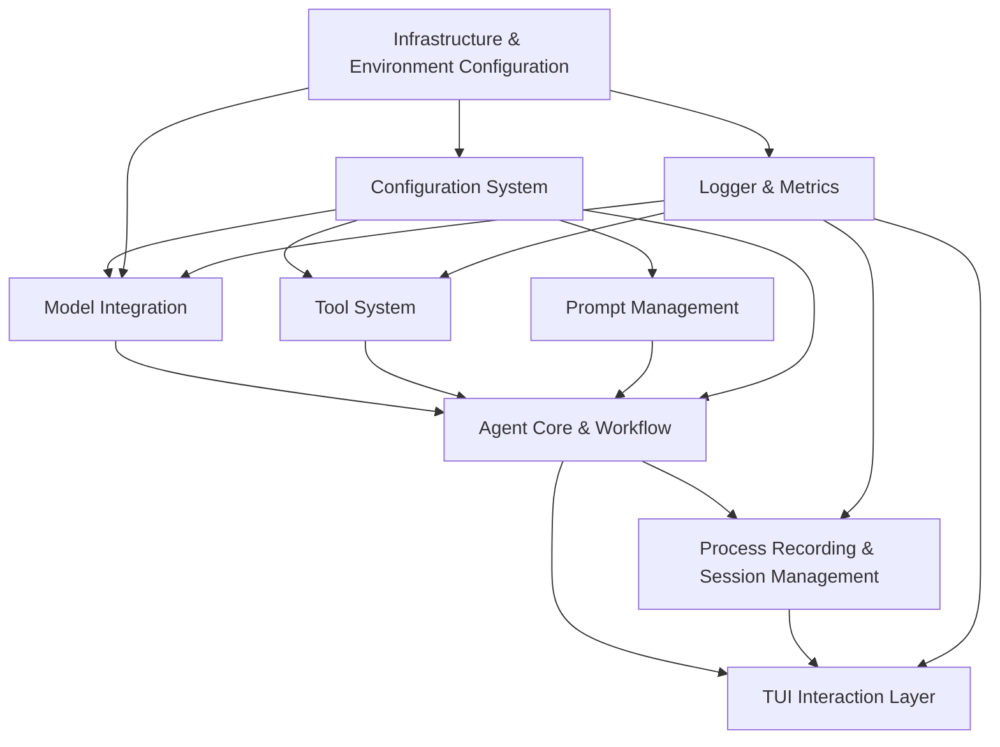

# Modular Agent Framework Developer Guide

This document provides essential information for AI agents working with the Modular Agent Framework codebase.

## Project Overview

The Modular Agent Framework is a Python-based multi-agent system built on LangGraph, featuring:
- Multi-model LLM integration (OpenAI, Gemini, Anthropic)
- Flexible tool system supporting native, MCP, and built-in tools
- Configuration-driven architecture with YAML-based configs
- LangGraph Studio integration for visualization and debugging
- Clean architectural layers: domain, infrastructure, application, presentation

## Development Environment Setup

### Prerequisites
- Python 3.13+
- uv (Python package manager) - install single package via `uv add`

### Environment Setup with uv
(already complete)
```bash
# Create virtual environment
uv venv

# Activate virtual environment
#(In VSCode, you can skip this step. IDE can automatically activate virtual environment)
source .venv/bin/activate  # Linux/Mac
# or
.venv\Scripts\activate  # Windows

# Install dependencies
uv sync

# Install test dependencies
uv sync --group test
```

### Development Tools Setup
(already complete)
```bash
# Install mypy for type checking
uv add mypy

# Install black for code formatting
uv add black

# Install isort for import sorting
uv add isort

# Install flake8 for linting
uv add flake8
```

## Development Commands

### Environmet Management
```bash
# Install a package(use uv add to sync with uv.lock and pyproject.toml)
uv add package_name

# Check if a certain package is installed
uv pip list | findstr package_name
```

### Code Quality Tools
(usually mypy is enough. if I didn't ask you to use reaminging tools, you can skip them)
If I don't ask you to check whole codebase, always use --follow-imports=silent to avoid check reletive files.
```bash
# Type checking with mypy(whole codebase)
mypy .
# or add `--follow-imports=silent` to check specific files
mypy file_reletive_path --follow-imports=silent
# Sometimes mypy can't find some packages. If uv pip list | findstr package_name shows it has been installed, you can ignore this mypy error, as it is a false alarm.

# Code formatting with black
black src/ tests/

# Import sorting with isort
isort src/ tests/

# Linting with flake8
flake8 src/ tests/
```

### Testing
```bash
# Run all tests
pytest

# Run unit tests
pytest tests/unit/

# Run integration tests
pytest tests/integration/

# Generate coverage report
pytest --cov=src --cov-report=html

# Run specific test file
pytest tests/unit/infrastructure/test_container.py

# Run with verbose output
pytest -v
```

### Environment Checking
```bash
# Check environment dependencies
python -m src.infrastructure.env_check_command

# Check with JSON output
python -m src.infrastructure.env_check_command --format json --output env_check.json

# Check with custom Python version requirement
python -m src.infrastructure.env_check_command --python-version 3.13.0
```

### Infrastructure Demo
```bash
# Run infrastructure demo
python demo_infrastructure.py
```

## Codebase Architecture

Based on the PRD documents, the framework follows a layered architecture:

### Architectural Layers (from docs/PRD/1-基础架构与环境配置.md)
```
UI(Presentation) layer → Application service layer → Domain layer → Infrastructure layer
```

### Directory Structure
```
src/
├── domain/          # Business logic and entities (no dependencies on other layers)
├── infrastructure/  # Technical implementations (depends only on domain)
├── application/     # Use cases and workflows (depends on domain and infrastructure)
└── presentation/    # UI and API interfaces (depends on all other layers)
```

### Core Infrastructure Components (from docs/PRD/1-基础架构与环境配置.md)

1. **Dependency Injection Container** (`src/infrastructure/container.py`)
   - Interface: `IDependencyContainer`
   - Manages service lifecycle (singleton, transient, scoped)
   - Supports multi-environment bindings
   - Automatic dependency resolution
   - Provides `get_service(service_type: Type[T]) -> T` method

2. **Configuration Loader** (`src/infrastructure/config_loader.py`)
   - Interface: `IConfigLoader`
   - Loads YAML configuration files
   - Environment variable substitution with `${VAR}` and `${VAR:default}`
   - Hot reloading with file watching
   - Configuration caching

3. **Environment Checker** (`src/infrastructure/environment.py`)
   - Interface: `IEnvironmentChecker`
   - Validates Python version, packages, and system resources
   - Checks configuration file existence
   - Generates detailed environment reports

4. **Architecture Checker** (`src/infrastructure/architecture.py`)
   - Enforces layer dependency rules
   - Detects circular dependencies
   - Validates import relationships

### Configuration System (from docs/PRD/6-配置系统.md)

Configuration structure:
```
configs/
├── global.yaml          # Global settings (logging, secrets, environment)
├── llms/                # Model configurations
│   ├── _group.yaml      # Model group configurations
│   └── *.yaml           # Individual model configurations
├── tool_sets/           # Tool set configurations
├── agents/              # Agent configurations
│   ├── _group.yaml      # Agent group configurations
│   └── *.yaml           # Individual agent configurations
└── workflows/           # Workflow configurations
```

Key features:
- **Configuration inheritance**: Group configurations with individual overrides
- **Environment variable injection**: `${ENV_VAR:DEFAULT}` format
- **Validation**: Pydantic models for configuration validation
- **Hot reloading**: Development environment support

## Module Dependencies and Relationships

Based on the overall project plan (docs/plan/overall-plan.md):



## Development Workflow

### 1. New Feature Development
- Follow the architectural layer constraints
- Register services in the dependency container
- Use configuration files for customization
- Write unit and integration tests
- Ensure type annotations with mypy

### 2. Testing Strategy (from docs/PRD/10-测试框架与策略.md)
- **Unit tests**: Coverage ≥ 90% for core business logic
- **Integration tests**: Coverage ≥ 80% for module interactions
- **End-to-end tests**: Coverage ≥ 70% for complete workflows
- **Performance tests**: LLM call latency ≤ 500ms, session loading ≤ 1s

### 3. Code Quality Standards
- Use type annotations (enforced by mypy)
- Follow black formatting (line length: 88)
- Use isort for import organization
- Pass flake8 linting
- Write comprehensive docstrings

### 4. Configuration Changes
- Update corresponding `_group.yaml` files for group configurations
- Create individual `.yaml` files for specific configurations
- Validate with environment checker
- Document new configuration options
- Ensure environment variable references use `${VAR:DEFAULT}` format

## Error Handling Patterns

Use specific exception types from `src.infrastructure.exceptions`:
- `InfrastructureError` - Base exception
- `ServiceNotRegisteredError` - DI container issues
- `ServiceCreationError` - Service instantiation problems
- `CircularDependencyError` - Dependency cycle detection
- `ConfigurationError` - Config loading problems
- `EnvironmentCheckError` - Environment validation failures
- `ArchitectureViolationError` - Layer dependency violations

## Testing Utilities

The framework provides `TestContainer` for integration testing:
```python
from src.infrastructure import TestContainer

with TestContainer() as container:
    # Setup test environment
    container.setup_basic_configs()
    
    # Get services for testing
    config_loader = container.get_config_loader()
    checker = container.get_environment_checker()
    
    # Test automatically cleans up
```

## Performance Requirements

From the PRD documents:
- Configuration loading: < 100ms (cold start), < 10ms (cached)
- Dependency injection service retrieval: < 1ms
- LLM call latency: ≤ 500ms (Mock environment)
- Session loading: ≤ 1s (100 rounds of history)

## Language
Always use Chinese in the code and documentation.

## Coding Specifications
Must follow mypy type specifications. For example, function must be annotated with type hints.