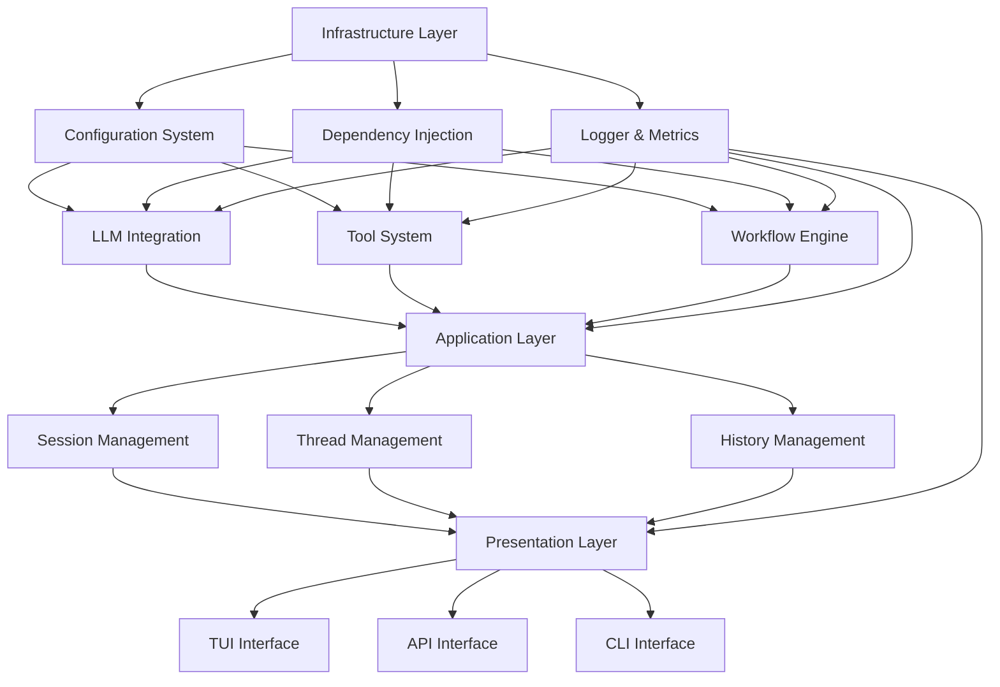
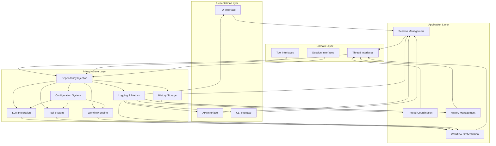

# Modular Agent Framework Developer Guide

This document provides essential information for AI agents working with the Modular Agent Framework codebase.

## Project Overview

The Modular Agent Framework is a Python-based multi-agent system built on LangGraph, featuring:
- **Multi-model LLM integration** (OpenAI, Gemini, Anthropic, Mock)
- **Flexible tool system** supporting native, MCP, and built-in tools
- **Configuration-driven architecture** with YAML-based configs and environment variable injection
- **LangGraph Studio integration** for visualization and debugging
- **Clean architectural layers**: Domain → Application → Infrastructure → Presentation
- **Complete dependency injection** with multi-environment support
- **Real-time TUI interface** with rich components
- **RESTful API** for external integration
- **Session and thread management** with checkpoint persistence
- **Workflow engine** with ReAct and other patterns

## Development Environment Setup

### Prerequisites
- Python 3.13+
- uv (Python package manager) - install single package via `uv add`

### Environment Setup with uv
(already complete)
```bash
# Create virtual environment
uv venv

# Activate virtual environment
#(In VSCode, you can skip this step. IDE can automatically activate virtual environment)
source .venv/bin/activate  # Linux/Mac
# or
.venv\Scripts\activate  # Windows

# Install dependencies
uv sync

# Install test dependencies
uv sync --group test
```

### Development Tools Setup
(already complete)
```bash
# Install mypy for type checking
uv add mypy

# Install black for code formatting
uv add black

# Install isort for import sorting
uv add isort

# Install flake8 for linting
uv add flake8
```

## Development Commands

### Environment Management
```bash
# Install a package (use uv add to sync with uv.lock and pyproject.toml)
uv add package_name

# Check if a certain package is installed
uv pip list | findstr package_name

# Install development dependencies
uv sync --group dev

# Install test dependencies
uv sync --group test

# Update all dependencies
uv sync --upgrade
```

### Code Quality Tools
(usually mypy is enough. if I didn't ask you to use remaining tools, you can skip them)
If I don't ask you to check whole codebase, always use --follow-imports=silent to avoid check relative files.
```bash
# Type checking with mypy (whole codebase)
mypy .
# or add `--follow-imports=silent` to check specific files
mypy file_relative_path --follow-imports=silent
# Sometimes mypy can't find some packages. If uv pip list | findstr package_name shows it has been installed, you can ignore this mypy error, as it is a false alarm.

# Code formatting with black
black src/ tests/

# Import sorting with isort
isort src/ tests/

# Linting with flake8
flake8 src/ tests/

# Run all code quality checks
mypy . && black src/ tests/ --check && isort src/ tests/ --check-only && flake8 src/ tests/
```

### Testing
```bash
# Run all tests
pytest

# Run unit tests
pytest tests/unit/

# Run integration tests
pytest tests/integration/

# Generate coverage report
pytest --cov=src --cov-report=html

# Run specific test file
pytest tests/unit/infrastructure/test_container.py

# Run with verbose output
pytest -v

# Run tests with coverage and generate HTML report
pytest --cov=src --cov-report=html:cov_html --cov-report=term

# Run tests with performance benchmarks
pytest --benchmark-only
```

### Environment Checking
```bash
# Check environment dependencies
python -m src.infrastructure.env_check_command

# Check with JSON output
python -m src.infrastructure.env_check_command --format json --output env_check.json

# Check with custom Python version requirement
python -m src.infrastructure.env_check_command --python-version 3.13.0

# Check environment with detailed report
python -m src.infrastructure.env_check_command --verbose
```

### Application Execution
```bash
# Run TUI application
python src/run_tui.py

# Run API server
python -m src.presentation.api.run_api

# Run CLI interface
python -m src.presentation.cli.main

# Run infrastructure demo
python demo_infrastructure.py
```

### Development Utilities
```bash
# Generate dependency graph
python -m src.infrastructure.graph.visualization

# Validate configuration files
python -m src.infrastructure.config_loader --validate

# Check architecture compliance
python -m src.infrastructure.architecture_checker

# Generate API documentation
python -m src.presentation.api.main --docs
```

## Codebase Architecture

### Architectural Layers
```
Presentation Layer (TUI/API) → Application Layer → Domain Layer → Infrastructure Layer
```

### Directory Structure
```
src/
├── domain/              # Business logic and entities (no dependencies on other layers)
│   ├── threads/         # Thread management interfaces
│   ├── tools/           # Tool interfaces and types
│   └── sessions/        # Session management interfaces
├── infrastructure/      # Technical implementations (depends only on domain)
│   ├── container.py     # Dependency injection container
│   ├── config_loader.py # Configuration management
│   ├── environment.py   # Environment validation
│   ├── llm/            # LLM client implementations
│   ├── tools/          # Tool system implementation
│   ├── graph/          # LangGraph integration
│   ├── history/        # History and checkpoint management
│   ├── logger/         # Logging and metrics
│   └── monitoring/     # Performance monitoring
├── application/         # Use cases and workflows (depends on domain and infrastructure)
│   ├── sessions/       # Session management
│   ├── workflow/       # Workflow orchestration
│   ├── threads/        # Thread coordination
│   └── history/        # History management
└── presentation/       # UI and API interfaces (depends on all other layers)
    ├── tui/           # Terminal user interface
    ├── api/           # RESTful API
    └── cli/           # Command line interface
```

### Core Infrastructure Components

1. **Dependency Injection Container** (`src/infrastructure/container.py`)
   - Interface: `IDependencyContainer`
   - Implementation: `DependencyContainer`, `OptimizedDependencyContainer`
   - Manages service lifecycle (singleton, transient, scoped)
   - Supports multi-environment bindings (development, test, production)
   - Automatic dependency resolution with type hints
   - Circular dependency detection and prevention
   - Performance monitoring and caching
   - Provides `get_service(service_type: Type[T]) -> T` method

2. **Configuration Loader** (`src/infrastructure/config_loader.py`)
   - Interface: `IConfigLoader`
   - Loads YAML configuration files with inheritance support
   - Environment variable substitution with `${VAR}` and `${VAR:default}` syntax
   - Hot reloading with file watching using watchdog
   - Configuration caching for performance optimization
   - Configuration validation with Pydantic models
   - Multi-environment configuration support

3. **Environment Checker** (`src/infrastructure/environment.py`)
   - Interface: `IEnvironmentChecker`
   - Validates Python version compatibility (≥3.13)
   - Checks required package dependencies
   - Validates system resources (memory, disk space)
   - Checks configuration file existence and accessibility
   - Generates detailed environment reports in multiple formats

4. **LLM Module** (`src/infrastructure/llm/`)
   - Multi-provider support: OpenAI, Gemini, Anthropic, Mock
   - Connection pooling with configurable pool sizes
   - Intelligent fallback mechanisms for service failures
   - Token counting with provider-specific tokenizers
   - Rate limiting and request queuing
   - Plugin system for custom LLM integrations
   - Performance monitoring and metrics collection

5. **Tool System** (`src/infrastructure/tools/`)
   - Support for native Python tools, MCP tools, and built-in tools
   - Dynamic tool discovery and registration
   - Schema validation and OpenAPI schema generation
   - Tool execution management with error handling
   - Tool caching for performance optimization
   - Tool lifecycle management

6. **Workflow Engine** (`src/infrastructure/graph/`)
   - LangGraph integration with custom extensions
   - State management with serialization capabilities
   - Node registry for dynamic workflow composition
   - Graph execution with checkpoint persistence
   - Workflow visualization and debugging support
   - Performance monitoring and optimization

7. **Session Management** (`src/application/sessions/`)
   - Session lifecycle management (create, update, delete)
   - Thread management with metadata tracking
   - Checkpoint persistence and restoration
   - Session state serialization
   - Event collection and replay capabilities

8. **History Management** (`src/infrastructure/history/`)
   - Complete conversation history storage
   - Checkpoint management with SQLite backend
   - History replay and analysis
   - Performance metrics collection
   - Storage optimization and compression

9. **Logging System** (`src/infrastructure/logger/`)
   - Multi-output logging (console, file, JSON)
   - Structured logging with rich formatting
   - Log redaction for sensitive information
   - Performance metrics collection
   - Integration with monitoring systems

10. **TUI Interface** (`src/presentation/tui/`)
    - Rich terminal user interface with blessed
    - Real-time workflow visualization
    - Interactive session management
    - Component-based UI architecture
    - Event-driven interaction model

11. **API Interface** (`src/presentation/api/`)
    - RESTful API with FastAPI framework
    - WebSocket support for real-time communication
    - Authentication and authorization
    - API documentation with OpenAPI
    - Rate limiting and request validation

### Configuration System

Configuration structure:
```
configs/
├── global.yaml          # Global settings (logging, secrets, environment)
├── application.yaml     # Application-specific settings
├── history.yaml         # History and checkpoint configuration
├── prompts.yaml         # Prompt templates and system messages
├── llms/                # Model configurations
│   ├── _group.yaml      # Model group configurations
│   ├── provider/        # Provider-specific configurations
│   │   ├── openai/      # OpenAI models (GPT-4, GPT-3.5)
│   │   ├── gemini/      # Gemini models (Gemini Pro)
│   │   └── anthropic/   # Anthropic models (Claude)
│   └── tokens_counter/  # Token counting configurations
├── agents/              # Agent configurations
│   ├── _group.yaml      # Agent group configurations
│   ├── default.yaml     # Default agent configuration
│   ├── advanced.yaml    # Advanced agent configuration
│   └── data_analyst.yaml # Data analysis agent configuration
├── tool-sets/           # Tool set configurations
│   └── _group.yaml      # Tool set group configurations
├── tools/               # Individual tool configurations
│   ├── calculator.yaml  # Calculator tool
│   ├── database.yaml    # Database tool
│   └── weather.yaml     # Weather tool
└── workflows/           # Workflow configurations
    ├── base_workflow.yaml    # Base workflow template
    ├── react_workflow.yaml   # ReAct workflow
    ├── plan_execute.yaml     # Plan-Execute workflow
    ├── collaborative.yaml    # Collaborative workflow
    └── human_review.yaml     # Human review workflow
```

Key features:
- **Configuration inheritance**: Group configurations with individual overrides using `inherits_from` field
- **Environment variable injection**: `${ENV_VAR:DEFAULT}` format with automatic resolution
- **Validation**: Pydantic models for configuration validation with type safety
- **Hot reloading**: Development environment support with file watching
- **Multi-environment**: Test, development, production environments with environment-specific overrides
- **Modular structure**: Hierarchical configuration for easy maintenance
- **Type safety**: Strong typing with validation for all configuration options
- **Performance**: Caching and lazy loading for optimal performance

#### Configuration Inheritance Example:
```yaml
# configs/llms/_group.yaml
openai_group:
  base_url: "https://api.openai.com/v1"
  headers:
    User-Agent: "ModularAgent/1.0"
  parameters:
    temperature: 0.7
    max_tokens: 2000

# configs/llms/provider/openai/openai-gpt4.yaml
inherits_from: "../../_group.yaml#openai_group"
model: "gpt-4"
parameters:
  temperature: 0.8  # Override group setting
  max_completion_tokens: 1000  # Add new parameter
```

#### Environment Variable Injection Example:
```yaml
# configs/global.yaml
api_key: "${OPENAI_API_KEY:default_key}"
database_url: "${DATABASE_URL:sqlite:///storage/agent.db}"
log_level: "${LOG_LEVEL:INFO}"
```

## Module Dependencies and Relationships



## Development Workflow

### 1. New Feature Development
- Follow the architectural layer constraints (Domain → Application → Infrastructure → Presentation)
- Register services in the dependency container using appropriate lifecycle (singleton, transient, scoped)
- Use configuration files for customization with inheritance and environment variable support
- Write unit and integration tests with proper mocking
- Ensure type annotations with mypy and follow Python 3.13+ type hints
- Use dependency injection for all service dependencies
- Implement proper error handling with custom exception types

### 2. Testing Strategy
- **Unit tests**: Coverage ≥ 90% for core business logic in domain and application layers
- **Integration tests**: Coverage ≥ 80% for module interactions and infrastructure components
- **End-to-end tests**: Coverage ≥ 70% for complete workflows and user scenarios
- **Performance tests**: 
  - LLM call latency ≤ 500ms (Mock environment)
  - Session loading ≤ 1s (100 rounds of history)
  - Configuration loading < 100ms (cold start), < 10ms (cached)
  - Dependency injection service retrieval < 1ms

### 3. Code Quality Standards
- Use type annotations (enforced by mypy with strict mode)
- Follow black formatting (line length: 88, Python 3.13+ target)
- Use isort for import organization with black profile
- Pass flake8 linting with comprehensive rules
- Write comprehensive docstrings with parameter and return type documentation
- Follow dependency injection patterns for all service instantiation
- Use configuration-driven approach for all external dependencies

### 4. Configuration Changes
- Update corresponding `_group.yaml` files for group configurations
- Create individual `.yaml` files for specific configurations with inheritance
- Validate with environment checker before deployment
- Document new configuration options in configuration guide
- Ensure environment variable references use `${VAR:DEFAULT}` format
- Test configuration inheritance and environment variable resolution
- Update configuration validation schemas when adding new options

### 5. Service Registration
- Register services in appropriate dependency injection modules
- Use proper service lifetime (singleton for shared resources, transient for request-scoped)
- Implement service interfaces for all external dependencies
- Provide test implementations for all services
- Use dependency injection container for all service resolution

### 6. Error Handling
- Use specific exception types from `src.infrastructure.exceptions`
- Implement proper error propagation across layers
- Log errors with appropriate context and severity
- Provide meaningful error messages for users
- Handle configuration errors gracefully with fallbacks

## Error Handling Patterns

Use specific exception types from `src.infrastructure.exceptions`:
- `InfrastructureError` - Base exception
- `ServiceNotRegisteredError` - DI container issues
- `ServiceCreationError` - Service instantiation problems
- `CircularDependencyError` - Dependency cycle detection
- `ConfigurationError` - Config loading problems
- `EnvironmentCheckError` - Environment validation failures
- `ArchitectureViolationError` - Layer dependency violations

## Testing Utilities

The framework provides `TestContainer` for integration testing:
```python
from src.infrastructure import TestContainer

with TestContainer() as container:
    # Setup test environment
    container.setup_basic_configs()
    
    # Get services for testing
    config_loader = container.get_config_loader()
    checker = container.get_environment_checker()
    
    # Test automatically cleans up
```

## Performance Requirements

From the PRD documents:
- Configuration loading: < 100ms (cold start), < 10ms (cached)
- Dependency injection service retrieval: < 1ms
- LLM call latency: ≤ 500ms (Mock environment)
- Session loading: ≤ 1s (100 rounds of history)

## Module Dependencies and Architecture

### Detailed Module Relationships



### Service Registration Patterns

```python
# Example: Workflow Module Service Registration
from src.application.workflow.di_config import WorkflowModule

# Register services with dependencies
WorkflowModule.register_services_with_dependencies(
    container, config_loader, node_registry
)

# Register environment-specific services
if environment == "test":
    WorkflowModule.register_test_services(container)
elif environment == "development":
    WorkflowModule.register_development_services(container)
elif environment == "production":
    WorkflowModule.register_production_services(container)
```

### Configuration Inheritance Example

```yaml
# Base configuration (configs/llms/_group.yaml)
openai_group:
  base_url: "https://api.openai.com/v1"
  parameters:
    temperature: 0.7
    max_tokens: 2000

# Specific configuration (configs/llms/provider/openai/openai-gpt4.yaml)
inherits_from: "../../_group.yaml#openai_group"
model: "gpt-4"
parameters:
  temperature: 0.8  # Override
  max_completion_tokens: 1000  # Add new parameter
```

### Error Handling Patterns

```python
from src.infrastructure.exceptions import (
    InfrastructureError,
    ServiceNotRegisteredError,
    ConfigurationError,
    EnvironmentCheckError
)

try:
    service = container.get(ISomeService)
except ServiceNotRegisteredError as e:
    logger.error(f"Service not registered: {e}")
    # Handle missing service
except ConfigurationError as e:
    logger.error(f"Configuration error: {e}")
    # Handle configuration issues
except InfrastructureError as e:
    logger.error(f"Infrastructure error: {e}")
    # Handle other infrastructure errors
```

## Language
Always use Chinese in the code and documentation.

## Coding Specifications
Must follow mypy type specifications. For example, function must be annotated with type hints.