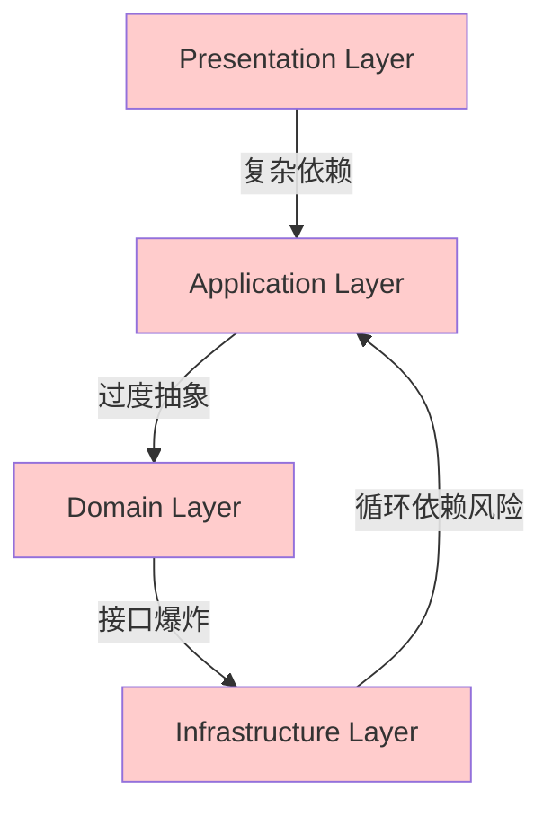
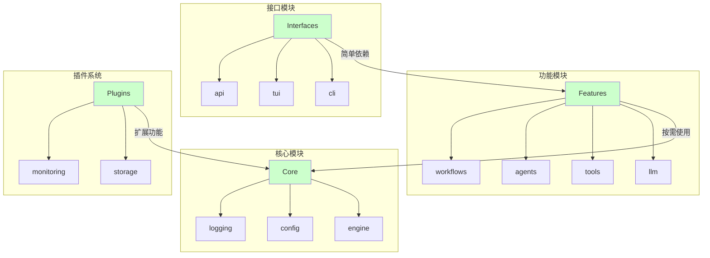

# 架构对比分析

## 当前四层架构 vs 新模块化架构

### 当前架构问题可视化



**问题：**
- 4层严格的分层架构
- 复杂的依赖注入容器
- 60+服务类型需要注册
- 过度抽象和接口爆炸
- 调试困难，调用链过长

### 新架构设计



**优势：**
- 按功能域组织，而非严格分层
- 简单的依赖关系
- 插件化扩展
- 单一配置文件
- 开发友好

## 代码复杂度对比

### 当前架构：简单功能实现

```python
# 当前架构实现一个简单工具需要：
# 1. Domain层定义接口
class ITool(ABC):
    @abstractmethod
    def execute(self, **kwargs) -> Any:
        pass

# 2. Infrastructure层实现
class CalculatorTool(ITool):
    def execute(self, **kwargs) -> Any:
        # 实现逻辑
        pass

# 3. Application层协调
class ToolManager:
    def __init__(self, tool_repository: IToolRepository):
        self.tool_repository = tool_repository
    
    def execute_tool(self, tool_name: str, **kwargs):
        tool = self.tool_repository.get_tool(tool_name)
        return tool.execute(**kwargs)

# 4. Presentation层调用
class TUIApp:
    def __init__(self, tool_manager: ToolManager):
        self.tool_manager = tool_manager
    
    def handle_tool_command(self, tool_name: str, **kwargs):
        return self.tool_manager.execute_tool(tool_name, **kwargs)

# 5. 依赖注入配置
container.register(ITool, CalculatorTool)
container.register(IToolRepository, ToolRepository)
container.register(ToolManager, ToolManager)
container.register(TUIApp, TUIApp)
```

**问题：** 5个文件，50+行代码，复杂的依赖注入配置

### 新架构：简单功能实现

```python
# 新架构实现同样的工具：

# features/tools/calculator.py
class CalculatorTool:
    def execute(self, **kwargs) -> Any:
        # 实现逻辑
        pass

# interfaces/cli/commands.py
class ToolCommands:
    def __init__(self):
        self.tools = {
            'calculator': CalculatorTool()
        }
    
    def execute_tool(self, tool_name: str, **kwargs):
        tool = self.tools.get(tool_name)
        if tool:
            return tool.execute(**kwargs)
        raise ValueError(f"Unknown tool: {tool_name}")

# 直接使用
commands = ToolCommands()
result = commands.execute_tool('calculator', a=1, b=2)
```

**优势：** 2个文件，15行代码，无复杂配置

## 配置复杂度对比

### 当前架构配置

```yaml
# configs/global.yaml
log_level: "DEBUG"
log_outputs:
  - type: "console"
  - type: "file"
    path: "logs/agent.log"

# configs/application.yaml
application:
  name: "ModularAgent"
  environment: "${ENV:development}"

dependencies:
  singletons:
    - "IConfigLoader"
    - "ILLMClientFactory"
    - "IToolManager"

# configs/llms/openai.yaml
provider: "openai"
model: "gpt-4"
api_key: "${OPENAI_API_KEY}"

# configs/tools/calculator.yaml
name: "calculator"
type: "builtin"
class: "CalculatorTool"
```

**问题：** 多个配置文件，复杂的继承关系，难以理解

### 新架构配置

```yaml
# config.yaml
application:
  name: "ModularAgent"
  environment: "${ENV:development}"

core:
  logging:
    level: "DEBUG"
    outputs:
      - type: "console"
      - type: "file"
        path: "logs/agent.log"

features:
  llm:
    default_provider: "openai"
    providers:
      openai:
        model: "gpt-4"
        api_key: "${OPENAI_API_KEY}"
  tools:
    enabled:
      - calculator
      - weather
```

**优势：** 单一配置文件，清晰的结构，易于理解

## 启动流程对比

### 当前架构启动

```python
# 复杂的启动流程
class ApplicationBootstrap:
    def bootstrap(self) -> IDependencyContainer:
        # 1. 加载应用配置
        app_config = self._load_application_config()
        
        # 2. 设置环境
        self._setup_environment(app_config)
        
        # 3. 初始化日志系统
        self._initialize_logging(app_config)
        
        # 4. 执行启动前钩子
        self._execute_pre_startup_hooks(app_config)
        
        # 5. 配置依赖注入容器
        self._configure_container(app_config)
        
        # 6. 初始化生命周期管理器
        self._initialize_lifecycle_manager()
        
        # 7. 启动核心服务
        self._start_core_services()
        
        # 8. 注册全局容器
        self._register_global_container()
        
        # 9. 启动后台任务
        self._start_background_tasks(app_config)
        
        # 10. 执行启动后钩子
        self._execute_post_startup_hooks(app_config)
        
        # 11. 执行健康检查
        self._perform_health_checks(app_config)
        
        return self.container
```

**问题：** 11个步骤，复杂的依赖注入配置，难以调试

### 新架构启动

```python
# 简单的启动流程
class Application:
    def __init__(self, config_path: str = "config.yaml"):
        self.config = Config.load(config_path)
    
    def start(self):
        self._initialize_core()
        self._load_features()
        self._load_plugins()
        self._start_interfaces()

# 使用方式
app = Application()
app.start()
```

**优势：** 4个步骤，简单直接，易于理解

## 开发体验对比

### 当前架构开发新功能

1. 在Domain层定义接口
2. 在Infrastructure层实现接口
3. 在Application层编写协调逻辑
4. 在Presentation层添加UI
5. 配置依赖注入
6. 编写测试（需要大量Mock）
7. 调试（穿越多个层次）

**时间成本：** 2-3天

### 新架构开发新功能

1. 在Features模块实现功能
2. 在Interfaces模块添加调用
3. 更新配置文件
4. 编写测试（简单直接）
5. 调试（清晰的调用链）

**时间成本：** 0.5-1天

## 维护成本对比

### 当前架构维护

- **理解成本：** 新人需要1-2周理解架构
- **修改成本：** 简单修改需要影响多个层次
- **调试成本：** 问题定位困难，需要穿越多个层次
- **测试成本：** 需要大量Mock和集成测试

### 新架构维护

- **理解成本：** 新人需要1-2天理解架构
- **修改成本：** 修改影响范围清晰
- **调试成本：** 问题定位简单，调用链清晰
- **测试成本：** 单元测试为主，集成测试简单

## 总结

新架构通过以下方式显著改善了开发体验：

1. **简化设计**：消除过度工程化，采用实用主义方法
2. **模块化组织**：按功能域划分，而非严格分层
3. **插件化扩展**：核心保持稳定，扩展通过插件实现
4. **配置简化**：单一配置文件，清晰的结构
5. **启动简化**：简单的启动流程，易于理解和调试

这些改进使得新架构在保持功能完整性的同时，显著提高了开发效率、可维护性和用户体验。