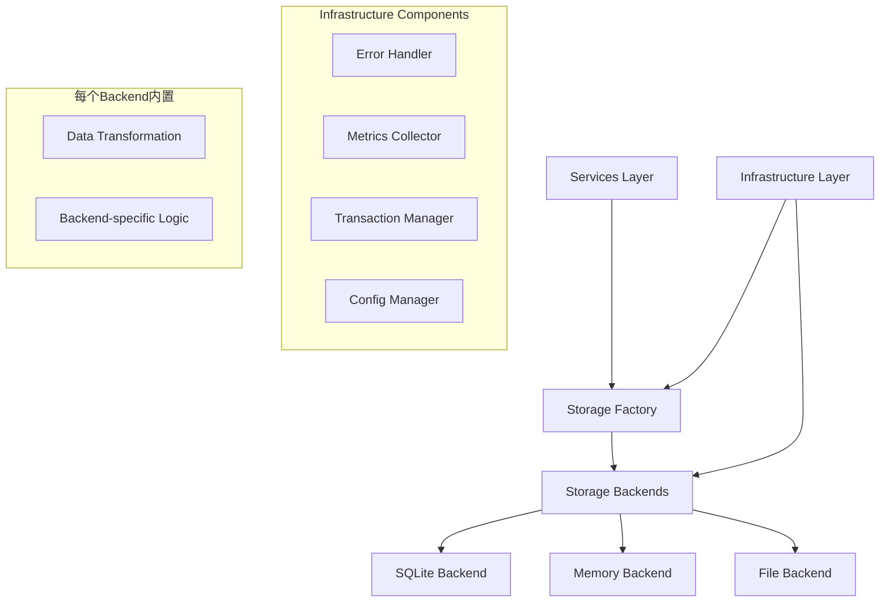

# 存储适配器重构方案

## 概述

本文档详细描述了 `src/adapters/storage/adapter` 和 `src/adapters/storage/adapters` 目录的合并重构方案。由于集成尚未完成，本次重构将采用破坏性方式，不需要考虑向后兼容性。

## 1. 现状分析

### 1.1 当前目录结构

```
src/adapters/storage/
├── adapter/                          # 通用存储适配器
│   ├── __init__.py
│   ├── storage_adapter.py           # StorageAdapter实现
│   ├── config_manager.py            # 配置管理器
│   └── data_transformer.py          # 数据转换器
├── adapters/                        # 状态存储适配器
│   ├── base.py                      # 存储后端基类（位置错误）
│   ├── async_adapter.py             # 异步状态存储适配器
│   ├── file.py                      # 文件状态存储适配器
│   ├── memory.py                    # 内存状态存储适配器
│   └── sqlite.py                    # SQLite状态存储适配器
└── backends/                        # 存储后端
    ├── base.py
    ├── file_backend.py
    ├── memory_backend.py
    ├── sqlite_backend.py
    └── ...
```

### 1.2 主要问题

#### 1.2.1 架构层次混乱
- `adapters/base.py` 实际上是存储后端实现，不应放在 adapters 目录
- 违反了分层架构原则：Infrastructure 层不应依赖 Core 层
- 接口职责不清晰，存在功能重叠

#### 1.2.2 功能重复
- `StorageAdapter` 和 `AsyncStateStorageAdapter` 都提供存储适配功能
- 数据转换逻辑在多处重复实现
- 配置管理功能分散
- 错误处理、指标收集、事务管理逻辑重复

#### 1.2.3 接口不一致
- `adapter` 目录实现 `IStorageAdapter` 接口
- `adapters` 目录实现 `IStateStorageAdapter` 接口
- 两套接口存在功能重叠但职责不清晰

## 2. 重构目标

### 2.1 架构目标
- 遵循分层架构原则，明确各层职责
- 消除功能重复，提高代码复用性
- 统一接口设计，提供一致的API
- 支持灵活扩展，便于添加新的存储类型

### 2.2 功能目标
- 统一存储适配器实现
- 集中配置管理
- 复用核心组件（错误处理、指标收集、事务管理）
- 简化数据转换逻辑

## 3. 重新评估的架构设计

### 3.1 关键架构决策

#### 3.1.1 消除adapters层
经过深入分析，**adapters层是多余的**：
- 数据转换是存储后端的内在职责，不应独立
- 适配器模式在这里增加了不必要的复杂性
- 可以直接在服务层使用增强的存储后端

#### 3.1.2 内聚数据转换逻辑
- 将数据转换逻辑内聚到存储后端中
- 每个后端负责自己的数据格式转换
- 消除transformers目录，减少架构层次

#### 3.1.3 基础设施层统一
- core和config组件属于基础设施层
- 不应在adapters层下，应提升到更高层级
- 遵循分层架构原则

### 3.2 基于现有基础设施的分层架构

```
Interfaces Layer (接口层)
├── IStorage (通用存储接口)
├── IStateStorage (状态存储接口)
└── IStorageFactory (存储工厂接口)

Infrastructure Layer (src/infrastructure/)
├── storage/                           # 存储基础设施
│   ├── base_storage.py                # 基础存储接口
│   ├── error_handler.py               # 错误处理器
│   ├── metrics.py                     # 指标收集器
│   ├── transaction.py                 # 事务管理器
│   └── health_checker.py              # 健康检查器
├── config/                            # 配置管理
│   ├── config_manager.py              # 配置管理器
│   └── config_validator.py            # 配置验证器
└── common/                            # 通用组件
    └── utils.py                       # 工具类

Adapters Layer (src/adapters/storage/)
├── Storage Backends (存储后端实现，内置转换逻辑)
│   ├── Base Storage Backend (基类，包含通用转换)
│   ├── SQLite Backend (SQLite实现)
│   ├── Memory Backend (内存实现)
│   └── File Backend (文件实现)
├── Storage Factory (存储工厂)
│   └── Backend Registry (后端注册表)
└── Storage Services (存储服务)
    ├── State Service (状态服务)
    ├── History Service (历史服务)
    └── Snapshot Service (快照服务)

Services Layer (src/services/)
├── State Service (状态服务)
├── History Service (历史服务)
└── Snapshot Service (快照服务)
```

### 3.3 修正后的组件关系图



## 4. 基于现有架构的目录结构

```
src/infrastructure/                    # 基础设施层（已存在）
├── storage/                           # 存储基础设施
│   ├── __init__.py
│   ├── base_storage.py                # 基础存储接口
│   ├── error_handler.py               # 错误处理器（新增）
│   ├── metrics.py                     # 指标收集器（新增）
│   ├── transaction.py                 # 事务管理器（新增）
│   └── health_checker.py              # 健康检查器（新增）
├── config/                            # 配置管理（已存在）
│   └── config_manager.py              # 配置管理器（增强）
└── common/                            # 通用组件（已存在）
    └── utils.py                       # 工具类（增强）

src/adapters/storage/                  # 适配器层（重构后）
├── __init__.py
├── backends/                          # 存储后端目录（核心）
│   ├── __init__.py
│   ├── base.py                        # 存储后端基类（内置转换逻辑）
│   ├── sqlite_backend.py              # SQLite后端
│   ├── memory_backend.py              # 内存后端
│   ├── file_backend.py                # 文件后端
│   └── connection_pool.py             # 连接池管理
├── factory/                           # 存储工厂目录
│   ├── __init__.py
│   ├── storage_factory.py             # 存储工厂
│   └── backend_registry.py            # 后端注册表
└── services/                          # 存储服务目录
    ├── __init__.py
    ├── state_service.py               # 状态服务
    ├── history_service.py             # 历史服务
    └── snapshot_service.py            # 快照服务

src/services/                          # 服务层（已存在）
├── storage/                           # 存储服务
│   ├── state_service.py               # 状态服务实现
│   ├── history_service.py             # 历史服务实现
│   └── snapshot_service.py            # 快照服务实现
└── ...
```

### 4.1 架构优势

1. **消除冗余层次**：移除不必要的adapters层
2. **内聚职责**：数据转换逻辑内聚到存储后端
3. **清晰分层**：基础设施组件统一管理
4. **简化依赖**：减少组件间的复杂依赖关系
5. **易于扩展**：新的存储类型只需实现后端接口

## 5. 基于现有基础设施的重构实施计划

### 5.1 阶段1: 基础设施层增强

#### 5.1.1 增强基础设施存储组件
```bash
# 在现有基础设施中添加存储相关组件
# src/infrastructure/storage/ 目录下新增：
touch src/infrastructure/storage/error_handler.py
touch src/infrastructure/storage/metrics.py
touch src/infrastructure/storage/transaction.py
touch src/infrastructure/storage/health_checker.py

# 增强现有配置管理
# src/infrastructure/config/config_manager.py 增加存储配置支持
```

#### 5.1.2 重构存储后端基类（使用基础设施组件）
```python
# src/adapters/storage/backends/base.py
from src.infrastructure.storage.error_handler import StorageErrorHandler
from src.infrastructure.storage.metrics import StorageMetrics
from src.infrastructure.storage.transaction import TransactionManager
from src.infrastructure.config.config_manager import ConfigManager

class BaseStorageBackend(IStorage):
    """存储后端基类，内置数据转换逻辑，使用基础设施组件"""
    
    def __init__(self, **config):
        self._config = config
        self._error_handler = StorageErrorHandler()
        self._metrics = StorageMetrics()
        self._transaction_manager = TransactionManager()
        self._config_manager = ConfigManager()
    
    def _transform_to_storage_format(self, data: Any) -> Dict[str, Any]:
        """内置数据转换：领域对象转存储格式"""
        # 基础转换逻辑
        pass
    
    def _transform_from_storage_format(self, storage_data: Dict[str, Any]) -> Any:
        """内置数据转换：存储格式转领域对象"""
        # 基础转换逻辑
        pass
    
    async def save(self, data: Any) -> str:
        """保存数据（内置转换）"""
        return await self._error_handler.handle(
            "save",
            lambda: self._save_internal(data)
        )
    
    async def _save_internal(self, data: Any) -> str:
        """内部保存实现"""
        storage_data = self._transform_to_storage_format(data)
        result = await self._save_to_backend(storage_data)
        self._metrics.record_operation("save", True)
        return result
```

#### 5.1.3 基础设施组件实现
```python
# src/infrastructure/storage/error_handler.py
class StorageErrorHandler:
    """存储错误处理器"""
    
    async def handle(self, operation: str, func):
        """统一错误处理"""
        try:
            return await func()
        except Exception as e:
            # 统一异常处理逻辑
            raise StorageError(f"Failed to {operation}: {e}")

# src/infrastructure/storage/metrics.py
class StorageMetrics:
    """存储指标收集器"""
    
    def __init__(self):
        self._metrics = {}
    
    def record_operation(self, operation: str, success: bool):
        """记录操作指标"""
        if operation not in self._metrics:
            self._metrics[operation] = {"total": 0, "success": 0, "failed": 0}
        
        self._metrics[operation]["total"] += 1
        if success:
            self._metrics[operation]["success"] += 1
        else:
            self._metrics[operation]["failed"] += 1
```

### 5.2 阶段2: 存储工厂实现

#### 5.2.1 实现存储工厂
```python
# src/adapters/storage/factory/storage_factory.py
class StorageFactory:
    """存储工厂，直接创建存储后端实例"""
    
    def __init__(self):
        self._registry = BackendRegistry()
        self._config_manager = ConfigManager()
    
    async def create_storage(self, storage_type: str, config: Dict[str, Any]) -> IStorage:
        """创建存储实例"""
        # 验证配置
        if not self._config_manager.validate_config(storage_type, config):
            raise StorageConfigurationError(f"Invalid config for {storage_type}")
        
        # 获取后端类
        backend_class = self._registry.get_backend_class(storage_type)
        
        # 创建并返回后端实例
        return await backend_class.create(**config)
```

#### 5.2.2 实现后端注册表
```python
# src/adapters/storage/factory/backend_registry.py
class BackendRegistry:
    """存储后端注册表"""
    
    def __init__(self):
        self._backends = {}
        self._register_default_backends()
    
    def _register_default_backends(self):
        """注册默认后端"""
        self.register("sqlite", SQLiteBackend)
        self.register("memory", MemoryBackend)
        self.register("file", FileBackend)
    
    def register(self, name: str, backend_class: type):
        """注册后端"""
        self._backends[name] = backend_class
    
    def get_backend_class(self, name: str) -> type:
        """获取后端类"""
        if name not in self._backends:
            raise ValueError(f"Unknown storage backend: {name}")
        return self._backends[name]
```

### 5.3 阶段3: 服务层实现

#### 5.3.1 实现状态服务
```python
# src/adapters/storage/services/state_service.py
class StateService:
    """状态服务，直接使用存储后端"""
    
    def __init__(self, storage: IStorage):
        self._storage = storage
    
    async def save_state(self, state_data: Any) -> str:
        """保存状态"""
        return await self._storage.save(state_data)
    
    async def load_state(self, state_id: str) -> Any:
        """加载状态"""
        return await self._storage.load(state_id)
```

#### 5.3.2 实现历史服务
```python
# src/adapters/storage/services/history_service.py
class HistoryService:
    """历史服务，直接使用存储后端"""
    
    def __init__(self, storage: IStorage):
        self._storage = storage
    
    async def save_history_entry(self, entry: Any) -> str:
        """保存历史记录"""
        # 添加历史元数据
        entry_with_metadata = {
            "data": entry,
            "type": "history",
            "timestamp": time.time()
        }
        return await self._storage.save(entry_with_metadata)
    
    async def get_history_entries(self, filters: Dict[str, Any]) -> List[Any]:
        """获取历史记录"""
        history_filters = {**filters, "type": "history"}
        storage_results = await self._storage.list(history_filters)
        return [result["data"] for result in storage_results]
```

### 5.4 阶段4: 清理和优化

#### 5.4.1 删除冗余代码和目录
- 完全删除 `adapter` 和 `adapters` 目录
- 删除 `transformers` 目录（转换逻辑内聚到后端）
- 移除所有重复的错误处理、指标收集逻辑

#### 5.4.2 更新使用方式
```python
# 旧方式（复杂）
adapter = StorageAdapterFactory.create_adapter("sqlite", config)
result = await adapter.save(data)

# 新方式（简洁）
factory = StorageFactory()
storage = await factory.create_storage("sqlite", config)
result = await storage.save(data)

# 或直接使用服务
service = StateService(storage)
result = await service.save_state(data)
```

#### 5.4.3 全面测试验证
- 单元测试：测试每个后端的功能
- 集成测试：测试工厂和服务的协作
- 性能测试：确保简化后性能提升

## 6. 关键重构点

### 6.1 接口统一
- 保留 `IStorageAdapter` 和 `IStateStorageAdapter` 两个接口
- 明确各自的职责范围
- 提供统一的错误处理和指标收集机制

### 6.2 依赖关系清理
- 确保 Infrastructure 层只依赖 Interfaces 层
- 移除循环依赖
- 明确各层之间的依赖关系

### 6.3 配置管理统一
- 集中管理所有存储配置
- 提供配置验证机制
- 支持环境变量注入和配置继承

### 6.4 核心组件复用
- 错误处理器：统一处理所有存储操作异常
- 指标收集器：统一收集性能指标
- 事务管理器：统一管理事务逻辑
- 健康检查器：统一处理健康检查

## 7. 实施注意事项

### 7.1 破坏性变更
由于集成尚未完成，本次重构采用破坏性方式：
- 直接删除旧代码，不需要保留兼容性
- 重新设计接口，不需要考虑现有使用方式
- 可以修改公共API，确保设计最优

### 7.2 测试策略
- 在重构过程中持续运行测试
- 为新组件编写单元测试
- 进行集成测试验证整体功能

### 7.3 文档更新
- 更新架构文档
- 更新API文档
- 提供迁移指南

## 8. 预期收益

### 8.1 代码质量提升
- 消除重复代码，提高可维护性
- 清晰的架构分层，降低复杂度
- 统一的接口设计，提高一致性

### 8.2 开发效率提升
- 复用核心组件，减少重复开发
- 统一的配置管理，简化配置工作
- 清晰的扩展机制，便于添加新功能

### 8.3 系统稳定性提升
- 统一的错误处理，提高异常处理能力
- 集中的指标收集，便于监控和调优
- 规范的事务管理，提高数据一致性

## 9. 风险评估

### 9.1 技术风险
- **风险**: 重构过程中可能引入新的bug
- **缓解**: 充分的测试覆盖，分阶段实施

### 9.2 时间风险
- **风险**: 重构工作量可能超出预期
- **缓解**: 合理的计划安排，及时调整优先级

### 9.3 兼容性风险
- **风险**: 可能影响其他依赖模块
- **缓解**: 及时沟通，协调相关模块更新

## 10. 总结

本次重构将彻底解决 `adapter` 和 `adapters` 目录的架构问题，通过统一设计、消除重复、优化结构，建立一个清晰、可维护、可扩展的存储适配器架构。由于集成尚未完成，我们可以采用破坏性重构方式，确保最终架构的最优性。

重构完成后，存储适配器将具备以下特点：
- 清晰的分层架构
- 统一的接口设计
- 高度的代码复用
- 灵活的扩展机制
- 完善的错误处理和监控

这将为后续的开发和维护工作奠定坚实的基础。