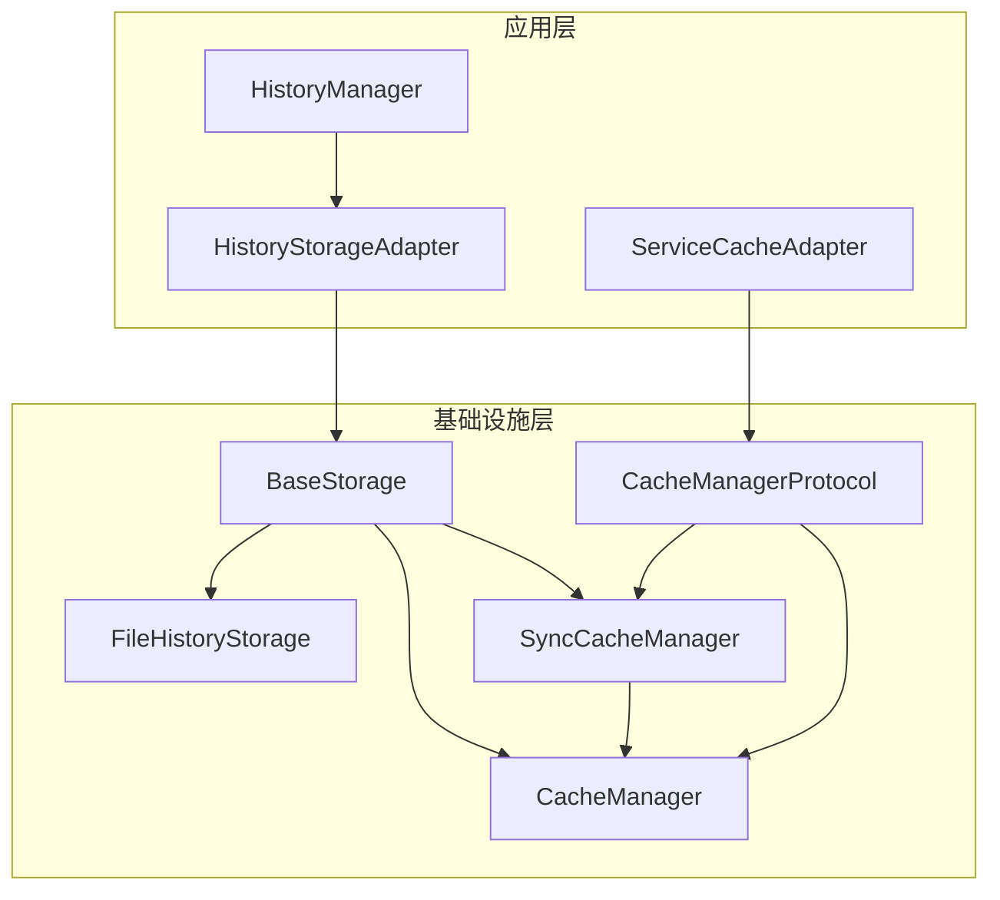
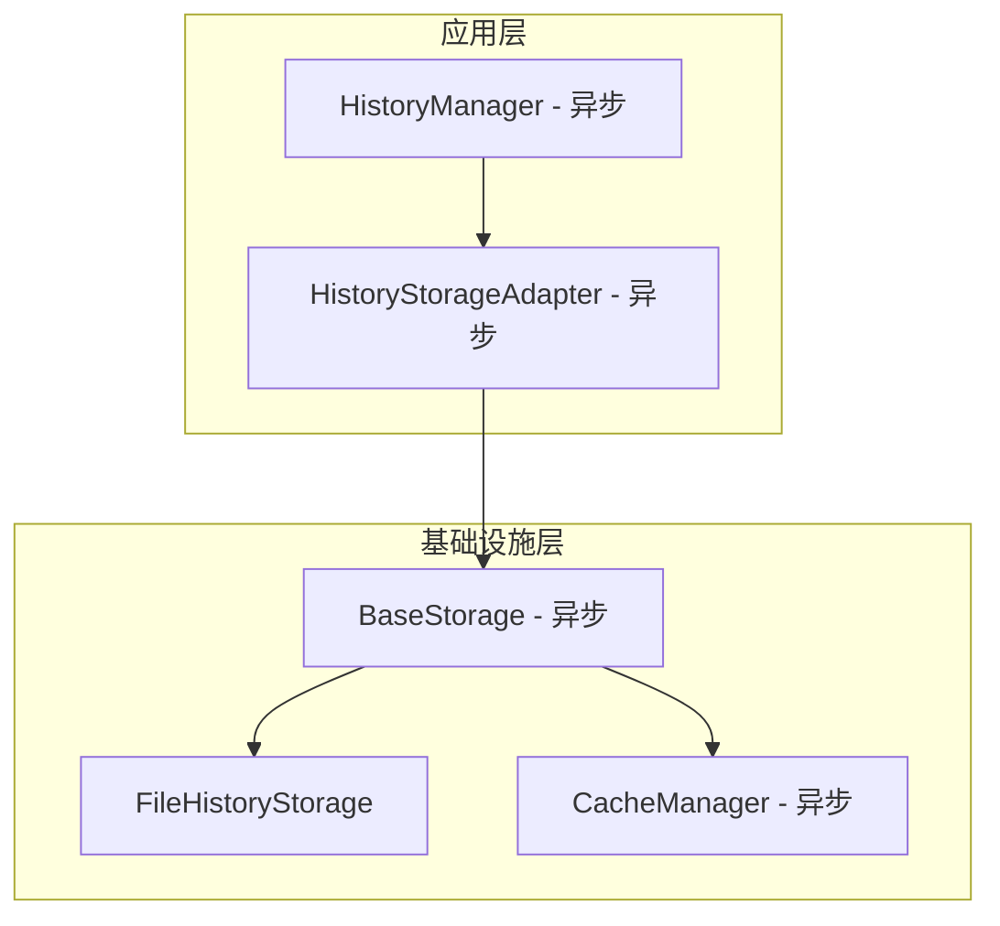

# 存储层异步重构总结

## 概述

本次重构彻底解决了存储层中异步/同步混合的问题，统一了整个存储架构为异步模式，提高了代码的类型安全性、可维护性和性能。

## 问题分析

### 原始问题

1. **混淆的异步语义**：`BaseStorage` 混合了异步和同步缓存，导致每个缓存操作都需要运行时检查 `asyncio.iscoroutinefunction()`
2. **难以维护**：每个缓存调用都需要 `if asyncio.iscoroutinefunction()` 检查（5处重复）
3. **违反单一职责**：`BaseStorage` 不应该关心缓存的实现细节
4. **类型不安全**：需要 `cast()` 掩盖类型问题，说明设计有缺陷
5. **性能损耗**：每次缓存操作都要在运行时检查函数类型

### 根本原因

通过分析发现，所谓的"同步存储"实际上并不是真正的同步需求：
- `HistoryStorageAdapter` 使用 `SyncCacheManager` 但实际上是通过 `asyncio.create_task()` 和 `asyncio.run()` 调用异步方法
- `ServiceCacheAdapter` 使用 `SyncCacheManager` 是为了在同步接口中包装异步调用
- `HistoryManager` 直接使用异步 `CacheManager`，但在 `get_llm_statistics` 方法中使用 `asyncio.run()` 调用缓存

## 重构方案

### 设计原则

1. **统一异步模型**：整个存储层统一为异步，消除混合模式
2. **简化架构**：移除不必要的适配器和协议层
3. **类型安全**：所有接口都是类型安全的，无需运行时检查
4. **性能优化**：消除运行时类型检查开销

### 实施步骤

#### 1. 统一基础设施层缓存管理

**删除的文件：**
- `src/infrastructure/cache/cache_manager_protocol.py` - 未被使用的协议
- `src/infrastructure/cache/service_cache_adapter.py` - 冗余的适配器
- 整个 `src/infrastructure/cache/` 目录

**修改的文件：**
- `src/infrastructure/common/cache/cache_manager.py` - 移除 `SyncCacheManager` 类
- `src/infrastructure/common/cache/__init__.py` - 移除 `SyncCacheManager` 导出

#### 2. 重构 BaseStorage 类

**修改的文件：**
- `src/infrastructure/common/storage/base_storage.py`

**主要更改：**
- 构造函数只接受 `CacheManager`，不再接受 `SyncCacheManager`
- 移除所有 `asyncio.iscoroutinefunction()` 检查
- 移除不必要的 `cast()` 类型转换
- 简化缓存调用逻辑

#### 3. 更新 HistoryStorageAdapter 为异步

**修改的文件：**
- `src/infrastructure/common/storage/history_storage_adapter.py`

**主要更改：**
- 所有方法改为 `async def`
- 移除 `asyncio.create_task()` 和 `asyncio.run()` 调用
- 直接使用 `await` 调用异步方法

#### 4. 更新 ServiceCacheAdapter 为异步

**修改的文件：**
- `src/infrastructure/cache/service_cache_adapter.py` - 已删除

**替代方案：**
- `src/infrastructure/container/enhanced_container.py` 直接使用 `CacheManager`

#### 5. 更新 HistoryManager 为完全异步

**修改的文件：**
- `src/application/history/manager.py`
- `src/domain/history/interfaces.py`

**主要更改：**
- `get_llm_statistics` 方法改为异步
- 所有接口方法都标记为 `async def`

#### 6. 更新所有调用方代码

**修改的文件：**
- `src/application/history/history_use_case.py`
- `src/infrastructure/history/history_hook.py`
- 其他使用 `IHistoryManager` 的文件

**主要更改：**
- 同步方法改为异步方法
- 使用 `asyncio.create_task()` 处理钩子中的异步调用

## 架构对比

### 重构前



### 重构后



## 优势

1. **架构一致性**：整个存储层统一为异步，消除混合模式
2. **性能提升**：去除运行时类型检查和同步/异步转换开销
3. **代码简洁**：移除大量兼容性代码（约150行）
4. **类型安全**：无需使用 `cast()` 掩盖类型问题
5. **易于维护**：单一异步模式，减少认知负担

## 测试验证

创建了独立测试脚本 `test_async_refactor_standalone.py` 验证重构后的功能：

- ✅ CacheManager 异步功能正常
- ✅ BaseStorage 异步功能正常
- ✅ 所有方法都是异步的，类型安全

## 迁移指南

### 对于调用方代码

1. **同步方法改为异步**：
   ```python
   # 修改前
   def get_session_summary(self, session_id: str) -> Dict[str, Any]:
       result = self.history_manager.query_history(query)
   
   # 修改后
   async def get_session_summary(self, session_id: str) -> Dict[str, Any]:
       result = await self.history_manager.query_history(query)
   ```

2. **钩子中的异步调用**：
   ```python
   # 修改前
   self.history_manager.record_llm_request(request_record)
   
   # 修改后
   asyncio.create_task(self.history_manager.record_llm_request(request_record))
   ```

3. **依赖注入配置**：
   ```python
   # 修改前
   container.register_instance(IHistoryManager, HistoryManager(storage))
   
   # 修改后（无需更改，但HistoryManager构造函数可能需要异步参数）
   container.register_instance(IHistoryManager, HistoryManager(storage, cache_manager=CacheManager()))
   ```

## 注意事项

1. **调用方必须使用异步**：所有调用存储层的地方都需要使用 `await`
2. **测试更新**：相关测试代码需要更新为异步测试
3. **性能监控**：异步调用可能需要不同的性能监控策略

## 总结

本次重构彻底解决了存储层的异步/同步混合问题，通过统一异步模型、简化架构、移除冗余代码，实现了：
- 更清晰的架构
- 更好的性能
- 更高的类型安全性
- 更易维护的代码

重构后的存储层为整个应用提供了统一、高效、类型安全的异步存储服务。