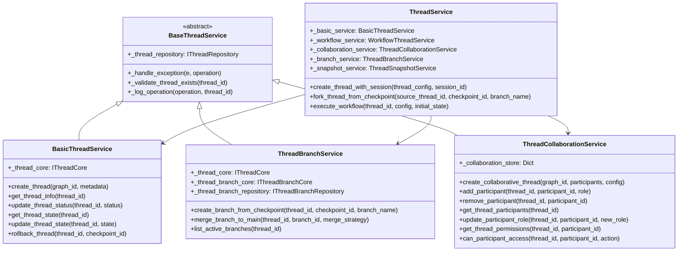

# 线程服务重构架构图

## 重构前架构问题

### 原始架构
```
ThreadService (主服务门面)
├── BasicThreadService (基础CRUD)
├── ThreadBranchService (分支管理)
├── ThreadCollaborationService (错误实现 - 状态管理)
├── ThreadCoordinatorService (简单包装器)
├── ThreadSnapshotService (快照管理)
└── WorkflowThreadService (工作流执行)
```

### 主要问题
1. **功能重叠**: 多个服务存在相同的功能实现
2. **接口不匹配**: ThreadCollaborationService实现与接口定义完全不符
3. **缺乏基类**: 没有统一的基类提供通用功能
4. **过度设计**: ThreadCoordinatorService功能过于简单

## 重构后架构

### 新架构
```
BaseThreadService (抽象基类)
├── 统一异常处理
├── 通用验证逻辑
├── 标准化日志记录
└── 公共辅助方法

ThreadService (主服务门面)
├── BasicThreadService (基础CRUD + 状态管理)
├── ThreadBranchService (分支管理)
├── ThreadCollaborationService (真正的协作功能)
├── ThreadSnapshotService (快照管理)
└── WorkflowThreadService (工作流执行)
```

### 服务职责重新分配

#### BasicThreadService
- **新增职责**: 状态管理（从协作服务迁移）
- **保留职责**: 基础CRUD操作、线程查询、状态验证
- **继承**: BaseThreadService

#### ThreadCollaborationService
- **完全重写**: 实现真正的协作功能
- **新功能**: 参与者管理、权限控制、协作线程创建
- **继承**: BaseThreadService

#### ThreadBranchService
- **保留职责**: 分支管理功能
- **继承**: BaseThreadService
- **优化**: 使用基类的通用功能

#### ThreadCoordinatorService
- **删除**: 功能过于简单，合并到主服务中

## 重构收益

### 1. 消除功能重叠
- 状态管理统一到BasicThreadService
- 协作功能专注于真正的协作逻辑
- 删除冗余的协调器服务

### 2. 接口实现一致性
- ThreadCollaborationService完全重写，符合接口定义
- 所有服务都有明确的职责边界

### 3. 代码复用
- BaseThreadService提供通用功能
- 统一的异常处理和日志记录
- 减少重复代码

### 4. 简化架构
- 减少服务数量
- 清晰的依赖关系
- 更容易维护和扩展

## 类图关系



## 重构步骤总结

1. ✅ 创建BaseThreadService抽象基类
2. ✅ 重构BasicThreadService，继承基类并吸收状态管理功能
3. ✅ 重构ThreadBranchService，继承基类
4. ✅ 完全重写ThreadCollaborationService，实现真正的协作功能
5. ✅ 删除ThreadCoordinatorService
6. ✅ 重构ThreadService，移除对协调器服务的依赖
7. ✅ 更新接口定义，移除协调器接口

## 后续优化建议

1. **依赖注入**: 使用DI容器管理服务依赖
2. **配置驱动**: 通过配置文件控制服务行为
3. **异步优化**: 进一步优化异步操作性能
4. **监控集成**: 添加性能监控和指标收集
5. **测试覆盖**: 为重构后的服务编写完整的单元测试