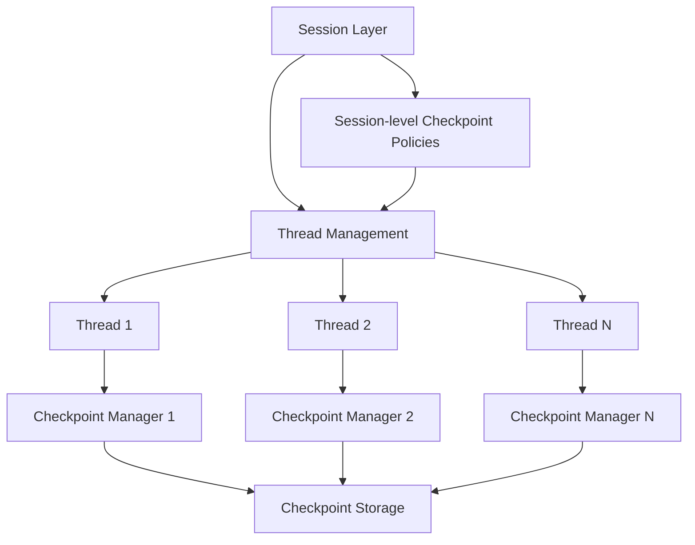

# Checkpoint模块架构决策文档

## 1. 问题概述

当前系统中checkpoint模块存在两套并行的实现：
- **独立的Checkpoint实现**: 位于`src/interfaces/checkpoint/`、`src/core/checkpoint/`、`src/services/checkpoint/`
- **作为Thread子模块的Checkpoint实现**: 位于`src/interfaces/threads/checkpoint.py`、`src/core/threads/checkpoints/`、`src/services/thread_checkpoint/`

这种双重实现导致了代码重复、维护困难、架构混乱等问题。

## 2. Checkpoint与其他模块的关联关系分析

### 2.1 Checkpoint与各模块的关联关系

#### 2.1.1 Checkpoint与Thread的关系
- **强关联**: Thread是checkpoint的主要使用者和管理者
- **生命周期绑定**: checkpoint的生命周期与Thread紧密相关
- **数据归属**: checkpoint本质上属于Thread的状态快照
- **功能依赖**: Thread的分支、协作、恢复等功能都依赖checkpoint

#### 2.1.2 Checkpoint与Session的关系
- **间接关联**: Session通过Thread间接管理checkpoint
- **统计关系**: Session维护checkpoint计数（[`checkpoint_count`](src/interfaces/state/session.py:47)）
- **协调关系**: Session协调多个Thread的checkpoint管理
- **生命周期管理**: Session负责清理其下所有Thread的checkpoint

#### 2.1.3 Checkpoint与Workflow的关系
- **执行关联**: Workflow执行过程中产生checkpoint
- **状态保存**: Workflow状态通过checkpoint持久化
- **恢复机制**: Workflow可以从checkpoint恢复执行状态
- **流式执行**: 流式Workflow执行依赖checkpoint进行状态管理

#### 2.1.4 Checkpoint与State的关系
- **数据模型**: checkpoint是State的快照形式
- **序列化**: State通过checkpoint进行序列化和反序列化
- **持久化**: checkpoint提供State的持久化机制
- **版本管理**: checkpoint支持State的版本管理

### 2.2 Session层通过Thread管理checkpoint的可行性评估

#### 2.2.1 可行性分析

**✅ 可行的方面：**

1. **架构合理性**
   - Session作为更高层次的抽象，管理多个Thread
   - Thread作为checkpoint的直接管理者，符合单一职责原则
   - Session通过Thread接口管理checkpoint，保持了层次清晰

2. **现有实现支持**
   - Session已经维护了checkpoint计数
   - Session有Thread的完整管理接口
   - Thread提供了完整的checkpoint管理功能

3. **业务逻辑合理性**
   - Session级别的checkpoint策略（如全局清理）
   - Thread级别的checkpoint操作（如创建、恢复）
   - 跨Thread的checkpoint协调（如同步点）

**⚠️ 需要注意的问题：**

1. **性能考虑**
   - Session通过Thread管理checkpoint可能增加调用链路
   - 需要优化批量操作的性能
   - 缓存策略需要考虑层次结构

2. **一致性保证**
   - 跨Thread的checkpoint操作需要事务支持
   - Session级别的状态同步机制
   - 并发访问的一致性保证

3. **错误处理**
   - Thread级别的checkpoint错误不能影响Session
   - Session需要处理Thread checkpoint失败的情况
   - 错误传播和恢复机制

#### 2.2.2 推荐的管理模式



**关键设计原则：**

1. **分层管理**: Session负责策略，Thread负责执行
2. **接口统一**: Thread提供统一的checkpoint管理接口
3. **策略下沉**: Session的checkpoint策略通过Thread接口实现
4. **状态同步**: Session和Thread的checkpoint状态需要同步

#### 2.2.3 实现建议

1. **Session层的checkpoint管理职责**
   - 制定全局checkpoint策略
   - 协调多Thread的checkpoint操作
   - 监控checkpoint使用情况
   - 清理过期的checkpoint

2. **Thread层的checkpoint管理职责**
   - 执行具体的checkpoint操作
   - 管理checkpoint的生命周期
   - 处理checkpoint的错误和异常
   - 提供checkpoint的查询和统计

3. **接口设计**
   ```python
   # Session层接口
   class ISessionCheckpointManager:
       async def set_global_checkpoint_policy(self, policy: CheckpointPolicy) -> None
       async def cleanup_all_thread_checkpoints(self, session_id: str) -> int
       async def get_session_checkpoint_statistics(self, session_id: str) -> Dict[str, Any]
       async def coordinate_cross_thread_checkpoints(self, session_id: str) -> bool
   
   # Thread层接口（Session调用）
   class IThreadCheckpointManager:
       async def create_checkpoint(self, thread_id: str, state: Dict[str, Any]) -> str
       async def restore_checkpoint(self, thread_id: str, checkpoint_id: str) -> Dict[str, Any]
       async def list_checkpoints(self, thread_id: str) -> List[Checkpoint]
       async def delete_checkpoint(self, thread_id: str, checkpoint_id: str) -> bool
   ```

### 2.3 结论

**Thread是checkpoint唯一直接关联的对象**，其他模块（Session、Workflow、State）都通过Thread间接使用checkpoint。Session层通过Thread管理checkpoint是完全可行的，并且符合系统的分层架构设计原则。

## 2. 现状分析

### 2.1 两套实现的差异

| 方面 | 独立实现 | Thread子模块实现 |
|------|----------|------------------|
| **接口定义** | `ICheckpointService` | `IThreadCheckpointManager`、`IThreadCheckpointStorage` |
| **数据模型** | `Checkpoint`、`CheckpointMetadata` | `ThreadCheckpoint`、`CheckpointStatistics` |
| **业务逻辑** | 通用checkpoint操作 | Thread特定的checkpoint业务规则 |
| **存储实现** | 实现了`ICheckpointSaver`接口 | 实现了`IThreadCheckpointStorage`接口 |
| **功能范围** | 基础CRUD、列表、清理 | 分支管理、协作、里程碑、备份等 |

### 2.2 架构问题

1. **代码重复**: 两套系统实现了相似的功能
2. **职责不清**: checkpoint既是独立概念又是Thread的子概念
3. **依赖混乱**: 存在循环依赖和双向依赖
4. **维护成本高**: 需要同时维护两套系统
5. **扩展困难**: 新功能需要在两套系统中分别实现

## 3. 架构决策

### 3.1 核心决策

**采用分层统一架构，将Checkpoint作为独立的核心概念，ThreadCheckpoint作为其特化实现。Session层通过Thread接口管理checkpoint，保持清晰的层次结构。**

### 3.2 设计原则

1. **统一接口**: 消除两套并行的接口，建立统一的checkpoint抽象
2. **分层设计**: 采用分层架构，区分通用checkpoint功能和Thread特定功能
3. **依赖倒置**: Thread依赖于checkpoint抽象，而不是具体实现
4. **单一职责**: checkpoint专注于状态管理，Thread专注于执行流程
5. **向后兼容**: 提供适配器模式支持现有代码的平滑迁移
6. **层次管理**: Session负责策略，Thread负责执行，保持架构清晰

### 3.3 目标架构

```
┌─────────────────────────────────────────┐
│           Session Layer                 │
│  ┌─────────────────────────────────────┐ │
│  │     SessionCheckpointManager        │ │
│  │  (Session级别的checkpoint策略)       │ │
│  │  - 全局策略制定                     │ │
│  │  - 多Thread协调                     │ │
│  │  - 统计监控                         │ │
│  └─────────────────────────────────────┘ │
└─────────────────────────────────────────┘
                    │
                    ▼
┌─────────────────────────────────────────┐
│           Thread Layer                  │
│  ┌─────────────────────────────────────┐ │
│  │     ThreadCheckpointService         │ │
│  │  (Thread特定的业务逻辑)              │ │
│  │  - 分支管理                         │ │
│  │  - 协作功能                         │ │
│  │  - 里程碑管理                       │ │
│  └─────────────────────────────────────┘ │
└─────────────────────────────────────────┘
                    │
                    ▼
┌─────────────────────────────────────────┐
│         Checkpoint Core Layer           │
│  ┌─────────────────────────────────────┐ │
│  │      CheckpointDomainService        │ │
│  │     (通用checkpoint业务逻辑)         │ │
│  │  - 基础CRUD操作                     │ │
│  │  - 生命周期管理                     │ │
│  │  - 过期策略                         │ │
│  │  - 清理规则                         │ │
│  └─────────────────────────────────────┘ │
└─────────────────────────────────────────┘
                    │
                    ▼
┌─────────────────────────────────────────┐
│        Infrastructure Layer             │
│  ┌─────────────────────────────────────┐ │
│  │       CheckpointRepository          │ │
│  │     (统一的存储抽象)                 │ │
│  │  - 内存存储                         │ │
│  │  - SQLite存储                       │ │
│  │  - 扩展接口                         │ │
│  └─────────────────────────────────────┘ │
└─────────────────────────────────────────┘
```

## 4. 重构方案

### 4.1 重构阶段

#### 阶段一：建立统一的核心模型（1-2周）
- 创建统一的Checkpoint核心模型
- 设计分层的接口体系（包含Session层接口）
- 定义统一的异常和验证逻辑

#### 阶段二：重构存储层（2-3周）
- 统一存储后端实现
- 设计数据迁移策略
- 保证向后兼容性

#### 阶段三：重构服务层（3-4周）
- 创建统一的CheckpointDomainService
- 实现SessionCheckpointManager
- 实现适配器模式
- 逐步迁移调用方

#### 阶段四：迁移Thread相关功能（2-3周）
- 重构ThreadCheckpoint相关代码
- 更新Thread服务
- 实现Session通过Thread管理checkpoint的机制
- 保持功能完整性

#### 阶段五：清理和优化（1-2周）
- 删除重复代码
- 性能优化
- 更新文档和测试

### 4.2 风险控制

1. **功能回归风险**
   - 建立完整的测试覆盖
   - 分阶段验证功能
   - 保留回滚方案

2. **数据迁移风险**
   - 设计无损迁移方案
   - 提供数据验证工具
   - 支持增量迁移

3. **性能影响风险**
   - 建立性能基准测试
   - 监控关键指标
   - 优化热点路径

4. **Session-Thread协调风险**
   - 设计清晰的接口契约
   - 实现错误隔离机制
   - 建立状态同步机制

## 5. 实施计划

### 5.1 时间安排

| 阶段 | 时间 | 主要任务 | 交付物 |
|------|------|----------|--------|
| 阶段一 | 第1-2周 | 核心模型设计 | 统一的接口和模型定义 |
| 阶段二 | 第3-5周 | 存储层重构 | 统一的存储实现 |
| 阶段三 | 第6-9周 | 服务层重构 | 统一的业务逻辑和Session管理 |
| 阶段四 | 第10-12周 | Thread功能迁移 | 完整的Thread checkpoint功能 |
| 阶段五 | 第13-14周 | 清理优化 | 最终的架构实现 |

### 5.2 里程碑

1. **M1（第2周）**: 完成核心模型和接口设计（包含Session层）
2. **M2（第5周）**: 完成存储层统一
3. **M3（第9周）**: 完成服务层重构和Session管理机制
4. **M4（第12周）**: 完成Thread功能迁移和Session-Thread协调
5. **M5（第14周）**: 完成整体重构

## 6. 预期收益

### 6.1 技术收益

1. **代码减少**: 预计减少30-40%的重复代码
2. **维护成本降低**: 统一维护，减少同步成本
3. **扩展性提升**: 更容易添加新的checkpoint功能
4. **架构清晰**: 职责明确，依赖关系清晰
5. **性能优化**: 统一的存储和缓存策略
6. **层次清晰**: Session-Thread-Checkpoint三层架构清晰

### 6.2 业务收益

1. **开发效率**: 减少重复开发工作
2. **质量提升**: 统一的代码质量和测试覆盖
3. **功能增强**: 更丰富的checkpoint功能
4. **用户体验**: 更稳定和高效的checkpoint服务
5. **管理便利**: Session级别的checkpoint管理更加便捷

## 7. 成功标准

1. **功能完整性**: 所有现有功能正常工作
2. **性能指标**: 不低于现有性能水平
3. **代码质量**: 代码重复率降低到10%以下
4. **测试覆盖**: 达到90%以上的测试覆盖率
5. **文档完整**: 完整的API文档和架构文档
6. **层次清晰**: Session-Thread-Checkpoint层次结构清晰明确

## 8. 结论

通过采用分层统一架构，我们可以有效解决当前checkpoint模块的架构问题，实现代码的统一和简化，提高系统的可维护性和扩展性。基于对checkpoint与其他模块关联关系的深入分析，确认Thread是checkpoint唯一直接关联的对象，Session层通过Thread管理checkpoint是完全可行的。

这个重构方案虽然需要一定的投入，但长期来看将带来显著的技术和业务收益。新的架构设计保持了清晰的层次结构，Session负责策略制定，Thread负责具体执行，Checkpoint专注于状态管理，各层职责明确，符合系统的整体架构原则。

建议按照提出的分阶段方案进行实施，确保重构过程的平稳进行，最小化对现有系统的影响。