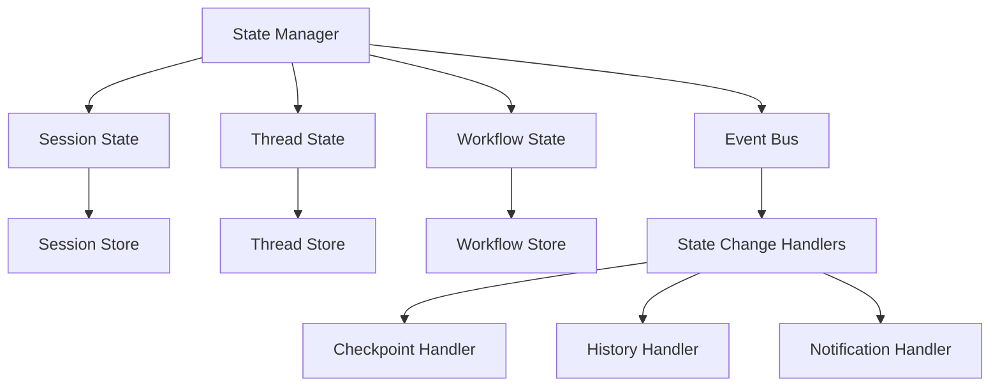

## 架构优化建议

基于前面的分析，我提出以下架构优化建议：

### 1. Checkpoint 与 History 模块优化

#### 1.1 创建共享基础设施

**建议**: 创建 `src/infrastructure/common` 目录，提取共同组件

```python
# src/infrastructure/common/temporal.py
class TemporalManager:
    """统一时间管理"""
    @staticmethod
    def now() -> datetime:
        return datetime.now()
    
    @staticmethod
    def format_timestamp(dt: datetime) -> str:
        return dt.isoformat()

# src/infrastructure/common/metadata.py
class MetadataManager:
    """统一元数据管理"""
    @staticmethod
    def normalize_metadata(metadata: Any) -> Dict[str, Any]:
        # 统一元数据标准化逻辑
        pass

# src/infrastructure/common/id_generator.py
class IDGenerator:
    """统一ID生成"""
    @staticmethod
    def generate_id(prefix: str = "") -> str:
        return f"{prefix}{uuid.uuid4().hex[:8]}"
```

#### 1.2 重构存储抽象

**建议**: 创建统一的存储接口

```python
# src/infrastructure/common/storage.py
class IStorage(ABC):
    """统一存储接口"""
    @abstractmethod
    async def save(self, data: Dict[str, Any]) -> bool: pass
    
    @abstractmethod
    async def load(self, id: str) -> Optional[Dict[str, Any]]: pass
    
    @abstractmethod
    async def list(self, filters: Dict[str, Any]) -> List[Dict[str, Any]]: pass
    
    @abstractmethod
    async def delete(self, id: str) -> bool: pass

class BaseStorage(IStorage):
    """存储基类，提供通用功能"""
    def __init__(self, temporal_manager: TemporalManager, 
                 metadata_manager: MetadataManager):
        self.temporal = temporal_manager
        self.metadata = metadata_manager
```

#### 1.3 明确模块职责边界

**Checkpoint 模块职责**:
- 专注于工作流状态快照和恢复
- 与 LangGraph 深度集成
- 提供状态序列化/反序列化

**History 模块职责**:
- 专注于用户交互历史记录
- Token 使用统计和成本追踪
- 会话上下文管理

### 2. 状态管理架构优化

#### 2.1 引入状态管理器

**建议**: 创建统一的状态管理器

```python
# src/application/state/state_manager.py
class IStateManager(ABC):
    """状态管理器接口"""
    @abstractmethod
    async def get_state(self, entity_id: str, entity_type: str) -> Optional[Dict[str, Any]]: pass
    
    @abstractmethod
    async def update_state(self, entity_id: str, entity_type: str, 
                          state: Dict[str, Any]) -> bool: pass
    
    @abstractmethod
    async def create_state(self, entity_id: str, entity_type: str, 
                          initial_state: Dict[str, Any]) -> bool: pass

class StateManager(IStateManager):
    """统一状态管理器实现"""
    def __init__(self, storage: IStorage, event_bus: IEventBus):
        self.storage = storage
        self.event_bus = event_bus
    
    async def update_state(self, entity_id: str, entity_type: str, 
                          state: Dict[str, Any]) -> bool:
        # 1. 保存状态
        success = await self.storage.save({
            "entity_id": entity_id,
            "entity_type": entity_type,
            "state": state,
            "updated_at": TemporalManager.now()
        })
        
        # 2. 发布状态变更事件
        if success:
            await self.event_bus.publish(StateChangedEvent(
                entity_id=entity_id,
                entity_type=entity_type,
                new_state=state
            ))
        
        return success
```

#### 2.2 事件驱动的状态同步

**建议**: 实现事件总线机制

```python
# src/infrastructure/events/event_bus.py
class IEventBus(ABC):
    @abstractmethod
    async def publish(self, event: Event) -> None: pass
    
    @abstractmethod
    async def subscribe(self, event_type: Type[Event], 
                       handler: Callable[[Event], None]) -> None: pass

class StateChangedEvent(Event):
    def __init__(self, entity_id: str, entity_type: str, new_state: Dict[str, Any]):
        self.entity_id = entity_id
        self.entity_type = entity_type
        self.new_state = new_state
        self.timestamp = TemporalManager.now()
```

#### 2.3 分层状态管理架构



### 3. 具体优化方案

#### 3.1 Session 层优化

```python
# src/application/sessions/stateful_session_manager.py
class StatefulSessionManager(ISessionManager):
    """基于状态管理器的会话管理器"""
    
    def __init__(self, state_manager: IStateManager, 
                 event_bus: IEventBus):
        self.state_manager = state_manager
        self.event_bus = event_bus
        
        # 订阅相关事件
        await self.event_bus.subscribe(ThreadStateChangedEvent, 
                                      self._handle_thread_state_change)
    
    async def _handle_thread_state_change(self, event: ThreadStateChangedEvent):
        """处理 Thread 状态变更"""
        # 更新 Session 中的 Thread 状态
        session_state = await self.state_manager.get_state(
            event.session_id, "session"
        )
        if session_state:
            # 更新 Thread 状态信息
            await self.state_manager.update_state(
                event.session_id, "session", 
                self._update_thread_state(session_state, event)
            )
```

#### 3.2 Thread 层优化

```python
# src/application/threads/stateful_thread_manager.py
class StatefulThreadManager(IThreadManager):
    """基于状态管理器的线程管理器"""
    
    async def execute_workflow(self, thread_id: str, config: Dict[str, Any]) -> WorkflowState:
        # 1. 更新 Thread 状态为执行中
        await self.state_manager.update_state(thread_id, "thread", {
            "status": "running",
            "workflow_config": config,
            "started_at": TemporalManager.now()
        })
        
        try:
            # 2. 执行工作流
            result = await self._execute_workflow_internal(thread_id, config)
            
            # 3. 更新 Thread 状态为完成
            await self.state_manager.update_state(thread_id, "thread", {
                "status": "completed",
                "result": result,
                "completed_at": TemporalManager.now()
            })
            
            return result
        except Exception as e:
            # 4. 更新 Thread 状态为错误
            await self.state_manager.update_state(thread_id, "thread", {
                "status": "error",
                "error": str(e),
                "failed_at": TemporalManager.now()
            })
            raise
```

#### 3.3 Checkpoint 与 History 集成优化

```python
# src/application/state/state_handlers.py
class CheckpointStateHandler:
    """Checkpoint 状态处理器"""
    
    async def handle_state_change(self, event: StateChangedEvent):
        if event.entity_type == "thread" and event.new_state.get("status") == "running":
            # 自动创建 Checkpoint
            await self.checkpoint_manager.auto_save_checkpoint(
                thread_id=event.entity_id,
                workflow_id=event.new_state.get("workflow_id"),
                state=event.new_state,
                trigger_reason="state_change"
            )

class HistoryStateHandler:
    """History 状态处理器"""
    
    async def handle_state_change(self, event: StateChangedEvent):
        if event.entity_type == "session":
            # 记录会话状态变更到历史
            await self.history_manager.record_session_state_change(
                session_id=event.entity_id,
                old_state=event.old_state,
                new_state=event.new_state
            )
```

### 4. 实施路径建议

#### 阶段 1: 基础设施重构
1. 创建共享基础设施组件
2. 重构存储抽象层
3. 实现统一的时间管理和元数据管理

#### 阶段 2: 状态管理器引入
1. 设计和实现状态管理器
2. 创建事件总线机制
3. 实现基本的状态同步

#### 阶段 3: 渐进式迁移
1. 先迁移 Session 层到新架构
2. 然后迁移 Thread 层
3. 最后优化 Checkpoint 和 History 集成

#### 阶段 4: 优化和监控
1. 性能优化
2. 监控和告警
3. 文档和测试完善