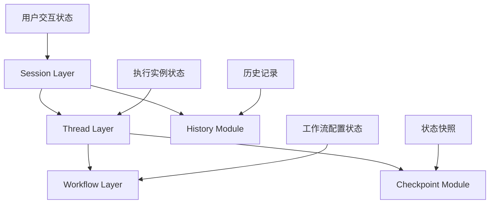

## Sessions、Thread、Workflow 层状态管理需求分析

### 1. Sessions 层状态管理

#### 当前实现分析：
- **主要职责**: 用户交互追踪和多线程协调
- **状态管理需求**:
  - 会话生命周期管理（创建、更新、删除）
  - 用户交互历史追踪
  - 多 Thread 协调和状态同步
  - 会话级元数据管理

#### 状态管理特点：
- **用户导向**: 关注用户交互和体验
- **协调层**: 作为多个 Thread 的协调者
- **持久化**: 需要长期保存会话状态
- **版本控制**: 集成 Git 进行变更追踪

#### 状态数据结构：
```python
SessionContext {
  session_id: str
  user_id: Optional[str]
  thread_ids: List[str]
  status: str
  created_at: datetime
  updated_at: datetime
  metadata: Dict[str, Any]
}
```

### 2. Thread 层状态管理

#### 当前实现分析：
- **主要职责**: 工作流执行实例管理
- **状态管理需求**:
  - Thread 生命周期管理
  - 工作流状态快照（通过 Checkpoint）
  - 分支管理和协作
  - 快照管理（SnapshotManager）

#### 状态管理特点：
- **执行导向**: 关注工作流执行状态
- **快照机制**: 依赖 Checkpoint 进行状态保存
- **分支支持**: 支持多分支和协作
- **临时性**: 相对 Sessions，状态更偏向临时

#### 状态数据流：
```
Thread -> Checkpoint -> 状态持久化
Thread -> Snapshot -> 状态快照
Thread -> Branch -> 分支状态
```

### 3. Workflow 层状态管理

#### 当前实现分析：
- **主要职责**: 工作流元数据管理和配置
- **状态管理需求**:
  - 工作流配置管理
  - 执行统计和监控
  - 可视化状态
  - 版本和依赖管理

#### 状态管理特点：
- **配置导向**: 关注工作流定义和配置
- **无状态**: 主要管理元数据，不管理执行状态
- **共享性**: 多个 Thread 可以共享同一工作流配置
- **版本化**: 支持配置版本管理

### 4. 状态管理层次关系



### 5. 状态管理问题分析

#### 当前存在的问题：

1. **状态边界模糊**:
   - Session 和 Thread 都有状态管理职责
   - 缺乏清晰的状态所有权划分

2. **状态同步复杂**:
   - Thread 状态变化需要通知 Session
   - 多 Thread 间的状态协调复杂

3. **状态一致性**:
   - Checkpoint 和 History 之间的时间同步
   - 状态更新的事务性保证缺失

4. **状态冗余**:
   - 多层状态存储可能导致数据冗余
   - 缺乏统一的状态访问接口

### 6. 状态管理优化需求

#### 理想的状态管理架构：

1. **分层明确**:
   - Session: 用户会话状态
   - Thread: 执行实例状态
   - Workflow: 配置元数据状态

2. **状态同步机制**:
   - 事件驱动的状态更新
   - 状态变更通知机制

3. **状态一致性保证**:
   - 事务性状态更新
   - 状态版本控制

4. **统一状态访问**:
   - 统一的状态查询接口
   - 状态变更审计日志