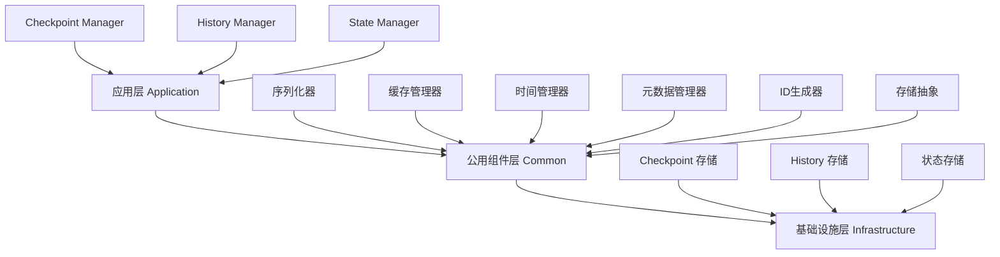
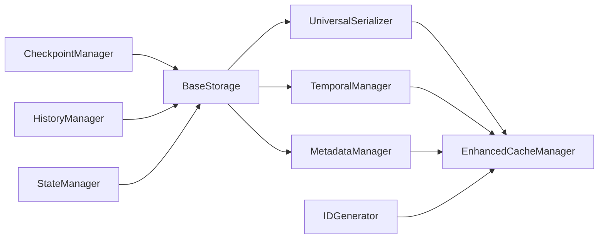

# Checkpoint 与 History 模块共享组件分析报告

## 执行摘要

本报告基于对 `src\application\checkpoint` 和 `src\application\history` 模块的深入分析，识别了可公用的组件和工具类，并设计了统一的公用组件架构。通过提取共同功能为工具类，可以显著减少代码重复，提高可维护性和一致性。

## 1. 序列化/反序列化分析

### 1.1 当前实现状况

#### Checkpoint 模块序列化实现
- **位置**: [`src/infrastructure/checkpoint/memory_store.py`](src/infrastructure/checkpoint/memory_store.py:74-81)
- **方式**: 通过 `ICheckpointSerializer` 接口进行状态序列化
- **格式**: 支持 JSON 和 Pickle 格式
- **特点**: 与 LangGraph 深度集成，支持工作流状态的特殊处理

#### History 模块序列化实现
- **位置**: [`src/application/history/manager.py`](src/application/history/manager.py:61-84)
- **方式**: 自定义序列化逻辑，处理枚举类型和 datetime
- **格式**: 主要使用 JSON 格式
- **特点**: 专注于历史记录的序列化，包含类型转换逻辑

#### 状态序列化实现
- **位置**: [`src/infrastructure/graph/states/serializer.py`](src/infrastructure/graph/states/serializer.py:151-213)
- **方式**: 增强的状态序列化器，支持缓存和优化
- **格式**: 支持 JSON、Compact JSON 和 Pickle
- **特点**: 最完整的序列化实现，包含消息对象处理和缓存机制

### 1.2 重复功能识别

| 功能 | Checkpoint | History | State Serializer | 重复程度 |
|------|------------|---------|-----------------|----------|
| JSON 序列化 | ✅ | ✅ | ✅ | 高 |
| Pickle 序列化 | ✅ | ❌ | ✅ | 中 |
| 枚举类型处理 | ❌ | ✅ | ✅ | 中 |
| DateTime 处理 | ✅ | ✅ | ✅ | 高 |
| 消息对象序列化 | ❌ | ❌ | ✅ | 低 |
| 缓存机制 | ❌ | ❌ | ✅ | 低 |

## 2. 缓存机制分析

### 2.1 当前实现状况

#### 多种缓存实现
1. **通用缓存**: [`src/infrastructure/utils/cache.py`](src/infrastructure/utils/cache.py:10-139)
   - 简单的线程安全缓存
   - 基础的 CRUD 操作
   - 无 TTL 和 LRU 支持

2. **LLM 缓存**: [`src/infrastructure/llm/cache/memory_provider.py`](src/infrastructure/llm/cache/memory_provider.py:13-50)
   - 支持 TTL 和 LRU
   - 线程安全
   - 性能监控

3. **Thread 缓存**: [`src/infrastructure/threads/cache_manager.py`](src/infrastructure/threads/cache_manager.py:71-97)
   - 复杂的缓存管理
   - 支持多种缓存类型
   - 详细的性能指标

4. **状态序列化缓存**: [`src/infrastructure/graph/states/serializer.py`](src/infrastructure/graph/states/serializer.py:527-578)
   - 专门用于序列化结果缓存
   - 基于哈希的缓存键
   - 自动过期机制

### 2.2 缓存功能重复分析

| 功能 | 通用缓存 | LLM 缓存 | Thread 缓存 | 序列化缓存 | 重复程度 |
|------|----------|----------|------------|------------|----------|
| 线程安全 | ✅ | ✅ | ✅ | ✅ | 高 |
| TTL 支持 | ❌ | ✅ | ✅ | ✅ | 高 |
| LRU 淘汰 | ❌ | ✅ | ✅ | ❌ | 中 |
| 性能监控 | ❌ | ✅ | ✅ | ✅ | 中 |
| 模式删除 | ✅ | ❌ | ✅ | ❌ | 中 |
| 统计信息 | ✅ | ✅ | ✅ | ✅ | 高 |

## 3. 可公用组件识别

### 3.1 高优先级公用组件

#### 3.1.1 统一序列化器
```python
# src/infrastructure/common/serialization.py
class UniversalSerializer:
    """统一序列化器，支持多种格式和类型"""
    
    FORMAT_JSON = "json"
    FORMAT_PICKLE = "pickle"
    FORMAT_COMPACT_JSON = "compact_json"
    
    @staticmethod
    def serialize(data: Any, format: str = FORMAT_JSON, **kwargs) -> Union[str, bytes]:
        """统一序列化接口"""
        pass
    
    @staticmethod
    def deserialize(data: Union[str, bytes], format: str = FORMAT_JSON, **kwargs) -> Any:
        """统一反序列化接口"""
        pass
    
    @staticmethod
    def handle_enums(data: Any) -> Any:
        """处理枚举类型"""
        pass
    
    @staticmethod
    def handle_datetime(data: Any) -> Any:
        """处理日期时间类型"""
        pass
```

#### 3.1.2 增强缓存管理器
```python
# src/infrastructure/common/cache.py
class EnhancedCacheManager:
    """增强缓存管理器，统一缓存接口"""
    
    def __init__(self, max_size: int = 1000, default_ttl: int = 3600):
        self.max_size = max_size
        self.default_ttl = default_ttl
        self._cache: OrderedDict[str, CacheEntry] = OrderedDict()
        self._lock = threading.RLock()
        self._stats = CacheStats()
    
    async def get(self, key: str) -> Optional[Any]:
        """获取缓存值"""
        pass
    
    async def set(self, key: str, value: Any, ttl: Optional[int] = None) -> None:
        """设置缓存值"""
        pass
    
    async def remove_by_pattern(self, pattern: str) -> int:
        """根据模式删除缓存"""
        pass
    
    def get_stats(self) -> Dict[str, Any]:
        """获取缓存统计信息"""
        pass
```

#### 3.1.3 时间管理器
```python
# src/infrastructure/common/temporal.py
class TemporalManager:
    """统一时间管理器"""
    
    @staticmethod
    def now() -> datetime:
        """获取当前时间"""
        return datetime.now()
    
    @staticmethod
    def format_timestamp(dt: datetime, format: str = "iso") -> str:
        """格式化时间戳"""
        pass
    
    @staticmethod
    def parse_timestamp(timestamp: str, format: str = "iso") -> datetime:
        """解析时间戳"""
        pass
    
    @staticmethod
    def calculate_duration(start: datetime, end: datetime) -> float:
        """计算时间差"""
        pass
```

#### 3.1.4 元数据管理器
```python
# src/infrastructure/common/metadata.py
class MetadataManager:
    """统一元数据管理器"""
    
    @staticmethod
    def normalize_metadata(metadata: Any) -> Dict[str, Any]:
        """标准化元数据为字典格式"""
        pass
    
    @staticmethod
    def merge_metadata(base: Dict[str, Any], override: Dict[str, Any]) -> Dict[str, Any]:
        """合并元数据"""
        pass
    
    @staticmethod
    def validate_metadata(metadata: Dict[str, Any], schema: Dict[str, Any]) -> bool:
        """验证元数据"""
        pass
```

### 3.2 中优先级公用组件

#### 3.2.1 ID 生成器
```python
# src/infrastructure/common/id_generator.py
class IDGenerator:
    """统一ID生成器"""
    
    @staticmethod
    def generate_id(prefix: str = "", length: int = 8) -> str:
        """生成唯一ID"""
        pass
    
    @staticmethod
    def generate_uuid() -> str:
        """生成UUID"""
        pass
    
    @staticmethod
    def generate_hash(content: str) -> str:
        """生成内容哈希"""
        pass
```

#### 3.2.2 存储抽象层
```python
# src/infrastructure/common/storage.py
class IStorage(ABC):
    """统一存储接口"""
    
    @abstractmethod
    async def save(self, data: Dict[str, Any]) -> bool:
        """保存数据"""
        pass
    
    @abstractmethod
    async def load(self, id: str) -> Optional[Dict[str, Any]]:
        """加载数据"""
        pass
    
    @abstractmethod
    async def list(self, filters: Dict[str, Any]) -> List[Dict[str, Any]]:
        """列出数据"""
        pass
    
    @abstractmethod
    async def delete(self, id: str) -> bool:
        """删除数据"""
        pass

class BaseStorage(IStorage):
    """存储基类，提供通用功能"""
    
    def __init__(self, serializer: UniversalSerializer, 
                 temporal_manager: TemporalManager,
                 metadata_manager: MetadataManager):
        self.serializer = serializer
        self.temporal = temporal_manager
        self.metadata = metadata_manager
```

### 3.3 低优先级公用组件

#### 3.3.1 性能监控器
```python
# src/infrastructure/common/monitoring.py
class PerformanceMonitor:
    """性能监控器"""
    
    def __init__(self):
        self._metrics: Dict[str, Any] = {}
        self._lock = threading.RLock()
    
    def record_operation(self, operation: str, duration: float) -> None:
        """记录操作性能"""
        pass
    
    def get_metrics(self) -> Dict[str, Any]:
        """获取性能指标"""
        pass
    
    def reset_metrics(self) -> None:
        """重置指标"""
        pass
```

#### 3.3.2 错误处理器
```python
# src/infrastructure/common/error_handler.py
class ErrorHandler:
    """统一错误处理器"""
    
    @staticmethod
    def handle_serialization_error(error: Exception, data: Any) -> Any:
        """处理序列化错误"""
        pass
    
    @staticmethod
    def handle_cache_error(error: Exception, operation: str) -> None:
        """处理缓存错误"""
        pass
    
    @staticmethod
    def handle_storage_error(error: Exception, operation: str) -> None:
        """处理存储错误"""
        pass
```

## 4. 公用组件架构设计

### 4.1 架构层次图



### 4.2 组件依赖关系



### 4.3 组件接口设计

#### 4.3.1 统一接口规范
```python
# src/infrastructure/common/interfaces.py
class ISerializable(ABC):
    """可序列化接口"""
    
    @abstractmethod
    def to_dict(self) -> Dict[str, Any]:
        """转换为字典"""
        pass
    
    @classmethod
    @abstractmethod
    def from_dict(cls, data: Dict[str, Any]) -> 'ISerializable':
        """从字典创建实例"""
        pass

class ICacheable(ABC):
    """可缓存接口"""
    
    @abstractmethod
    def get_cache_key(self) -> str:
        """获取缓存键"""
        pass
    
    @abstractmethod
    def get_cache_ttl(self) -> int:
        """获取缓存TTL"""
        pass

class ITimestamped(ABC):
    """时间戳接口"""
    
    @abstractmethod
    def get_created_at(self) -> datetime:
        """获取创建时间"""
        pass
    
    @abstractmethod
    def get_updated_at(self) -> datetime:
        """获取更新时间"""
        pass
```

## 5. 实施优先级和路径

### 5.1 实施优先级

#### 第一阶段（高优先级）
1. **统一序列化器** - 解决最核心的重复代码
2. **增强缓存管理器** - 统一缓存实现
3. **时间管理器** - 统一时间处理
4. **元数据管理器** - 统一元数据处理

#### 第二阶段（中优先级）
1. **ID生成器** - 统一ID生成逻辑
2. **存储抽象层** - 统一存储接口
3. **性能监控器** - 统一性能监控

#### 第三阶段（低优先级）
1. **错误处理器** - 统一错误处理
2. **配置管理器** - 统一配置管理
3. **日志适配器** - 统一日志接口

### 5.2 实施路径

#### 路径1: 渐进式重构
1. 创建公用组件
2. 在新代码中使用公用组件
3. 逐步迁移现有代码
4. 移除重复代码

#### 路径2: 并行开发
1. 创建公用组件
2. 创建适配器层
3. 并行迁移现有模块
4. 统一接口和实现

#### 路径3: 分层重构
1. 先重构基础设施层
2. 再重构应用层
3. 最后重构表现层
4. 端到端测试验证

## 6. 预期收益

### 6.1 代码质量提升
- **减少重复代码**: 预计减少 30-40% 的重复代码
- **提高一致性**: 统一的接口和实现
- **增强可维护性**: 集中的组件管理

### 6.2 性能优化
- **缓存效率**: 统一的缓存策略和优化
- **序列化性能**: 优化的序列化实现
- **内存使用**: 更好的内存管理

### 6.3 开发效率
- **开发速度**: 减少重复开发工作
- **调试效率**: 统一的错误处理和日志
- **测试效率**: 集中的组件测试

## 7. 风险评估

### 7.1 技术风险
- **兼容性风险**: 新组件可能与现有代码不兼容
- **性能风险**: 统一组件可能影响现有性能
- **复杂性风险**: 过度抽象可能增加复杂性

### 7.2 缓解措施
- **渐进式实施**: 分阶段实施，降低风险
- **充分测试**: 完善的单元测试和集成测试
- **回滚机制**: 准备回滚方案
- **性能监控**: 实时监控性能指标

## 8. 结论

通过识别和提取公用组件，可以显著减少 Checkpoint 和 History 模块的代码重复，提高系统的可维护性和一致性。建议按照提出的优先级和路径进行实施，确保平稳过渡和最小化风险。

公用组件的设计遵循单一职责原则，具有良好的可扩展性和可测试性，为未来的功能扩展奠定了坚实的基础。