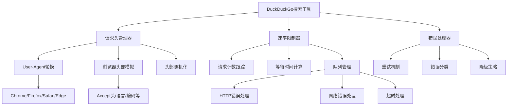

## 当前问题分析

从 [`definition/tools/duckduckgo_search.py`](definition/tools/duckduckgo_search.py:1) 和 [`definition/tools/fetch.py`](definition/tools/fetch.py:1) 的对比分析，发现以下问题：

### 1. 请求头设置过于简单
- 当前只设置了固定的User-Agent
- 缺少其他重要的浏览器头部信息
- 没有随机化机制，容易被识别为机器人

### 2. 缺少请求间隔控制
- 没有实现速率限制器
- 多次搜索时没有时间间隔

### 3. 错误处理不完善
- 没有重试机制
- 没有针对不同错误类型的处理

## 优化计划

### 1. 请求头优化策略

**参考 [`fetch.py`](definition/tools/fetch.py:28) 中的最佳实践：**
- 使用多样化的User-Agent列表
- 添加完整的浏览器头部信息
- 实现头部随机化机制

**具体实现：**
- 导入 [`fetch.py`](definition/tools/fetch.py:83) 中的 `get_browser_headers()` 函数
- 实现可选的请求头随机化

### 2. 时间间隔控制

**基于网络搜索的发现：**
- DuckDuckGo搜索限制：30次/分钟
- 内容获取限制：20次/分钟
- 添加自动队列管理和等待时间

### 3. 错误处理和重试机制

- 实现智能重试逻辑
- 针对不同HTTP状态码的处理
- 连接超时和读取超时的分别处理

### 4. 架构设计

### 5. 具体实现步骤

1. **重构请求头系统**
   - 从 [`fetch.py`](definition/tools/fetch.py:83) 导入 `get_browser_headers()` 功能
- **实现请求间隔控制**，基于30次/分钟的搜索限制
- **添加智能重试机制**，针对临时性错误
- **优化错误消息**，提供更具体的指导

2. **增强速率限制器**
   - 实现真正的请求计数和时间窗口管理
   - 添加队列管理功能
- **更新示例代码**，展示新的优化功能

### 6. 预期改进效果

- **提高成功率**：通过更好的请求头模拟减少被屏蔽
- **避免速率限制**：通过合理的间隔控制
- **更好的用户体验**：更详细的错误信息和恢复建议