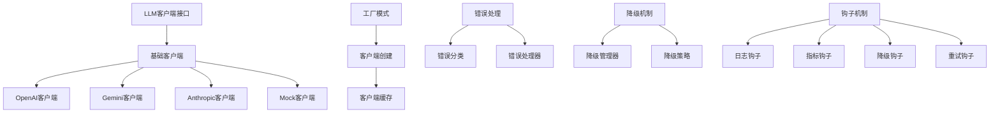

# LLM API调用处理逻辑分析与改进建议

## 概述

本文档对当前LLM模块的API调用处理逻辑进行全面分析，识别现有问题，并提出具体的改进建议。

## 1. 当前架构分析

### 1.1 架构优势

当前LLM模块架构具有以下优势：

1. **统一接口设计**：通过[`ILLMClient`](src/llm/interfaces.py:21)接口提供一致的API调用方式
2. **多模型支持**：支持OpenAI、Gemini、Anthropic等主流模型
3. **错误处理机制**：完善的异常分类和错误处理
4. **钩子机制**：支持调用前后的自定义逻辑
5. **降级策略**：提供多种降级策略和条件降级

### 1.2 核心组件



## 2. 存在的问题与不足

### 2.1 架构设计问题

#### 2.1.1 依赖注入不完整
- **问题**：[`LLMNode`](src/workflow/nodes/llm_node.py:26)中直接创建Mock客户端，缺乏依赖注入
- **影响**：测试困难，配置管理复杂
- **位置**：[`src/workflow/nodes/llm_node.py`](src/workflow/nodes/llm_node.py:169)

#### 2.1.2 配置管理分散
- **问题**：配置分散在多个地方，缺乏统一管理
- **影响**：配置维护困难，容易出错
- **位置**：[`src/llm/config.py`](src/llm/config.py:11), [`configs/llms/_group.yaml`](configs/llms/_group.yaml:1)

#### 2.1.3 类型安全不足
- **问题**：多处使用`Any`类型，缺乏类型安全
- **影响**：运行时错误风险增加
- **位置**：[`src/llm/clients/base.py`](src/llm/clients/base.py:63)

### 2.2 错误处理问题

#### 2.2.1 错误恢复机制不完善
- **问题**：错误钩子处理逻辑简单，缺乏智能重试
- **影响**：错误恢复能力有限
- **位置**：[`src/llm/hooks.py`](src/llm/hooks.py:253)

#### 2.2.2 错误信息不够详细
- **问题**：错误上下文信息不足，调试困难
- **影响**：问题定位效率低
- **位置**：[`src/llm/error_handler.py`](src/llm/error_handler.py:85)

### 2.3 性能问题

#### 2.3.1 缓存机制简单
- **问题**：客户端缓存使用简单LRU，缺乏TTL和智能淘汰
- **影响**：内存泄漏风险，缓存效率低
- **位置**：[`src/llm/factory.py`](src/llm/factory.py:177)

#### 2.3.2 缺乏连接池管理
- **问题**：HTTP连接未复用，每次请求创建新连接
- **影响**：性能开销大，响应时间长
- **位置**：[`src/llm/clients/gemini_client.py`](src/llm/clients/gemini_client.py:102)

### 2.4 可观测性问题

#### 2.4.1 监控指标不完整
- **问题**：缺乏详细的性能指标和监控数据
- **影响**：系统监控和性能分析困难
- **位置**：[`src/llm/hooks.py`](src/llm/hooks.py:107)

#### 2.4.2 日志记录不充分
- **问题**：日志信息不够详细，缺乏结构化日志
- **影响**：问题排查和审计困难
- **位置**：[`src/llm/hooks.py`](src/llm/hooks.py:26)

## 3. 改进建议

### 3.1 架构优化

#### 3.1.1 完善依赖注入
```python
# 建议：使用依赖注入容器管理客户端
class LLMNode(BaseNode):
    def __init__(self, llm_client_factory: ILLMClientFactory) -> None:
        self._llm_client_factory = llm_client_factory
    
    def _get_llm_client(self, config: Dict[str, Any]) -> ILLMClient:
        return self._llm_client_factory.create_client(config)
```

#### 3.1.2 统一配置管理
```python
# 建议：创建配置管理器
class LLMConfigManager:
    def __init__(self, config_loader: IConfigLoader) -> None:
        self._config_loader = config_loader
        self._config_cache: Dict[str, LLMClientConfig] = {}
    
    def get_client_config(self, model_name: str) -> LLMClientConfig:
        # 从配置系统加载并缓存配置
        pass
```

#### 3.1.3 增强类型安全
```python
# 建议：使用更严格的类型注解
from typing import TypeVar, Generic
from langchain_core.messages import BaseMessage

T = TypeVar('T', bound=BaseMessage)

class TypedLLMClient(ILLMClient, Generic[T]):
    def generate(
        self,
        messages: List[T],
        parameters: Optional[Dict[str, Any]] = None,
        **kwargs: Any
    ) -> LLMResponse:
        pass
```

### 3.2 错误处理优化

#### 3.2.1 智能重试机制
```python
# 建议：实现智能重试策略
class SmartRetryHook(ILLMCallHook):
    def __init__(
        self,
        max_retries: int = 3,
        base_delay: float = 1.0,
        max_delay: float = 60.0,
        jitter: bool = True
    ) -> None:
        self.max_retries = max_retries
        self.base_delay = base_delay
        self.max_delay = max_delay
        self.jitter = jitter
    
    def _calculate_delay(self, attempt: int) -> float:
        # 指数退避 + 抖动
        delay = min(self.base_delay * (2 ** attempt), self.max_delay)
        if self.jitter:
            delay = delay * (0.5 + random.random() * 0.5)
        return delay
```

#### 3.2.2 增强错误上下文
```python
# 建议：丰富错误上下文信息
@dataclass
class ErrorContext:
    model_name: str
    model_type: str
    request_id: str
    timestamp: datetime
    request_parameters: Dict[str, Any]
    request_messages: List[BaseMessage]
    response_headers: Optional[Dict[str, str]] = None
    response_status: Optional[int] = None
    response_body: Optional[str] = None
    retry_count: int = 0
    fallback_attempts: List[str] = field(default_factory=list)
```

### 3.3 性能优化

#### 3.3.1 智能缓存机制
```python
# 建议：实现智能缓存
class SmartCache:
    def __init__(
        self,
        max_size: int = 100,
        ttl: int = 3600,
        cleanup_interval: int = 300
    ) -> None:
        self.max_size = max_size
        self.ttl = ttl
        self.cleanup_interval = cleanup_interval
        self._cache: Dict[str, CacheEntry] = {}
        self._access_times: Dict[str, float] = {}
    
    def get(self, key: str) -> Optional[Any]:
        # 实现带TTL和访问频率的缓存
        pass
    
    def set(self, key: str, value: Any, ttl: Optional[int] = None) -> None:
        # 实现智能缓存设置
        pass
```

#### 3.3.2 连接池管理
```python
# 建议：实现HTTP连接池
class ConnectionPool:
    def __init__(
        self,
        max_connections: int = 10,
        max_keepalive: int = 10,
        timeout: float = 30.0
    ) -> None:
        self.max_connections = max_connections
        self.max_keepalive = max_keepalive
        self.timeout = timeout
        self._pool: Dict[str, List[Any]] = {}
    
    def get_connection(self, base_url: str) -> Any:
        # 获取或创建连接
        pass
    
    def release_connection(self, base_url: str, connection: Any) -> None:
        # 释放连接回池
        pass
```

### 3.4 可观测性增强

#### 3.4.1 结构化日志
```python
# 建议：实现结构化日志记录
class StructuredLoggingHook(ILLMCallHook):
    def __init__(self, logger: logging.Logger) -> None:
        self.logger = logger
    
    def before_call(
        self,
        messages: List[BaseMessage],
        parameters: Optional[Dict[str, Any]] = None,
        **kwargs: Any
    ) -> None:
        log_data = {
            "event": "llm_call_start",
            "model": kwargs.get("model", "unknown"),
            "message_count": len(messages),
            "parameters": parameters,
            "timestamp": datetime.now().isoformat()
        }
        self.logger.info("LLM调用开始", extra=log_data)
```

#### 3.4.2 详细监控指标
```python
# 建议：增强监控指标
class EnhancedMetricsHook(ILLMCallHook):
    def __init__(self) -> None:
        self.metrics = {
            "total_calls": 0,
            "successful_calls": 0,
            "failed_calls": 0,
            "total_tokens": 0,
            "total_response_time": 0.0,
            "error_counts": {},
            "model_usage": {},
            "latency_percentiles": {},
            "token_usage_stats": {}
        }
    
    def after_call(
        self,
        response: Optional[LLMResponse],
        messages: List[Any],
        parameters: Optional[Dict[str, Any]] = None,
        **kwargs: Any
    ) -> None:
        # 记录详细指标
        if response and response.response_time:
            self._record_latency(response.response_time)
            self._record_token_usage(response.token_usage)
            self._record_model_usage(response.model)
```

## 4. 具体改进方案

### 4.1 短期改进（1-2周）

1. **完善错误处理**
   - 实现智能重试机制
   - 增强错误上下文信息
   - 添加错误分类和统计

2. **优化配置管理**
   - 统一配置加载逻辑
   - 添加配置验证
   - 实现热重载配置

3. **增强监控能力**
   - 添加结构化日志
   - 实现基础监控指标
   - 添加性能追踪

### 4.2 中期改进（1-2个月）

1. **性能优化**
   - 实现智能缓存机制
   - 添加连接池管理
   - 优化内存使用

2. **架构重构**
   - 完善依赖注入
   - 重构配置系统
   - 增强类型安全

3. **扩展性增强**
   - 支持插件机制
   - 添加自定义钩子
   - 支持更多模型提供商

## 4. 实施优先级

### 高优先级（立即实施）
- 完善错误处理和重试机制
- 增强日志和监控
- 修复类型安全问题

### 中优先级（下个版本）
- 优化配置管理
- 实现智能缓存
- 添加连接池

### 低优先级（后续版本）
- 架构重构
- 高级功能开发
- 运维能力增强

## 5. 风险评估

### 技术风险
- **兼容性风险**：改进可能破坏现有API
- **性能风险**：新功能可能引入性能问题
- **稳定性风险**：复杂功能可能影响系统稳定性

### 缓解措施
- 充分测试：确保向后兼容性
- 渐进式发布：分阶段部署新功能
- 监控告警：实时监控系统状态

## 6. 总结

当前LLM API调用处理逻辑在架构设计上具有良好基础，但在错误处理、性能优化和可观测性方面存在改进空间。通过实施上述改进建议，可以显著提升系统的可靠性、性能和可维护性。

建议按照优先级分阶段实施改进，确保系统的稳定性和向后兼容性。