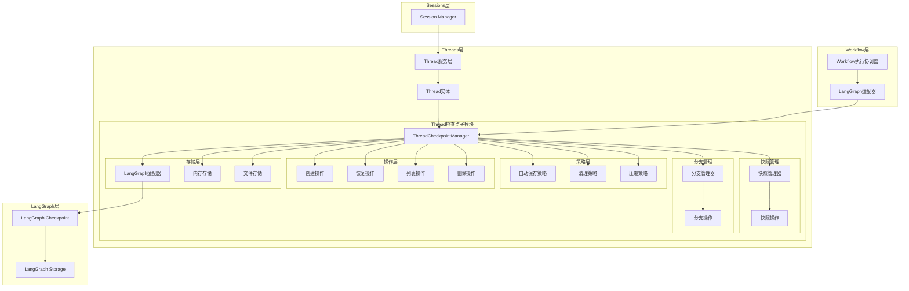
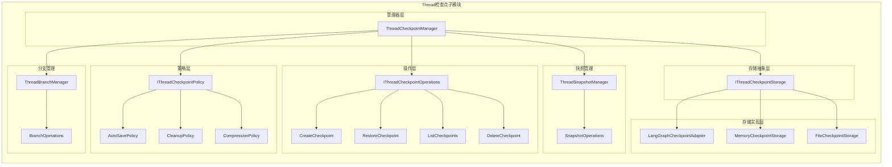
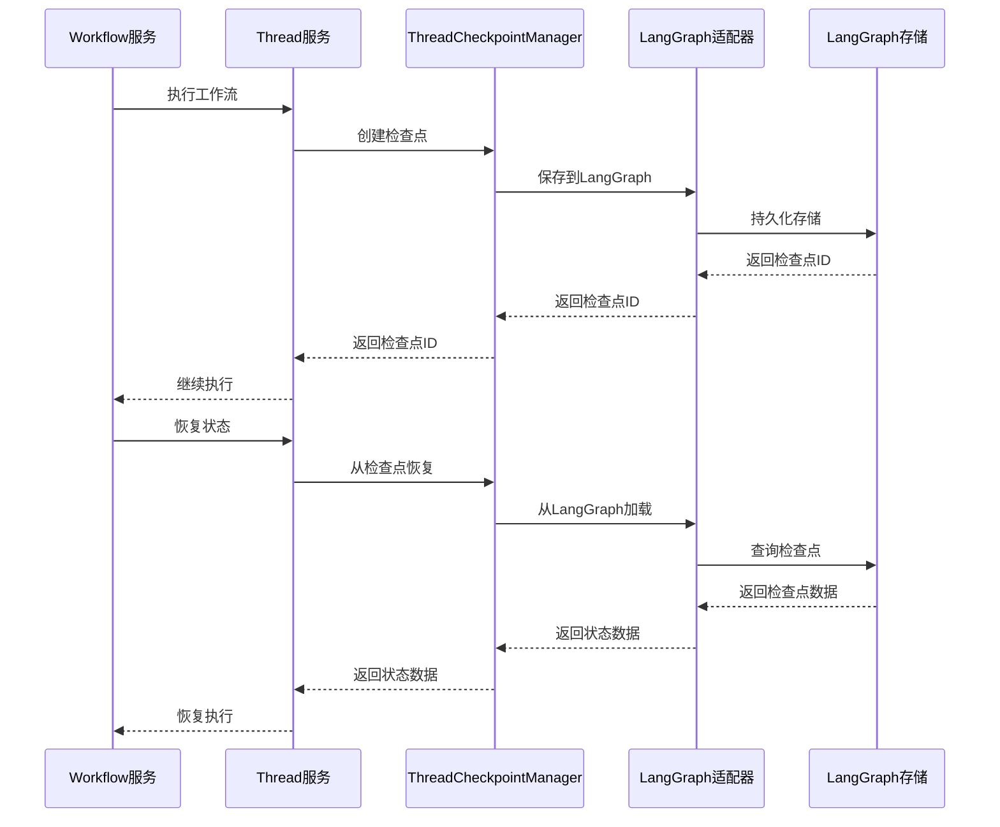
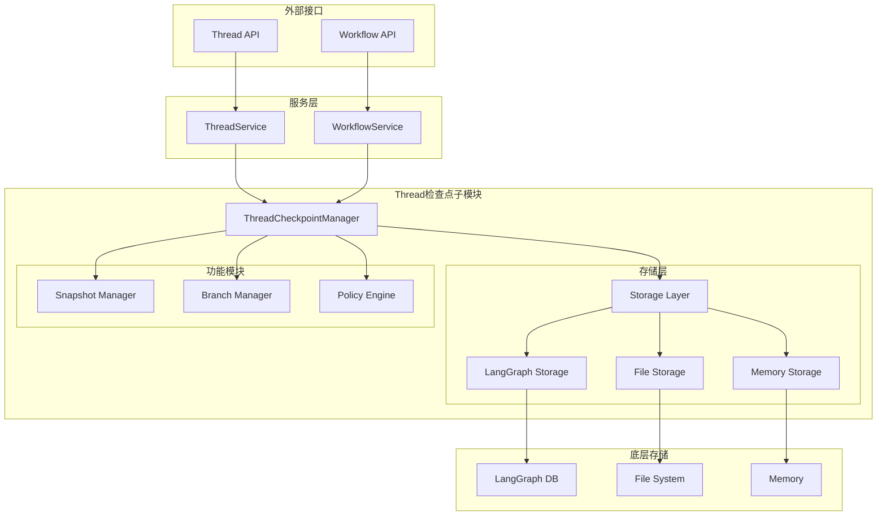
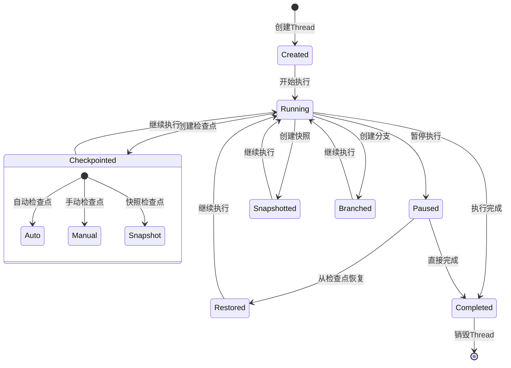
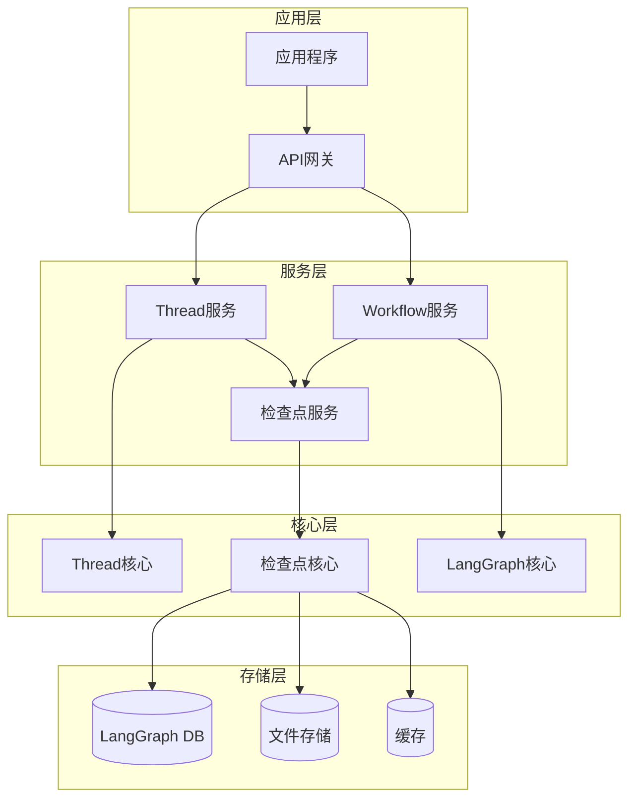
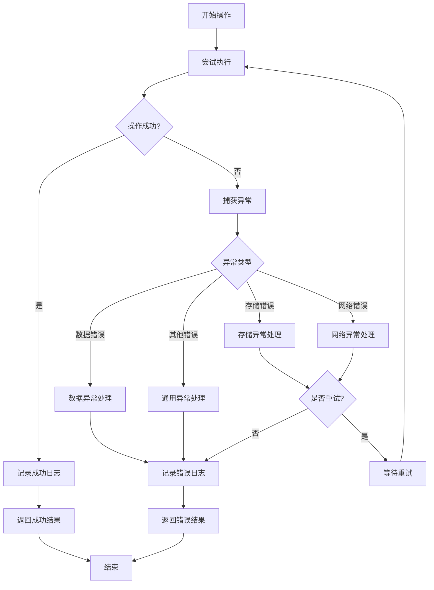
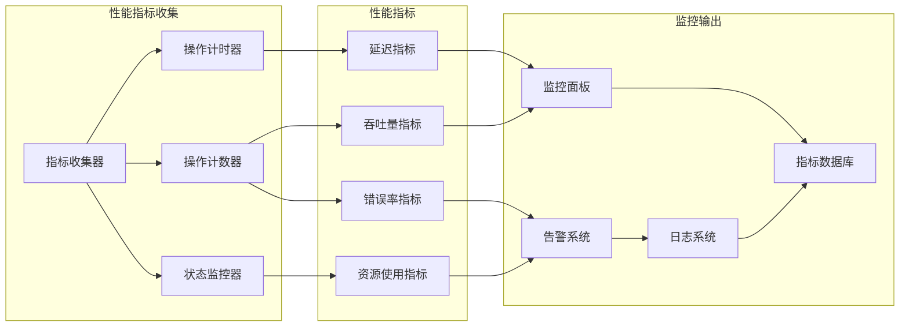

# Thread检查点子模块架构图

## 1. 整体架构图

## 2. 检查点子模块详细架构

## 3. 数据流图

## 4. 组件交互图

## 5. 状态转换图

## 6. 部署架构图

## 7. 错误处理流程图

## 8. 性能监控图

这些架构图清晰地展示了Thread检查点子模块的设计思路，包括组件关系、数据流、状态转换等关键方面，为后续的实现提供了详细的指导。