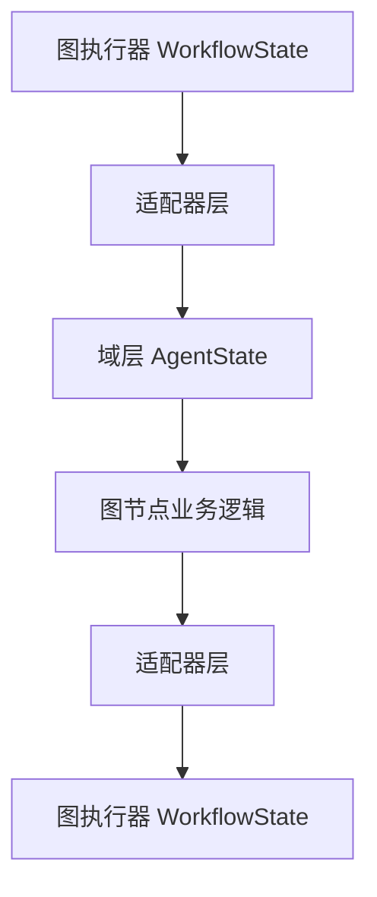

# Agent状态适配器集成方案

## 概述

本文档提供了详细的适配器集成方案，旨在解决当前适配器层已实现但未集成的问题。通过分阶段集成适配器到图节点执行流程，最终解决Agent与Graph系统的状态定义冲突问题。

## 当前问题分析

### 问题现状
- ✅ **适配器层已完整实现**：StateAdapter、MessageAdapter、AdapterFactory功能完整
- ⚠️ **适配器未集成**：图节点导入适配器但未在execute方法中使用
- ⚠️ **状态定义冲突依然存在**：图系统使用WorkflowState，节点使用AgentState

### 集成挑战
1. **接口不一致**：节点期望AgentState，图执行器使用WorkflowState
2. **类型转换复杂性**：需要确保所有字段的正确映射
3. **性能影响**：状态转换可能带来性能开销
4. **向后兼容性**：需要确保现有功能不受影响

## 集成方案设计

### 总体架构



### 核心原则

1. **统一接口**：所有节点统一使用WorkflowState作为输入输出类型
2. **适配器透明**：节点内部使用域层状态，适配器负责转换
3. **增量集成**：逐个节点集成，降低风险
4. **充分测试**：每个集成步骤都有完整测试覆盖

## 分阶段集成计划

### 阶段1：接口统一和基础框架（预计2天）

#### 1.1 更新节点接口
```python
# 当前问题接口
def execute(self, state: AgentState, config: Dict[str, Any]) -> NodeExecutionResult

# 目标接口
def execute(self, state: WorkflowState, config: Dict[str, Any]) -> WorkflowState
```

#### 1.2 创建基础适配器包装器
```python
class AdapterNodeWrapper:
    """适配器节点包装器"""
    
    def __init__(self, node_instance):
        self.node = node_instance
        self.state_adapter = get_state_adapter()
    
    def execute(self, state: WorkflowState, config: Dict[str, Any]) -> WorkflowState:
        # 1. 图状态转域状态
        domain_state = self.state_adapter.from_graph_state(state)
        
        # 2. 调用节点原始逻辑（需要适配）
        result = self.node.execute(domain_state, config)
        
        # 3. 域状态转回图状态
        return self.state_adapter.to_graph_state(result.state)
```

#### 1.3 更新图执行器配置
```python
# 在GraphBuilder中包装节点
def _get_node_function(self, node_config: NodeConfig) -> Optional[Callable]:
    node_class = self.node_registry.get_node_class(node_config.function_name)
    if node_class:
        node_instance = node_class()
        return AdapterNodeWrapper(node_instance).execute
```

### 阶段2：逐个节点集成（预计5天）

#### 2.1 分析节点集成（优先级：高）
**当前问题**：
```python
def execute(self, state: AgentState, config: Dict[str, Any]) -> NodeExecutionResult:
    # 直接使用域层状态
    state.messages.append(compatible_message)
```

**集成方案**：
```python
def execute(self, state: WorkflowState, config: Dict[str, Any]) -> WorkflowState:
    state_adapter = get_state_adapter()
    
    # 转换到域层状态
    domain_state = state_adapter.from_graph_state(state)
    
    # 业务逻辑（保持不变）
    compatible_message = AgentMessage(content=response.content, role='ai')
    domain_state.messages.append(compatible_message)
    
    # 转换回图状态
    return state_adapter.to_graph_state(domain_state)
```

#### 2.2 LLM节点集成（优先级：高）
**集成要点**：
- 保持现有的消息处理逻辑
- 添加状态转换包装
- 确保工具调用信息正确传递

#### 2.3 工具节点集成（优先级：中）
**集成要点**：
- 工具调用提取逻辑需要适配
- 工具结果需要正确映射
- 错误处理需要保持一致

#### 2.4 条件节点集成（优先级：低）
**集成要点**：
- 条件判断逻辑基于域层状态
- 条件配置需要适配新的状态类型

### 阶段3：性能优化和清理（预计3天）

#### 3.1 性能优化
```python
# 优化转换逻辑，减少不必要的复制
class OptimizedStateAdapter(StateAdapter):
    def to_graph_state(self, domain_state: DomainAgentState) -> GraphAgentState:
        # 使用引用而不是深拷贝
        # 优化消息转换
        # 缓存常用转换结果
```

#### 3.2 代码清理
- 移除未使用的导入
- 清理重复的状态定义
- 更新类型注解

#### 3.3 最终测试
- 完整的功能测试
- 性能基准测试
- 回归测试

## 详细技术实现

### 节点接口适配方案

#### 方案A：包装器模式（推荐）
```python
class AnalysisNodeWithAdapter:
    """带适配器的分析节点"""
    
    def __init__(self, original_node):
        self.original_node = original_node
        self.state_adapter = get_state_adapter()
    
    def execute(self, state: WorkflowState, config: Dict[str, Any]) -> WorkflowState:
        # 状态转换
        domain_state = self.state_adapter.from_graph_state(state)
        
        # 调用原始节点逻辑
        result = self.original_node.execute(domain_state, config)
        
        # 结果转换
        return self.state_adapter.to_graph_state(result.state)
```

#### 方案B：继承重写
```python
class AdaptedAnalysisNode(AnalysisNode):
    """适配后的分析节点"""
    
    def execute(self, state: WorkflowState, config: Dict[str, Any]) -> WorkflowState:
        state_adapter = get_state_adapter()
        domain_state = state_adapter.from_graph_state(state)
        
        # 调用父类逻辑
        result = super().execute(domain_state, config)
        
        return state_adapter.to_graph_state(result.state)
```

### 状态转换细节处理

#### 消息转换
```python
def _convert_messages_to_graph(self, domain_messages: List[DomainAgentMessage]) -> List[GraphBaseMessage]:
    """确保消息角色正确映射"""
    graph_messages = []
    for domain_msg in domain_messages:
        if domain_msg.role == "user":
            graph_msg = HumanMessage(content=domain_msg.content)
        elif domain_msg.role == "assistant":
            graph_msg = AIMessage(content=domain_msg.content)
        # ... 其他角色映射
        graph_messages.append(graph_msg)
    return graph_messages
```

#### 工具结果转换
```python
def _convert_tool_results(self, tool_results: List[ToolResult]) -> List[Dict[str, Any]]:
    """确保工具结果格式兼容"""
    return [
        {
            "tool_name": result.tool_name,
            "success": result.success,
            "output": result.output,
            "error": result.error
        }
        for result in tool_results
    ]
```

## 测试策略

### 单元测试
```python
def test_analysis_node_with_adapter():
    """测试带适配器的分析节点"""
    # 准备测试数据
    workflow_state = create_workflow_state(...)
    node = AnalysisNodeWithAdapter(original_node)
    
    # 执行测试
    result = node.execute(workflow_state, config)
    
    # 验证结果
    assert isinstance(result, WorkflowState)
    assert "messages" in result
    # ... 其他断言
```

### 集成测试
```python
def test_full_workflow_with_adapters():
    """测试完整工作流适配器集成"""
    # 构建带适配器的图
    graph = build_graph_with_adapters(config)
    
    # 执行工作流
    result = graph.invoke(initial_state)
    
    # 验证最终状态
    assert result["complete"] == True
    # ... 其他验证
```

### 性能测试
```python
def test_adapter_performance():
    """测试适配器性能"""
    import time
    state_adapter = get_state_adapter()
    
    start_time = time.time()
    for i in range(1000):
        graph_state = state_adapter.to_graph_state(domain_state)
        domain_state = state_adapter.from_graph_state(graph_state)
    
    duration = time.time() - start_time
    assert duration < 1.0  # 性能要求
```

## 风险缓解措施

### 技术风险
1. **类型转换错误**
   - **缓解**：完善的单元测试覆盖所有转换场景
   - **监控**：添加转换日志和错误监控

2. **性能下降**
   - **缓解**：优化转换逻辑，使用缓存
   - **监控**：性能基准测试和监控

3. **功能回归**
   - **缓解**：完整的回归测试套件
   - **回滚**：准备详细的回滚方案

### 项目风险
1. **集成复杂性**
   - **缓解**：分阶段集成，逐个节点验证
   - **沟通**：定期同步集成进度和问题

2. **时间延误**
   - **缓解**：设置缓冲时间，优先处理关键节点
   - **监控**：每日进度跟踪

## 成功标准

### 技术标准
- ✅ 所有图节点正确使用适配器进行状态转换
- ✅ 状态定义冲突问题完全解决
- ✅ 性能开销在可接受范围内（<10%）
- ✅ 向后兼容性得到保证

### 质量标准
- ✅ 单元测试覆盖率 >90%
- ✅ 集成测试通过率 100%
- ✅ 回归测试无功能回归
- ✅ 文档更新完整准确

### 项目标准
- ✅ 按计划完成集成工作
- ✅ 团队掌握新的架构模式
- ✅ 代码质量得到提升

## 后续工作

### 短期（集成完成后）
1. **监控和优化**：监控系统性能，进行必要的优化
2. **文档完善**：更新开发文档和API文档
3. **培训**：团队培训新的架构模式

### 中长期
1. **架构演进**：基于适配器模式进行进一步的架构优化
2. **功能扩展**：支持新的状态类型和工作流模式
3. **性能优化**：持续优化状态转换性能

## 总结

本集成方案提供了详细的技术实现路径和风险管理策略。通过分阶段、增量式的集成方法，可以安全有效地完成适配器集成工作，最终解决Agent与Graph系统的状态定义冲突问题。

**建议立即开始阶段1的工作，为后续的集成奠定基础。**