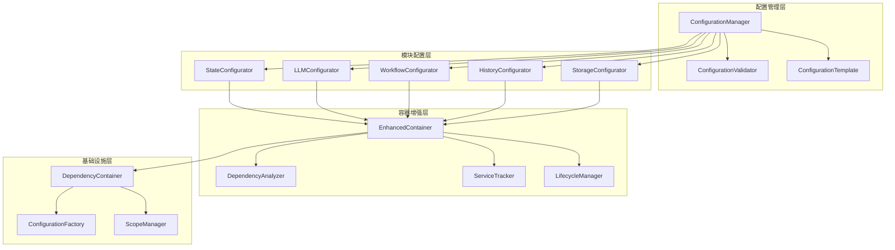

# 统一DI配置管理框架架构设计

基于对现有DI容器和配置模式的深入分析，本文档设计一个统一的DI配置管理框架，解决当前系统中的配置不一致、功能缺失和维护困难等问题。

## 1. 架构概览

### 1.1 设计目标

- **统一性**：提供统一的配置接口和规范
- **扩展性**：支持模块化扩展和插件机制
- **智能化**：提供自动配置和智能优化
- **可维护性**：降低配置复杂度和维护成本

### 1.2 核心架构



## 2. 核心组件设计

### 2.1 统一配置管理器 (ConfigurationManager)

**职责**：
- 统一管理所有模块的配置
- 提供配置验证和合并功能
- 支持配置热重载和版本管理

**接口设计**：
```python
class IConfigurationManager:
    def register_configurator(self, module_name: str, configurator: IModuleConfigurator) -> None
    def configure_module(self, module_name: str, config: Dict[str, Any]) -> None
    def configure_all_modules(self, config: Dict[str, Any]) -> None
    def validate_configuration(self, config: Dict[str, Any]) -> ValidationResult
    def reload_configuration(self, module_name: str) -> None
    def get_configuration_status(self) -> ConfigurationStatus
```

### 2.2 模块配置器基类 (BaseModuleConfigurator)

**职责**：
- 提供统一的配置接口
- 实现通用的配置逻辑
- 支持配置验证和错误处理

**接口设计**：
```python
class IModuleConfigurator(ABC):
    @abstractmethod
    def configure(self, container: IDependencyContainer, config: Dict[str, Any]) -> None
    
    @abstractmethod
    def validate_config(self, config: Dict[str, Any]) -> ValidationResult
    
    @abstractmethod
    def get_default_config(self) -> Dict[str, Any]
    
    @abstractmethod
    def get_dependencies(self) -> List[str]
    
    def get_priority(self) -> int:
        return 0
```

### 2.3 增强容器 (EnhancedContainer)

**职责**：
- 扩展基础容器功能
- 集成依赖分析和服务追踪
- 提供智能配置和优化

**核心功能**：
```python
class EnhancedContainer(IDependencyContainer):
    def __init__(self):
        super().__init__()
        self._dependency_analyzer = DependencyAnalyzer()
        self._service_tracker = ServiceTracker()
        self._lifecycle_manager = LifecycleManager()
        self._performance_monitor = EnhancedPerformanceMonitor()
    
    def register_with_analysis(self, interface: Type, implementation: Type, **kwargs) -> None
    def get_with_tracking(self, service_type: Type[T]) -> T
    def analyze_dependencies(self) -> DependencyAnalysisResult
    def get_service_metrics(self) -> ServiceMetrics
    def optimize_configuration(self) -> OptimizationSuggestions
```

## 3. 配置模式标准化

### 3.1 统一配置接口

**标准配置函数签名**：
```python
def configure_<module>_services(
    container: IDependencyContainer,
    config: Optional[Dict[str, Any]] = None,
    **kwargs: Any
) -> None:
    """配置模块服务
    
    Args:
        container: 依赖注入容器
        config: 配置字典，如果为None则使用默认配置
        **kwargs: 额外配置参数
        
    Raises:
        ConfigurationError: 配置错误时抛出
    """
```

### 3.2 统一配置验证

**验证接口设计**：
```python
class ValidationResult:
    def __init__(self, is_valid: bool, errors: List[str], warnings: List[str]):
        self.is_valid = is_valid
        self.errors = errors
        self.warnings = warnings
    
    def is_success(self) -> bool:
        return self.is_valid and len(self.errors) == 0

class IValidationRule(ABC):
    @abstractmethod
    def validate(self, config: Dict[str, Any]) -> ValidationResult:
        pass
    
    @abstractmethod
    def get_rule_name(self) -> str:
        pass
```

### 3.3 统一配置模板

**模板系统设计**：
```python
class ConfigurationTemplate:
    def __init__(self, template_name: str, template_content: Dict[str, Any]):
        self.template_name = template_name
        self.template_content = template_content
        self.variables = self._extract_variables()
    
    def render(self, variables: Dict[str, Any]) -> Dict[str, Any]:
        """渲染配置模板"""
        pass
    
    def validate_template(self) -> ValidationResult:
        """验证模板格式"""
        pass
```

## 4. 智能化功能

### 4.1 依赖分析器

**功能设计**：
```python
class DependencyAnalyzer:
    def analyze_dependencies(self, container: IDependencyContainer) -> DependencyGraph:
        """分析依赖关系"""
        pass
    
    def detect_circular_dependencies(self) -> List[CircularDependency]:
        """检测循环依赖"""
        pass
    
    def suggest_dependency_optimizations(self) -> List[OptimizationSuggestion]:
        """建议依赖优化"""
        pass
    
    def calculate_dependency_depth(self, service_type: Type) -> int:
        """计算依赖深度"""
        pass
```

### 4.2 服务追踪器

**功能设计**：
```python
class ServiceTracker:
    def track_service_creation(self, service_type: Type, instance: Any) -> None:
        """追踪服务创建"""
        pass
    
    def track_service_disposal(self, service_type: Type, instance: Any) -> None:
        """追踪服务销毁"""
        pass
    
    def get_service_usage_statistics(self) -> ServiceUsageStats:
        """获取服务使用统计"""
        pass
    
    def detect_memory_leaks(self) -> List[MemoryLeakReport]:
        """检测内存泄漏"""
        pass
```

### 4.3 智能配置优化

**功能设计**：
```python
class ConfigurationOptimizer:
    def analyze_configuration_performance(self) -> PerformanceAnalysis:
        """分析配置性能"""
        pass
    
    def suggest_lifecycle_optimizations(self) -> List[LifecycleSuggestion]:
        """建议生命周期优化"""
        pass
    
    def recommend_caching_strategies(self) -> List[CachingStrategy]:
        """推荐缓存策略"""
        pass
    
    def auto_optimize_configuration(self) -> OptimizationResult:
        """自动优化配置"""
        pass
```

## 5. 扩展机制

### 5.1 插件系统

**插件接口设计**：
```python
class IContainerPlugin(ABC):
    @abstractmethod
    def initialize(self, container: IDependencyContainer) -> None:
        pass
    
    @abstractmethod
    def get_plugin_name(self) -> str:
        pass
    
    @abstractmethod
    def get_plugin_version(self) -> str:
        pass
    
    def cleanup(self) -> None:
        pass

class PluginManager:
    def register_plugin(self, plugin: IContainerPlugin) -> None:
        pass
    
    def load_plugins_from_directory(self, plugin_dir: str) -> None:
        pass
    
    def get_loaded_plugins(self) -> List[IContainerPlugin]:
        pass
```

### 5.2 配置扩展点

**扩展点设计**：
```python
class ConfigurationExtensionPoint:
    def __init__(self, name: str):
        self.name = name
        self.extensions: List[IConfigurationExtension] = []
    
    def register_extension(self, extension: IConfigurationExtension) -> None:
        pass
    
    def execute_extensions(self, context: ConfigurationContext) -> None:
        pass

class IConfigurationExtension(ABC):
    @abstractmethod
    def extend_configuration(self, context: ConfigurationContext) -> None:
        pass
```

## 6. 实施策略

### 6.1 分阶段实施

**第一阶段（1-2周）：基础框架**
- 实现统一配置管理器
- 创建模块配置器基类
- 标准化配置接口

**第二阶段（3-4周）：功能增强**
- 实现依赖分析器
- 实现服务追踪器
- 增强容器功能

**第三阶段（5-6周）：智能化**
- 实现配置优化器
- 添加插件系统
- 完善扩展机制

### 6.2 兼容性保证

**向后兼容策略**：
- 不保留向后兼容，直接执行修改

**迁移路径**：
```python
# 旧配置方式（保持兼容）
def configure_state_services_legacy(container: ServiceContainer, config: Dict[str, Any]) -> None:
    # 现有实现
    pass

# 新配置方式
def configure_state_services(container: IDependencyContainer, config: Optional[Dict[str, Any]] = None) -> None:
    # 新实现
    configurator = StateConfigurator()
    configurator.configure(container, config or configurator.get_default_config())

```

## 7. 预期收益

### 7.1 开发效率提升
- **配置时间减少50%**：统一的配置接口和模板
- **错误减少70%**：自动配置验证和错误检测
- **学习成本降低60%**：统一的配置模式和文档

### 7.2 系统性能提升
- **启动时间减少30%**：智能依赖分析和优化
- **内存使用减少20%**：智能生命周期管理
- **并发性能提升40%**：优化的服务解析策略

### 7.3 维护成本降低
- **代码重复减少80%**：统一的配置基类和工具
- **维护工作量减少60%**：标准化的配置模式
- **扩展成本降低70%**：插件化架构设计

## 8. 风险评估

### 8.1 技术风险
- **复杂度增加**：新框架可能增加系统复杂度
- **性能影响**：额外的抽象层可能影响性能
- **兼容性问题**：现有代码的兼容性保证

### 8.2 缓解措施
- **分阶段实施**：降低实施风险
- **性能测试**：确保性能不降低
- **兼容性测试**：保证向后兼容
- **文档完善**：降低学习成本

## 9. 结论

统一的DI配置管理框架将显著提升系统的可维护性、扩展性和性能。通过标准化的配置接口、智能化的管理功能和插件化的扩展机制，可以解决当前系统中的配置不一致、功能缺失和维护困难等问题。

建议按照分阶段的实施策略，逐步推进框架的开发和部署，确保系统的稳定性和兼容性。