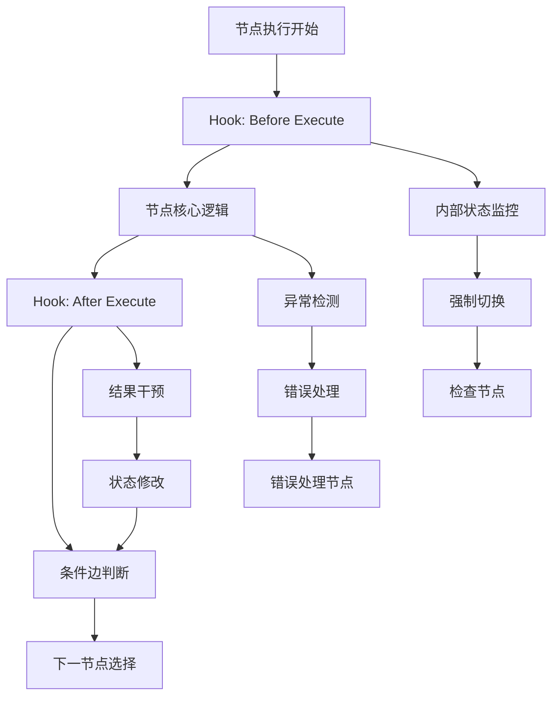

# Hook机制与条件边的关系分析

## 概述

本文档详细分析节点Hook机制与LangGraph条件边的关系，明确两者的职责边界和协作方式。

## 核心理解

### Hook机制的角色定位
- **主要职责**：通过配置文件灵活地为节点配置检查机制
- **核心能力**：捕获节点内部状态，实现细粒度的监控和干预
- **应用场景**：死循环检测、性能监控、异常状态捕获等

### 条件边的角色定位
- **主要职责**：处理正常通过节点已定义的退出条件或LLM工具调用执行切换时的检查
- **核心能力**：实现复杂的流程判断逻辑
- **应用场景**：工作流编排时已经确定好的流程判断

## 职责边界划分

### Hook机制的职责范围
1. **节点内部状态监控**
   - 执行时间监控
   - 死循环检测
   - 连续失败计数
   - 资源使用监控

2. **异常状态干预**
   - 强制切换到检查节点
   - 降级处理逻辑
   - 错误恢复机制

3. **性能指标收集**
   - 执行时间统计
   - 成功率统计
   - 资源使用统计

### 条件边的职责范围
1. **业务流程判断**
   - 工具调用结果判断
   - LLM响应内容分析
   - 任务完成状态判断

2. **工作流路径选择**
   - 根据业务逻辑选择下一节点
   - 多分支路径选择
   - 循环控制逻辑

3. **状态转换逻辑**
   - 基于全局状态的路径决策
   - 预定义的业务规则判断

## 协作关系图



## 具体场景分析

### 场景1：死循环检测
- **Hook职责**：监控节点执行次数，超过阈值时强制切换到检查节点
- **条件边职责**：不参与此逻辑，因为这是异常状态处理

### 场景2：工具调用结果判断
- **Hook职责**：不参与正常工具调用结果判断
- **条件边职责**：根据工具执行结果选择下一节点路径

### 场景3：性能监控
- **Hook职责**：记录节点执行时间，超时时进行干预
- **条件边职责**：不参与性能监控逻辑

### 场景4：业务流程分支
- **Hook职责**：不参与正常的业务流程分支决策
- **条件边职责**：根据业务规则选择不同的执行路径

## 配置示例

### Hook配置示例
```yaml
# configs/hooks/agent_execution_hooks.yaml
agent_execution_node:
  hooks:
    - type: "dead_loop_detection"
      config:
        max_iterations: 20
        fallback_node: "dead_loop_check"
    - type: "performance_monitoring"
      config:
        timeout_threshold: 10.0
        log_slow_executions: true
    - type: "error_recovery"
      config:
        max_retries: 3
        fallback_node: "error_handler"
```

### 条件边配置示例
```yaml
# configs/graphs/workflow.yaml
edges:
  - from: "agent_execution_node"
    to: "tool_execution_node"
    type: "conditional"
    condition: "has_tool_calls"
    description: "有工具调用时执行工具"
    
  - from: "agent_execution_node"  
    to: "end_node"
    type: "conditional"
    condition: "task_completed"
    description: "任务完成时结束"
```

## 技术实现建议

### Hook实现要点
1. **节点内部状态访问**：Hook需要能够访问节点的内部执行状态
2. **干预能力**：支持修改节点执行结果和下一节点选择
3. **配置驱动**：通过YAML配置实现灵活的Hook组合
4. **错误隔离**：Hook执行错误不应影响主流程

### 条件边实现要点
1. **全局状态访问**：基于AgentState进行判断
2. **业务逻辑封装**：实现复杂的业务判断逻辑
3. **路径映射**：支持多分支路径选择
4. **性能优化**：条件判断应该高效执行

## 总结

Hook机制和条件边在节点切换触发中扮演不同的角色：

- **Hook机制**：专注于节点内部状态的监控和异常干预，提供灵活的配置化检查机制
- **条件边**：专注于业务流程的逻辑判断和路径选择，实现预定义的工作流编排

两者相辅相成，Hook机制弥补了条件边在节点内部状态监控方面的不足，而条件边继续承担正常的业务流程决策职责。这种分工确保了系统的灵活性和可维护性。