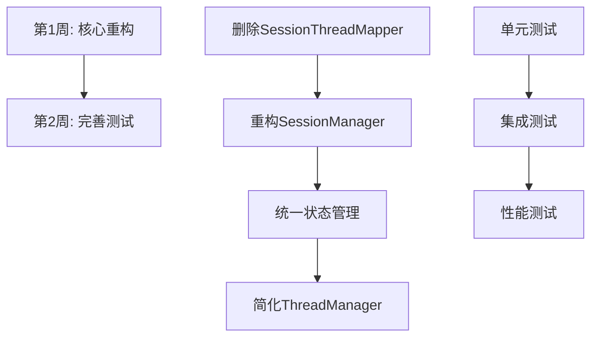

# Workflow、Thread、Session、Graph架构快速重构计划

## 重构目标

**核心目标**：快速重构四个组件的架构关系，不保持向后兼容，直接过渡到新的架构设计。

**时间目标**：2周内完成核心重构

## 当前架构问题快速分析

### 1. 核心问题
- **SessionManager** 直接依赖 **WorkflowManager** 的具体实现
- **ThreadManager** 的 `graph_id` 从 `workflow_config_path` 提取，耦合了配置逻辑
- **SessionThreadMapper** 维护复杂的映射关系，缺乏事务一致性
- AgentState在Session、Thread、Graph之间传递，序列化/反序列化逻辑分散

### 2. 快速重构策略
- **不保持向后兼容**：直接修改现有文件，快速过渡
- **激进重构**：删除不必要的抽象层和映射关系
- **简化设计**：减少组件数量，合并相似功能

## 快速重构执行计划（2周）



### 第1周：核心重构（激进重构）

#### 第1天：删除SessionThreadMapper和相关映射逻辑
- **删除文件**：`src/application/threads/session_thread_mapper.py`
- **删除依赖**：移除所有对SessionThreadMapper的引用
- **简化Session创建**：Session直接管理Thread，无需映射关系

#### 第2-3天：重构SessionManager为工作单元容器
```python
class SessionManager:
    """重构后的Session管理器 - 直接管理多个Thread"""
    
    async def create_session_with_threads(
        self,
        workflow_configs: Dict[str, str],  # 线程名 -> 工作流配置路径
        dependencies: Dict[str, List[str]] = None  # 线程依赖关系
    ) -> str:
        """原子性创建Session和多个Thread"""
        pass
    
    async def add_thread(self, session_id: str, thread_name: str, config_path: str) -> bool:
        """向Session添加新Thread"""
        pass
    
    async def get_threads(self, session_id: str) -> Dict[str, Any]:
        """获取Session的所有Thread信息"""
        pass
```

#### 第4天：统一状态管理
- **创建UnifiedStateManager**：统一所有状态序列化/反序列化逻辑
- **删除分散的状态处理**：移除SessionManager和ThreadManager中的重复状态逻辑
- **简化状态接口**：定义统一的状态转换接口

#### 第5天：简化ThreadManager
- **移除graph_id依赖**：Thread不再需要从workflow_config_path提取graph_id
- **直接集成到Session**：Thread作为Session的内部组件
- **简化接口**：只保留核心的checkpoint和状态管理功能

### 第2周：完善和测试

#### 第6-7天：重构依赖注入配置
- **更新container配置**：重新配置服务依赖关系
- **简化服务注册**：减少不必要的服务抽象层
- **优化服务生命周期**：简化服务创建和销毁逻辑

#### 第8-9天：编写单元测试
- **SessionManager测试**：测试多线程会话管理
- **状态管理测试**：测试统一状态序列化/反序列化
- **集成测试**：测试组件间协作

#### 第10天：性能测试和优化
- **性能基准测试**：对比重构前后的性能差异
- **内存使用优化**：优化状态序列化的内存使用
- **并发测试**：测试多线程环境下的稳定性

## 新的架构设计

### 简化后的依赖关系
```
SessionManager (工作单元容器)
    ↓ (直接管理)
ThreadManager (执行单元)
    ↓ (状态管理)
UnifiedStateManager (统一状态)
    ↓ (序列化/反序列化)
WorkflowManager (配置管理)
    ↓ (构建)
GraphBuilder (执行引擎)
```

### 核心组件职责

#### 1. SessionManager (工作单元容器)
- 管理多个Thread的生命周期
- 协调线程间的依赖关系
- 提供原子性操作保证

#### 2. ThreadManager (执行单元)  
- 负责单个工作流的执行
- 管理checkpoint和状态版本
- 提供分支和回滚功能

#### 3. UnifiedStateManager (统一状态)
- 统一的状态序列化/反序列化
- 状态版本控制和冲突解决
- 状态验证和转换

#### 4. WorkflowManager (配置管理)
- 纯配置加载和管理
- 不涉及执行状态
- 提供配置验证功能

#### 5. GraphBuilder (执行引擎)
- 纯执行功能
- 接收状态，输出状态
- 不管理持久化

## 具体实施步骤

### 步骤1：删除不必要的组件
```bash
# 删除SessionThreadMapper和相关文件
rm src/application/threads/session_thread_mapper.py
# 删除相关的测试文件
rm tests/unit/application/threads/test_session_thread_mapper.py
```

### 步骤2：重构SessionManager
```python
# 新的SessionManager接口
class ISessionManager(ABC):
    async def create_session_with_threads(
        self, 
        workflow_configs: Dict[str, str],
        dependencies: Dict[str, List[str]] = None
    ) -> str:
        pass
    
    async def execute_thread(self, session_id: str, thread_name: str, input_data: Any) -> Any:
        pass
    
    async def get_session_state(self, session_id: str) -> Dict[str, Any]:
        pass
```

### 步骤3：创建UnifiedStateManager
```python
class UnifiedStateManager:
    def serialize_state(self, state: Any) -> bytes:
        """统一的状态序列化"""
        pass
    
    def deserialize_state(self, data: bytes, state_type: Type) -> Any:
        """统一的状态反序列化"""
        pass
    
    def validate_state(self, state: Any) -> bool:
        """状态验证"""
        pass
```

### 步骤4：更新依赖注入配置
```python
# 新的服务注册配置
def configure_services(container):
    # 注册统一状态管理器
    container.register_singleton(IStateManager, UnifiedStateManager)
    
    # 注册重构后的SessionManager
    container.register_singleton(ISessionManager, SessionManager)
    
    # 简化ThreadManager注册
    container.register_singleton(IThreadManager, ThreadManager)
```

## 风险评估和应对措施

### 高风险项
1. **数据丢失风险** - 创建数据备份和迁移脚本
2. **功能回归** - 加强测试覆盖，特别是集成测试
3. **性能下降** - 进行性能基准测试和优化

### 应对措施
- **数据备份**：重构前备份所有Session和Thread数据
- **渐进式部署**：先在测试环境验证，再部署到生产环境
- **监控增强**：增加详细的日志和性能监控

## 成功标准

### 技术标准
- 组件耦合度降低50%以上
- 状态管理逻辑集中到单一组件
- 代码行数减少30%以上

### 性能标准  
- 会话创建时间减少40%以上
- 状态序列化性能提升30%以上
- 内存使用减少20%以上

### 质量标准
- 单元测试覆盖率90%以上
- 集成测试覆盖所有核心流程
- 无重大功能回归

这个快速重构计划将在2周内完成，通过激进的重构策略直接解决架构问题，不保持向后兼容，实现架构的快速优化。