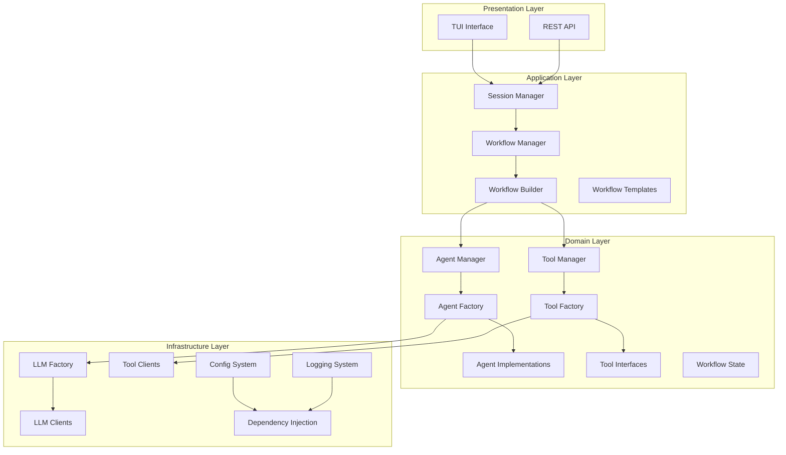
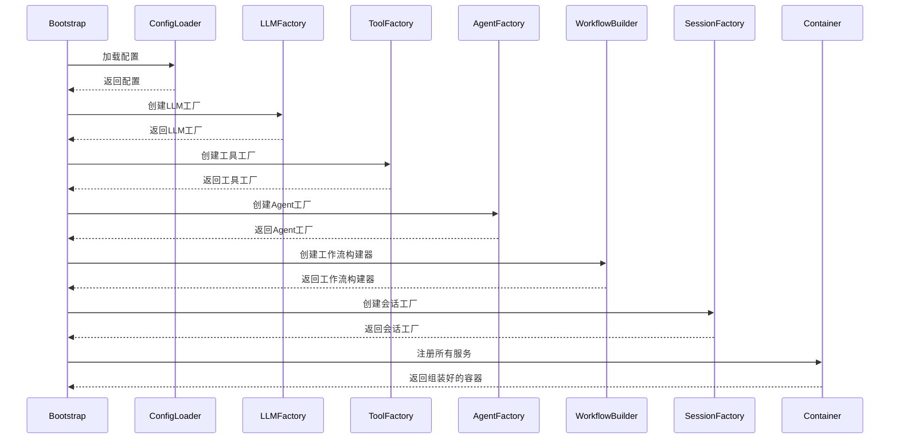
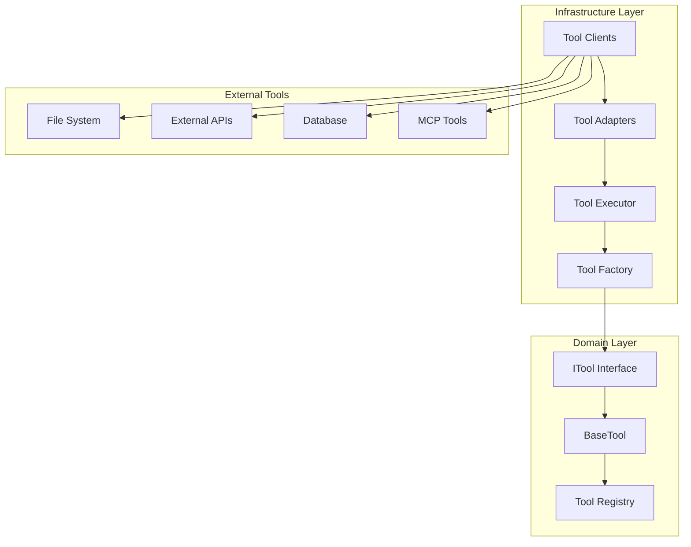
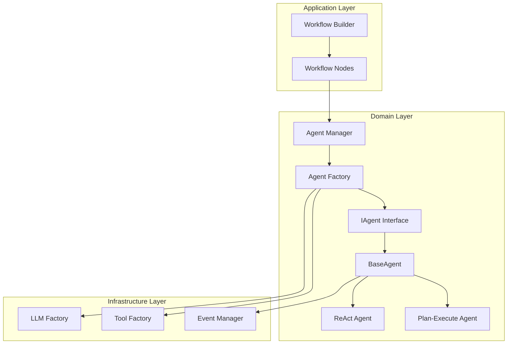
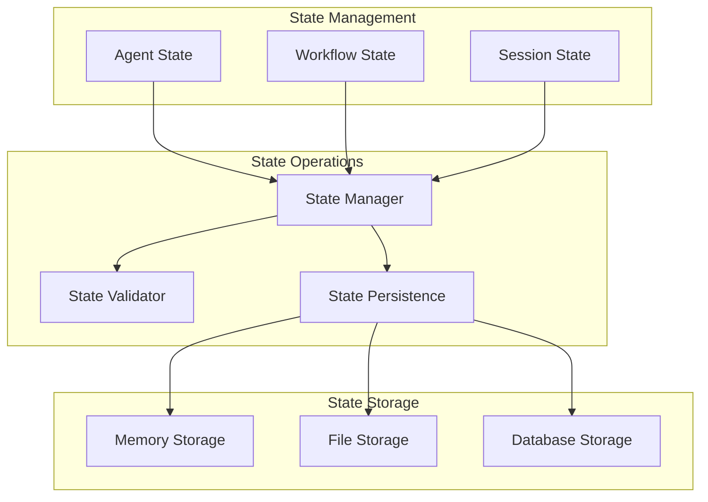

# 改进后的架构设计方案

## 概述

本文档基于架构分析报告的建议，设计了改进后的 Modular Agent Framework 架构，包括详细的架构图、组件设计和实施计划。

## 1. 改进后的整体架构

### 1.1 架构层级图



### 1.2 架构原则

1. **单一职责原则**：每个组件只负责一个明确的功能
2. **依赖倒置原则**：高层模块不依赖低层模块，都依赖抽象
3. **开闭原则**：对扩展开放，对修改关闭
4. **接口隔离原则**：使用多个专门的接口，而不是单一的总接口
5. **配置驱动原则**：通过配置文件驱动组件的创建和组装

### 1.3 层级职责定义

#### Presentation Layer（表现层）
- **职责**：提供用户界面和API接口
- **组件**：
  - TUI Interface：终端用户界面
  - REST API：HTTP API接口（未来扩展）
- **特点**：不包含业务逻辑，只负责用户交互

#### Application Layer（应用层）
- **职责**：协调领域对象，执行应用任务
- **组件**：
  - Session Manager：会话生命周期管理
  - Workflow Manager：工作流执行管理
  - Workflow Builder：工作流构建和组装
  - Workflow Templates：工作流模板管理
- **特点**：编排业务流程，不包含具体业务逻辑

#### Domain Layer（领域层）
- **职责**：表达业务概念和业务规则
- **组件**：
  - Agent Manager：Agent实例管理
  - Agent Factory：Agent创建工厂
  - Agent Implementations：具体Agent实现
  - Tool Manager：工具管理
  - Tool Factory：工具创建工厂
  - Tool Interfaces：工具接口定义
  - Workflow State：工作流状态管理
- **特点**：包含核心业务逻辑，不依赖技术细节

#### Infrastructure Layer（基础设施层）
- **职责**：提供技术支持和外部集成
- **组件**：
  - LLM Factory：LLM客户端工厂
  - LLM Clients：具体LLM客户端实现
  - Tool Clients：外部工具客户端
  - Config System：配置管理系统
  - Dependency Injection：依赖注入容器
  - Logging System：日志系统
- **特点**：提供技术实现，不包含业务逻辑

## 2. 核心组件设计

### 2.1 配置驱动的组件组装

#### 2.1.1 组装流程图



#### 2.1.2 简化的ComponentAssembler

```python
class ComponentAssembler:
    """简化的组件组装器"""
    
    def __init__(self, container: IDependencyContainer, config_loader: IConfigLoader):
        self.container = container
        self.config_loader = config_loader
        self.registry = Registry()
    
    def assemble(self, config_path: str) -> IDependencyContainer:
        """组装组件"""
        # 1. 加载配置
        config = self.config_loader.load(config_path)
        
        # 2. 创建基础工厂
        llm_factory = self._create_llm_factory(config["llm"])
        tool_factory = self._create_tool_factory(config["tools"])
        
        # 3. 创建业务工厂
        agent_factory = self._create_agent_factory(config["agents"], llm_factory, tool_factory)
        workflow_builder = self._create_workflow_builder(config["workflows"], agent_factory)
        session_factory = self._create_session_factory(config["session"])
        
        # 4. 注册服务
        self._register_services(llm_factory, tool_factory, agent_factory, workflow_builder, session_factory)
        
        return self.container
    
    def _create_llm_factory(self, config: Dict[str, Any]) -> ILLMFactory:
        """创建LLM工厂"""
        return LLMFactory(config)
    
    def _create_tool_factory(self, config: Dict[str, Any]) -> IToolFactory:
        """创建工具工厂"""
        return ToolFactory(config)
    
    def _create_agent_factory(self, config: Dict[str, Any], llm_factory: ILLMFactory, tool_factory: IToolFactory) -> IAgentFactory:
        """创建Agent工厂"""
        return AgentFactory(config, llm_factory, tool_factory)
    
    def _create_workflow_builder(self, config: Dict[str, Any], agent_factory: IAgentFactory) -> IWorkflowBuilder:
        """创建工作流构建器"""
        return WorkflowBuilder(config, agent_factory)
    
    def _create_session_factory(self, config: Dict[str, Any]) -> ISessionFactory:
        """创建会话工厂"""
        return SessionFactory(config)
    
    def _register_services(self, *factories) -> None:
        """注册服务到容器"""
        for factory in factories:
            self.container.register(type(factory), factory)
```

### 2.2 统一的工具系统

#### 2.2.1 工具系统架构图



#### 2.2.2 工具接口设计

```python
class ITool(ABC):
    """工具接口"""
    
    @property
    @abstractmethod
    def name(self) -> str:
        """工具名称"""
        pass
    
    @property
    @abstractmethod
    def description(self) -> str:
        """工具描述"""
        pass
    
    @abstractmethod
    async def execute(self, **kwargs) -> Any:
        """执行工具"""
        pass
    
    @abstractmethod
    def get_schema(self) -> Dict[str, Any]:
        """获取参数模式"""
        pass

class IToolFactory(ABC):
    """工具工厂接口"""
    
    @abstractmethod
    def create_tool(self, tool_config: Dict[str, Any]) -> ITool:
        """创建工具实例"""
        pass
    
    @abstractmethod
    def register_tool_type(self, tool_type: str, tool_class: Type[ITool]) -> None:
        """注册工具类型"""
        pass

class IToolExecutor(ABC):
    """工具执行器接口"""
    
    @abstractmethod
    async def execute_tool(self, tool: ITool, **kwargs) -> Any:
        """执行工具"""
        pass
    
    @abstractmethod
    def get_available_tools(self) -> List[ITool]:
        """获取可用工具列表"""
        pass
```

### 2.3 解耦的Agent系统

#### 2.3.1 Agent系统架构图



#### 2.3.2 Agent接口设计

```python
class IAgent(ABC):
    """Agent接口"""
    
    @property
    @abstractmethod
    def name(self) -> str:
        """Agent名称"""
        pass
    
    @property
    @abstractmethod
    def description(self) -> str:
        """Agent描述"""
        pass
    
    @abstractmethod
    async def execute(self, state: AgentState) -> AgentState:
        """执行Agent逻辑"""
        pass
    
    @abstractmethod
    def can_handle(self, state: AgentState) -> bool:
        """判断是否能处理当前状态"""
        pass
    
    @abstractmethod
    def get_capabilities(self) -> List[str]:
        """获取Agent能力列表"""
        pass

class IAgentFactory(ABC):
    """Agent工厂接口"""
    
    @abstractmethod
    def create_agent(self, agent_config: Dict[str, Any]) -> IAgent:
        """创建Agent实例"""
        pass
    
    @abstractmethod
    def register_agent_type(self, agent_type: str, agent_class: Type[IAgent]) -> None:
        """注册Agent类型"""
        pass

class IAgentManager(ABC):
    """Agent管理器接口"""
    
    @abstractmethod
    async def execute_agent(self, agent_id: str, state: AgentState) -> AgentState:
        """执行Agent"""
        pass
    
    @abstractmethod
    def register_agent(self, agent_id: str, agent: IAgent) -> None:
        """注册Agent实例"""
        pass
```

### 2.4 统一的状态管理

#### 2.4.1 状态管理架构图



#### 2.4.2 状态设计

```python
@dataclass
class AgentState:
    """Agent状态"""
    # 基础信息
    agent_id: str = ""
    agent_type: str = ""
    
    # 消息历史
    messages: List[BaseMessage] = field(default_factory=list)
    
    # 上下文信息
    context: Dict[str, Any] = field(default_factory=dict)
    
    # 工具执行结果
    tool_results: List[ToolResult] = field(default_factory=list)
    
    # 控制信息
    current_step: str = ""
    next_step: str = ""
    iteration_count: int = 0
    max_iterations: int = 10
    
    # 元数据
    metadata: Dict[str, Any] = field(default_factory=dict)
    
    # 错误信息
    errors: List[Dict[str, Any]] = field(default_factory=list)

@dataclass
class WorkflowState:
    """工作流状态"""
    # 基础信息
    workflow_id: str = ""
    workflow_name: str = ""
    
    # 当前节点信息
    current_node: str = ""
    node_history: List[str] = field(default_factory=list)
    
    # Agent状态
    agent_states: Dict[str, AgentState] = field(default_factory=dict)
    
    # 全局消息
    messages: List[BaseMessage] = field(default_factory=list)
    
    # 执行结果
    results: Dict[str, Any] = field(default_factory=dict)
    
    # 控制信息
    is_finished: bool = False
    error: Optional[str] = None
    
    # 元数据
    metadata: Dict[str, Any] = field(default_factory=dict)

@dataclass
class SessionState:
    """会话状态"""
    # 基础信息
    session_id: str = ""
    user_id: str = ""
    
    # 工作流状态
    workflow_states: Dict[str, WorkflowState] = field(default_factory=dict)
    current_workflow_id: str = ""
    
    # 会话历史
    history: List[Dict[str, Any]] = field(default_factory=list)
    
    # 用户偏好
    preferences: Dict[str, Any] = field(default_factory=dict)
    
    # 元数据
    metadata: Dict[str, Any] = field(default_factory=dict)
    created_at: Optional[datetime] = None
    updated_at: Optional[datetime] = None
```

## 3. 配置系统设计

### 3.1 配置文件结构

```
configs/
├── application.yaml          # 应用程序主配置
├── global.yaml              # 全局配置
├── llms/                    # LLM配置
│   ├── _group.yaml          # LLM组配置
│   └── *.yaml               # 具体LLM配置
├── tools/                   # 工具配置
│   ├── _group.yaml          # 工具组配置
│   └── *.yaml               # 具体工具配置
├── agents/                  # Agent配置
│   ├── _group.yaml          # Agent组配置
│   └── *.yaml               # 具体Agent配置
├── workflows/               # 工作流配置
│   ├── _templates.yaml      # 工作流模板
│   └── *.yaml               # 具体工作流配置
└── sessions/                # 会话配置
    └── _group.yaml          # 会话组配置
```

### 3.2 配置示例

#### 3.2.1 应用程序配置 (application.yaml)

```yaml
# 应用程序配置
version: "1.0"

# 应用程序信息
application:
  name: "ModularAgent"
  version: "1.0.0"
  environment: "${ENV:development}"

# 组件配置
components:
  # LLM配置
  llm:
    config_path: "configs/llms"
    default_provider: "openai"
    
  # 工具配置
  tools:
    config_path: "configs/tools"
    auto_discovery: true
    
  # Agent配置
  agents:
    config_path: "configs/agents"
    default_type: "react"
    
  # 工作流配置
  workflows:
    config_path: "configs/workflows"
    template_path: "configs/workflows/_templates.yaml"
    
  # 会话配置
  sessions:
    storage_type: "file"
    storage_path: "sessions"
    auto_save: true

# 依赖注入配置
dependencies:
  singletons:
    - "IConfigLoader"
    - "ILLMFactory"
    - "IToolFactory"
    - "IAgentFactory"
    - "IWorkflowTemplateRegistry"
    
  scoped:
    - "IWorkflowBuilder"
    - "ISessionManager"
    - "IAgentManager"
```

#### 3.2.2 Agent配置示例 (agents/default.yaml)

```yaml
# 默认Agent配置
agent_type: "react"
name: "default_agent"
description: "默认的ReAct Agent"

# LLM配置
llm:
  provider: "openai"
  model: "gpt-4"
  temperature: 0.2
  max_tokens: 2000

# 工具配置
tools:
  - "calculator"
  - "search"
  - "file_reader"
  - "file_writer"

# 提示词配置
prompts:
  system: "prompts/system/default.md"
  user: "prompts/user/default.md"

# 行为配置
behavior:
  max_iterations: 5
  timeout: 60
  retry_count: 3
  
# 记忆配置
memory:
  type: "buffer"
  max_size: 10
```

#### 3.2.3 工作流配置示例 (workflows/collaborative.yaml)

```yaml
# 协作工作流配置
name: "collaborative_workflow"
description: "多Agent协作工作流"

# 节点配置
nodes:
  supervisor:
    type: "agent"
    agent: "supervisor_agent"
    description: "监督者Agent"
    
  coder:
    type: "agent"
    agent: "coder_agent"
    description: "代码生成Agent"
    
  reviewer:
    type: "agent"
    agent: "reviewer_agent"
    description: "代码审查Agent"
    
  decision:
    type: "condition"
    condition: "review_result"
    description: "审查结果决策"

# 边配置
edges:
  - from: "START"
    to: "supervisor"
  - from: "supervisor"
    to: "coder"
  - from: "coder"
    to: "reviewer"
  - from: "reviewer"
    to: "decision"

# 条件边配置
conditional_edges:
  - from: "decision"
    condition: "review_result"
    targets:
      approved: "END"
      needs_changes: "coder"
      major_issues: "supervisor"

# 状态配置
state:
  initial:
    task: ""
    requirements: []
    code: ""
    review_result: ""
    
  final:
    result: ""
    artifacts: []
```

## 4. 实施计划

### 4.1 第一阶段：架构整理（4周）

#### 第1周：基础设施重构
- [ ] 重构ComponentAssembler，简化组装流程
- [ ] 统一配置系统，实现配置驱动组装
- [ ] 优化依赖注入容器

#### 第2周：工具系统统一
- [ ] 重组工具系统，明确职责划分
- [ ] 实现统一的工具接口和工厂
- [ ] 迁移现有工具到新架构

#### 第3周：Agent系统解耦
- [ ] 解耦Agent与Workflow
- [ ] 重构Agent接口和实现
- [ ] 实现Agent事件系统

#### 第4周：状态管理统一
- [ ] 统一状态管理设计
- [ ] 实现状态持久化
- [ ] 优化状态传递机制

### 4.2 第二阶段：功能完善（6周）

#### 第5-6周：Workflow系统增强
- [ ] 实现Workflow模板机制
- [ ] 添加Workflow验证
- [ ] 优化Workflow执行性能

#### 第7-8周：Agent生态系统
- [ ] 实现更多Agent类型
- [ ] 添加Agent能力注册
- [ ] 优化Agent性能

#### 第9-10周：配置系统完善
- [ ] 实现配置验证
- [ ] 添加配置热重载
- [ ] 优化配置加载性能

### 4.3 第三阶段：性能优化（4周）

#### 第11-12周：性能监控
- [ ] 添加性能指标收集
- [ ] 实现性能分析工具
- [ ] 优化关键路径性能

#### 第13-14周：缓存和并发优化
- [ ] 实现智能缓存策略
- [ ] 优化异步处理
- [ ] 提高系统吞吐量

## 5. 风险评估与缓解

### 5.1 技术风险

| 风险 | 影响 | 概率 | 缓解措施 |
|------|------|------|----------|
| 重构引入新bug | 高 | 中 | 充分测试，分阶段实施 |
| 性能下降 | 中 | 低 | 性能基准测试，持续监控 |
| 兼容性问题 | 中 | 中 | 提供适配器，保持向后兼容 |

### 5.2 项目风险

| 风险 | 影响 | 概率 | 缓解措施 |
|------|------|------|----------|
| 时间延期 | 中 | 中 | 合理规划，预留缓冲时间 |
| 资源不足 | 中 | 低 | 优先级排序，核心功能优先 |
| 需求变更 | 低 | 中 | 灵活设计，预留扩展点 |

## 6. 成功指标

### 6.1 架构质量指标
- [ ] 代码重复率降低30%
- [ ] 单元测试覆盖率达到90%
- [ ] 集成测试覆盖率达到80%
- [ ] 架构违规数量为0

### 6.2 性能指标
- [ ] 配置加载时间 < 100ms
- [ ] 组件组装时间 < 500ms
- [ ] Agent执行延迟 < 200ms
- [ ] Workflow执行延迟 < 1s

### 6.3 可维护性指标
- [ ] 新功能开发时间减少20%
- [ ] Bug修复时间减少30%
- [ ] 代码审查时间减少25%
- [ ] 文档完整性达到95%

## 7. 总结

本架构设计方案基于对当前项目的深入分析和参考文档的最佳实践，提出了一个清晰、可扩展、高性能的架构设计。通过分阶段实施，可以在保证系统稳定性的同时，逐步提升架构质量和系统性能。

改进后的架构具有以下优势：
1. **清晰的层级划分**：每层职责明确，依赖关系清晰
2. **配置驱动**：通过配置文件驱动组件创建和组装
3. **高内聚低耦合**：组件内部高内聚，组件之间低耦合
4. **易于扩展**：通过接口和工厂模式支持灵活扩展
5. **高性能**：优化的状态管理和执行流程

建议按照实施计划分阶段进行改进，优先解决架构层面的核心问题，然后逐步完善功能和优化性能。