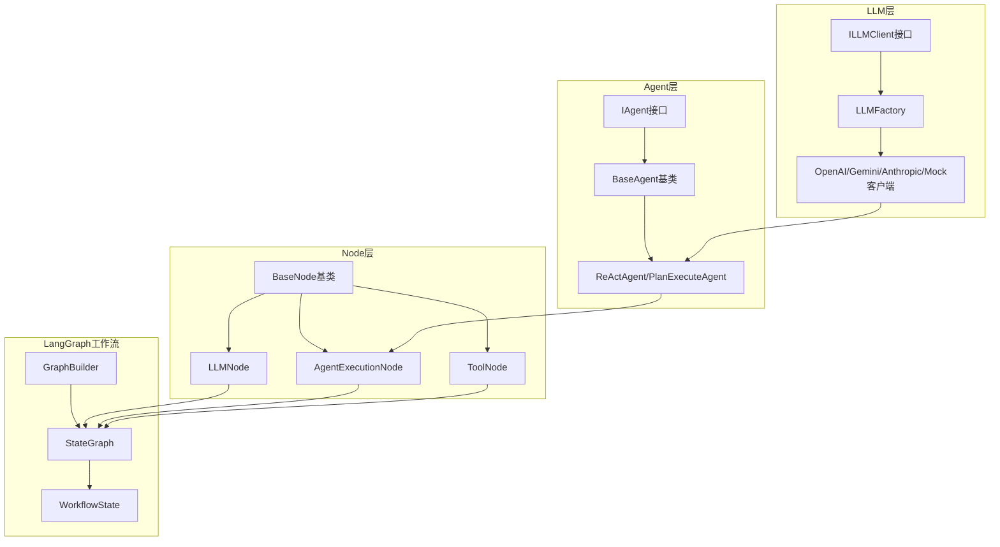

现在我来完成详细的关系分析报告。基于我对代码的深入分析，我将为您详细解释LLM、Agent和Node（LangGraph）之间的关系。

## LLM、Agent和Node（LangGraph）关系分析报告

### 1. 整体架构概览

项目采用**分层架构设计**，各组件之间的关系如下：



### 2. 核心组件关系详解

#### 2.1 LLM模块的角色
- **位置**: `src/infrastructure/llm/`
- **核心接口**: [`ILLMClient`](src/infrastructure/llm/interfaces.py:22)
- **主要职责**: 提供统一的多模型LLM调用能力
- **支持的模型**: OpenAI、Gemini、Anthropic、Mock、HumanRelay
- **与Agent的关系**: Agent通过依赖注入获取LLM客户端实例

#### 2.2 Agent模块的角色
- **位置**: `src/domain/agent/`
- **核心接口**: [`IAgent`](src/domain/agent/interfaces.py:10)
- **主要职责**: 封装具体的Agent逻辑（如ReAct、Plan-Execute等）
- **关键实现**: [`BaseAgent`](src/domain/agent/base.py:19) 提供通用框架，[`ReActAgent`](src/domain/agent/react_agent.py:13) 实现具体算法
- **与LLM的关系**: Agent持有LLM客户端引用，用于推理和决策

#### 2.3 Node（LangGraph）模块的角色
- **位置**: `src/infrastructure/graph/`
- **核心基类**: [`BaseNode`](src/infrastructure/graph/registry.py:28)
- **主要职责**: 作为LangGraph工作流中的执行单元
- **关键节点类型**:
  - [`LLMNode`](src/infrastructure/graph/nodes/llm_node.py:18): 直接调用LLM
  - [`AgentExecutionNode`](src/infrastructure/graph/nodes/agent_execution_node.py:16): 调用完整的Agent
  - [`ToolNode`](src/infrastructure/graph/nodes/tool_node.py): 执行工具调用

### 3. 数据流和调用关系

#### 3.1 直接LLM调用路径
```
LLMNode → ILLMClient → 具体LLM服务
```
- **适用场景**: 简单的LLM调用，不需要复杂的Agent逻辑
- **配置示例**: [`configs/workflows/react_workflow.yaml`](configs/workflows/react_workflow.yaml:76)中的`think_node`

#### 3.2 Agent执行路径
```
AgentExecutionNode → IAgentManager → ReActAgent → ILLMClient → LLM服务
```
- **适用场景**: 需要复杂推理和工具调用的任务
- **优势**: 封装了完整的ReAct算法，支持工具调用和状态管理

#### 3.3 工作流编排
```
GraphBuilder → StateGraph → 节点注册表 → 具体节点执行
```
- **配置驱动**: 通过YAML配置文件定义工作流结构
- **状态管理**: [`WorkflowState`](src/infrastructure/graph/state.py)统一管理执行状态

### 4. 关键设计模式

#### 4.1 依赖注入模式
```python
# Agent通过依赖注入获取LLM客户端
class BaseAgent(IAgent, ABC):
    def __init__(self, config: 'AgentConfig', llm_client: 'ILLMClient', ...):
        self.llm_client = llm_client
```

#### 4.2 装饰器注册模式
```python
# 节点通过装饰器自动注册
@node("llm_node")
class LLMNode(BaseNode):
    # 节点实现...
```

#### 4.3 配置继承模式
```yaml
# 工作流配置支持继承
inherits_from: "base_workflow.yaml"
```

### 5. 实际执行流程示例

以ReAct工作流为例：

1. **工作流启动**: [`GraphBuilder.build_graph()`](src/infrastructure/graph/builder.py:97)
2. **节点执行**: [`AgentExecutionNode.execute()`](src/infrastructure/graph/nodes/agent_execution_node.py:34)
3. **Agent推理**: [`ReActAgent._execute_logic()`](src/domain/agent/react_agent.py:18)
4. **LLM调用**: [`ILLMClient.generate()`](src/infrastructure/llm/interfaces.py:36)
5. **工具执行**: 通过工具执行器调用外部工具
6. **状态更新**: 更新[`AgentState`](src/domain/agent/state.py)并决定下一步

### 6. 架构优势分析

#### 6.1 模块化设计
- **LLM模块**: 独立的多模型支持，易于扩展新模型
- **Agent模块**: 算法与实现分离，支持多种Agent类型
- **Node模块**: 工作流节点可插拔，支持动态注册

#### 6.2 配置驱动
- 通过YAML配置文件定义工作流结构
- 支持配置继承和环境变量注入
- 便于部署和维护

#### 6.3 类型安全
- 使用mypy进行类型检查
- 清晰的接口定义和类型注解
- 减少运行时错误

### 7. 改进建议

基于当前架构分析，建议考虑以下改进：

1. **异步执行优化**: 当前部分同步/异步混合调用可以进一步统一
2. **错误处理增强**: 增加更细粒度的错误处理和恢复机制
3. **性能监控**: 添加更详细的性能指标和监控点
4. **测试覆盖**: 增加集成测试覆盖关键数据流路径


## LLM、Agent和Node（LangGraph）关系分析总结

通过深入分析当前项目的代码架构，我为您详细解析了LLM、Agent和Node（LangGraph）之间的关系：

### 核心关系架构

项目采用**分层架构设计**，各组件形成清晰的依赖关系链：

**LLM层（基础设施层）** → **Agent层（应用层）** → **Node层（工作流层）** → **LangGraph工作流（编排层）**

### 关键发现

1. **LLM模块** (`src/infrastructure/llm/`)
   - 提供统一的多模型LLM调用接口 ([`ILLMClient`](src/infrastructure/llm/interfaces.py:22))
   - 支持OpenAI、Gemini、Anthropic、Mock等多种模型
   - 通过工厂模式 ([`LLMFactory`](src/infrastructure/llm/factory.py:11)) 管理客户端实例

2. **Agent模块** (`src/domain/agent/`)
   - 定义标准Agent接口 ([`IAgent`](src/domain/agent/interfaces.py:10))
   - 提供基础框架 ([`BaseAgent`](src/domain/agent/base.py:19)) 和具体实现 ([`ReActAgent`](src/domain/agent/react_agent.py:13))
   - Agent通过依赖注入获取LLM客户端实例

3. **Node模块** (`src/infrastructure/graph/nodes/`)
   - 作为LangGraph工作流的基本执行单元
   - 关键节点类型：
     - [`LLMNode`](src/infrastructure/graph/nodes/llm_node.py:18): 直接调用LLM
     - [`AgentExecutionNode`](src/infrastructure/graph/nodes/agent_execution_node.py:16): 调用完整Agent
     - [`ToolNode`](src/infrastructure/graph/nodes/tool_node.py): 执行工具调用

4. **工作流编排** (`src/infrastructure/graph/builder.py`)
   - [`GraphBuilder`](src/infrastructure/graph/builder.py:79) 负责构建LangGraph工作流
   - 配置驱动，支持YAML配置文件定义工作流结构
   - 通过节点注册表 ([`NodeRegistry`](src/infrastructure/graph/registry.py:96)) 管理节点类型

### 执行流程示例

典型的ReAct工作流执行路径：
```
GraphBuilder → StateGraph → AgentExecutionNode → ReActAgent → ILLMClient → LLM服务
```

### 架构优势

1. **模块化设计**: 各层职责清晰，易于扩展和维护
2. **配置驱动**: 通过YAML配置文件定义工作流，支持环境变量注入
3. **类型安全**: 使用mypy进行严格的类型检查
4. **多模型支持**: 统一的LLM接口支持多种模型提供商

### 关系特点

- **LLM是基础能力提供者**，为Agent提供推理能力
- **Agent封装业务逻辑**，将LLM能力转化为具体的任务处理能力  
- **Node是工作流执行单元**，将Agent能力编排成复杂的工作流程
- **LangGraph提供流程编排框架**，管理节点间的状态流转和条件分支

这种分层架构确保了系统的可扩展性、可维护性和灵活性，符合现代AI应用开发的最佳实践。