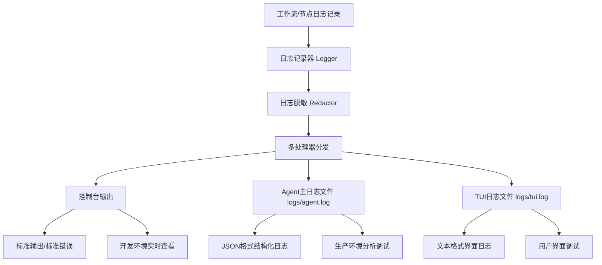

基于我对Modular Agent Framework代码的深入分析，现在我为您提供完整的工作流、节点等执行日志输出位置分析报告：

## 当前项目工作流和节点执行日志输出架构分析

### 1. 全局日志配置概览

根据 [`configs/global.yaml`](configs/global.yaml:1) 配置，项目配置了**三个主要日志输出目标**：

```yaml
log_outputs:
  # 1. 控制台日志 - 用于开发和调试的实时日志查看
  - type: "console"
    level: "DEBUG"
    format: "text"
  
  # 2. Agent主日志文件 - 记录核心运行日志（JSON格式）
  - type: "file"
    level: "DEBUG"
    format: "json"
    path: "logs/agent.log"
    rotation: "daily"
    max_size: "10MB"
  
  # 3. TUI专用日志文件 - 记录界面调试和操作日志
  - type: "file"
    level: "DEBUG"
    format: "text"
    path: "logs/tui.log"
    rotation: "daily"
    max_size: "10MB"
```

### 2. 日志系统架构



### 3. 工作流和节点日志记录机制

#### 日志记录器初始化
- **模块级日志器**：每个模块使用 `logging.getLogger(__name__)` 初始化
- **核心日志位置**：体现在 [`src/infrastructure/logger/logger.py`](src/infrastructure/logger/logger.py:297) 中

#### 工作流相关日志记录点：

**启动阶段** ([`src/infrastructure/graph/nodes/start_node.py`](src/infrastructure/graph/nodes/start_node.py:63-93))：
```python
logger.info("START节点开始执行")
logger.info(f"START节点执行完成，耗时 {execution_time:.2f}s")
logger.error(f"START节点执行失败: {e}")
```

**结束阶段** ([`src/infrastructure/graph/nodes/end_node.py`](src/infrastructure/graph/nodes/end_node.py:63-99))：
```python
logger.info("END节点开始执行") 
logger.info(f"END节点执行完成，耗时 {execution_time:.2f}s")
logger.error(f"END节点执行失败: {e}")
```

**工作流执行** ([`src/application/workflow/runner.py`](src/application/workflow/runner.py:66-377))：
- 工作流启动和完成日志
- 重试机制日志记录
- 错误处理和失败日志

**节点执行** ([`src/infrastructure/graph/iteration_aware_builder.py`](src/infrastructure/graph/iteration_aware_builder.py:96-135))：
- 节点迭代限制检测
- 节点执行错误日志
- 插件执行状态

### 4. 日志插件系统

项目还提供了**内置的日志插件** ([`src/infrastructure/graph/plugins/builtin/hooks/logging.py`](src/infrastructure/graph/plugins/builtin/hooks/logging.py:17))，支持：

- **节点执行前日志**：记录节点开始执行事件
- **节点执行后日志**：记录执行完成和性能数据  
- **错误日志**：记录执行失败详情
- **结构化日志**：支持JSON和键值对格式

### 5. 日志格式说明

**控制台输出**：
- 文本格式，带颜色标记（开发环境）
- 实时显示工作流和节点执行状态

**Agent主日志** ([`logs/agent.log`](logs/agent.log))：
- JSON格式，适合机器解析
- 包含完整结构化数据（时间戳、线程ID、进程ID等）
- 支持敏感信息脱敏

**TUI日志** ([`logs/tui.log`](logs/tui.log))：
- 文本格式，便于界面调试
- 专门记录TUI相关操作和状态变更

### 6. 日志管理系统特性

**配置热重载**：
- 支持运行时配置变更 ([`src/infrastructure/logger/config_integration.py`](src/infrastructure/logger/config_integration.py:126))
- 自动检测日志级别和输出目标变化

**性能优化**：
- 异步日志处理
- 日志轮转和压缩
- 内存缓冲区管理

**安全特性**：
- 敏感信息自动脱敏 ([`src/infrastructure/logger/redactor.py`](src/infrastructure/logger/redactor.py))
- API密钥、邮箱、电话号码等模式识别屏蔽
