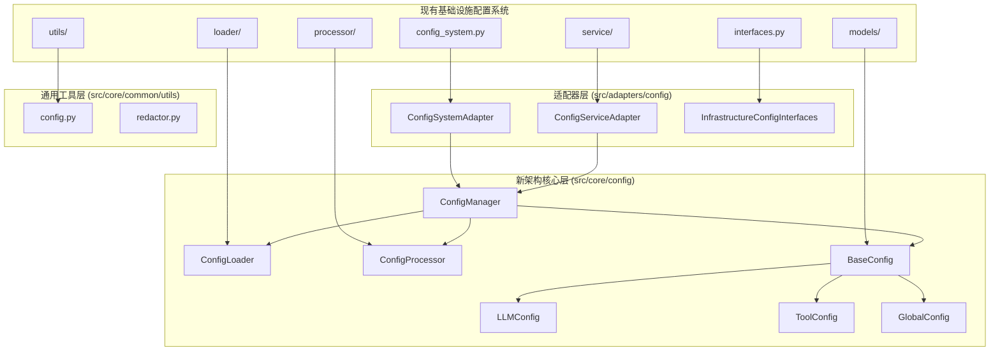

# `src\infrastructure\config` 目录迁移到新架构方案

## 概述

本文档提供了将 `src\infrastructure\config` 目录迁移到新架构的详细方案和文件移动列表。

## 现状分析

### 现有基础设施配置系统 (`src\infrastructure\config`)
- **功能完整度**: 高，包含完整的配置加载、继承、验证、缓存、环境变量解析等功能
- **架构复杂度**: 高，包含多层嵌套结构（models, loader, processor, service, utils等）
- **依赖关系**: 与基础设施层紧密耦合，包含大量基础设施特定实现
- **文件数量**: 约40个文件，分布在多个子目录中

### 新架构配置系统 (`src\core\config`)
- **功能完整度**: 中等，已实现基础配置管理、加载、处理功能
- **架构复杂度**: 低，采用扁平化设计
- **依赖关系**: 核心层独立，无外部依赖
- **文件数量**: 约10个文件，集中在单一目录

## 迁移策略

基于"核心功能迁移，业务逻辑保留"的原则：

1. **核心功能迁移**: 将通用配置功能迁移到 `src\core\config`
2. **业务逻辑保留**: 基础设施特定的配置逻辑保留在适配器层
3. **接口统一**: 使用新架构的统一接口
4. **渐进迁移**: 分阶段迁移，确保向后兼容

## 迁移依赖关系图

## 文件移动详细列表

### 第一阶段：核心功能迁移

**迁移到 `src/core/config/` 的文件：**

| 原文件路径 | 新文件路径 | 迁移类型 | 优先级 |
|------------|------------|----------|---------|
| `models/base.py` | `src/core/config/models.py` | 内容合并 | 高 |
| `models/global_config.py` | `src/core/config/models.py` | 内容合并 | 高 |
| `models/llm_config.py` | `src/core/config/models.py` | 内容合并 | 高 |
| `models/tool_config.py` | `src/core/config/models.py` | 内容合并 | 高 |
| `loader/file_config_loader.py` | `src/core/config/yaml_loader.py` | 功能整合 | 高 |
| `processor/validator.py` | `src/core/config/config_processor.py` | 功能整合 | 高 |

### 第二阶段：业务逻辑适配

**迁移到 `src/adapters/config/` 的文件：**

| 原文件路径 | 新文件路径 | 迁移类型 | 优先级 |
|------------|------------|----------|---------|
| `config_system.py` | `src/adapters/config/config_system_adapter.py` | 重构 | 中 |
| `service/` 目录 | `src/adapters/config/services/` | 移动 | 中 |
| `interfaces.py` | `src/adapters/config/interfaces.py` | 保留 | 中 |

### 第三阶段：工具类整合

**迁移到 `src/core/common/utils/` 的文件：**

| 原文件路径 | 新文件路径 | 迁移类型 | 优先级 |
|------------|------------|----------|---------|
| `utils/config_operations.py` | `src/core/common/utils/config_ops.py` | 整合 | 低 |
| `utils/redactor.py` | `src/core/common/utils/redactor.py` | 整合 | 低 |

### 需要删除的文件

以下文件在新架构中不再需要，可以安全删除：
- `config_cache.py` (功能已整合到通用缓存)
- `config_loader.py` (功能已整合)
- 各种工具类适配器文件

## 具体迁移步骤

### 步骤1: 准备阶段
- 创建目标目录结构
- 备份现有配置系统
- 更新依赖注入配置

### 步骤2: 核心模型迁移
- 将基础设施配置模型整合到核心配置模型
- 保持向后兼容的接口
- 更新模型验证逻辑

### 步骤3: 加载器迁移
- 整合文件配置加载器功能
- 统一YAML加载接口
- 优化缓存机制

### 步骤4: 处理器迁移
- 整合配置处理逻辑（继承、环境变量、验证）
- 统一错误处理机制
- 优化性能

### 步骤5: 适配器创建
- 创建配置系统适配器
- 实现基础设施特定逻辑
- 提供向后兼容接口

### 步骤6: 工具类整合
- 将通用工具函数整合到核心工具库
- 保持功能一致性
- 优化代码复用

## 测试和验证计划

### 测试策略

**单元测试覆盖：**
- 核心配置管理器功能测试
- 配置模型验证测试
- 配置加载器功能测试
- 配置处理器功能测试
- 适配器接口兼容性测试

**集成测试：**
- 配置系统整体功能测试
- 与LLM模块集成测试
- 与工具系统集成测试
- 与工作流系统集成测试

**回归测试：**
- 现有功能回归测试
- 性能基准测试
- 错误处理测试

### 验证检查清单

**功能验证：**
- [ ] 配置加载功能正常
- [ ] 配置继承功能正常
- [ ] 环境变量解析正常
- [ ] 配置验证功能正常
- [ ] 缓存机制正常
- [ ] 热重载功能正常

**兼容性验证：**
- [ ] 向后兼容性验证
- [ ] 接口兼容性验证
- [ ] 依赖注入兼容性验证
- [ ] 配置文件格式兼容性验证

**性能验证：**
- [ ] 配置加载性能测试
- [ ] 内存使用情况测试
- [ ] 并发访问测试
- [ ] 缓存效率测试

## 风险分析和缓解措施

### 主要风险

1. **功能丢失风险**
   - **风险**: 迁移过程中可能丢失某些特定功能
   - **缓解**: 全面功能测试，逐步迁移

2. **兼容性风险**
   - **风险**: 新架构可能不兼容现有代码
   - **缓解**: 提供适配器层，保持接口兼容

3. **性能风险**
   - **风险**: 新实现可能性能下降
   - **缓解**: 性能基准测试和优化

### 回滚计划

如果迁移出现问题，可以：
1. 恢复备份的配置系统
2. 回退到旧版本
3. 使用适配器提供临时解决方案

## 迁移效益

1. **架构简化**: 从复杂的基础设施层迁移到扁平的核心+适配器架构
2. **代码复用**: 通用配置功能可在整个系统中复用
3. **维护性提升**: 清晰的职责分离，便于维护和扩展
4. **性能优化**: 统一的缓存和加载机制

## 总结

本迁移方案提供了一个完整的从 `src\infrastructure\config` 到新架构的迁移路线图。方案采用了渐进式迁移策略，确保在整个迁移过程中系统功能保持稳定。建议按照迁移步骤分阶段实施，并在每个阶段进行充分的测试验证。

**创建时间**: 2025-11-18  
**文档版本**: 1.0