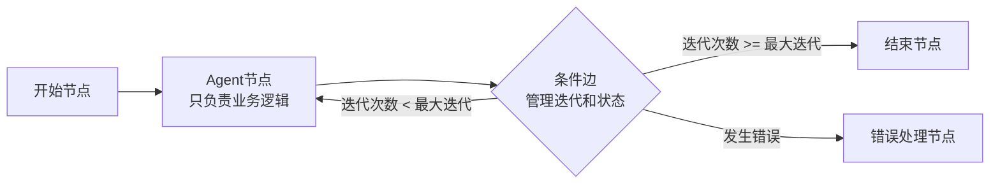

## 改进建议和重构方案

基于对代码库的深入分析，我发现了 [`configs/nodes/_group.yaml`](configs/nodes/_group.yaml) 中的节点配置确实与项目期望的设计理念存在差异。以下是详细的分析和改进建议：

### 主要问题

1. **节点职责不清晰**：Agent节点包含了执行控制逻辑（`max_iterations`, `max_steps`）
2. **状态管理与节点逻辑耦合**：迭代次数等执行控制应该由工作流引擎管理
3. **边管理缺失**：配置中缺乏明确的边定义来控制工作流流程

### 正确的设计模式



### 具体改进建议

#### 1. 重构节点配置

**当前配置（存在问题）**：
```yaml
plan_execute_agent_node:
  # 执行限制 - 这些应该由边管理
  max_iterations: 10
  max_steps: 7
  continue_on_plan_generated: true
  next_node_on_error: "error_handler"
```

**建议配置**：
```yaml
plan_execute_agent_node:
  # 只保留业务相关配置
  name: "plan_execute_agent"
  system_prompt: |
    你是一个使用Plan-Execute算法的智能助手，先制定计划然后逐步执行。
```

#### 2. 添加边配置

在工作流配置中添加条件边来管理执行流程：

```yaml
edges:
  - from: "plan_execute_agent_node"
    to: "plan_execute_agent_node"  # 循环执行
    type: "conditional"
    condition: "max_iterations_not_reached"
    
  - from: "plan_execute_agent_node"
    to: "end_node"  # 正常结束
    type: "conditional"
    condition: "max_iterations_reached"
    
  - from: "plan_execute_agent_node"
    to: "error_handler_node"  # 错误处理
    type: "conditional"
    condition: "has_errors"
```

#### 3. 完善条件函数

项目已经提供了完善的条件函数系统（[`ConditionNode`](src/infrastructure/graph/nodes/condition_node.py)），包括：
- `max_iterations_reached` - 检查是否达到最大迭代次数
- `iteration_count_equals` - 检查迭代次数是否等于指定值
- `iteration_count_greater_than` - 检查迭代次数是否大于指定值
- `has_errors` - 检查是否有错误

### 重构步骤

1. **移除节点中的执行控制配置**：从Agent节点配置中删除 `max_iterations`, `max_steps`, `next_node_on_error` 等字段

2. **在工作流配置中添加条件边**：使用条件边来控制执行流程和迭代次数

3. **统一状态管理**：通过工作流状态（`iteration_count`, `max_iterations`）来管理执行控制

4. **增强错误处理**：通过条件边实现统一的错误处理机制

### 实施建议

这种重构将使得：
- **节点职责更清晰**：每个节点只关注业务逻辑
- **执行控制更灵活**：通过边配置可以轻松调整执行策略
- **系统更可维护**：统一的执行控制机制
- **可观测性更强**：更好的执行流程跟踪和监控