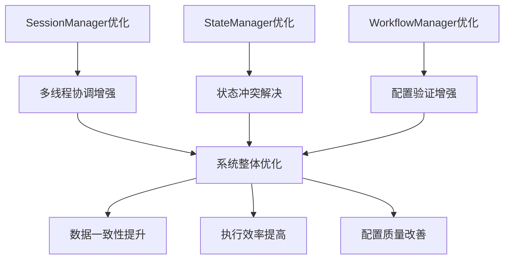

# 架构优化方案总览

## 项目背景

基于对当前Session与Thread关系架构的分析，我们识别了三个关键的优化方向，并制定了详细的改进方案。这些方案旨在提升系统的数据一致性、多线程协调能力和配置管理质量。

## 优化方案文档列表

### 1. StateManager状态冲突解决机制
- **文件**: `state-conflict-resolution-design.md`
- **目标**: 提供完整的状态冲突检测和解决能力
- **核心功能**:
  - 状态版本控制
  - 冲突检测算法
  - 多种解决策略（最后写入获胜、首次写入获胜、合并变更等）
  - 冲突历史记录

### 2. SessionManager线程依赖协调增强
- **文件**: `thread-dependency-coordination-design.md`
- **目标**: 增强多线程工作流的依赖管理和协调能力
- **核心功能**:
  - 依赖关系建模（顺序、并行、数据流、条件依赖）
  - 执行顺序控制（拓扑排序）
  - 数据流协调机制
  - 错误处理和恢复策略

### 3. WorkflowManager配置验证增强
- **文件**: `workflow-config-validation-design.md`
- **目标**: 提供全面的配置验证和智能修复能力
- **核心功能**:
  - 多层次验证（语法、模式、语义、依赖、性能）
  - 智能修复建议
  - 验证缓存机制
  - 详细的验证报告

### 4. 整体实施计划
- **文件**: `optimization-implementation-plan.md`
- **内容**: 6周实施时间表、资源需求、风险评估、成功标准

## 架构优化关系图

## 实施优先级建议（调整后）

### 高优先级（立即实施）
1. **StateManager状态冲突解决**
   - 直接影响数据一致性
   - 基础框架相对简单
   - 风险可控
   - 收益明显

### 中优先级（第二阶段实施）
2. **WorkflowManager配置验证增强**
   - 提升开发效率
   - 需要较多测试验证
   - 可以分阶段实施
   - 实际需求明确

3. **SessionManager线程依赖协调（简化版）**
   - 当前业务需求不明确
   - 建议实现简化版本
   - 避免过度工程化
   - 根据实际使用情况扩展

### 低优先级（评估后实施）
- 高级协调策略（如ADAPTIVE模式）
- 复杂数据流协调机制
- 动态依赖关系管理

## 技术架构影响

### 接口变更
所有优化方案都设计为**向后兼容**，主要变化包括：

1. **新增接口**：增强的功能通过新接口提供
2. **可选功能**：高级功能可以通过配置启用/禁用
3. **渐进升级**：现有代码可以继续使用原有接口

### 性能考虑
每个方案都包含性能优化措施：
- 缓存机制减少重复计算
- 异步处理避免阻塞
- 配置选项控制功能开销

## 测试策略

### 单元测试
- 每个核心功能模块都有对应的单元测试
- 测试覆盖率目标≥90%
- 边界条件和异常情况全面覆盖

### 集成测试
- 多组件协作测试
- 性能基准测试
- 真实场景模拟测试

## 部署策略

### 分阶段部署
1. **开发环境**：首先在开发环境验证
2. **测试环境**：全面功能测试和性能测试
3. **预生产环境**：真实数据验证
4. **生产环境**：灰度发布，监控运行状态

### 回滚计划
每个阶段都制定明确的回滚策略：
- 功能开关控制
- 数据备份机制
- 快速回滚脚本

## 监控和运维

### 关键指标监控
- **性能指标**：操作延迟、内存使用、CPU负载
- **业务指标**：错误率、成功率、用户满意度
- **系统指标**：可用性、响应时间、吞吐量

### 告警机制
- 异常检测和自动告警
- 性能阈值监控
- 健康检查端点

## 后续演进方向

### 短期优化（3-6个月）
- 性能优化和瓶颈消除
- 用户体验改进
- 监控工具完善

### 长期规划（6-12个月）
- 机器学习驱动的智能优化
- 自适应系统调整
- 生态系统扩展

## 联系方式

如有问题或建议，请联系：
- **架构团队**: architecture-team@example.com
- **项目负责人**: project-lead@example.com
- **技术文档**: docs-team@example.com

## 版本历史

| 版本 | 日期 | 修改内容 | 作者 |
|------|------|----------|------|
| 1.0 | 2025-10-29 | 初始版本，包含四个优化方案 | 架构团队 |
| 1.1 | - | 待更新 | - |

---

**注意**: 本文档会随着项目进展持续更新，请关注最新版本。