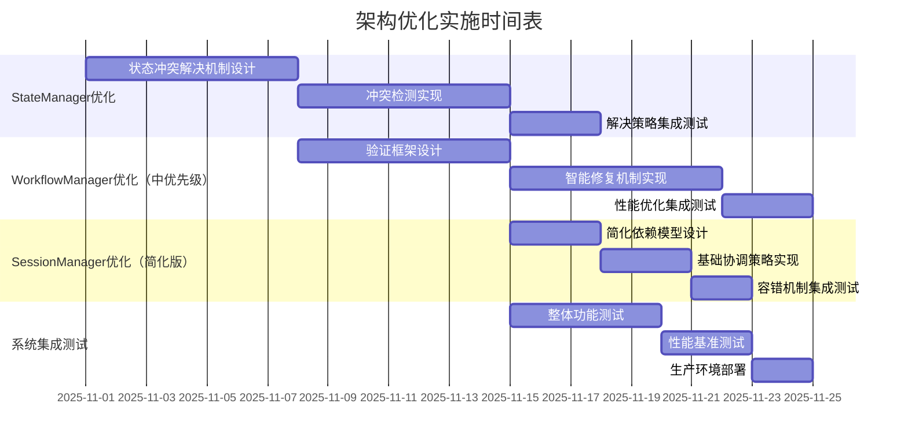

# 架构优化方案实施总计划

## 概述

本文档汇总了针对Session与Thread关系架构的三个关键优化方案的整体实施计划，包括时间安排、资源需求和风险评估。

## 优化方案概览

### 1. StateManager状态冲突解决机制
- **目标**：提供完整的状态冲突检测和解决能力
- **核心功能**：状态版本控制、冲突检测、多种解决策略
- **优先级**：高（影响数据一致性）

### 2. SessionManager线程依赖协调增强
- **目标**：增强多线程工作流的依赖管理和协调能力
- **核心功能**：依赖关系建模、执行顺序控制、数据流协调
- **优先级**：高（影响多工作流协作效率）

### 3. WorkflowManager配置验证增强
- **目标**：提供全面的配置验证和智能修复能力
- **核心功能**：多层次验证、智能修复、性能优化
- **优先级**：中（影响开发效率）

## 整体实施时间表

## 详细实施计划

### 第一阶段：基础框架实现（3周）

#### 第1周：StateManager状态冲突解决
- **任务**：实现状态版本控制和冲突检测基础框架
- **交付物**：
  - EnhancedStateManager基础实现
  - 冲突检测算法
  - 单元测试覆盖

#### 第2周：WorkflowManager验证框架
- **任务**：实现多层次验证框架和基本规则
- **交付物**：
  - EnhancedConfigValidator核心逻辑
  - 语法和模式验证规则
  - 验证报告生成

#### 第3周：智能功能增强
- **任务**：实现智能冲突解决和配置修复
- **交付物**：
  - StateConflictResolver智能策略
  - ConfigFixer自动修复功能
  - 自适应错误处理

### 第二阶段：简化功能实现（1.5周）

#### 第4周：SessionManager简化协调
- **任务**：实现简化版依赖协调机制
- **交付物**：
  - SimplifiedThreadCoordinator基础版本
  - 基本拓扑排序算法（简化版）
  - BEST_EFFORT协调策略

#### 第5周：性能优化和集成（0.5周）
- **任务**：优化性能并完成系统集成
- **交付物**：
  - 验证缓存机制
  - 性能基准测试报告
  - 集成测试用例

### 第三阶段：测试和部署（1周）

#### 第6周：全面测试和部署
- **任务**：进行系统测试和生产部署
- **交付物**：
  - 完整的测试报告
  - 部署文档和操作指南
  - 性能监控配置

## 资源需求

### 开发团队配置
- **架构师**：1人（负责技术设计和指导）
- **高级开发工程师**：2人（负责核心功能实现）
- **测试工程师**：1人（负责测试和验证）

### 技术环境要求
- **开发环境**：Python 3.13+，uv包管理器
- **测试环境**：独立的测试服务器集群
- **监控工具**：性能监控和日志分析工具

### 工具和库依赖
- **测试框架**：pytest，pytest-asyncio
- **性能工具**：pytest-benchmark，memory-profiler
- **文档工具**：Sphinx，Mermaid.js

## 风险评估和应对措施

### 高风险项
1. **性能影响风险**
   - **风险**：新功能可能引入性能开销
   - **应对**：实施性能基准测试，提供性能优化选项
   - **缓解**：使用缓存机制，异步处理

2. **向后兼容性风险**
   - **风险**：修改现有接口可能影响现有系统
   - **应对**：保持接口兼容，提供迁移路径
   - **缓解**：分阶段部署，充分的回归测试

3. **复杂度增加风险**
   - **风险**：新功能增加系统复杂度
   - **应对**：模块化设计，清晰的文档
   - **缓解**：代码审查，设计模式应用

### 中风险项
1. **团队学习曲线**
   - **风险**：新架构概念需要学习时间
   - **应对**：培训文档，代码示例
   - **缓解**：渐进式引入，结对编程

2. **测试覆盖不足**
   - **风险**：复杂功能难以完全测试
   - **应对**：自动化测试，边界测试
   - **缓解**：代码覆盖率要求，集成测试

## 成功标准

### 技术标准
- **功能完整性**：所有设计功能完全实现
- **性能指标**：核心操作性能下降不超过10%
- **测试覆盖率**：单元测试覆盖率≥90%，集成测试覆盖所有核心流程

### 质量标准
- **代码质量**：通过mypy类型检查，black代码格式化
- **文档完整性**：完整的API文档和使用指南
- **可维护性**：清晰的代码结构和注释

### 业务标准
- **开发效率**：配置验证时间减少50%
- **系统稳定性**：状态冲突导致的错误减少80%
- **用户体验**：多工作流协作效率提升30%

## 监控和度量

### 性能监控指标
- **状态操作延迟**：序列化/反序列化时间
- **验证性能**：配置验证耗时
- **内存使用**：缓存和状态管理的内存占用

### 业务监控指标
- **配置错误率**：验证发现的配置问题数量
- **冲突解决成功率**：自动冲突解决的成功率
- **用户满意度**：开发团队的使用反馈

## 后续优化方向

### 短期优化（3个月内）
- 进一步优化性能瓶颈
- 扩展验证规则库
- 增强监控和告警功能

### 中期规划（6个月内）
- 机器学习驱动的智能修复
- 可视化配置验证工具
- 分布式状态管理支持

### 长期愿景（1年内）
- 全自动配置优化
- 预测性冲突避免
- 自适应学习系统

## 结论

这个实施计划为三个关键优化方案提供了清晰的路线图，通过6周的集中开发可以实现架构的显著提升。建议采用敏捷开发方法，分阶段交付价值，确保每个里程碑都有明确的交付物和质量标准。

实施过程中需要密切关注风险因素，特别是性能和兼容性问题，通过充分的测试和监控确保系统稳定性。成功实施后，将显著提升多线程工作流系统的可靠性、效率和可维护性。