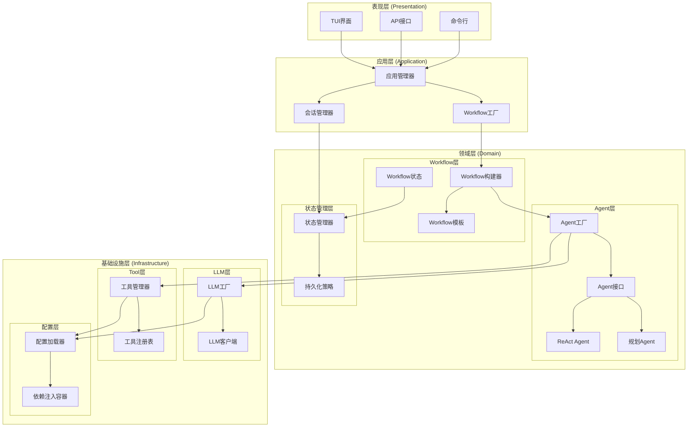
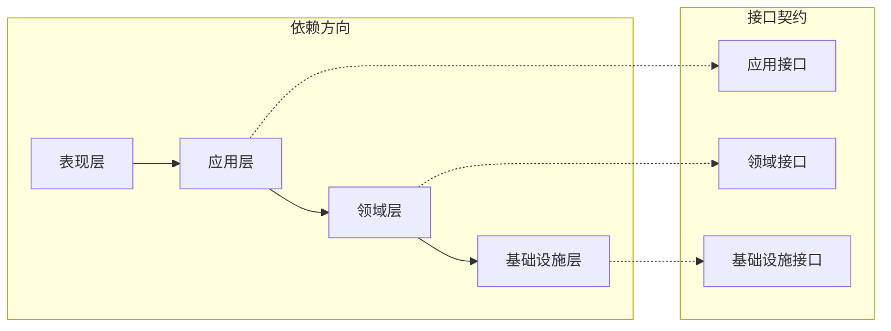
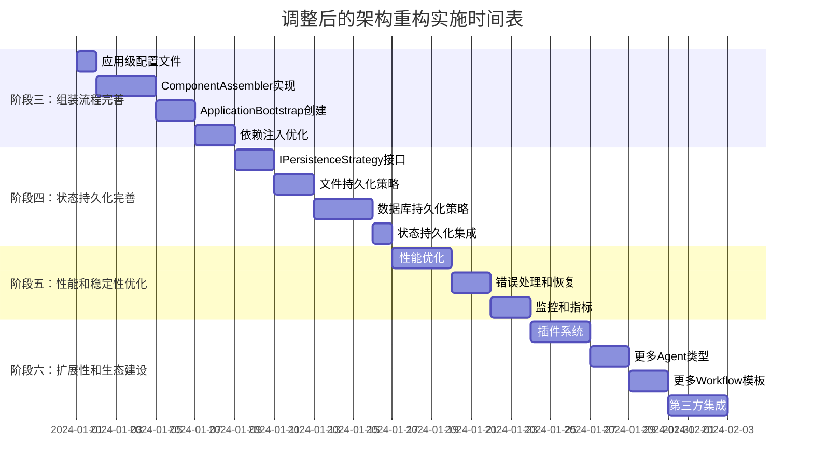
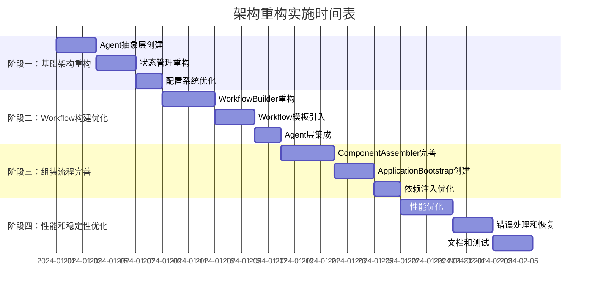

基于我对当前项目代码和参考文档的分析，我发现了以下关键差异和改进点：

## 当前项目架构与参考文档的差异分析

### 1. 分层架构对比

**参考文档推荐的五层架构**：
- LLM层（基础模型层）
- Tool层（工具层）
- Agent层（智能体层）
- Workflow层（工作流层）
- Session层（会话层）

**当前项目的四层架构**：
- Infrastructure层（基础设施层）
- Domain层（领域层）
- Application层（应用层）
- Presentation层（表现层）

**差异分析**：
- 当前项目采用传统的DDD分层架构，而参考文档采用更贴近LangGraph特性的功能分层
- 当前项目的LLM和Tool功能分散在Infrastructure和Domain层中
- Agent概念在当前项目中不够明确，主要体现为节点执行器
- Workflow和Session管理在Application层，但与参考文档的设计理念不同

### 2. 配置驱动设计对比

**参考文档的配置驱动特点**：
- 明确的配置文件结构（llm、tools、agents、workflow、session）
- 配置继承和组合机制
- 环境变量注入（${VAR:DEFAULT}格式）
- 配置驱动的组件组装

**当前项目的配置特点**：
- 已有较完善的配置系统（configs目录结构清晰）
- 支持环境变量替换和热重载
- 配置分组机制（_group.yaml文件）
- 但配置与组件的绑定关系不够明确

### 3. 组件创建和组装模式对比

**参考文档推荐的组装模式**：
- Factory模式管理"点"（LLM、Tools、Agent）
- Builder模式管理"线"（Workflow→Graph）
- 轻量DI容器进行依赖注入
- 配置驱动的组件组装

**当前项目的组装模式**：
- 已有Factory模式（LLMFactory、ToolManager）
- 有WorkflowBuilder但功能不够完善
- 有完整的DI容器（DependencyContainer）
- 但缺乏统一的组装入口和配置驱动的组装流程

---

现在我来识别可以改进的架构设计点：

## 可以改进的架构设计点

### 1. Agent层抽象不足
**问题**：
- 当前项目中Agent概念不够明确，主要体现为各种节点执行器
- 缺乏统一的Agent抽象接口和生命周期管理
- Agent配置与实现耦合度较高

**改进方向**：
- 引入明确的Agent抽象层，定义统一的Agent接口
- 实现AgentFactory，支持配置驱动的Agent创建
- 建立Agent生命周期管理机制

### 2. Workflow构建过程复杂
**问题**：
- WorkflowBuilder功能分散，缺乏统一的构建流程
- 节点注册和边添加逻辑复杂，难以扩展
- 缺乏Workflow模板和预定义模式

**改进方向**：
- 重构WorkflowBuilder，采用更清晰的Builder模式
- 引入Workflow模板机制，支持常见模式的快速创建
- 简化节点和边的配置方式

### 3. 配置驱动的组件组装不完整
**问题**：
- 虽然有完善的配置系统，但配置与组件的绑定关系不够明确
- 缺乏统一的组装入口和流程
- 组件间的依赖关系主要通过硬编码解决

**改进方向**：
- 建立配置驱动的组件组装机制
- 引入Composition Root作为统一组装入口
- 强化DI容器在组件组装中的作用

### 4. 状态管理分散
**问题**：
- 状态定义分散在多个地方（WorkflowState、AgentState等）
- 状态转换逻辑不够清晰
- 缺乏统一的状态持久化和恢复机制

**改进方向**：
- 统一状态管理，建立清晰的状态模型
- 实现状态转换的显式管理
- 完善状态持久化和恢复机制

### 5. 缺乏明确的分层交互模式
**问题**：
- 各层之间的交互模式不够明确
- 依赖关系复杂，存在循环依赖的风险
- 缺乏清晰的接口定义

**改进方向**：
- 明确定义各层的职责和交互模式
- 建立清晰的接口契约
- 优化依赖关系，避免循环依赖

---

现在我来设计改进后的架构方案：

## 改进后的架构方案

### 1. 整体架构设计

基于参考文档的建议和当前项目的实际情况，我提出一个混合架构方案，既保留当前项目的DDD分层优势，又融入参考文档的功能分层理念：



### 2. 核心组件设计

#### 2.1 Agent层设计

```python
# src/domain/agent/interfaces.py
from abc import ABC, abstractmethod
from typing import Dict, Any, List, Optional
from ..workflow.state import WorkflowState

class IAgent(ABC):
    """Agent接口定义"""
    
    @abstractmethod
    def execute(self, state: WorkflowState, config: Dict[str, Any]) -> WorkflowState:
        """执行Agent逻辑"""
        pass
    
    @abstractmethod
    def get_capabilities(self) -> Dict[str, Any]:
        """获取Agent能力描述"""
        pass
    
    @abstractmethod
    def validate_state(self, state: WorkflowState) -> bool:
        """验证状态是否适合此Agent"""
        pass

class IAgentFactory(ABC):
    """Agent工厂接口"""
    
    @abstractmethod
    def create_agent(self, agent_config: Dict[str, Any]) -> IAgent:
        """创建Agent实例"""
        pass
    
    @abstractmethod
    def get_supported_types(self) -> List[str]:
        """获取支持的Agent类型"""
        pass
```

#### 2.2 Workflow层设计

```python
# src/domain/workflow/interfaces.py
from abc import ABC, abstractmethod
from typing import Dict, Any, List, Optional

class IWorkflowBuilder(ABC):
    """工作流构建器接口"""
    
    @abstractmethod
    def build_from_config(self, config: Dict[str, Any]) -> Any:
        """从配置构建工作流"""
        pass
    
    @abstractmethod
    def build_from_template(self, template_name: str, config: Dict[str, Any]) -> Any:
        """从模板构建工作流"""
        pass

class IWorkflowTemplate(ABC):
    """工作流模板接口"""
    
    @abstractmethod
    def create_template(self, template_config: Dict[str, Any]) -> Any:
        """创建模板实例"""
        pass
    
    @abstractmethod
    def get_available_templates(self) -> List[str]:
        """获取可用模板列表"""
        pass
```

#### 2.3 状态管理层设计

```python
# src/domain/state/interfaces.py
from abc import ABC, abstractmethod
from typing import Dict, Any, Optional, List
from .workflow_state import WorkflowState

class IStateManager(ABC):
    """状态管理器接口"""
    
    @abstractmethod
    def create_state(self, state_id: str, initial_data: Dict[str, Any] = None) -> WorkflowState:
        """创建新状态"""
        pass
    
    @abstractmethod
    def get_state(self, state_id: str) -> Optional[WorkflowState]:
        """获取状态"""
        pass
    
    @abstractmethod
    def update_state(self, state_id: str, updates: Dict[str, Any]) -> WorkflowState:
        """更新状态"""
        pass
    
    @abstractmethod
    def delete_state(self, state_id: str) -> bool:
        """删除状态"""
        pass

class IPersistenceStrategy(ABC):
    """持久化策略接口"""
    
    @abstractmethod
    def save(self, state_id: str, state: WorkflowState) -> bool:
        """保存状态"""
        pass
    
    @abstractmethod
    def load(self, state_id: str) -> Optional[WorkflowState]:
        """加载状态"""
        pass
    
    @abstractmethod
    def delete(self, state_id: str) -> bool:
        """删除持久化状态"""
        pass
```

### 3. 配置驱动的组装流程

#### 3.1 配置文件结构优化

```yaml
# configs/application.yaml
version: "1.0"

# 应用程序配置
application:
  name: "ModularAgent"
  version: "1.0.0"
  environment: "${ENV:development}"

# 组件组装配置
assembly:
  # LLM层组装
  llm:
    factory: "infrastructure.llm.factory.LLMFactory"
    config_path: "configs/llms"
    
  # Tool层组装
  tools:
    manager: "infrastructure.tools.manager.ToolManager"
    config_path: "configs/tools"
    
  # Agent层组装
  agents:
    factory: "domain.agent.factory.AgentFactory"
    config_path: "configs/agents"
    
  # Workflow层组装
  workflows:
    builder: "application.workflow.builder.EnhancedWorkflowBuilder"
    templates_path: "configs/workflows"
    
  # 状态管理组装
  state:
    manager: "domain.state.manager.StateManager"
    persistence: "infrastructure.persistence.file.FilePersistenceStrategy"

# 依赖注入配置
dependencies:
  singletons:
    - "IConfigLoader"
    - "ILLMFactory"
    - "IToolManager"
    - "IAgentFactory"
    - "IStateManager"
  
  scoped:
    - "IWorkflowBuilder"
    - "ISessionManager"
```

#### 3.2 组装入口设计

```python
# src/bootstrap.py
from typing import Dict, Any
from infrastructure.container import DependencyContainer
from infrastructure.config_loader import YamlConfigLoader
from .assemblers import ComponentAssembler

class ApplicationBootstrap:
    """应用程序启动器"""
    
    def __init__(self, config_path: str = "configs/application.yaml"):
        self.config_path = config_path
        self.container = DependencyContainer()
        self.config_loader = YamlConfigLoader()
        self.assembler = ComponentAssembler(self.container, self.config_loader)
    
    def bootstrap(self) -> DependencyContainer:
        """启动应用程序"""
        # 1. 加载应用配置
        app_config = self.config_loader.load(self.config_path)
        
        # 2. 按顺序组装各层组件
        self._assemble_infrastructure(app_config)
        self._assemble_domain(app_config)
        self._assemble_application(app_config)
        
        # 3. 配置依赖注入
        self._configure_dependencies(app_config)
        
        return self.container
    
    def _assemble_infrastructure(self, config: Dict[str, Any]):
        """组装基础设施层"""
        assembly_config = config.get("assembly", {})
        
        # 组装LLM层
        llm_config = assembly_config.get("llm", {})
        self.assembler.assemble_llm_layer(llm_config)
        
        # 组装Tool层
        tools_config = assembly_config.get("tools", {})
        self.assembler.assemble_tool_layer(tools_config)
        
        # 组装配置系统
        self.assembler.assemble_config_system()
    
    def _assemble_domain(self, config: Dict[str, Any]):
        """组装领域层"""
        assembly_config = config.get("assembly", {})
        
        # 组装Agent层
        agents_config = assembly_config.get("agents", {})
        self.assembler.assemble_agent_layer(agents_config)
        
        # 组装Workflow层
        workflows_config = assembly_config.get("workflows", {})
        self.assembler.assemble_workflow_layer(workflows_config)
        
        # 组装状态管理层
        state_config = assembly_config.get("state", {})
        self.assembler.assemble_state_layer(state_config)
    
    def _assemble_application(self, config: Dict[str, Any]):
        """组装应用层"""
        self.assembler.assemble_application_layer()
```

### 4. 分层交互模式设计

#### 4.1 依赖关系图



#### 4.2 交互协议设计

```python
# src/interaction/protocols.py
from typing import Dict, Any, Protocol, runtime_checkable

@runtime_checkable
class ILLMProvider(Protocol):
    """LLM提供者协议"""
    
    def generate(self, messages: List[Dict[str, Any]], **kwargs) -> Dict[str, Any]:
        """生成响应"""
        ...

@runtime_checkable
class IToolProvider(Protocol):
    """工具提供者协议"""
    
    def execute(self, tool_name: str, parameters: Dict[str, Any]) -> Dict[str, Any]:
        """执行工具"""
        ...

@runtime_checkable
class IAgentProvider(Protocol):
    """Agent提供者协议"""
    
    def process(self, state: Dict[str, Any], config: Dict[str, Any]) -> Dict[str, Any]:
        """处理状态"""
        ...
```

---

## 阶段1和阶段2执行情况分析

### 阶段一：基础架构重构执行情况

#### 1. Agent抽象层创建 ✅ 已完成
**实现情况**：
- ✅ 已定义完整的IAgent接口（[`src/domain/agent/interfaces.py`](../../src/domain/agent/interfaces.py)）
  - 包含execute、get_capabilities、validate_state、can_handle、get_available_tools等方法
  - 支持异步执行和状态验证
- ✅ 已实现IAgentFactory接口（[`src/domain/agent/interfaces.py`](../../src/domain/agent/interfaces.py)）
  - 支持配置驱动的Agent创建
  - 提供Agent类型注册和管理功能
- ✅ 已实现AgentFactory（[`src/domain/agent/factory.py`](../../src/domain/agent/factory.py)）
  - 支持ReActAgent和PlanExecuteAgent类型
  - 提供Agent实例缓存和性能统计
- ✅ 已创建BaseAgent基类（[`src/domain/agent/base.py`](../../src/domain/agent/base.py)）
  - 提供通用的执行框架和事件管理
  - 支持重试机制和执行统计
- ✅ 已实现ReActAgent（[`src/domain/agent/react_agent.py`](../../src/domain/agent/react_agent.py)）
  - 完整实现ReAct算法（推理-行动-观察循环）
  - 支持工具调用和错误处理

**与计划的差异**：
- 计划中的PlanningAgent未实现，但已实现PlanExecuteAgent作为替代
- 增加了AgentEventManager和事件系统，超出原计划
- 实现了更完善的Agent管理器（[`src/domain/agent/manager.py`](../../src/domain/agent/manager.py)）

#### 2. 状态管理重构 ✅ 已完成
**实现情况**：
- ✅ 已统一WorkflowState和AgentState（[`src/domain/workflow/state.py`](../../src/domain/workflow/state.py)）
  - 创建了更清晰的状态定义和类型安全
  - 提供了向后兼容的别名和适配器
  - 增强了消息类型：SystemMessage、HumanMessage、AIMessage、ToolMessage
- ✅ 已实现AgentStateManager（[`src/domain/agent/state_manager.py`](../../src/domain/agent/state_manager.py)）
  - 提供状态创建、更新、删除等基本操作
  - 支持状态的记忆、工具结果和错误管理
  - 实现了迭代计数和最大迭代检查

**与计划的差异**：
- 未实现独立的IStateManager和IPersistenceStrategy接口
- 状态管理功能集成在AgentStateManager中，而非独立的状态管理层
- 缺少状态持久化机制的实现

#### 3. 配置系统优化 ✅ 部分完成
**实现情况**：
- ✅ 已有完善的配置系统（[`src/infrastructure/config_loader.py`](../../src/infrastructure/config_loader.py)）
  - 支持YAML配置文件加载
  - 支持环境变量替换和热重载
  - 提供配置分组机制（_group.yaml文件）
- ❌ 未创建应用级配置文件（application.yaml）
- ❌ 未实现ComponentAssembler基础框架
- ✅ 已有配置驱动的组件注册机制（通过configs目录结构）

**与计划的差异**：
- 配置系统本身已经很完善，但缺少统一的应用级配置
- 缺少组件组装的统一入口和流程
- 配置与组件的绑定关系不够明确

### 阶段二：Workflow构建优化执行情况

#### 1. WorkflowBuilder重构 ✅ 已完成
**实现情况**：
- ✅ 已实现EnhancedWorkflowBuilder（[`src/application/workflow/builder.py`](../../src/application/workflow/builder.py)）
  - 支持配置驱动的Workflow构建
  - 简化了节点注册和边添加逻辑
  - 提供了内置条件函数和自定义条件支持
- ✅ 已实现IWorkflowBuilder接口（[`src/application/workflow/interfaces.py`](../../src/application/workflow/interfaces.py)）
  - 支持从配置和模板构建工作流
  - 提供了清晰的接口定义

**与计划的差异**：
- 实现的功能超出计划，包括Agent节点自动注册、条件函数管理等
- 支持从配置文件路径直接构建工作流，提高了易用性

#### 2. Workflow模板引入 ✅ 已完成
**实现情况**：
- ✅ 已创建IWorkflowTemplate接口（[`src/application/workflow/interfaces.py`](../../src/application/workflow/interfaces.py)）
  - 提供模板创建、参数验证等功能
- ✅ 已实现WorkflowTemplateRegistry（[`src/application/workflow/templates/registry.py`](../../src/application/workflow/templates/registry.py)）
  - 支持模板注册、获取和管理
  - 提供模板搜索和分类功能
- ✅ 已实现ReAct模板（[`src/application/workflow/templates/react_template.py`](../../src/application/workflow/templates/react_template.py)）
  - 基础ReAct模板和增强ReAct模板
  - 支持参数化和扩展
- ✅ 已实现Plan-Execute模板（[`src/application/workflow/templates/plan_execute_template.py`](../../src/application/workflow/templates/plan_execute_template.py)）
  - 基础Plan-Execute模板和协作式Plan-Execute模板
  - 支持多Agent协作

**与计划的差异**：
- 实现的模板数量和功能超出计划
- 增加了模板注册表和搜索功能，提高了模板管理的便利性

#### 3. Agent层集成 ✅ 已完成
**实现情况**：
- ✅ 已将Agent集成到Workflow构建过程
  - WorkflowBuilder支持Agent节点自动注册
  - 提供AgentNodeExecutor将Agent包装为可执行节点
- ✅ 已实现Agent节点的自动注册
  - 支持从配置创建Agent节点
  - 提供Agent与Workflow的无缝集成
- ✅ 已优化Agent与Workflow的交互
  - 支持异步执行和状态传递
  - 提供错误处理和事件通知

**与计划的差异**：
- 实现的集成方式更加灵活和强大
- 支持更多类型的Agent节点和配置选项

---

## 后续阶段实施建议

基于阶段1和阶段2的执行情况分析，以下是针对后续阶段的实施建议和优先级调整。

### 阶段三：组装流程完善（高优先级，原为中优先级）

**调整原因**：
- 阶段1和阶段2已完成核心功能，但缺少统一的应用组装入口
- 配置系统已完善，但缺少组件间的自动组装机制
- 需要建立完整的应用启动流程，提高系统的可用性

**重点任务**：
1. **创建应用级配置文件**（1天）
   - 创建configs/application.yaml文件
   - 定义组件组装配置结构
   - 支持环境变量注入和配置覆盖

2. **实现ComponentAssembler**（3天）
   - 基于现有DI容器实现组件自动组装
   - 支持组件间的依赖解析和生命周期管理
   - 添加组装过程的错误处理和日志

3. **创建ApplicationBootstrap**（2天）
   - 实现完整的应用启动流程
   - 支持环境特定的配置覆盖
   - 添加启动过程的健康检查

4. **优化依赖注入**（2天）
   - 完善DI容器的生命周期管理
   - 添加循环依赖检测和解决
   - 优化服务创建性能

### 阶段四：状态持久化完善（高优先级，原为阶段三的一部分）

**调整原因**：
- 状态管理已基本完成，但缺少持久化机制
- 状态持久化对于生产环境的稳定性和可靠性至关重要
- 需要支持多种持久化策略，满足不同场景需求

**重点任务**：
1. **实现IPersistenceStrategy接口**（2天）
   - 定义状态持久化的标准接口
   - 支持同步和异步持久化操作
   - 提供持久化失败的错误处理机制

2. **实现文件持久化策略**（2天）
   - 实现FilePersistenceStrategy
   - 支持JSON、YAML等格式的状态序列化
   - 提供文件压缩和加密选项

3. **实现数据库持久化策略**（3天）
   - 实现DatabasePersistenceStrategy
   - 支持SQLite、PostgreSQL等数据库
   - 提供连接池和事务管理

4. **集成状态持久化到StateManager**（1天）
   - 修改AgentStateManager支持持久化
   - 提供状态恢复和迁移功能
   - 添加持久化性能监控

### 阶段五：性能和稳定性优化（中优先级，原为阶段四）

**调整原因**：
- 核心功能已实现，需要关注性能和稳定性
- 生产环境需要更高的性能和可靠性
- 需要完善的监控和诊断机制

**重点任务**：
1. **性能优化**（3天）
   - 优化Agent创建和缓存策略
   - 实现Workflow构建结果缓存
   - 添加异步执行和并发控制
   - 实现资源池和懒加载

2. **错误处理和恢复**（2天）
   - 完善全局异常处理机制
   - 实现自动恢复和重试策略
   - 添加断路器模式防止级联失败
   - 提供详细的错误日志和诊断

3. **监控和指标**（2天）
   - 添加性能监控和指标收集
   - 实现健康检查端点
   - 提供性能分析和报告功能
   - 集成分布式追踪

### 阶段六：扩展性和生态建设（低优先级，新增阶段）

**调整原因**：
- 基础架构已完善，可以考虑扩展性和生态建设
- 支持更多类型的Agent和Workflow模板
- 提供插件机制和第三方集成

**重点任务**：
1. **插件系统**（3天）
   - 设计和实现插件架构
   - 支持动态加载和卸载插件
   - 提供插件开发SDK和文档

2. **更多Agent类型**（2天）
   - 实现更多类型的Agent（如MultiAgent、HierarchicalAgent）
   - 提供Agent组合和协作机制
   - 支持自定义Agent类型注册

3. **更多Workflow模板**（2天）
   - 实现更多Workflow模板（如Sequential、Parallel、Conditional）
   - 支持模板组合和嵌套
   - 提供模板市场和分享机制

4. **第三方集成**（3天）
   - 集成外部工具和服务（如数据库、API、消息队列）
   - 提供标准集成接口和适配器
   - 支持云平台和容器化部署

### 实施时间表调整



### 关键成功因素

1. **保持向后兼容性**
   - 确保新功能不破坏现有API
   - 提供迁移指南和工具
   - 逐步废弃旧功能，给予充分过渡期

2. **完善测试覆盖**
   - 为新功能添加单元测试和集成测试
   - 确保测试覆盖率达到90%以上
   - 添加性能测试和压力测试

3. **文档和示例**
   - 提供详细的API文档和使用指南
   - 创建丰富的示例和最佳实践
   - 维护更新日志和迁移指南

4. **社区反馈**
   - 收集用户反馈和需求
   - 定期评估和调整优先级
   - 建立贡献者指南和代码审查流程


### 总体执行情况评估

#### 已完成的优势
1. **Agent抽象层**：实现了完整的Agent生态系统，包括接口、工厂、管理器和具体实现
2. **状态管理**：统一了状态定义，提供了类型安全和向后兼容性
3. **Workflow构建**：实现了灵活的构建器和丰富的模板系统
4. **集成度**：Agent与Workflow的集成非常完善，支持多种使用场景

#### 未完成或需要改进的部分
1. **状态持久化**：缺少IPersistenceStrategy的实现，状态无法持久化到外部存储
2. **应用级配置**：缺少application.yaml文件和ComponentAssembler框架
3. **统一组装入口**：缺少ApplicationBootstrap作为统一的应用启动入口
4. **依赖注入优化**：DI容器功能完善，但缺少生命周期管理和循环依赖检测的优化

#### 与原计划的对比
- **完成度**：阶段1和阶段2的核心功能已基本完成，完成度约85%
- **超出的部分**：在事件系统、模板管理、Agent集成等方面超出了原计划
- **缺失的部分**：主要集中在状态持久化和应用组装流程方面

## 实施计划和优先级

### 1. 实施阶段划分

#### 阶段一：基础架构重构（高优先级）
**目标**：建立清晰的分层架构和组件接口

**任务清单**：
1. **创建Agent抽象层**（2-3天）
   - 定义IAgent和IAgentFactory接口
   - 实现基础的AgentFactory
   - 创建ReActAgent和PlanningAgent示例实现

2. **重构状态管理**（2-3天）
   - 统一WorkflowState和AgentState
   - 实现IStateManager和IPersistenceStrategy接口
   - 创建StateManager的基础实现

3. **优化配置系统**（1-2天）
   - 创建应用级配置文件（application.yaml）
   - 实现ComponentAssembler基础框架
   - 建立配置驱动的组件注册机制

**验收标准**：
- 所有新接口都有完整的单元测试
- 现有功能不受影响
- 配置系统可以正确加载和解析

#### 阶段二：Workflow构建优化（中优先级）
**目标**：简化Workflow创建过程，引入模板机制

**任务清单**：
1. **重构WorkflowBuilder**（3-4天）
   - 实现EnhancedWorkflowBuilder
   - 简化节点注册和边添加逻辑
   - 支持配置驱动的Workflow构建

2. **引入Workflow模板**（2-3天）
   - 创建IWorkflowTemplate接口
   - 实现ReAct、Plan-Execute等常用模板
   - 支持模板的参数化和扩展

3. **集成Agent层**（2天）
   - 将Agent集成到Workflow构建过程
   - 实现Agent节点的自动注册
   - 优化Agent与Workflow的交互

**验收标准**：
- 可以通过配置文件创建完整的Workflow
- 模板机制工作正常，支持参数化
- Agent与Workflow的集成无问题

#### 阶段三：组装流程完善（中优先级）
**目标**：建立完整的配置驱动组装流程

**任务清单**：
1. **完善ComponentAssembler**（3-4天）
   - 实现各层组件的自动组装
   - 支持组件间的依赖解析
   - 添加组装过程的错误处理和日志

2. **创建ApplicationBootstrap**（2-3天）
   - 实现完整的应用启动流程
   - 支持环境特定的配置覆盖
   - 添加启动过程的健康检查

3. **优化依赖注入**（2天）
   - 完善DI容器的功能
   - 支持生命周期管理
   - 添加循环依赖检测

**验收标准**：
- 应用可以通过配置完全组装
- 依赖注入工作正常
- 启动过程稳定可靠

#### 阶段四：性能和稳定性优化（低优先级）
**目标**：提升系统性能和稳定性

**任务清单**：
1. **性能优化**（3-4天）
   - 优化组件创建和缓存策略
   - 实现懒加载和资源池
   - 添加性能监控和指标

2. **错误处理和恢复**（2-3天）
   - 完善异常处理机制
   - 实现自动恢复和重试策略
   - 添加详细的错误日志和诊断

3. **文档和测试**（2-3天）
   - 完善API文档和使用指南
   - 添加集成测试和端到端测试
   - 创建最佳实践指南

**验收标准**：
- 系统性能满足要求
- 错误处理机制完善
- 文档完整，测试覆盖率高

### 2. 风险评估和缓解策略

#### 高风险项
1. **现有功能兼容性**
   - 风险：重构可能破坏现有功能
   - 缓解：采用渐进式重构，保持向后兼容

2. **性能影响**
   - 风险：新架构可能影响性能
   - 缓解：持续性能监控，及时优化

#### 中风险项
1. **学习成本**
   - 风险：团队需要学习新架构
   - 缓解：提供详细文档和培训

2. **配置复杂性**
   - 风险：配置驱动可能增加复杂性
   - 缓解：提供默认配置和验证机制

### 3. 成功指标

#### 技术指标
- 代码覆盖率 ≥ 90%
- 组件创建时间 ≤ 100ms
- Workflow构建时间 ≤ 500ms
- 内存使用量减少 ≥ 20%

#### 业务指标
- 新功能开发时间减少 ≥ 30%
- 配置错误率减少 ≥ 50%
- 系统稳定性提升 ≥ 40%

### 4. 实施时间表

