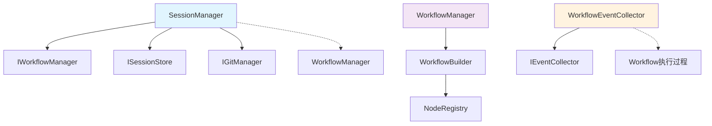

# Session模块与Workflow模块关系分析

## 概述

本文档详细分析Modular Agent Framework中Session模块与Workflow模块的当前关系架构、存在的问题以及优化建议。

## 当前架构关系

### 1. 模块职责划分

#### Session模块 (`src/application/sessions/`)
- **SessionManager**: 会话生命周期管理、持久化、Git版本记录
- **EventCollector**: 工作流执行事件收集和管理
- **WorkflowEventCollector**: 工作流事件收集器装饰器
- **SessionStore**: 会话数据存储（文件/内存）
- **GitManager**: 会话版本控制

#### Workflow模块 (`src/application/workflow/`)
- **WorkflowManager**: 工作流配置加载、构建、执行管理
- **WorkflowBuilder**: 工作流构建器
- **NodeRegistry**: 节点注册表
- **节点和边实现**: 具体的工作流组件

### 2. 依赖关系分析



### 3. 核心交互流程

#### 会话创建流程
```python
# SessionManager.create_session()
1. workflow_id = workflow_manager.load_workflow(config_path)
2. workflow = workflow_manager.create_workflow(workflow_id)
3. workflow_config = workflow_manager.get_workflow_config(workflow_id)
4. 保存会话数据（包含workflow_id和workflow_config快照）
```

#### 会话恢复流程
```python
# SessionManager.restore_session()
1. 从存储加载会话数据
2. workflow_id = session_data["metadata"]["workflow_id"]
3. workflow = workflow_manager.create_workflow(workflow_id)
4. 恢复AgentState状态
```

#### 事件收集流程
```python
# WorkflowEventCollector
1. 在会话创建时实例化
2. 提供工作流事件收集方法（workflow_start, node_start等）
3. 但目前workflow模块未调用这些方法
```

## 主要问题分析

### 1. 会话恢复的脆弱性

**问题**: `SessionManager.restore_session` 依赖首次创建时缓存的 `workflow_id`，但 `WorkflowManager` 的ID在进程重启后不会被恢复。

**代码表现**:
```python
# src/application/sessions/manager.py:232-233
workflow_id = session_data["metadata"]["workflow_id"]
workflow = self.workflow_manager.create_workflow(workflow_id)
```

**风险**: 进程重启后，`WorkflowManager` 中的工作流缓存丢失，导致会话恢复失败。

### 2. 配置存储职责重叠

**问题**: SessionManager在创建会话时缓存完整工作流配置快照，与WorkflowManager内部的配置缓存形成重复。

**代码表现**:
```python
# src/application/sessions/manager.py:203-207
workflow_config = self.workflow_manager.get_workflow_config(workflow_id)
session_data = {
    "metadata": session_metadata,
    "state": self._serialize_state(initial_state),
    "workflow_config": workflow_config.to_dict() if workflow_config else {}
}
```

**风险**: 配置数据重复存储，可能导致数据不一致。

### 3. 接口语义不清晰

**问题**: `save_session` 接口签名要求传入workflow实例，但实现中完全未使用。

**代码表现**:
```python
# src/application/sessions/manager.py:240-265
def save_session(self, session_id: str, workflow: Any, state: AgentState) -> bool:
    # workflow参数未被使用
    session_data["state"] = self._serialize_state(state)
    # ... 仅保存状态，不涉及workflow
```

**影响**: 接口设计误导，职责边界模糊。

### 4. 事件收集机制不完整

**问题**: `WorkflowEventCollector` 仅存在于会话模块，但workflow模块没有任何调用。

**现状**:
- Session模块提供了完整的事件收集基础设施
- Workflow模块执行过程中没有触发这些事件
- 导致过程记录与可视化能力无法落地

## 架构改进建议

### 1. 稳定会话恢复链路

**解决方案**:
- 在 `SessionManager.restore_session` 中优先依据 `workflow_config_path` 重新加载工作流
- 若原ID不存在则调用 `WorkflowManager.load_workflow` 重新生成ID
- 将会话元数据中的工作流标识改为以 `config_path + version` 为主键

**伪代码**:
```python
def restore_session(self, session_id: str) -> Tuple[Any, AgentState]:
    session_data = self.session_store.get_session(session_id)
    if not session_data:
        raise ValueError(f"会话 {session_id} 不存在")
    
    # 优先使用配置路径重新加载工作流
    config_path = session_data["metadata"]["workflow_config_path"]
    try:
        workflow_id = self.workflow_manager.load_workflow(config_path)
        workflow = self.workflow_manager.create_workflow(workflow_id)
    except Exception:
        # 回退到原始workflow_id
        workflow_id = session_data["metadata"]["workflow_id"]
        workflow = self.workflow_manager.create_workflow(workflow_id)
    
    # 恢复状态
    state = self._deserialize_state(session_data["state"])
    return workflow, state
```

### 2. 精简配置存储职责

**解决方案**:
- 为 `WorkflowManager` 补充按需导出配置摘要的接口
- `SessionManager` 只保存引用信息与运行时参数
- 会话层读取完整配置时通过 `WorkflowManager.get_workflow_config` 获取

**接口设计**:
```python
class IWorkflowManager(ABC):
    def get_workflow_summary(self, workflow_id: str) -> Dict[str, Any]:
        """获取工作流配置摘要（名称、版本、校验指纹等）"""
        pass

class SessionManager:
    def create_session(self, workflow_config_path: str, ...):
        workflow_id = self.workflow_manager.load_workflow(workflow_config_path)
        workflow_summary = self.workflow_manager.get_workflow_summary(workflow_id)
        
        session_data = {
            "metadata": {
                "workflow_config_path": workflow_config_path,
                "workflow_summary": workflow_summary,  # 只保存摘要
                # ... 其他元数据
            },
            "state": self._serialize_state(initial_state)
        }
```

### 3. 贯通事件流

**解决方案**:
- 在 `WorkflowManager.run_workflow/stream_workflow` 或 `WorkflowBuilder` 中注入可选的事件收集器回调
- 在工作流入口、节点执行前后、LLM/工具调用处触发 `WorkflowEventCollector`
- 由 `SessionManager` 负责创建带 `session_id` 的装饰器

**实现示例**:
```python
class WorkflowManager:
    def run_workflow(self, workflow_id: str, initial_state: AgentState, 
                    event_collector: Optional[WorkflowEventCollector] = None):
        if event_collector:
            event_collector.collect_workflow_start(workflow_name, config)
        
        # 执行工作流...
        for node in workflow_nodes:
            if event_collector:
                event_collector.collect_node_start(node.name, node.type, node.config)
            # 执行节点...
            if event_collector:
                event_collector.collect_node_end(node.name, result)
        
        if event_collector:
            event_collector.collect_workflow_end(workflow_name, final_result)
```

### 4. 梳理接口语义

**解决方案**:
- 将 `SessionManager.save_session` 的 `workflow` 参数剔除或改为显式使用
- 考虑将 `FileSessionStore` 等IO实现挪到 `src/infrastructure`
- 在会话层仅保留抽象接口以契合分层原则

**改进后的接口**:
```python
class ISessionManager(ABC):
    def save_session(self, session_id: str, state: AgentState) -> bool:
        """保存会话状态"""
        pass
    
    def save_session_with_metrics(self, session_id: str, state: AgentState, 
                                 workflow_metrics: Dict[str, Any]) -> bool:
        """保存会话状态和工作流指标"""
        pass
```

## 依赖关系优化

### 当前依赖关系
```
SessionManager → IWorkflowManager (依赖注入)
WorkflowManager → 无Session依赖 (单向依赖)
```

### 优化后依赖关系
```
SessionManager → IWorkflowManager (依赖注入)
WorkflowManager → IEventCollector (可选依赖，通过回调)
EventCollector ← WorkflowEventCollector (装饰器模式)
```

## 测试策略

### 集成测试场景
1. **会话恢复测试**: 模拟进程重启后会话恢复场景
2. **事件收集测试**: 验证工作流执行过程中的事件收集
3. **配置一致性测试**: 确保会话和工作流配置的一致性
4. **性能测试**: 验证改进后的性能表现

### 测试用例重点
```python
def test_session_recovery_after_restart():
    """测试进程重启后的会话恢复"""
    # 创建会话并保存
    session_id = session_manager.create_session(config_path, initial_state)
    
    # 模拟进程重启（重新初始化workflow_manager）
    new_workflow_manager = WorkflowManager()
    new_session_manager = SessionManager(new_workflow_manager, ...)
    
    # 恢复会话应该成功
    workflow, state = new_session_manager.restore_session(session_id)
    assert workflow is not None
    assert state is not None
```

## 总结

当前Session模块与Workflow模块的关系存在以下核心问题：

1. **恢复机制脆弱**: 依赖易失的workflow_id导致会话恢复失败
2. **职责边界模糊**: 配置存储重复，接口语义不清晰  
3. **事件流断裂**: 事件收集机制不完整，影响过程记录能力
4. **架构耦合**: Session过度依赖Workflow内部实现细节

通过上述改进方案，可以实现：
- 更健壮的会话恢复机制
- 清晰的职责边界和接口语义
- 完整的事件收集和过程记录
- 更好的架构解耦和可维护性

建议按照优先级逐步实施这些改进，优先解决会话恢复的稳定性问题。