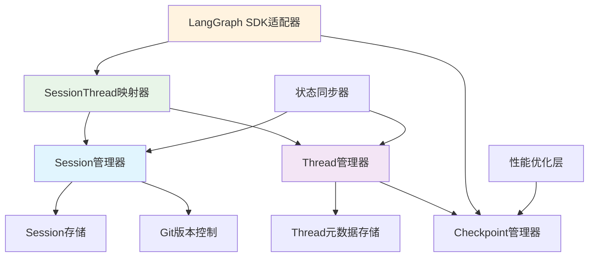

# Checkpoint机制增强与Session LangGraph Thread集成方案

## 执行摘要

基于对现有代码库的深入分析，本方案提出在现有优秀架构基础上进行增强，实现完整的LangGraph Thread生态集成。现有checkpoint实现已经具备LangGraph原生兼容性、清晰的分层架构和完整的功能，本方案将在此基础上增强Thread概念支持、优化Session-Thread映射、完善SDK兼容性。

## 1. 现有架构优势分析

### 1.1 Checkpoint架构优势
- ✅ **LangGraph原生兼容**: 直接使用`InMemorySaver`和`AsyncSqliteSaver`
- ✅ **分层架构清晰**: 领域层、应用层、基础设施层完整分离
- ✅ **异步支持完整**: 完整的异步操作支持
- ✅ **多种存储类型**: 内存和SQLite存储支持
- ✅ **策略管理完善**: 自动保存策略和触发条件

### 1.2 Session架构优势
- ✅ **生命周期管理完整**: 会话创建、恢复、保存、删除
- ✅ **Git版本控制集成**: 支持会话历史追踪
- ✅ **恢复机制健壮**: 多级回退策略
- ✅ **状态序列化完善**: 支持复杂状态对象的序列化

## 2. 增强方案设计

### 2.1 Thread概念增强

#### 2.1.1 Thread管理器设计
```python
class ThreadManager:
    """Thread生命周期管理器"""
    
    def __init__(self, checkpoint_manager: CheckpointManager):
        self.checkpoint_manager = checkpoint_manager
        self._thread_metadata_store: Dict[str, Dict[str, Any]] = {}
    
    async def create_thread(self, graph_id: str, metadata: Dict[str, Any]) -> str:
        """创建Thread并初始化元数据"""
        thread_id = f"thread_{uuid.uuid4().hex[:8]}"
        thread_metadata = {
            "thread_id": thread_id,
            "graph_id": graph_id,
            "created_at": datetime.now().isoformat(),
            "status": "active",
            **metadata
        }
        self._thread_metadata_store[thread_id] = thread_metadata
        return thread_id
    
    async def get_thread_info(self, thread_id: str) -> Optional[Dict[str, Any]]:
        """获取Thread详细信息"""
        return self._thread_metadata_store.get(thread_id)
    
    async def update_thread_status(self, thread_id: str, status: str) -> bool:
        """更新Thread状态"""
        if thread_id in self._thread_metadata_store:
            self._thread_metadata_store[thread_id]["status"] = status
            self._thread_metadata_store[thread_id]["updated_at"] = datetime.now().isoformat()
            return True
        return False
    
    async def list_threads(self, filters: Dict[str, Any] = None) -> List[Dict[str, Any]]:
        """列出Threads，支持过滤"""
        threads = list(self._thread_metadata_store.values())
        if filters:
            threads = [t for t in threads if all(t.get(k) == v for k, v in filters.items())]
        return sorted(threads, key=lambda x: x.get("created_at", ""), reverse=True)
```

#### 2.1.2 Thread元数据存储增强
```python
class ThreadMetadataStore:
    """Thread元数据持久化存储"""
    
    def __init__(self, storage_path: Path):
        self.storage_path = storage_path / "thread_metadata"
        self.storage_path.mkdir(parents=True, exist_ok=True)
    
    async def save_metadata(self, thread_id: str, metadata: Dict[str, Any]) -> bool:
        """保存Thread元数据"""
        file_path = self.storage_path / f"{thread_id}.json"
        try:
            with open(file_path, 'w', encoding='utf-8') as f:
                json.dump(metadata, f, ensure_ascii=False, indent=2)
            return True
        except Exception:
            return False
    
    async def load_metadata(self, thread_id: str) -> Optional[Dict[str, Any]]:
        """加载Thread元数据"""
        file_path = self.storage_path / f"{thread_id}.json"
        try:
            with open(file_path, 'r', encoding='utf-8') as f:
                return json.load(f)
        except Exception:
            return None
```

### 2.2 Session-Thread映射层

#### 2.2.1 SessionThreadMapper设计
```python
class SessionThreadMapper:
    """Session与Thread映射管理器"""
    
    def __init__(self, session_manager: SessionManager, thread_manager: ThreadManager):
        self.session_manager = session_manager
        self.thread_manager = thread_manager
        self._mappings: Dict[str, str] = {}  # session_id -> thread_id
        self._reverse_mappings: Dict[str, str] = {}  # thread_id -> session_id
    
    async def create_session_with_thread(self, 
                                       workflow_config_path: str,
                                       thread_metadata: Dict[str, Any]) -> Tuple[str, str]:
        """同时创建Session和Thread"""
        # 创建Session
        session_id = self.session_manager.create_session(workflow_config_path)
        
        # 提取graph_id（从工作流配置路径）
        graph_id = self._extract_graph_id(workflow_config_path)
        
        # 创建Thread
        thread_id = await self.thread_manager.create_thread(graph_id, thread_metadata)
        
        # 建立双向映射
        self._mappings[session_id] = thread_id
        self._reverse_mappings[thread_id] = session_id
        
        return session_id, thread_id
    
    async def get_thread_for_session(self, session_id: str) -> Optional[str]:
        """获取Session对应的Thread ID"""
        return self._mappings.get(session_id)
    
    async def get_session_for_thread(self, thread_id: str) -> Optional[str]:
        """获取Thread对应的Session ID"""
        return self._reverse_mappings.get(thread_id)
    
    async def delete_mapping(self, session_id: str) -> bool:
        """删除映射关系"""
        thread_id = self._mappings.get(session_id)
        if thread_id:
            del self._mappings[session_id]
            if thread_id in self._reverse_mappings:
                del self._reverse_mappings[thread_id]
            return True
        return False
    
    def _extract_graph_id(self, workflow_config_path: str) -> str:
        """从工作流配置路径提取graph ID"""
        # 实现逻辑：从路径中提取文件名作为graph ID
        return Path(workflow_config_path).stem
```

### 2.3 LangGraph SDK兼容性增强

#### 2.3.1 完整LangGraph SDK适配器
```python
class CompleteLangGraphSDKAdapter:
    """完整的LangGraph SDK适配器"""
    
    def __init__(self, session_thread_mapper: SessionThreadMapper, checkpoint_manager: CheckpointManager):
        self.mapper = session_thread_mapper
        self.checkpoint_manager = checkpoint_manager
    
    async def threads_create(self, 
                           graph_id: str, 
                           supersteps: Optional[List] = None,
                           metadata: Optional[Dict[str, Any]] = None) -> Dict[str, Any]:
        """完整的Thread创建接口"""
        # 创建Thread（通过映射层）
        thread_metadata = metadata or {}
        if supersteps:
            thread_metadata["supersteps"] = supersteps
        
        # 这里需要将graph_id映射到workflow_config_path
        workflow_config_path = self._map_graph_id_to_config_path(graph_id)
        session_id, thread_id = await self.mapper.create_session_with_thread(
            workflow_config_path, thread_metadata
        )
        
        return {
            "thread_id": thread_id,
            "session_id": session_id,
            "graph_id": graph_id,
            "metadata": thread_metadata
        }
    
    async def threads_get_state_history(self, 
                                      thread_id: str,
                                      limit: Optional[int] = None) -> List[Dict[str, Any]]:
        """获取Thread状态历史"""
        session_id = await self.mapper.get_session_for_thread(thread_id)
        if not session_id:
            return []
        
        checkpoints = await self.checkpoint_manager.list_checkpoints(session_id)
        if limit:
            checkpoints = checkpoints[:limit]
        
        return [{
            "checkpoint_id": cp.get("id"),
            "state": cp.get("state_data"),
            "metadata": cp.get("metadata"),
            "created_at": cp.get("created_at")
        } for cp in checkpoints]
    
    async def threads_update_state(self,
                                thread_id: str,
                                values: Dict[str, Any],
                                checkpoint_id: Optional[str] = None) -> Dict[str, Any]:
        """更新Thread状态"""
        session_id = await self.mapper.get_session_for_thread(thread_id)
        if not session_id:
            raise ValueError(f"Thread {thread_id} 不存在对应的Session")
        
        # 获取当前状态
        if checkpoint_id:
            checkpoint = await self.checkpoint_manager.get_checkpoint(session_id, checkpoint_id)
            current_state = checkpoint.get("state_data") if checkpoint else {}
        else:
            latest_checkpoint = await self.checkpoint_manager.get_latest_checkpoint(session_id)
            current_state = latest_checkpoint.get("state_data") if latest_checkpoint else {}
        
        # 合并状态
        updated_state = {**current_state, **values}
        
        # 保存新checkpoint
        new_checkpoint_id = await self.checkpoint_manager.create_checkpoint(
            session_id, "default_workflow", updated_state,
            metadata={"trigger_reason": "thread_state_update"}
        )
        
        return {
            "thread_id": thread_id,
            "checkpoint_id": new_checkpoint_id,
            "state": updated_state
        }
    
    async def threads_copy(self, thread_id: str) -> Dict[str, Any]:
        """复制Thread"""
        session_id = await self.mapper.get_session_for_thread(thread_id)
        if not session_id:
            raise ValueError(f"Thread {thread_id} 不存在")
        
        # 获取原Thread信息
        thread_info = await self.mapper.thread_manager.get_thread_info(thread_id)
        session_info = self.mapper.session_manager.get_session(session_id)
        
        # 创建新Thread
        new_thread_id = await self.mapper.thread_manager.create_thread(
            thread_info["graph_id"],
            {**thread_info, "copied_from": thread_id}
        )
        
        # 复制checkpoint历史
        checkpoints = await self.checkpoint_manager.list_checkpoints(session_id)
        for checkpoint in checkpoints[:10]:  # 限制复制数量
            await self.checkpoint_manager.create_checkpoint(
                new_session_id, checkpoint["workflow_id"], checkpoint["state_data"],
                metadata=checkpoint["metadata"]
            )
        
        return {
            "original_thread_id": thread_id,
            "new_thread_id": new_thread_id,
            "checkpoints_copied": len(checkpoints)
        }
    
    async def threads_search(self,
                           status: Optional[str] = None,
                           metadata: Optional[Dict[str, Any]] = None,
                           limit: int = 100) -> List[Dict[str, Any]]:
        """搜索Threads"""
        filters = {}
        if status:
            filters["status"] = status
        if metadata:
            filters.update(metadata)
        
        threads = await self.mapper.thread_manager.list_threads(filters)
        return threads[:limit]
    
    def _map_graph_id_to_config_path(self, graph_id: str) -> str:
        """将graph ID映射到工作流配置路径"""
        # 实现逻辑：根据graph_id查找对应的配置文件
        return f"configs/workflows/{graph_id}.yaml"
```

### 2.4 状态同步机制

#### 2.4.1 StateSynchronizer设计
```python
class StateSynchronizer:
    """状态同步器"""
    
    def __init__(self, session_manager: SessionManager, thread_manager: ThreadManager):
        self.session_manager = session_manager
        self.thread_manager = thread_manager
    
    async def sync_session_to_thread(self, session_id: str, thread_id: str) -> bool:
        """将Session状态同步到Thread"""
        session_data = self.session_manager.get_session(session_id)
        if not session_data:
            return False
        
        # 转换Session状态为Thread状态格式
        thread_state = self._convert_session_to_thread_state(session_data)
        
        # 更新Thread元数据中的状态信息
        thread_info = await self.thread_manager.get_thread_info(thread_id)
        if thread_info:
            thread_info["last_synced_state"] = thread_state
            thread_info["last_sync_time"] = datetime.now().isoformat()
            # 这里需要ThreadManager提供更新方法
            # await self.thread_manager.update_thread_metadata(thread_id, thread_info)
        
        return True
    
    async def sync_thread_to_session(self, thread_id: str, session_id: str) -> bool:
        """将Thread状态同步到Session"""
        thread_info = await self.thread_manager.get_thread_info(thread_id)
        if not thread_info:
            return False
        
        # 转换Thread状态为Session状态格式
        session_state = self._convert_thread_to_session_state(thread_info)
        
        # 更新Session状态
        return self.session_manager.save_session(session_id, session_state)
    
    def _convert_session_to_thread_state(self, session_data: Dict[str, Any]) -> Dict[str, Any]:
        """转换Session状态为Thread状态格式"""
        state_data = session_data.get("state", {})
        return {
            "messages": state_data.get("messages", []),
            "current_step": state_data.get("current_step", ""),
            "iteration_count": state_data.get("iteration_count", 0),
            "workflow_name": state_data.get("workflow_name", "")
        }
    
    def _convert_thread_to_session_state(self, thread_info: Dict[str, Any]) -> Dict[str, Any]:
        """转换Thread状态为Session状态格式"""
        thread_state = thread_info.get("last_synced_state", {})
        return {
            "messages": thread_state.get("messages", []),
            "current_step": thread_state.get("current_step", ""),
            "iteration_count": thread_state.get("iteration_count", 0),
            "workflow_name": thread_state.get("workflow_name", "")
        }
```

### 2.5 性能优化增强

#### 2.5.1 增量状态存储
```python
class IncrementalCheckpointStore:
    """增量checkpoint存储"""
    
    def __init__(self, base_store: ICheckpointStore):
        self.base_store = base_store
        self._deltas: Dict[str, List[Dict[str, Any]]] = {}
    
    async def save_incremental(self,
                             session_id: str,
                             base_checkpoint_id: str,
                             delta: Dict[str, Any]) -> str:
        """保存增量checkpoint"""
        # 获取基础checkpoint
        base_checkpoint = await self.base_store.get_checkpoint(session_id, base_checkpoint_id)
        
        # 应用增量
        new_state = self._apply_delta(base_checkpoint['state_data'], delta)
        
        # 保存新checkpoint
        return await self.base_store.save_checkpoint(session_id, new_state)
    
    def _apply_delta(self, base_state: Dict[str, Any], delta: Dict[str, Any]) -> Dict[str, Any]:
        """应用增量到基础状态"""
        result = base_state.copy()
        for key, value in delta.items():
            if isinstance(value, dict) and key in result and isinstance(result[key], dict):
                result[key] = {**result[key], **value}
            else:
                result[key] = value
        return result
```

#### 2.5.2 缓存优化
```python
class CachedCheckpointManager(CheckpointManager):
    """带缓存的Checkpoint管理器"""
    
    def __init__(self, *args, cache_ttl: int = 300, **kwargs):
        super().__init__(*args, **kwargs)
        self._cache: Dict[str, Tuple[Dict[str, Any], float]] = {}
        self._cache_ttl = cache_ttl
    
    async def get_checkpoint(self, session_id: str, checkpoint_id: str) -> Optional[Dict[str, Any]]:
        """带缓存的checkpoint获取"""
        cache_key = f"{session_id}:{checkpoint_id}"
        
        # 检查缓存
        if cache_key in self._cache:
            cached_data, timestamp = self._cache[cache_key]
            if time.time() - timestamp < self._cache_ttl:
                return cached_data
        
        # 从存储获取
        checkpoint = await super().get_checkpoint(session_id, checkpoint_id)
        
        # 更新缓存
        if checkpoint:
            self._cache[cache_key] = (checkpoint, time.time())
        
        return checkpoint
```

## 3. 实施路线图

### 3.1 阶段1：Thread概念增强（1-2周）
- 实现Thread管理器核心功能
- 添加Thread元数据持久化存储
- 创建基本的Session-Thread映射层
- 单元测试覆盖

### 3.2 阶段2：SDK兼容性完善（1-2周）
- 实现完整LangGraph SDK接口
- 添加高级搜索和查询功能
- 优化性能缓存机制
- 集成测试验证

### 3.3 阶段3：状态同步优化（1周）
- 实现状态自动同步机制
- 提供数据一致性保证
- 性能测试和优化
- 生产环境部署

## 4. 风险评估与缓解

### 4.1 技术风险
| 风险点 | 等级 | 缓解措施 |
|--------|------|----------|
| 现有功能兼容性 | 低 | 保持现有接口不变，仅添加新功能 |
| 性能影响 | 中 | 实施渐进式优化，添加性能监控 |
| 数据一致性 | 中 | 实现原子性操作和回滚机制 |

### 4.2 实施风险
| 风险点 | 等级 | 缓解措施 |
|--------|------|----------|
| 开发周期 | 低 | 基于现有组件，缩短开发时间 |
| 团队学习曲线 | 低 | 延续现有技术栈，减少学习成本 |
| 测试覆盖 | 中 | 实施全面的单元和集成测试 |

## 5. 预期收益

### 5.1 技术收益
1. **最大化现有投资**: 重用优秀的Checkpoint实现
2. **保持架构一致性**: 延续清晰的分层设计
3. **降低技术风险**: 基于经过验证的组件
4. **完整LangGraph生态集成**: 获得Thread完整功能支持

### 5.2 业务收益
1. **零迁移成本**: 现有功能完全保留
2. **快速交付价值**: 缩短开发周期
3. **生态兼容性**: 同时支持现有系统和LangGraph标准

## 6. 结论与建议

### 6.1 核心结论
**现有架构已经提供了优秀的基础**，建议采用渐进式增强方案：
1. **在现有Checkpoint基础上增强Thread支持**
2. **保持清晰的Session-Thread职责分离**
3. **渐进式实施，优先实现高价值功能**

### 6.2 最终建议
**立即开始Thread概念增强工作**，充分利用现有Checkpoint架构的优势。这种方案在技术可行性、实施成本和业务价值之间取得了最佳平衡。

通过这种渐进式改进，我们可以在最短时间内获得LangGraph Thread的完整功能支持，同时保持系统的稳定性和可维护性。

## 附录

### A. 架构图


### B. 核心接口定义
关键接口需要扩展以支持Thread概念：
- `IThreadManager`: Thread生命周期管理
- `ISessionThreadMapper`: Session-Thread映射管理  
- `ICompleteLangGraphSDK`: 完整SDK接口
- `IStateSynchronizer`: 状态同步接口

### C. 配置示例
```yaml
# configs/threads/thread_config.yaml
thread:
  enabled: true
  metadata_storage: "file"  # file | memory
  storage_path: "./threads"
  max_threads: 1000
  auto_cleanup: true
  
session_thread_mapping:
  enabled: true
  mapping_storage: "memory"  # memory | file
  auto_sync: true
  
langgraph_sdk:
  enabled: true
  compatibility_mode: "full"  # basic | full
  cache_enabled: true
  cache_ttl: 300
```

本方案为现有架构提供了完整的LangGraph Thread集成路径，确保系统能够充分利用LangGraph生态的优势，同时保持向后兼容性和架构简洁性。