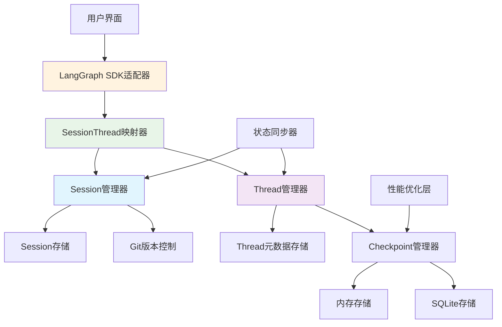

# Checkpoint机制增强与Thread集成方案总结

## 方案概述

基于对现有代码库的深入分析，本方案提出了一套完整的增强计划，旨在充分利用现有优秀架构，实现与LangGraph Thread生态的完整集成。方案采用渐进式实施策略，确保在保持系统稳定性的同时获得最大技术收益。

## 核心发现

### 现有架构优势
1. **LangGraph原生兼容**: 直接使用`InMemorySaver`和`AsyncSqliteSaver`
2. **分层架构清晰**: 领域层、应用层、基础设施层完整分离
3. **功能完整性高**: 支持异步操作、多种存储类型、策略管理
4. **Session管理成熟**: 完整的生命周期管理和Git版本控制集成

### 增强机会
1. **Thread概念支持**: 需要独立的Thread生命周期管理
2. **SDK兼容性**: 需要完整的LangGraph SDK接口实现
3. **状态同步**: 需要Session和Thread状态的一致性保证
4. **性能优化**: 可以进一步优化存储和查询性能

## 增强方案核心设计

### 1. Thread概念增强
- **Thread管理器**: 独立的Thread生命周期管理
- **元数据存储**: Thread元数据的持久化存储
- **状态历史**: 完整的Thread状态历史追踪

### 2. Session-Thread映射层
- **双向映射**: Session和Thread的双向关联管理
- **职责分离**: 明确Session和Thread的职责边界
- **状态同步**: 自动状态同步机制

### 3. LangGraph SDK兼容性
- **完整接口**: 实现LangGraph标准的Thread管理接口
- **高级查询**: 支持过滤、搜索、排序等高级功能
- **性能优化**: 缓存机制和性能监控

### 4. 状态同步机制
- **双向同步**: Session状态与Thread状态的自动同步
- **一致性保证**: 数据一致性验证和修复机制
- **错误处理**: 完善的错误处理和恢复策略

## 技术架构图

## 实施路线图

### 阶段1：Thread概念增强（第1-2周）
- 建立Thread管理基础架构
- 实现Thread生命周期管理
- 创建基础映射层

### 阶段2：SDK兼容性增强（第3-4周）
- 实现完整LangGraph SDK接口
- 添加高级查询功能
- 性能优化实现

### 阶段3：状态同步与生产部署（第5周）
- 实现状态同步机制
- 生产环境部署
- 性能测试和优化

## 风险评估与缓解

### 技术风险
| 风险点 | 等级 | 缓解措施 |
|--------|------|----------|
| 现有功能兼容性 | 低 | 保持现有接口不变 |
| 性能影响 | 中 | 渐进式优化，添加监控 |
| 数据一致性 | 中 | 原子性操作，验证机制 |

### 实施风险
| 风险点 | 等级 | 缓解措施 |
|--------|------|----------|
| 开发周期延误 | 中 | 里程碑管理，灵活调整 |
| 团队技能匹配 | 低 | 技术培训，代码审查 |

## 预期收益

### 技术收益
1. **最大化现有投资**: 重用优秀的Checkpoint实现
2. **完整生态集成**: 获得LangGraph Thread完整功能支持
3. **架构一致性**: 延续清晰的分层设计
4. **性能提升**: 通过优化获得更好的性能表现

### 业务收益
1. **零迁移成本**: 现有功能完全保留
2. **快速价值交付**: 缩短开发周期
3. **生态优势**: 兼容LangGraph标准生态
4. **用户体验提升**: 更强大的Thread管理功能

## 成功标准

### 技术标准
- ✅ Thread管理器功能完整
- ✅ SDK接口100%兼容LangGraph标准
- ✅ 状态同步机制稳定可靠
- ✅ 性能指标达到预期目标

### 业务标准
- ✅ 现有功能零影响
- ✅ 用户迁移成本为零
- ✅ 生产环境稳定运行
- ✅ 用户满意度高

## 关键决策点

### 架构决策
1. **不引入额外Thread层**: 在现有Session层增强Thread支持
2. **保持向后兼容**: 所有现有接口保持不变
3. **渐进式实施**: 分阶段降低风险

### 技术决策
1. **重用现有存储**: 继续使用LangGraph原生存储
2. **明确职责边界**: Session负责执行，Thread负责状态
3. **性能优先**: 在功能完整的基础上优化性能

## 实施建议

### 立即行动项
1. **开始阶段1开发**: 立即启动Thread管理器实现
2. **组建核心团队**: 分配开发、测试、文档角色
3. **设置监控指标**: 定义关键性能指标和成功标准

### 中期规划
1. **阶段2准备**: 在阶段1完成前开始阶段2设计
2. **用户反馈收集**: 尽早收集用户需求和反馈
3. **性能基准测试**: 建立性能基准用于后续优化

### 长期愿景
1. **生态扩展**: 探索更多的LangGraph生态集成
2. **高级功能**: 实现AI驱动的Thread管理
3. **多云支持**: 扩展分布式部署能力

## 结论

本增强方案基于现有优秀架构，采用务实的技术路线，能够在最短时间内实现完整的LangGraph Thread生态集成。方案充分考虑了技术可行性、实施风险和业务价值，是当前最优的技术选择。

**核心优势**:
- 充分利用现有投资
- 渐进式降低风险
- 完整的功能支持
- 优秀的用户体验

**推荐立即开始实施**，按照三个阶段路线图稳步推进，确保项目成功交付。

## 附录

### 相关文档
- [`enhanced-checkpoint-thread-integration.md`](enhanced-checkpoint-thread-integration.md): 详细技术方案
- [`implementation-plan.md`](implementation-plan.md): 具体实施计划
- [`checkpoint-implementation-analysis.md`](checkpoint-implementation-analysis.md): 现有架构分析
- [`session-thread.md`](session-thread.md): Session-Thread概念分析
- [`final-recommendation.md`](final-recommendation.md): 最终建议

### 技术依赖
- Python 3.13+
- LangGraph 最新版本
- 现有Modular Agent Framework架构

### 联系方式
如需进一步技术讨论或实施方案调整，请联系架构团队。