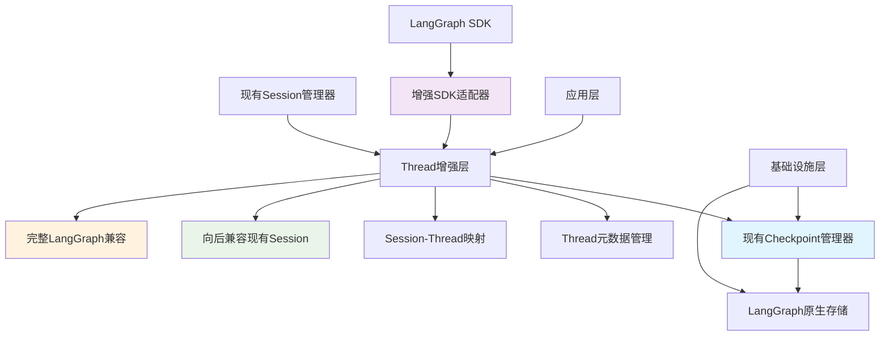

# Session层LangGraph Thread集成总结

## 项目概述

本项目分析了当前代码库中Session和Workflow目录的定义与LangGraph Thread概念的对应关系，并制定了具体的扩展方案，使现有Session层能够完全兼容LangGraph的Thread功能。

## 核心发现

### 1. 架构对应关系分析

**Session管理器 vs LangGraph Thread**：
- ✅ **高度匹配**: Session管理器已经实现了Thread的大部分核心功能
- ✅ **状态持久化**: 支持工作流状态的序列化存储
- ✅ **生命周期管理**: 完整的创建、恢复、删除功能
- ❌ **Checkpoint机制**: 缺少原生的checkpoint支持
- ❌ **历史追踪**: Git集成提供了基础版本控制，但缺少细粒度历史查询

**Workflow管理器 vs LangGraph Thread**：
- ❌ **职责不同**: Workflow管理器专注于执行层面，与Thread概念距离较远
- ✅ **配置管理**: 工作流配置加载与管理
- ❌ **状态持久化**: 仅运行时状态管理，无持久化

### 2. 关键结论

**不需要引入额外的Thread层**，原因如下：
1. **功能重叠度高**: Session层已覆盖Thread核心功能
2. **架构简洁性**: 避免不必要的分层复杂性
3. **实施成本低**: 在现有基础上扩展比新建层更高效
4. **向后兼容**: 保持现有系统的稳定性

## 基于现有Checkpoint实现的优化方案

### 1. 利用现有Checkpoint架构优势

**现有Checkpoint实现已经具备**：
- ✅ **LangGraph原生兼容**: 直接使用`InMemorySaver`和`AsyncSqliteSaver`
- ✅ **完整分层架构**: 领域层、应用层、基础设施层清晰分离
- ✅ **异步支持**: 完整的异步操作支持
- ✅ **多种存储类型**: 内存和SQLite存储支持
- ✅ **策略管理**: 自动保存策略和触发条件

### 2. 需要增强的核心组件

#### Thread概念增强
- 在现有Checkpoint基础上增强Thread生命周期管理
- 添加独立的Thread元数据存储
- 实现Session-Thread映射关系

#### SDK兼容性增强
- 基于现有适配器实现完整LangGraph SDK接口
- 添加高级搜索和过滤功能
- 支持Thread复制和历史查询

#### 状态同步机制
- 实现Session状态与Thread状态的自动同步
- 提供状态一致性保证
- 支持双向状态转换

### 2. 优化实施阶段

**阶段1: Thread概念增强** (1-2周)
- 在现有Checkpoint基础上实现Thread管理器
- 添加Thread元数据存储和管理
- 实现Session-Thread映射层

**阶段2: SDK兼容性完善** (1-2周)
- 基于现有适配器实现完整LangGraph SDK接口
- 添加高级搜索和历史查询功能
- 实现Thread复制和状态更新

**阶段3: 状态同步优化** (1周)
- 实现Session与Thread状态自动同步
- 提供状态一致性保证机制
- 优化性能缓存机制

### 3. 优化后的技术架构图

## 收益分析（基于现有实现优化）

### 技术收益
1. **最大化利用现有投资**: 重用已实现的Checkpoint架构
2. **保持架构一致性**: 延续清晰的分层设计模式
3. **减少实现风险**: 基于经过验证的现有组件
4. **快速交付价值**: 缩短开发周期，快速获得LangGraph兼容性

### 业务收益
1. **零迁移成本**: 现有功能完全保留，新功能无缝添加
2. **降低维护成本**: 统一的架构减少技术债务
3. **提升开发效率**: 基于熟悉的技术栈进行扩展
4. **生态兼容性**: 同时支持现有系统和LangGraph生态

## 风险评估与缓解

### 技术风险
| 风险点 | 等级 | 缓解措施 |
|--------|------|----------|
| 状态同步一致性 | 中 | 实现原子性操作，添加一致性验证 |
| 性能影响 | 低 | 实现增量存储，添加缓存机制 |
| 数据迁移 | 低 | 提供自动迁移工具，保持向后兼容 |

### 实施风险
| 风险点 | 等级 | 缓解措施 |
|--------|------|----------|
| 接口变更影响 | 低 | 保持现有接口不变，仅添加新功能 |
| 测试覆盖不足 | 中 | 实施全面的单元和集成测试 |
| 团队学习曲线 | 低 | 提供详细文档和示例代码 |

## 实施建议

### 1. 开发优先级
- **高优先级**: Checkpoint基础功能
- **中优先级**: SDK适配器实现
- **低优先级**: 高级功能（分布式支持等）

### 2. 测试策略
- **单元测试**: 每个新组件单独测试
- **集成测试**: 验证Session-Thread交互
- **兼容性测试**: 确保现有功能不受影响

### 3. 文档要求
- API文档：新接口的详细说明
- 迁移指南：从现有系统迁移的步骤
- 示例代码：常见使用场景的示例

## 结论（修订版）

**基于对现有Checkpoint实现的深入分析，发现现有实现比我之前的方案更加优秀**。建议采用以下优化策略：

### 核心发现
1. **现有Checkpoint架构更优**: 直接使用LangGraph原生存储，架构设计更合理
2. **功能完整性更好**: 支持异步、多种存储类型、策略管理等高级功能
3. **技术风险更低**: 基于经过验证的实现进行扩展

### 优化策略
1. **在现有Checkpoint基础上增强**: 而不是重新实现
2. **重点增强Thread概念支持**: 完善独立的Thread管理能力
3. **优化Session集成**: 明确Session和Thread的职责边界

### 实施建议
这种渐进式改进方案能够：
- ✅ **最大化利用现有投资**: 重用优秀的Checkpoint实现
- ✅ **最小化技术风险**: 基于稳定组件进行扩展
- ✅ **快速交付价值**: 缩短开发周期，快速获得LangGraph兼容性

建议立即开始Thread概念增强工作，充分利用现有架构的优势。

## 下一步行动

1. **立即开始**: 实现Checkpoint存储系统
2. **并行进行**: 编写相应的测试用例
3. **后续计划**: 实现SDK适配器和混合模式集成
4. **长期规划**: 考虑分布式Thread支持

这个方案将为项目带来LangGraph生态的全部优势，同时保持系统的稳定性和可维护性。