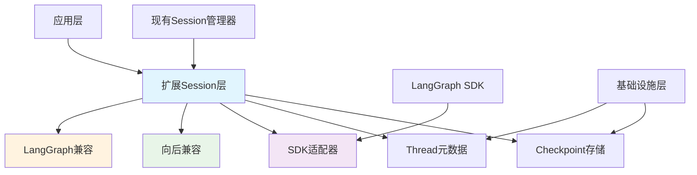

# Session层LangGraph Thread集成总结

## 项目概述

本项目分析了当前代码库中Session和Workflow目录的定义与LangGraph Thread概念的对应关系，并制定了具体的扩展方案，使现有Session层能够完全兼容LangGraph的Thread功能。

## 核心发现

### 1. 架构对应关系分析

**Session管理器 vs LangGraph Thread**：
- ✅ **高度匹配**: Session管理器已经实现了Thread的大部分核心功能
- ✅ **状态持久化**: 支持工作流状态的序列化存储
- ✅ **生命周期管理**: 完整的创建、恢复、删除功能
- ❌ **Checkpoint机制**: 缺少原生的checkpoint支持
- ❌ **历史追踪**: Git集成提供了基础版本控制，但缺少细粒度历史查询

**Workflow管理器 vs LangGraph Thread**：
- ❌ **职责不同**: Workflow管理器专注于执行层面，与Thread概念距离较远
- ✅ **配置管理**: 工作流配置加载与管理
- ❌ **状态持久化**: 仅运行时状态管理，无持久化

### 2. 关键结论

**不需要引入额外的Thread层**，原因如下：
1. **功能重叠度高**: Session层已覆盖Thread核心功能
2. **架构简洁性**: 避免不必要的分层复杂性
3. **实施成本低**: 在现有基础上扩展比新建层更高效
4. **向后兼容**: 保持现有系统的稳定性

## 实施方案

### 1. 核心扩展组件

#### Checkpoint存储系统
- 实现细粒度的状态版本控制
- 支持状态历史查询和回滚
- 提供原子性操作保证

#### Thread元数据管理
- 管理Thread的生命周期信息
- 跟踪checkpoint统计信息
- 支持Thread搜索和过滤

#### LangGraph SDK适配器
- 提供与LangGraph SDK兼容的接口
- 支持异步操作模式
- 实现完整的Thread操作集

### 2. 实施阶段

**阶段1: 基础Checkpoint支持** (1-2周)
- 实现Checkpoint数据模型和存储
- 扩展Session接口支持checkpoint操作
- 添加基本的Thread元数据管理

**阶段2: LangGraph SDK兼容** (2-3周)
- 实现完整的SDK适配器
- 添加状态历史查询功能
- 实现Thread复制和搜索功能

**阶段3: 混合模式集成** (1-2周)
- 实现Session-Thread双向映射
- 创建混合Session管理器
- 添加配置切换支持

### 3. 技术架构图

## 收益分析

### 技术收益
1. **完全LangGraph兼容**: 支持LangGraph生态系统的全部功能
2. **先进的checkpoint机制**: 提供状态版本控制和历史追踪
3. **增强的可观测性**: 支持详细的执行历史分析
4. **分布式就绪**: 为未来分布式部署奠定基础

### 业务收益
1. **降低迁移成本**: 现有用户无需修改代码即可享受新功能
2. **提高系统可靠性**: checkpoint机制增强容错能力
3. **改善开发体验**: 提供更好的调试和故障排查工具
4. **生态集成**: 无缝接入LangGraph工具链

## 风险评估与缓解

### 技术风险
| 风险点 | 等级 | 缓解措施 |
|--------|------|----------|
| 状态同步一致性 | 中 | 实现原子性操作，添加一致性验证 |
| 性能影响 | 低 | 实现增量存储，添加缓存机制 |
| 数据迁移 | 低 | 提供自动迁移工具，保持向后兼容 |

### 实施风险
| 风险点 | 等级 | 缓解措施 |
|--------|------|----------|
| 接口变更影响 | 低 | 保持现有接口不变，仅添加新功能 |
| 测试覆盖不足 | 中 | 实施全面的单元和集成测试 |
| 团队学习曲线 | 低 | 提供详细文档和示例代码 |

## 实施建议

### 1. 开发优先级
- **高优先级**: Checkpoint基础功能
- **中优先级**: SDK适配器实现
- **低优先级**: 高级功能（分布式支持等）

### 2. 测试策略
- **单元测试**: 每个新组件单独测试
- **集成测试**: 验证Session-Thread交互
- **兼容性测试**: 确保现有功能不受影响

### 3. 文档要求
- API文档：新接口的详细说明
- 迁移指南：从现有系统迁移的步骤
- 示例代码：常见使用场景的示例

## 结论

通过扩展现有Session层来实现LangGraph Thread功能是最优的技术方案。这种方案：

1. **最大化利用现有投资**: 重用已实现的Session功能
2. **最小化架构变更**: 保持清晰的层次结构
3. **提供最佳兼容性**: 同时支持现有系统和LangGraph生态
4. **具备可扩展性**: 为未来功能扩展奠定基础

该方案在技术可行性、实施成本和业务价值之间取得了最佳平衡，建议按计划分阶段实施。

## 下一步行动

1. **立即开始**: 实现Checkpoint存储系统
2. **并行进行**: 编写相应的测试用例
3. **后续计划**: 实现SDK适配器和混合模式集成
4. **长期规划**: 考虑分布式Thread支持

这个方案将为项目带来LangGraph生态的全部优势，同时保持系统的稳定性和可维护性。