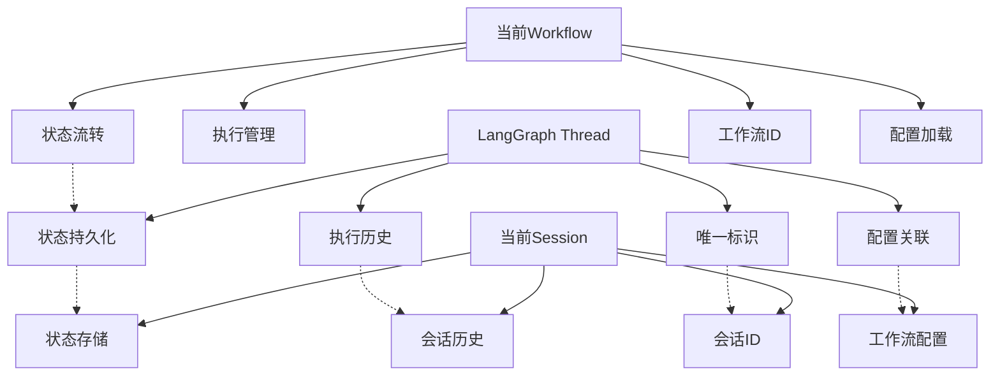

基于我对代码库和LangGraph文档的深入分析，我现在为您提供完整的分析报告：

## LangGraph Thread概念与当前架构分析报告

### 1. LangGraph Thread概念的核心特性

根据Context7获取的LangGraph文档，thread在LangGraph中具有以下核心特性：

- **状态持久化**: Thread是状态的有状态执行上下文，支持checkpoint机制
- **唯一标识**: 每个thread有唯一的thread_id，用于标识和管理
- **历史追踪**: 支持获取完整的执行历史（checkpoint历史）
- **状态管理**: 可以获取当前状态或特定checkpoint的状态
- **生命周期管理**: 支持创建、复制、删除、搜索等操作
- **配置关联**: 与graph配置关联，支持不同的执行策略

### 2. 当前Session管理器分析

**功能职责**：
- 会话生命周期管理（创建、恢复、保存、删除）
- 工作流状态持久化存储
- Git版本控制集成
- 会话元数据管理
- 恢复机制和错误处理

**关键特性**：
- 支持工作流配置关联
- 提供状态序列化/反序列化
- 支持会话历史追踪
- 具备恢复策略和一致性验证

### 3. 当前Workflow管理器分析

**功能职责**：
- 工作流配置加载和管理
- 工作流实例创建和执行
- 执行统计和监控
- 可视化数据生成
- 异步和流式执行支持

**关键特性**：
- 工作流生命周期管理
- 执行状态跟踪
- 性能指标收集
- 错误处理和日志记录

### 4. 架构对应关系分析

### 5. 对应关系总结

| LangGraph Thread特性 | Session管理器对应 | Workflow管理器对应 | 匹配度 |
|---------------------|------------------|-------------------|--------|
| 状态持久化 | ✅ 完整支持（状态序列化存储） | ❌ 仅运行时状态 | 高 |
| 执行历史 | ✅ 支持（Git版本控制） | ❌ 无历史追踪 | 中 |
| 唯一标识 | ✅ 会话ID | ✅ 工作流ID | 高 |
| 配置关联 | ✅ 工作流配置路径 | ✅ 工作流配置 | 高 |
| 生命周期管理 | ✅ 完整支持 | ✅ 执行管理 | 高 |
| Checkpoint机制 | ❌ 无原生支持 | ❌ 无原生支持 | 低 |

### 6. 是否需要额外Thread层的评估

**不需要引入额外Thread层的理由**：

1. **功能重叠度高**: Session管理器已经实现了Thread的大部分核心功能
2. **架构简洁性**: 当前分层清晰，职责分明
3. **实现成本**: 引入新层会增加复杂度，收益有限
4. **LangGraph集成**: 可以直接在现有Session层集成Thread概念

**建议的改进方向**：
- 在Session层增强对LangGraph Thread概念的适配
- 添加checkpoint机制支持
- 改进状态历史管理
- 增强与LangGraph SDK的兼容性

### 7. 架构改进建议

**短期改进（高优先级）**：
1. 在SessionManager中添加checkpoint支持
2. 实现状态快照和历史查询功能
3. 增强与LangGraph thread_id的兼容性

**中期改进（中优先级）**：
1. 重构状态管理以支持LangGraph StateSnapshot模式
2. 添加thread复制和搜索功能
3. 实现更细粒度的状态版本控制

**长期改进（低优先级）**：
1. 完全兼容LangGraph SDK接口
2. 支持分布式thread管理
3. 实现高级thread操作（如状态回滚）

### 结论

当前架构中的**Session管理器更接近LangGraph的Thread概念**，已经实现了Thread的大部分核心功能。Workflow管理器主要负责执行层面的管理，与Thread概念有一定距离。

**不建议引入额外的Thread层**，而是建议在现有Session层进行增强，使其更好地适配LangGraph的Thread概念。这样可以保持架构简洁性，同时获得LangGraph生态的兼容性优势。