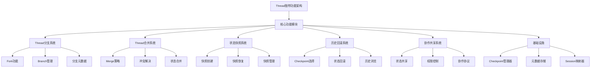

基于我对当前代码架构和LangGraph文档的深入分析，我现在为您提供thread独特功能的详细分析报告和实现计划。

## 当前Thread-Session映射架构分析

### 现有功能概览
当前系统已经实现了基础的thread-session映射关系：
- **双向映射管理**：SessionThreadMapper维护session_id ↔ thread_id的双向映射
- **生命周期管理**：同时创建session和thread，确保一致性
- **持久化支持**：支持内存和文件存储两种模式
- **基础CRUD操作**：创建、查询、删除、列表等基本功能

### 架构优势
- **清晰的职责分离**：Session负责执行层面，Thread负责状态层面
- **灵活的存储策略**：支持内存和持久化存储
- **完整的接口定义**：遵循依赖注入原则，易于扩展

## Thread独特功能分析

基于LangGraph的thread模型，我识别出以下独特的thread功能：

### 1. Thread分支功能 (Fork/Branching)
**概念**：从某个checkpoint创建新的thread分支，实现并行探索

**实现方案**：
```python
async def fork_thread(
    self, 
    source_thread_id: str, 
    checkpoint_id: str,
    branch_name: str,
    metadata: Dict[str, Any]
) -> str:
    """从指定checkpoint创建thread分支"""
```

### 2. Thread合并功能 (Merge)
**概念**：将多个thread分支的结果合并到主thread

**实现方案**：
```python
async def merge_threads(
    self,
    target_thread_id: str,
    source_thread_ids: List[str],
    merge_strategy: str = "latest"
) -> bool:
    """合并多个thread到目标thread"""
```

### 3. Thread状态快照 (Snapshot)
**概念**：创建thread的完整状态快照，包括所有checkpoints

**实现方案**：
```python
async def create_thread_snapshot(
    self,
    thread_id: str,
    snapshot_name: str
) -> str:
    """创建thread状态快照"""
```

### 4. Thread历史回滚 (Time Travel)
**概念**：回滚到thread历史中的任意checkpoint

**实现方案**：
```python
async def rollback_thread(
    self,
    thread_id: str,
    checkpoint_id: str
) -> bool:
    """回滚thread到指定checkpoint"""
```

### 5. Thread协作功能 (Collaboration)
**概念**：多个thread之间的状态共享和协作

**实现方案**：
```python
async def share_thread_state(
    self,
    source_thread_id: str,
    target_thread_id: str,
    checkpoint_id: str
) -> bool:
    """共享thread状态到其他thread"""
```

## 详细实现计划



### 实施步骤

**第一阶段：基础扩展**
1. 扩展ThreadManager接口，添加分支和合并方法
2. 增强CheckpointManager，支持checkpoint复制和状态恢复
3. 实现thread分支功能

**第二阶段：高级功能**
1. 实现thread合并功能，支持多种合并策略
2. 添加thread快照管理
3. 实现历史回滚功能

**第三阶段：协作功能**
1. 实现thread间状态共享
2. 添加权限控制和协作协议
3. 优化性能和用户体验

### 技术实现要点

1. **Checkpoint复制机制**：实现checkpoint的深度复制，确保分支独立性
2. **状态合并算法**：设计智能的状态合并策略，处理冲突
3. **元数据扩展**：为thread添加分支关系、快照信息等元数据
4. **性能优化**：实现增量快照、懒加载等优化策略