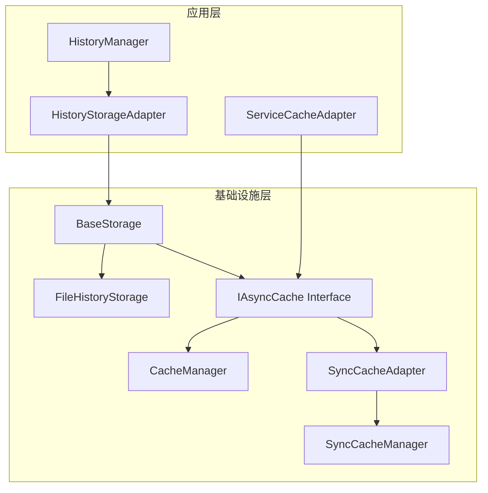
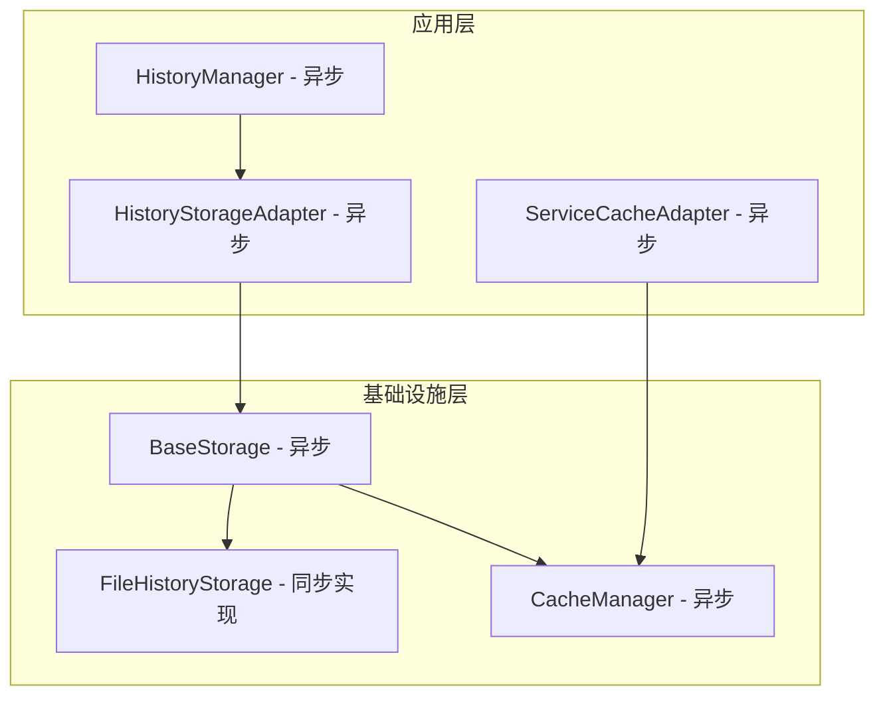

## 存储架构分析与重构方案

### 当前架构问题分析

通过代码分析，我发现了以下关键问题：

1. **混淆的异步语义**：[`BaseStorage`](src/infrastructure/common/storage/base_storage.py:15) 混合了异步和同步缓存，导致每个缓存操作都需要运行时检查 `asyncio.iscoroutinefunction()`

2. **同步缓存的真实使用场景**：
   - [`HistoryStorageAdapter`](src/infrastructure/common/storage/history_storage_adapter.py:17) 使用 `SyncCacheManager` 但实际上是通过 `asyncio.create_task()` 和 `asyncio.run()` 调用异步方法
   - [`ServiceCacheAdapter`](src/infrastructure/cache/service_cache_adapter.py:11) 使用 `SyncCacheManager` 是为了在同步接口中包装异步调用
   - [`HistoryManager`](src/application/history/manager.py:21) 直接使用异步 `CacheManager`，但在 `get_llm_statistics` 方法中使用 `asyncio.run()` 调用缓存

3. **架构不一致**：
   - [`FileHistoryStorage`](src/infrastructure/history/storage/file_storage.py:11) 是同步实现
   - [`HistoryManager`](src/application/history/manager.py:21) 是异步接口
   - [`BaseStorage`](src/infrastructure/common/storage/base_storage.py:15) 试图同时支持两种模式

### 重构方案设计

基于分析，我推荐采用**方案3：使用缓存接口适配器模式**，具体设计如下：

#### 1. 创建统一的异步缓存接口

```python
# 新增 src/infrastructure/common/cache/async_cache_interface.py
class IAsyncCache(ABC):
    @abstractmethod
    async def get(self, key: str) -> Optional[Any]: ...
    
    @abstractmethod
    async def set(self, key: str, value: Any, ttl: Optional[int] = None) -> None: ...
    
    @abstractmethod
    async def delete(self, key: str) -> bool: ...
```

#### 2. 创建同步缓存适配器

```python
# 新增 src/infrastructure/common/cache/sync_cache_adapter.py
class SyncCacheAdapter(IAsyncCache):
    """将同步缓存适配为异步接口"""
    
    def __init__(self, sync_cache: SyncCacheManager):
        self._sync_cache = sync_cache
    
    async def get(self, key: str) -> Optional[Any]:
        # 在线程池中执行同步操作
        loop = asyncio.get_event_loop()
        return await loop.run_in_executor(None, self._sync_cache.get, key)
```

#### 3. 重构 BaseStorage

```python
# 修改 src/infrastructure/common/storage/base_storage.py
class BaseStorage(IStorage):
    def __init__(
        self,
        serializer: Optional[Serializer] = None,
        temporal_manager: Optional[TemporalManager] = None,
        metadata_manager: Optional[MetadataManager] = None,
        cache_manager: Optional[IAsyncCache] = None  # 只接受异步缓存接口
    ):
        self.cache = cache_manager
    
    async def save_with_metadata(self, data: Dict[str, Any], metadata: Optional[Dict[str, Any]] = None, ttl: Optional[int] = None) -> bool:
        # 直接使用异步缓存，无需类型检查
        if success and self.cache and data.get("id"):
            await self.cache.set(data["id"], data, ttl=ttl)
```

#### 4. 更新依赖注入配置

```python
# 在配置中根据环境决定使用哪种缓存
def create_cache_manager(use_sync: bool = False) -> IAsyncCache:
    if use_sync:
        return SyncCacheAdapter(SyncCacheManager(CacheManager()))
    return CacheManager()
```

### 架构图



### 优势

1. **清晰的异步语义**：所有缓存操作都是异步的，类型安全
2. **向后兼容**：通过适配器模式支持现有的同步缓存
3. **性能优化**：消除运行时类型检查
4. **易于维护**：单一职责，代码更简洁
5. **灵活配置**：可以根据环境选择使用同步或异步缓存

### 实施步骤

1. 创建异步缓存接口和适配器
2. 重构 `BaseStorage` 只接受异步缓存
3. 更新所有使用 `BaseStorage` 的代码
4. 更新依赖注入配置
5. 逐步迁移现有代码

这个方案既解决了当前的设计问题，又保持了向后兼容性，是最适合的重构方案。

---

理解了，您希望我分析是否应该将所有存储统一为异步，而不是通过包装来兼容同步代码。让我重新分析这个问题。

## 深入分析：是否应该统一为异步存储

### 当前同步存储的真实使用场景

通过代码分析，我发现所谓的"同步存储"实际上并不是真正的同步需求：

1. **HistoryStorageAdapter**：
   - 在同步方法中使用 `asyncio.create_task()` 调用异步存储
   - 在 `query_history` 中使用 `asyncio.run()` 调用异步存储
   - 这表明它本质上需要异步存储，只是接口设计为同步

2. **ServiceCacheAdapter**：
   - 使用 `SyncCacheManager` 是为了在同步接口中包装异步调用
   - 内部通过 `_run_async()` 方法执行异步操作
   - 这同样表明底层需要异步能力

3. **HistoryManager**：
   - 大部分方法已经是异步的
   - 只有 `get_llm_statistics` 是同步方法，但内部使用 `asyncio.run()` 调用缓存
   - 这个方法完全可以改为异步

### 真正需要同步的场景分析

经过深入分析，我发现：
- **没有真正的同步存储需求**：所有使用存储的地方最终都需要异步能力
- **同步接口只是历史遗留**：可能是早期设计时没有完全采用异步模式
- **FileHistoryStorage** 虽然是同步实现，但被异步的 HistoryManager 使用

### 推荐方案：统一为异步存储

基于以上分析，我推荐采用**方案1：移除SyncCacheManager，只支持异步缓存**，并进一步统一整个存储层为异步。

#### 具体实施步骤：

1. **移除 SyncCacheManager 的使用**
   - 删除所有对 `SyncCacheManager` 的引用
   - 统一使用 `CacheManager`

2. **将所有存储接口统一为异步**
   - `BaseStorage` 已经是异步的，保持不变
   - 移除 `BaseStorage` 中的 `asyncio.iscoroutinefunction()` 检查
   - 简化缓存调用逻辑

3. **更新同步接口为异步**
   - `HistoryStorageAdapter` 的所有方法改为 `async def`
   - `ServiceCacheAdapter` 的所有方法改为 `async def`
   - `HistoryManager.get_llm_statistics` 改为异步

4. **更新调用方代码**
   - 所有调用这些接口的地方都需要使用 `await`
   - 确保调用链路全程异步

#### 优势：

1. **架构一致性**：整个存储层统一为异步，消除混合模式
2. **性能提升**：去除运行时类型检查和同步/异步转换开销
3. **代码简洁**：移除大量兼容性代码
4. **类型安全**：无需使用 `cast()` 掩盖类型问题
5. **易于维护**：单一异步模式，减少认知负担

#### 需要注意的点：

1. **调用方适配**：所有调用存储的地方都需要改为异步
2. **测试更新**：相关测试代码需要更新为异步测试
3. **文档更新**：API 文档需要更新为异步接口

### 修改后的架构图



这种方案彻底解决了当前的设计问题，使整个存储层架构更加清晰和一致。