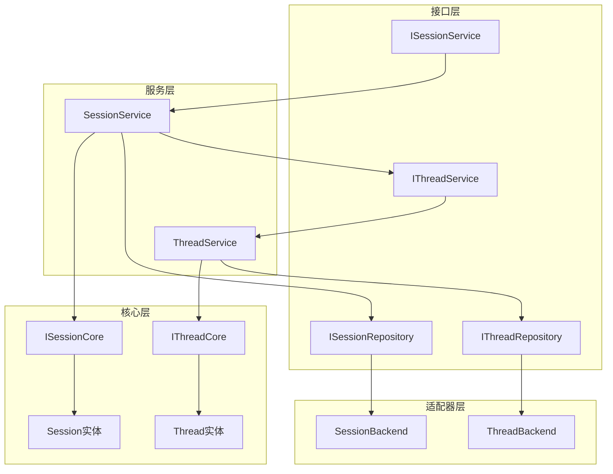
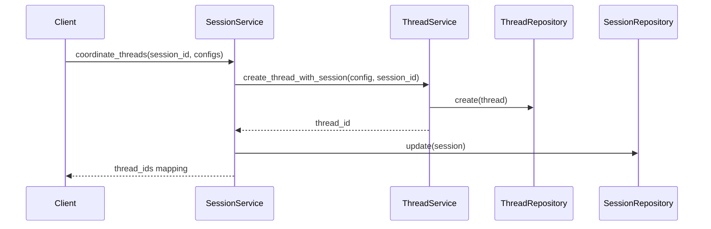
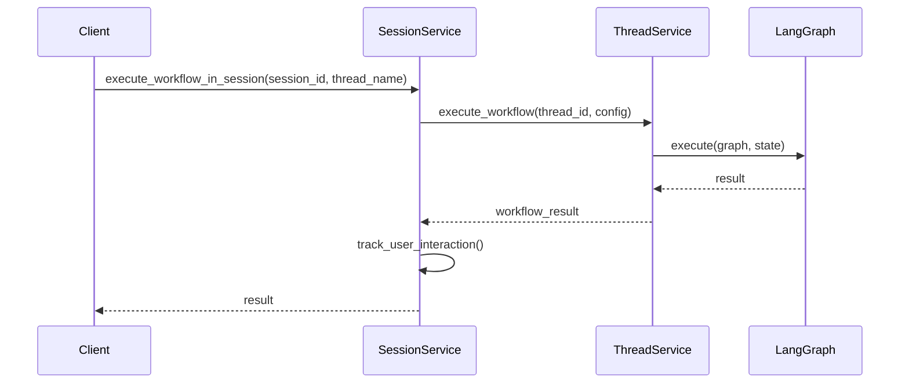

# Threads与Sessions关系架构分析报告

## 概述

本文档深入分析了当前项目中Threads（线程）与Sessions（会话）的关系设计，评估其架构合理性，识别潜在问题并提出改进建议。

## 1. 当前架构概览

### 1.1 架构层次结构

项目采用扁平化架构设计，Threads和Sessions分布在以下层次：

```
src/
├── interfaces/           # 接口层
│   ├── threads/         # 线程接口定义
│   └── sessions/        # 会话接口定义
├── core/                # 核心层
│   ├── threads/         # 线程核心实体和接口
│   └── sessions/        # 会话核心实体和接口
├── services/            # 服务层
│   ├── threads/         # 线程业务服务
│   └── session/         # 会话业务服务
└── adapters/            # 适配器层
    └── storage/         # 存储适配器
```

### 1.2 核心组件关系



## 2. Threads与Sessions关系分析

### 2.1 关系类型

Threads与Sessions之间是**一对多**的关联关系：

- **一个Session可以包含多个Thread**
- **一个Thread只能属于一个Session**
- **Session作为Thread的容器和协调者**

### 2.2 关系实现机制

#### 2.2.1 数据层面关联

```python
# Session实体中的Thread关联
class SessionEntity:
    session_id: str
    thread_ids: List[str] = field(default_factory=list)  # 关联的Thread ID列表
    
    def add_thread(self, thread_id: str) -> None:
        if thread_id not in self.thread_ids:
            self.thread_ids.append(thread_id)
            self.updated_at = datetime.now()
```

```python
# Thread实体中的Session关联
class Thread:
    id: str
    config: Dict[str, Any] = Field(default_factory=dict)
    
    # Thread通过config中的session_id字段关联到Session
    # config["session_id"] = session_id
```

#### 2.2.2 服务层面协调

```python
# SessionService协调Thread创建
async def coordinate_threads(self, session_id: str, thread_configs: List[Dict[str, Any]]) -> Dict[str, str]:
    thread_ids = {}
    for thread_config in thread_configs:
        # 委托ThreadService创建Thread
        thread_id = await self._thread_service.create_thread_with_session(
            thread_config, session_id
        )
        thread_ids[thread_config["name"]] = thread_id
        
        # 更新Session的thread_ids列表
        session_context.thread_ids.append(thread_id)
    
    return thread_ids
```

### 2.3 职责划分

#### 2.3.1 Session职责
- **用户交互追踪**：记录用户请求、反馈和系统响应
- **多线程协调**：管理和协调多个Thread的执行
- **会话生命周期管理**：创建、更新、删除会话
- **上下文维护**：维护会话级别的状态和元数据
- **历史记录**：保存会话历史和交互记录

#### 2.3.2 Thread职责
- **工作流执行**：执行具体的工作流任务
- **状态管理**：管理工作流执行状态
- **分支管理**：支持Thread分支和快照
- **检查点管理**：保存和恢复执行检查点
- **与LangGraph交互**：作为LangGraph的执行容器

## 3. 数据模型分析

### 3.1 Session数据模型

```python
@dataclass
class SessionEntity:
    session_id: str
    user_id: Optional[str] = None
    thread_ids: List[str] = field(default_factory=list)  # 关联Thread
    status: str = "active"
    created_at: datetime = field(default_factory=datetime.now)
    updated_at: datetime = field(default_factory=datetime.now)
    metadata: Dict[str, Any] = field(default_factory=dict)
```

**特点**：
- 通过`thread_ids`列表维护与Thread的关联
- 元数据中存储交互历史
- 支持用户级别的会话管理

### 3.2 Thread数据模型

```python
class Thread(BaseModel):
    id: str
    status: ThreadStatus = Field(default=ThreadStatus.ACTIVE)
    type: ThreadType = Field(default=ThreadType.MAIN)
    
    # 关联关系
    graph_id: Optional[str] = Field(None)
    parent_thread_id: Optional[str] = Field(None)
    source_checkpoint_id: Optional[str] = Field(None)
    
    # 配置中包含session_id
    config: Dict[str, Any] = Field(default_factory=dict)
    
    # 统计信息
    message_count: int = Field(default=0)
    checkpoint_count: int = Field(default=0)
    branch_count: int = Field(default=0)
```

**特点**：
- 通过`config["session_id"]`关联到Session
- 支持复杂的分支和快照关系
- 丰富的状态管理和统计信息

## 4. 接口设计分析

### 4.1 ThreadService接口

```python
class IThreadService(ABC):
    # 基础线程管理
    async def create_thread_with_session(self, thread_config: Dict[str, Any], session_id: Optional[str] = None) -> str
    async def get_thread_info(self, thread_id: str) -> Optional[Dict[str, Any]]
    
    # 工作流执行
    async def execute_workflow(self, thread_id: str, config: Optional[Dict[str, Any]] = None) -> WorkflowState
    async def stream_workflow(self, thread_id: str, config: Optional[Dict[str, Any]] = None) -> AsyncGenerator
    
    # 分支和快照管理
    async def fork_thread_from_checkpoint(self, source_thread_id: str, checkpoint_id: str, branch_name: str) -> str
    async def create_snapshot(self, thread_id: str, snapshot_name: str) -> str
```

### 4.2 SessionService接口

```python
class ISessionService(ABC):
    # 会话生命周期管理
    async def create_session(self, user_request: UserRequest) -> str
    async def get_session_context(self, session_id: str) -> Optional[SessionContext]
    
    # 用户交互管理
    async def track_user_interaction(self, session_id: str, interaction: UserInteraction) -> None
    async def get_interaction_history(self, session_id: str) -> List[UserInteraction]
    
    # 多线程协调
    async def coordinate_threads(self, session_id: str, thread_configs: List[Dict[str, Any]]) -> Dict[str, str]
    async def execute_workflow_in_session(self, session_id: str, thread_name: str) -> WorkflowState
```

## 5. 实现逻辑分析

### 5.1 Thread创建流程



### 5.2 工作流执行流程



## 6. 配置关系分析

### 6.1 应用级配置

```yaml
# configs/application.yaml
components:
  sessions:
    storage_type: "file"
    storage_path: "sessions"
    auto_save: true
```

### 6.2 全局配置

```yaml
# configs/global.yaml
checkpoint:
  enabled: true
  storage_type: "sqlite"
  auto_save: true
  save_interval: 5
```

### 6.3 工作流配置

```yaml
# configs/workflows/react_workflow.yaml
workflow_name: "react_workflow"
description: "ReAct模式工作流，支持思考-行动-观察循环"
max_iterations: 20
timeout: 600
```

## 7. 设计合理性评估

### 7.1 优点

#### 7.1.1 职责分离清晰
- **Session专注用户交互**：负责用户请求追踪、交互历史管理
- **Thread专注执行**：负责工作流执行、状态管理、分支处理
- **协调机制明确**：Session作为协调者，Thread作为执行者

#### 7.1.2 架构层次合理
- **接口层统一**：集中化的接口定义，便于维护和扩展
- **核心层稳定**：核心实体和接口保持稳定
- **服务层灵活**：业务逻辑可以根据需求变化
- **适配器层可扩展**：支持多种存储后端

#### 7.1.3 数据关系简洁
- **松耦合设计**：Thread通过配置关联Session，避免强依赖
- **双向导航**：Session可以找到所有Thread，Thread可以找到所属Session
- **状态一致性**：通过Repository模式保证数据一致性

#### 7.1.4 扩展性良好
- **多存储后端**：支持SQLite、文件等多种存储方式
- **分支和快照**：Thread支持复杂的分支管理
- **流式执行**：支持工作流的流式执行

### 7.2 存在的问题

#### 7.2.1 数据一致性问题

**问题描述**：
- Session的`thread_ids`列表与Thread的`config["session_id"]`可能出现不一致
- 缺乏事务性保证，可能导致数据不同步

**影响**：
- 可能导致孤儿Thread（没有对应Session）
- 可能导致Session统计信息不准确

#### 7.2.2 循环依赖风险

**问题描述**：
```python
# ThreadService依赖SessionService
class ThreadService:
    def __init__(self, session_service: Optional[ISessionService] = None)

# SessionService依赖ThreadService  
class SessionService:
    def __init__(self, thread_service: IThreadService)
```

**影响**：
- 增加了系统复杂性
- 可能导致循环初始化问题

#### 7.2.3 接口职责重叠

**问题描述**：
- SessionService提供了工作流执行方法（`execute_workflow_in_session`）
- ThreadService也提供了工作流执行方法（`execute_workflow`）
- 两个接口的功能存在重叠

**影响**：
- 增加了API复杂性
- 可能导致用户困惑

#### 7.2.4 配置管理分散

**问题描述**：
- Thread与Session的关联信息存储在Thread的config中
- Session的thread_ids列表需要手动维护
- 配置信息分散在多个地方

**影响**：
- 增加了维护复杂性
- 容易出现数据不一致

#### 7.2.5 错误处理不完善

**问题描述**：
- Thread创建失败时，Session的thread_ids可能已经更新
- 缺乏回滚机制
- 错误传播路径不清晰

## 8. 改进建议

### 8.1 数据一致性改进

#### 8.1.1 引入事务管理

```python
class SessionThreadTransaction:
    """Session-Thread事务管理器"""
    
    async def create_thread_with_session(
        self, 
        session_id: str, 
        thread_config: Dict[str, Any]
    ) -> str:
        """原子性地创建Thread并更新Session"""
        async with self.transaction():
            # 1. 创建Thread
            thread_id = await self.thread_service.create_thread(thread_config)
            
            # 2. 更新Session
            await self.session_service.add_thread_to_session(session_id, thread_id)
            
            # 3. 如果任何步骤失败，自动回滚
            return thread_id
```

#### 8.1.2 数据同步机制

```python
class SessionThreadSynchronizer:
    """Session-Thread数据同步器"""
    
    async def sync_session_threads(self, session_id: str) -> None:
        """同步Session的thread_ids列表"""
        # 1. 获取Session中记录的thread_ids
        session = await self.session_repository.get(session_id)
        recorded_thread_ids = session.thread_ids
        
        # 2. 查询实际关联的Thread
        actual_threads = await self.thread_repository.list_by_session(session_id)
        actual_thread_ids = [thread.id for thread in actual_threads]
        
        # 3. 同步差异
        if recorded_thread_ids != actual_thread_ids:
            session.thread_ids = actual_thread_ids
            await self.session_repository.update(session)
```

### 8.2 架构重构建议

#### 8.2.1 引入协调器模式

```python
class SessionThreadCoordinator:
    """Session-Thread协调器"""
    
    def __init__(
        self,
        session_service: ISessionService,
        thread_service: IThreadService,
        transaction_manager: SessionThreadTransaction
    ):
        self.session_service = session_service
        self.thread_service = thread_service
        self.transaction_manager = transaction_manager
    
    async def coordinate_threads(
        self, 
        session_id: str, 
        thread_configs: List[Dict[str, Any]]
    ) -> Dict[str, str]:
        """协调Thread创建，保证数据一致性"""
        return await self.transaction_manager.execute(
            self._do_coordinate_threads, session_id, thread_configs
        )
```

#### 8.2.2 解耦循环依赖

```python
# 方案1：使用事件系统
class ThreadService:
    def __init__(self, event_bus: EventBus):
        self.event_bus = event_bus
    
    async def create_thread(self, config: Dict[str, Any]) -> str:
        thread_id = await self._create_thread_impl(config)
        # 发布事件而不是直接调用SessionService
        await self.event_bus.publish(ThreadCreatedEvent(thread_id, config))

class SessionService:
    def __init__(self, event_bus: EventBus):
        self.event_bus = event_bus
        # 订阅Thread创建事件
        event_bus.subscribe(ThreadCreatedEvent, self._handle_thread_created)

# 方案2：使用依赖注入容器延迟解析
class ThreadService:
    def __init__(self, container: Container):
        self.container = container
        self._session_service = None  # 延迟解析
    
    @property
    def session_service(self) -> ISessionService:
        if self._session_service is None:
            self._session_service = self.container.get(ISessionService)
        return self._session_service
```

### 8.3 接口优化建议

#### 8.3.1 统一工作流执行接口

```python
class IWorkflowExecutor(ABC):
    """统一的工作流执行接口"""
    
    @abstractmethod
    async def execute(
        self, 
        context: ExecutionContext,
        config: Optional[Dict[str, Any]] = None
    ) -> WorkflowState:
        pass

class ExecutionContext:
    """执行上下文"""
    def __init__(
        self,
        thread_id: Optional[str] = None,
        session_id: Optional[str] = None,
        thread_name: Optional[str] = None
    ):
        self.thread_id = thread_id
        self.session_id = session_id
        self.thread_name = thread_name
```

#### 8.3.2 简化SessionService接口

```python
class ISessionService(ABC):
    """简化的会话服务接口"""
    
    # 专注于会话管理
    async def create_session(self, user_request: UserRequest) -> str
    async def get_session_context(self, session_id: str) -> Optional[SessionContext]
    async def delete_session(self, session_id: str) -> bool
    
    # 专注于交互管理
    async def track_user_interaction(self, session_id: str, interaction: UserInteraction) -> None
    async def get_interaction_history(self, session_id: str) -> List[UserInteraction]
    
    # 移除工作流执行相关方法，委托给协调器
```

### 8.4 配置管理改进

#### 8.4.1 集中化关联管理

```python
class SessionThreadAssociation:
    """Session-Thread关联管理"""
    
    def __init__(self, session_id: str, thread_id: str, thread_name: str):
        self.session_id = session_id
        self.thread_id = thread_id
        self.thread_name = thread_name
        self.created_at = datetime.now()
        self.metadata = {}

class ISessionThreadRepository(ABC):
    """Session-Thread关联仓储"""
    
    async def create_association(self, association: SessionThreadAssociation) -> bool
    async def get_associations_by_session(self, session_id: str) -> List[SessionThreadAssociation]
    async def get_association_by_thread(self, thread_id: str) -> Optional[SessionThreadAssociation]
    async def delete_association(self, session_id: str, thread_id: str) -> bool
```

#### 8.4.2 配置验证机制

```python
class SessionThreadConfigValidator:
    """Session-Thread配置验证器"""
    
    async def validate_thread_creation(
        self, 
        session_id: str, 
        thread_config: Dict[str, Any]
    ) -> ValidationResult:
        """验证Thread创建配置"""
        # 1. 验证Session存在
        # 2. 验证Thread配置格式
        # 3. 验证权限和限制
        # 4. 返回验证结果
```

### 8.5 错误处理改进

#### 8.5.1 统一异常处理

```python
class SessionThreadException(Exception):
    """Session-Thread相关异常基类"""
    pass

class ThreadCreationError(SessionThreadException):
    """Thread创建失败"""
    def __init__(self, session_id: str, thread_config: Dict[str, Any], cause: Exception):
        self.session_id = session_id
        self.thread_config = thread_config
        self.cause = cause
        super().__init__(f"Failed to create thread for session {session_id}: {cause}")

class SessionThreadInconsistencyError(SessionThreadException):
    """Session-Thread数据不一致"""
    def __init__(self, session_id: str, details: str):
        self.session_id = session_id
        self.details = details
        super().__init__(f"Session-Thread inconsistency in {session_id}: {details}")
```

#### 8.5.2 重试和恢复机制

```python
class SessionThreadRetryPolicy:
    """Session-Thread操作重试策略"""
    
    async def execute_with_retry(
        self, 
        operation: Callable, 
        max_retries: int = 3,
        backoff_factor: float = 1.0
    ):
        """带重试的操作执行"""
        for attempt in range(max_retries + 1):
            try:
                return await operation()
            except SessionThreadException as e:
                if attempt == max_retries:
                    raise
                await asyncio.sleep(backoff_factor * (2 ** attempt))
```

## 9. 实施路线图

### 9.1 短期改进（1-2周）

1. **数据一致性修复**
   - 实现SessionThreadSynchronizer
   - 添加数据一致性检查
   - 修复现有的数据不一致问题

2. **错误处理改进**
   - 统一异常类型定义
   - 添加重试机制
   - 改进错误日志

### 9.2 中期重构（3-4周）

1. **架构重构**
   - 引入SessionThreadCoordinator
   - 解耦循环依赖
   - 实现事务管理

2. **接口优化**
   - 统一工作流执行接口
   - 简化SessionService接口
   - 添加配置验证

### 9.3 长期优化（5-8周）

1. **性能优化**
   - 实现缓存机制
   - 优化查询性能
   - 添加监控指标

2. **功能扩展**
   - 支持Session模板
   - 添加Thread调度功能
   - 实现智能负载均衡

## 10. 总结

### 10.1 当前设计评估

当前的Threads与Sessions关系设计**整体合理**，具有以下特点：

**优势**：
- 职责分离清晰，Session专注用户交互，Thread专注执行
- 架构层次合理，符合扁平化架构原则
- 扩展性良好，支持多种存储后端和复杂功能
- 接口设计相对完整，覆盖了主要使用场景

**不足**：
- 数据一致性保证不足
- 存在循环依赖风险
- 接口职责有重叠
- 配置管理分散

### 10.2 改进优先级

1. **高优先级**：数据一致性修复、错误处理改进
2. **中优先级**：架构重构、接口优化
3. **低优先级**：性能优化、功能扩展

### 10.3 最终建议

建议按照**渐进式改进**的策略，优先解决数据一致性和错误处理问题，然后逐步进行架构重构。这样可以在保证系统稳定性的前提下，持续改进架构质量。

当前的Threads与Sessions关系设计为系统的进一步发展奠定了良好的基础，通过适当的改进，可以构建一个更加健壮、可维护和可扩展的架构。