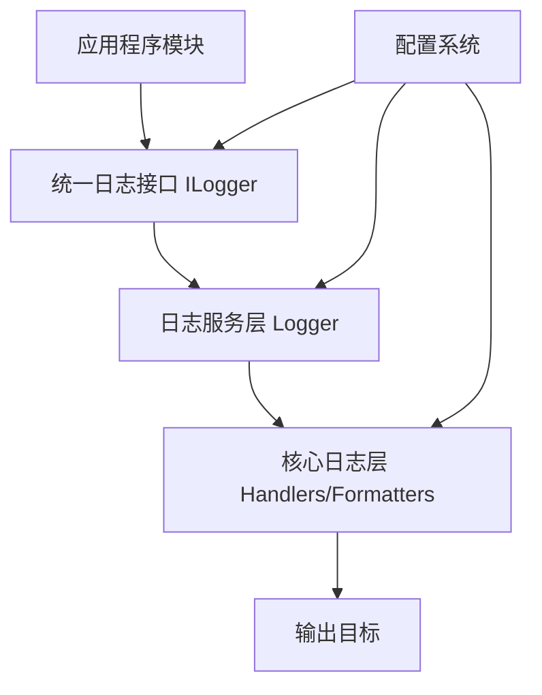

# 统一日志系统使用分析报告

## 概述

本报告分析了当前项目中各模块的日志记录使用情况，并提出了统一使用 `src\core\logger` 目录的完整方案。

## 1. 当前日志系统使用情况分析

### 1.1 日志使用模式统计

通过代码分析，发现项目中存在三种主要的日志使用模式：

**模式1：标准Python logging模块（主要模式）**
- 使用方式：`import logging; logger = logging.getLogger(__name__)`
- 覆盖范围：约80%的模块
- 示例模块：`src/services/workflow/`, `src/services/llm/`, `src/core/workflow/`

**模式2：自定义日志系统（次要模式）**
- 使用方式：`from ...services.logger import get_logger; logger = get_logger(__name__)`
- 覆盖范围：约15%的模块
- 示例模块：`src/services/prompts/registry.py`

**模式3：依赖注入方式（新兴模式）**
- 使用方式：通过 `ILogger` 接口注入
- 覆盖范围：约5%的模块
- 示例模块：`src/services/tools/validation/validators/base_validator.py`

### 1.2 主要问题识别

1. **不一致的日志实现**：项目同时存在标准Python logging和自定义日志系统
2. **配置分散**：日志配置分散在各个模块，缺乏统一管理
3. **功能利用不足**：自定义日志系统的丰富功能（脱敏、格式化、多处理器等）未被充分利用
4. **依赖注入不一致**：部分模块使用依赖注入获取日志器，部分直接导入

## 2. 统一日志使用方案设计

### 2.1 统一架构原则



### 2.2 统一使用模式

**推荐模式1：依赖注入（首选）**
```python
from src.interfaces import ILogger

class MyService:
    def __init__(self, logger: ILogger):
        self.logger = logger
        
    def my_method(self):
        self.logger.info("执行操作")
```

**推荐模式2：直接获取（简单模块）**
```python
from src.services.logger import get_logger

logger = get_logger(__name__)

class MyService:
    def my_method(self):
        logger.info("执行操作")
```

### 2.3 配置统一管理

所有日志配置通过 `configs/global.yaml` 统一管理：

```yaml
log_level: "DEBUG"
log_outputs:
  - type: "console"
    level: "DEBUG"
    format: "text"
  - type: "file"
    level: "DEBUG"
    format: "json"
    path: "logs/agent.log"
    rotation: "daily"
    max_size: "10MB"
```

## 3. 迁移计划和实施策略

### 3.1 迁移计划概述

**目标**：将项目中所有使用标准Python logging的模块统一迁移到自定义日志系统

**迁移策略**：分阶段、模块化迁移，确保不影响现有功能

### 3.2 实施策略

#### 阶段1：基础设施准备
1. 增强自定义日志系统的兼容性
2. 创建迁移工具和验证脚本
3. 更新配置系统以支持混合模式

#### 阶段2：核心模块迁移
1. 优先迁移服务层核心模块
2. 确保依赖注入容器正确配置
3. 验证日志功能完整性

#### 阶段3：适配器层迁移
1. 迁移TUI、API等适配器模块
2. 确保外部接口兼容性
3. 性能测试和优化

#### 阶段4：全面验证
1. 功能回归测试
2. 性能基准测试
3. 文档更新和培训

### 3.3 风险控制

- **向后兼容**：保持现有日志接口的兼容性
- **渐进迁移**：分批次迁移，避免大规模中断
- **监控机制**：实施迁移过程中的监控和回滚机制

## 4. 详细实施步骤

### 4.1 基础设施增强

1. **扩展自定义日志系统兼容性**
   - 添加对标准Python logging模块的兼容层
   - 创建日志桥接器，支持混合模式运行
   - 增强配置系统的环境变量支持

2. **创建迁移工具**
   - 开发自动检测脚本，识别使用标准logging的模块
   - 创建批量迁移工具，自动化代码替换
   - 开发验证脚本，检查迁移后的功能完整性

### 4.2 核心模块迁移（优先级顺序）

1. **服务层模块迁移**
   - `src/services/workflow/` - 工作流相关服务
   - `src/services/llm/` - LLM相关服务  
   - `src/services/tools/` - 工具相关服务
   - `src/services/sessions/` - 会话管理服务

2. **核心层模块迁移**
   - `src/core/workflow/` - 工作流核心
   - `src/core/llm/` - LLM核心
   - `src/core/tools/` - 工具核心
   - `src/core/config/` - 配置核心

3. **适配器层迁移**
   - `src/adapters/tui/` - TUI界面
   - `src/adapters/api/` - API接口
   - `src/adapters/cli/` - CLI工具

### 4.3 配置统一管理

1. **更新全局配置**
   - 统一日志级别和输出配置
   - 配置敏感信息脱敏规则
   - 设置性能优化参数

2. **环境特定配置**
   - 开发环境：详细调试日志
   - 测试环境：结构化日志
   - 生产环境：性能优化日志

### 4.4 测试和验证

1. **功能测试**
   - 单元测试：确保每个迁移模块的功能正确性
   - 集成测试：验证模块间的日志交互
   - 端到端测试：完整工作流的日志记录

2. **性能测试**
   - 日志性能基准测试
   - 内存使用监控
   - 并发压力测试

## 5. 风险评估和应对措施

| 风险类型 | 影响程度 | 应对措施 |
|---------|---------|---------|
| 功能回归 | 高 | 完善的测试套件，分阶段迁移 |
| 性能下降 | 中 | 性能基准测试，优化配置 |
| 配置错误 | 中 | 配置验证工具，详细文档 |
| 兼容性问题 | 低 | 向后兼容设计，渐进迁移 |

## 6. 成功指标

1. **功能完整性**：所有迁移模块日志功能正常
2. **性能达标**：日志系统性能不低于原有水平  
3. **配置统一**：所有模块使用统一配置管理
4. **文档完善**：完整的迁移和使用文档

## 7. 结论

通过统一使用 `src\core\logger` 目录，项目可以实现：

- **配置统一管理**：所有日志配置集中管理
- **功能增强**：充分利用自定义日志系统的丰富功能
- **维护简化**：减少代码重复和配置分散
- **性能优化**：统一的性能调优和监控

建议按照本报告提出的迁移计划逐步实施，确保项目平稳过渡到统一的日志系统。