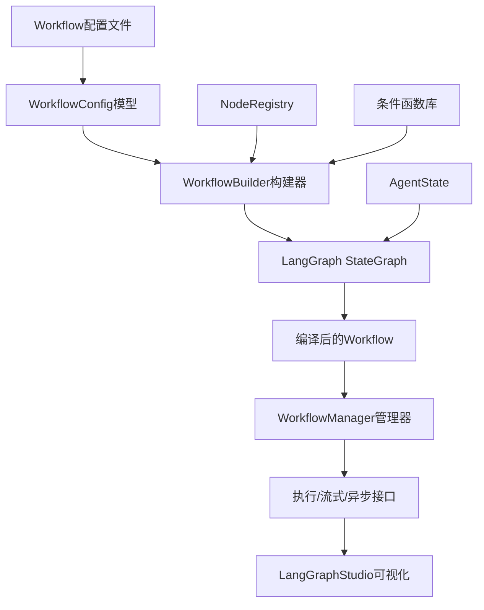

# 当前项目中Workflow与LangGraph图关系分析报告

## 1. 当前架构设计概述

基于对代码的深入分析，当前项目的workflow系统采用了**配置驱动**的LangGraph集成架构，具有以下核心组件：

### 核心架构层次
```
配置文件层 (YAML) → 配置模型层 → 工作流构建层 → LangGraph执行层 → 可视化层
```

### 主要组件关系


## 2. LangGraph集成合理性评估

### ✅ 设计优势
1. **配置驱动架构**：通过YAML配置文件定义工作流，支持热重载和动态修改
2. **模块化节点系统**：基于注册表的节点管理，支持自定义节点扩展
3. **完整的生命周期管理**：WorkflowManager提供加载、执行、监控、卸载全流程管理
4. **多模式执行支持**：同步、异步、流式三种执行模式
5. **可视化集成**：内置LangGraph Studio集成，支持工作流可视化调试
6. **条件边支持**：内置丰富的条件判断函数，支持复杂流程控制

### ⚠️ 存在的问题

#### 架构层面问题
1. **依赖关系混乱**：`src/domain/prompts/langgraph_integration.py`与主工作流系统存在重复功能
2. **状态管理不一致**：AgentState定义在prompts模块，但workflow系统重度依赖
3. **节点执行逻辑复杂**：`create_node_function`中的闭包设计可能导致状态管理问题

#### 代码质量问题
1. **类型注解不完整**：多处使用`Any`类型，缺乏精确的类型定义
2. **错误处理不统一**：不同模块的错误处理策略不一致
3. **配置验证薄弱**：节点配置的运行时验证不够完善

#### 功能完整性问题
1. **实际节点实现缺失**：配置中定义的节点类型（如`analysis_node`, `tool_node`）缺乏具体实现
2. **工具集成不完整**：工具调用与工作流集成需要进一步完善
3. **性能优化不足**：缺乏工作流执行性能监控和优化机制

## 3. 具体设计问题识别

### 3.1 架构设计问题
```python
# 问题：重复的工作流创建逻辑
# src/domain/prompts/langgraph_integration.py 与 src/application/workflow/builder.py 功能重叠

def create_agent_workflow():  # 简单固定的工作流
def build_workflow():         # 配置驱动的工作流
```

### 3.2 状态管理问题
```python
# 问题：AgentState定义在prompts模块，但被workflow系统重度依赖
# src/domain/prompts/agent_state.py 应该移动到更合适的位置
```

### 3.3 节点执行问题
```python
# 问题：复杂的闭包设计可能导致状态管理问题
def create_node_function(node, current_node_name, current_node_config):
    def node_function(state: AgentState) -> Dict[str, Any]:
        # 闭包中引用外部变量，可能产生意外行为
```

## 4. 改进建议

### 4.1 架构重构建议

#### 建议1：统一工作流创建接口
```python
# 合并两个工作流创建系统，提供统一的接口
class UnifiedWorkflowFactory:
    def create_from_config(config: WorkflowConfig) -> Workflow
    def create_simple(prompt_injector, llm_client) -> Workflow
    def create_react() -> Workflow
    def create_plan_execute() -> Workflow
```

#### 建议2：重构状态管理
```python
# 将AgentState移动到domain/workflow目录
# src/domain/workflow/state.py
@dataclass
class WorkflowState:
    # 明确的工作流状态定义
    messages: List[BaseMessage]
    tool_results: List[ToolResult]
    current_step: str
    metadata: Dict[str, Any]
```

#### 建议3：简化节点执行
```python
# 使用类替代闭包，提高可测试性和可维护性
class NodeExecutor:
    def __init__(self, node: BaseNode, config: Dict[str, Any]):
        self.node = node
        self.config = config
    
    def execute(self, state: WorkflowState) -> Dict[str, Any]:
        result = self.node.execute(state, self.config)
        return self._format_result(result)
```

### 4.2 功能增强建议

#### 建议4：完善节点生态系统
```python
# 实现核心节点类型
@node("llm_node")
class LLMNode(BaseNode):
    # LLM调用节点实现

@node("tool_node")  
class ToolNode(BaseNode):
    # 工具执行节点实现

@node("condition_node")
class ConditionNode(BaseNode):
    # 条件判断节点实现
```

#### 建议5：增强监控和调试
```python
# 添加工作流执行监控
class WorkflowMonitor:
    def record_node_execution(node_name, duration, success)
    def get_performance_metrics() -> Dict[str, Any]
    def generate_execution_report() -> str
```

### 4.3 配置系统优化

#### 建议6：增强配置验证
```python
# 使用Pydantic进行强类型配置验证
class WorkflowConfig(BaseModel):
    name: str
    nodes: Dict[str, NodeConfig]
    edges: List[EdgeConfig]
    
    @validator('nodes')
    def validate_nodes(cls, v):
        # 验证节点配置的完整性
```

## 5. 实施路线图

### 阶段1：架构整理（高优先级）
- 统一工作流创建接口
- 重构状态管理系统
- 完善类型注解

### 阶段2：功能完善（中优先级）  
- 实现核心节点类型
- 增强配置验证
- 完善错误处理

### 阶段3：性能优化（低优先级）
- 添加性能监控
- 优化执行效率
- 增强可视化功能

## 6. 结论

当前项目的workflow与LangGraph集成**整体设计合理**，具备了配置驱动、模块化、可视化的现代工作流系统特征。主要问题集中在**架构一致性**和**功能完整性**方面。

通过实施上述改进建议，可以显著提升系统的：
- **架构清晰度**：统一的接口和明确的责任划分
- **可维护性**：更好的类型安全和错误处理
- **可扩展性**：完善的节点生态系统和配置验证
- **用户体验**：强大的监控和调试功能

建议按照实施路线图分阶段进行改进，优先解决架构层面的核心问题。