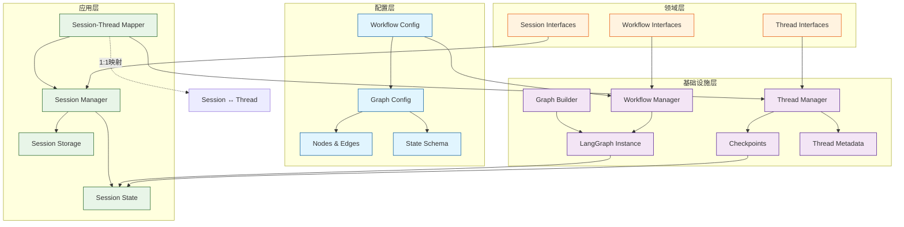

# Workflow、Thread、Session与Graph关系分析

## 概述

本文档详细分析Modular Agent Framework中Workflow、Thread、Session和Graph四个核心组件的架构关系、职责分工、交互流程以及优化建议。

## 当前架构关系

### 1. 组件职责划分

#### Workflow (工作流配置)
- **位置**: `src/infrastructure/graph/config.py`
- **职责**: 静态YAML配置定义，包含节点(nodes)、边(edges)、状态模式(state_schema)
- **接口**: `WorkflowConfig`、`GraphConfig`
- **作用**: 工作流的模板定义和配置管理

#### Graph (执行引擎)
- **位置**: `src/infrastructure/graph/`
- **职责**: LangGraph实例，实际的工作流执行引擎
- **接口**: `GraphBuilder`、`AsyncExecutor`
- **作用**: 提供invoke()、ainvoke()、stream()等执行方法

#### Session (会话实例)
- **位置**: `src/application/sessions/manager.py`
- **职责**: 工作流的执行实例，包含运行时状态和持久化
- **接口**: `ISessionManager`、`SessionManager`
- **作用**: 会话生命周期管理、状态序列化/反序列化

#### Thread (状态管理)
- **位置**: `src/domain/threads/manager.py`
- **职责**: 状态管理和分支支持
- **接口**: `IThreadManager`、`ThreadManager`
- **作用**: checkpoints管理、分支(fork)、快照(snapshot)

### 2. 依赖关系分析



### 3. 核心交互流程

#### 会话创建流程
```python
# SessionManager.create_session()
1. workflow_config_path → WorkflowManager.load_workflow() → workflow_id
2. WorkflowManager.create_workflow(workflow_id) → workflow实例
3. 从config_path提取graph_id → ThreadManager.create_thread(graph_id)
4. SessionThreadMapper建立session_id ↔ thread_id映射
5. 初始化AgentState → 保存到Session存储和Thread checkpoints
```

#### 会话恢复流程
```python
# SessionManager.restore_session()
1. 从Session存储加载session_data
2. 根据workflow_config_path重新加载workflow
3. 从Thread checkpoints恢复最新状态
4. 反序列化AgentState
5. 返回workflow实例和状态
```

#### 工作流执行流程
```python
# WorkflowManager.run_workflow()
1. 获取workflow实例
2. 准备initial_state (AgentState)
3. 调用graph.invoke(state)执行
4. ThreadManager更新checkpoints
5. SessionManager保存执行结果
```

#### 线程分支流程
```python
# ThreadManager.fork_thread()
1. 从源thread的checkpoint创建新thread
2. 复制状态数据
3. SessionThreadMapper创建新的session-thread映射
4. 新session基于分支状态初始化
```

## 主要问题分析

### 1. 组件耦合过度

**问题**: Session、Thread、Workflow和Graph之间的职责边界不清，导致循环依赖。

**表现**:
- SessionManager直接依赖WorkflowManager的具体实现
- ThreadManager的graph_id从workflow_config_path提取，耦合了配置逻辑
- Graph执行状态同时保存到Session和Thread，造成数据重复

**影响**: 难以独立测试和维护各组件，架构扩展性差。

### 2. 状态管理复杂

**问题**: AgentState在Session、Thread、Graph之间传递，序列化/反序列化逻辑分散。

**表现**:
```python
# SessionManager中有完整的状态序列化逻辑
def _serialize_state(self, state: AgentState) -> dict[str, Any]:
    # 复杂的状态转换逻辑...

# ThreadManager中也有状态处理
def update_thread_state(self, thread_id: str, state: Dict[str, Any]) -> bool:
    # 状态保存到checkpoints...
```

**风险**: 状态格式变更时需要多处修改，容易出错。

### 3. 映射关系维护困难

**问题**: SessionThreadMapper维护session_id ↔ thread_id的映射，但缺乏事务一致性保证。

**表现**:
```python
# SessionThreadMapper中
async def create_session_with_thread(self, ...):
    # 创建session
    session_id = self.session_manager.create_session(...)
    # 创建thread
    thread_id = await self.thread_manager.create_thread(...)
    # 建立映射
    self._mappings[session_id] = thread_id
```

**风险**: 如果thread创建失败，session已创建但无映射；删除时可能只删除映射，不清理实际数据。

### 4. 恢复机制脆弱

**问题**: 会话恢复依赖多层组件协同，任何一个环节失败都会导致恢复失败。

**表现**:
- 依赖workflow_config_path存在
- 依赖WorkflowManager能重新加载workflow
- 依赖Thread checkpoints完整
- 依赖Session存储数据一致

**影响**: 系统重启或配置变更后恢复失败率高。

## 架构改进建议

### 1. 职责边界重构（推荐方案）

**解决方案**: 将Session提升为工作单元容器，管理多个线程执行

**重构后的职责**:
- **Session**: 工作单元容器，管理多个线程的协调和生命周期
- **Thread**: 执行单元，负责单个工作流的执行和状态版本管理
- **Workflow**: 纯配置管理，不涉及执行状态
- **Graph**: 纯执行引擎，接收状态，输出状态

```python
class ISessionManager(ABC):
    """Session管理器接口"""
    
    async def create_multi_thread_session(
        self,
        workflow_configs: Dict[str, str],  # 线程名 -> 工作流配置
        thread_dependencies: Dict[str, List[str]]  # 线程依赖关系
    ) -> str:
        """创建多线程会话"""
        pass
    
    async def add_thread_to_session(
        self,
        session_id: str,
        thread_name: str,
        workflow_config: str
    ) -> bool:
        """向会话添加新线程"""
        pass
    
    async def get_session_threads(self, session_id: str) -> Dict[str, Any]:
        """获取会话的所有线程信息"""
        pass
    
    async def coordinate_threads(self, session_id: str) -> bool:
        """协调会话中的多个线程"""
        pass
```

### 2. 状态管理统一

**解决方案**:
- 创建统一的StateManager负责所有状态序列化/反序列化
- 定义标准的状态接口，减少各组件的状态处理逻辑

**统一状态接口**:
```python
class IStateManager(ABC):
    def serialize_state(self, state: AgentState) -> bytes:
        """序列化状态"""
        pass

    def deserialize_state(self, data: bytes) -> AgentState:
        """反序列化状态"""
        pass

    def validate_state(self, state: AgentState) -> bool:
        """验证状态完整性"""
        pass
```

### 3. 事务性操作管理

**解决方案**:
- 实现事务性操作，保证数据一致性
- 失败时自动回滚，避免数据不一致

**改进的事务管理**:
```python
class TransactionalSessionManager:
    async def create_session_with_threads(self, ...):
        async with self._transaction():
            try:
                # 原子性创建session和threads
                session_id = await self.create_session(...)
                for thread_config in thread_configs:
                    thread_id = await self.create_thread(...)
                    await self._link_thread_to_session(session_id, thread_id)
                await self._transaction.commit()
                return session_id
            except Exception:
                await self._transaction.rollback()
                raise
```

### 4. 健壮的恢复机制

**解决方案**:
- 实现渐进式恢复策略
- 多级fallback机制
- 恢复失败时的 graceful degradation

**恢复策略层次**:
```python
def restore_session(self, session_id: str):
    # 策略1: 完整恢复 (workflow + thread + state)
    try:
        return self._restore_full_context(session_id)
    except Exception:
        pass

    # 策略2: 状态恢复 (仅state，无workflow)
    try:
        return self._restore_state_only(session_id)
    except Exception:
        pass

    # 策略3: 基础恢复 (创建新实例)
    return self._restore_basic_context(session_id)
```

## 依赖关系优化

### 当前依赖关系
```
SessionManager → WorkflowManager → Graph Builder
SessionManager → ThreadManager → CheckpointManager
SessionThreadMapper → SessionManager + ThreadManager
WorkflowManager → NodeRegistry → Graph Components
```

### 优化后依赖关系
```
EnhancedSessionManager → IWorkflowManager (接口依赖)
EnhancedSessionManager → IStateManager (统一状态管理)
EnhancedSessionManager → IThreadManager (线程管理)
WorkflowManager → IGraphBuilder (执行引擎)
```

## 实施计划

### 阶段1：接口设计和基础重构（2-3周）
1. **设计增强的Session接口**：定义多线程会话管理接口
2. **统一状态管理**：创建StateManager统一状态序列化逻辑
3. **事务性操作基础**：实现基础的事务管理框架

### 阶段2：核心功能实现（3-4周）
1. **多线程会话管理**：实现Session管理多个Thread的功能
2. **线程协调机制**：实现线程间的依赖和协调逻辑
3. **状态同步机制**：实现多线程状态同步和冲突解决

### 阶段3：迁移和测试（2-3周）
1. **API兼容性**：保持向后兼容的API设计
2. **数据迁移**：实现现有数据的迁移工具
3. **全面测试**：单元测试、集成测试、性能测试

### 阶段4：优化和部署（1-2周）
1. **性能优化**：优化多线程管理的性能
2. **监控和日志**：增强监控和日志记录
3. **生产部署**：逐步部署到生产环境

## 测试策略

### 单元测试
1. **组件独立性测试**: 验证各组件可独立实例化和测试
2. **接口契约测试**: 确保接口实现符合规范
3. **状态一致性测试**: 验证状态序列化/反序列化的正确性

### 集成测试
1. **全流程测试**: 从workflow配置到执行完成的完整流程
2. **恢复测试**: 模拟各种异常情况下的恢复能力
3. **并发测试**: 多session/thread的并发操作测试

### 性能测试
1. **状态序列化性能**: 大状态对象的序列化耗时
2. **恢复性能**: 会话恢复的时间开销
3. **存储性能**: checkpoints和session数据的IO性能

## 总结

当前Workflow、Thread、Session和Graph的关系存在以下核心问题：

1. **耦合过度**: 组件间职责边界不清，存在循环依赖
2. **状态管理复杂**: 状态处理逻辑分散，维护困难
3. **映射关系脆弱**: 缺乏事务保证，数据一致性差
4. **恢复机制不稳**: 多层依赖导致恢复失败率高

通过将Session提升为工作单元容器，管理多个线程执行的方案，可以实现：

- **更合理的抽象层次**: Session作为工作单元，Thread作为执行单元
- **支持复杂工作流**: 可以管理并行、串行、分支等多种执行模式
- **更好的资源管理**: Session统一管理所有子线程的资源
- **清晰的职责边界**: 各组件职责明确，减少耦合

建议按照上述实施计划逐步推进架构改进，这将显著提升系统的架构质量和运行稳定性。