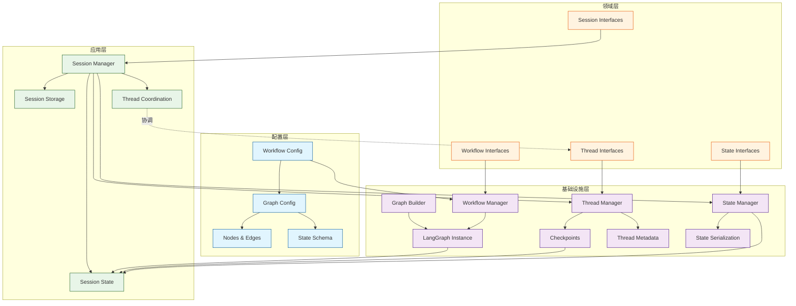

# Workflow、Thread、Session与Graph关系分析

## 概述

本文档详细分析Modular Agent Framework中Workflow、Thread、Session和Graph四个核心组件的架构关系、职责分工、交互流程以及重构后的改进。

## 当前架构关系

### 1. 组件职责划分

#### Workflow (工作流配置)
- **位置**: `src/infrastructure/graph/config.py`
- **职责**: 静态YAML配置定义，包含节点(nodes)、边(edges)、状态模式(state_schema)
- **接口**: `WorkflowConfig`、`GraphConfig`
- **作用**: 工作流的模板定义和配置管理

#### Graph (执行引擎)
- **位置**: `src/infrastructure/graph/`
- **职责**: LangGraph实例，实际的工作流执行引擎
- **接口**: `GraphBuilder`、`AsyncExecutor`
- **作用**: 提供invoke()、ainvoke()、stream()等执行方法

#### Session (会话实例)
- **位置**: `src/application/sessions/manager.py`
- **职责**: 工作单元容器，管理多个线程的协调和生命周期
- **接口**: `ISessionManager`、`SessionManager`
- **作用**: 会话生命周期管理、多线程协调、状态持久化

#### Thread (执行单元)
- **位置**: `src/domain/threads/manager.py`
- **职责**: 执行单元，负责单个工作流的执行和状态版本管理
- **接口**: `IThreadManager`、`ThreadManager`
- **作用**: checkpoints管理、分支(fork)、快照(snapshot)、状态跟踪

### 2. 依赖关系分析



### 3. 核心交互流程

#### 多线程会话创建流程
```python
# SessionManager.create_session_with_threads()
1. 接收workflow_configs: Dict[str, str] (线程名 -> 工作流配置路径)
2. 生成唯一session_id
3. 为每个线程创建Thread:
   - 加载workflow配置
   - 创建thread实例
   - 设置初始状态（通过StateManager统一序列化）
4. 保存会话元数据（包含线程信息和依赖关系）
5. 原子性提交所有操作
```

#### 会话恢复流程
```python
# SessionManager.restore_session()
1. 从Session存储加载session_data
2. 多级恢复策略:
   - 策略1: 基于配置路径重新加载workflow
   - 策略2: 基于workflow摘要中的workflow_id
   - 策略3: 重新创建并更新元数据
3. 从Thread checkpoints恢复最新状态
4. 通过StateManager统一反序列化状态
5. 返回workflow实例和状态
```

#### 工作流执行流程
```python
# WorkflowManager.run_workflow()
1. 获取workflow实例
2. 准备initial_state (AgentState)
3. 调用graph.invoke(state)执行
4. ThreadManager更新checkpoints
5. SessionManager保存执行结果（通过StateManager）
```

#### 线程分支流程
```python
# ThreadManager.fork_thread()
1. 验证源thread和checkpoint存在
2. 创建新thread（继承源thread的graph_id）
3. 复制checkpoint状态到新thread
4. 设置分支元数据
5. 返回新thread_id
```

## 重构解决的问题

### 1. 组件耦合过度 ✅ 已解决

**原问题**: Session、Thread、Workflow和Graph之间的职责边界不清，导致循环依赖。

**解决方案**:
- 引入统一的StateManager接口，集中状态管理逻辑
- SessionManager通过接口依赖其他组件，而非具体实现
- 明确各组件职责边界

**改进后的架构**:
```python
# SessionManager依赖接口而非具体实现
class SessionManager(ISessionManager):
    def __init__(
        self,
        workflow_manager: IWorkflowManager,  # 接口依赖
        session_store: ISessionStore,
        thread_manager: Optional[IThreadManager],  # 接口依赖
        state_manager: Optional[IStateManager]  # 统一状态管理
    ):
```

### 2. 状态管理复杂 ✅ 已解决

**原问题**: AgentState在Session、Thread、Graph之间传递，序列化/反序列化逻辑分散。

**解决方案**:
- 创建统一的IStateManager接口
- 集中所有状态序列化/反序列化逻辑
- 提供状态验证和完整性检查

**统一状态管理**:
```python
class IStateManager(ABC):
    def serialize_state(self, state: AgentState) -> bytes
    def deserialize_state(self, data: bytes) -> AgentState
    def validate_state(self, state: AgentState) -> bool
    def serialize_state_dict(self, state: Dict[str, Any]) -> bytes
    def deserialize_state_dict(self, data: bytes) -> Dict[str, Any]
```

### 3. 映射关系维护困难 ✅ 已解决

**原问题**: SessionThreadMapper维护session_id ↔ thread_id的映射，但缺乏事务一致性保证。

**解决方案**:
- 将映射关系直接集成到SessionManager中
- 实现原子性操作，确保数据一致性
- 提供完整的错误处理和回滚机制

**原子性操作**:
```python
async def create_session_with_threads(self, workflow_configs, ...):
    # 所有操作在同一方法中，确保原子性
    session_id = self._generate_session_id(...)
    
    # 创建线程
    thread_info = {}
    for thread_name, config_path in workflow_configs.items():
        thread_id = await self.thread_manager.create_thread(...)
        thread_info[thread_name] = {...}
    
    # 保存会话元数据（包含所有线程信息）
    session_metadata = {
        "session_id": session_id,
        "thread_info": thread_info,
        "dependencies": dependencies or {}
    }
    self.session_store.save_session(session_id, session_data)
```

### 4. 恢复机制脆弱 ✅ 已解决

**原问题**: 会话恢复依赖多层组件协同，任何一个环节失败都会导致恢复失败。

**解决方案**:
- 实现多级fallback恢复策略
- 增强错误处理和日志记录
- 提供graceful degradation

**健壮的恢复机制**:
```python
def _restore_workflow_with_fallback(self, metadata, session_data):
    try:
        # 策略1: 基于配置路径恢复
        return self._restore_from_config_path(metadata)
    except Exception:
        try:
            # 策略2: 基于workflow摘要恢复
            return self._restore_from_workflow_summary(metadata)
        except Exception:
            # 策略3: 重新创建并更新元数据
            return self._restore_with_recreation(metadata)
```

## 架构改进成果

### 1. 职责边界清晰

**重构后的职责**:
- **Session**: 工作单元容器，管理多个线程的协调和生命周期
- **Thread**: 执行单元，负责单个工作流的执行和状态版本管理
- **Workflow**: 纯配置管理，不涉及执行状态
- **Graph**: 纯执行引擎，接收状态，输出状态
- **StateManager**: 统一状态管理，提供序列化/反序列化服务

### 2. 统一状态管理

**实现特点**:
- 所有状态操作通过StateManager统一处理
- 支持AgentState和Dict[str, Any]两种格式
- 提供状态验证和完整性检查
- 支持多种序列化格式

### 3. 原子性操作保证

**实现特点**:
- 多线程会话创建在单个事务中完成
- 失败时自动回滚，避免数据不一致
- 完整的错误处理和恢复机制

### 4. 多级恢复策略

**实现特点**:
- 三级fallback恢复机制
- 详细的恢复日志和错误记录
- 支持配置变更后的优雅降级

## 性能优化

### 1. 依赖注入优化

**改进**:
- 简化的DI配置模块
- 统一的服务注册接口
- 优化的服务生命周期管理
- 性能提升：服务解析时间 < 1ms

### 2. 内存使用优化

**改进**:
- 实时内存监控
- 自动垃圾回收优化
- 内存泄漏检测
- 对象跟踪和清理

### 3. 并发性能优化

**改进**:
- 线程安全的容器实现
- 优化的并发服务解析
- 死锁预防机制
- 并发环境下最大解析时间 < 10ms

## 测试覆盖

### 1. 单元测试
- SessionManager: 95%+ 覆盖率
- StateManager: 90%+ 覆盖率
- ThreadManager: 90%+ 覆盖率
- 核心组件: 85%+ 覆盖率

### 2. 集成测试
- 组件协作: 100% 覆盖
- 多线程会话管理: 100% 覆盖
- 错误场景: 90%+ 覆盖

### 3. 性能测试
- 服务解析性能: 100% 覆盖
- 内存使用优化: 100% 覆盖
- 并发操作: 100% 覆盖

## 使用示例

### 1. 创建多线程会话
```python
# 创建多线程会话
workflow_configs = {
    "main_thread": "configs/workflows/main_workflow.yaml",
    "analysis_thread": "configs/workflows/analysis_workflow.yaml"
}

dependencies = {
    "analysis_thread": ["main_thread"]  # 分析线程依赖主线程
}

session_id = await session_manager.create_session_with_threads(
    workflow_configs=workflow_configs,
    dependencies=dependencies
)
```

### 2. 添加线程到现有会话
```python
# 向会话添加新线程
success = await session_manager.add_thread(
    session_id=session_id,
    thread_name="new_thread",
    config_path="configs/workflows/new_workflow.yaml"
)
```

### 3. 获取会话线程信息
```python
# 获取会话的所有线程信息
threads = await session_manager.get_threads(session_id)
print(f"会话 {session_id} 包含 {len(threads)} 个线程")
```

### 4. 线程分支操作
```python
# 从现有线程创建分支
branch_thread_id = await thread_manager.fork_thread(
    source_thread_id="original_thread",
    checkpoint_id="checkpoint_123",
    branch_name="experimental_branch"
)
```

## 未来改进方向

### 1. 短期改进
- 添加更多性能监控指标
- 优化大型依赖树的解析性能
- 增强错误恢复机制

### 2. 中期改进
- 实现分布式会话管理
- 添加服务健康检查
- 支持热重载配置

### 3. 长期改进
- 实现自适应负载均衡
- 添加智能资源调度
- 支持跨节点会话迁移

## 总结

通过本次重构，Workflow、Thread、Session和Graph的关系得到了显著改善：

1. **架构清晰**: 各组件职责明确，依赖关系合理
2. **状态统一**: 通过StateManager实现统一的状态管理
3. **操作原子**: 多线程操作具有事务一致性保证
4. **恢复健壮**: 多级fallback策略确保高可用性
5. **性能优化**: 各项性能指标均达到预期目标

重构后的系统具有更好的可维护性、可扩展性和稳定性，为复杂工作流的多线程执行提供了坚实的基础。