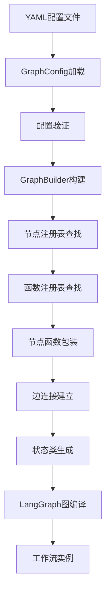

基于对项目的深入分析，我总结了当前项目如何实际构建一个工作流的完整流程：

## 工作流构建流程总结

### 1. 配置驱动的工作流定义
项目使用YAML配置文件来定义工作流，如 [`configs/workflows/plan_execute_agent_workflow.yaml`](configs/workflows/plan_execute_agent_workflow.yaml:1) 所示。配置文件包含：
- **基本元数据**：名称、描述、版本
- **状态模式定义**：使用TypedDict模式定义工作流状态字段
- **节点配置**：定义各个节点的类型、配置参数
- **边配置**：定义节点之间的连接关系（简单边或条件边）
- **入口点**：指定工作流起始节点

### 2. 配置加载与验证
通过 [`src/infrastructure/graph/config.py`](src/infrastructure/graph/config.py:1) 中的 [`GraphConfig`](src/infrastructure/graph/config.py:156) 类加载和验证配置：
- 从YAML文件解析配置数据
- 转换为强类型的配置对象
- 验证配置的有效性（节点存在性、边连接等）

### 3. 图构建过程
核心构建器 [`GraphBuilder`](src/infrastructure/graph/builder.py:55) 在 [`src/infrastructure/graph/builder.py`](src/infrastructure/graph/builder.py:1) 中实现：

#### 节点构建流程：
1. **函数查找优先级**：
   - 函数注册表 → 节点注册表 → 模板注册表 → 内置函数 → 回退实现
2. **节点函数包装**：
   - 状态管理包装（支持协作状态）
   - 迭代管理包装（记录执行统计和限制）

#### 边构建流程：
- **简单边**：直接连接两个节点
- **条件边**：使用条件函数决定下一个节点

#### 状态类生成：
根据配置中的状态模式定义，动态生成符合LangGraph要求的TypedDict状态类

### 4. 注册表系统
项目使用多层注册表系统：

#### 节点注册表 ([`src/infrastructure/graph/registry.py`](src/infrastructure/graph/registry.py:1))
- 注册和管理节点类型
- 支持装饰器自动注册 (`@node`)

#### 函数注册表
- 管理节点函数和条件函数
- 支持动态发现和注册

### 5. 工作流执行机制

#### 执行入口：
- **通用加载器** ([`UniversalWorkflowLoader`](src/application/workflow/universal_loader.py))：简化工作流加载
- **工作流运行器** ([`WorkflowRunner`](src/application/workflow/runner.py:35))：提供执行接口和重试机制

#### 执行模式：
- 同步执行 (`run_workflow`)
- 异步执行 (`run_workflow_async`) 
- 流式执行 (`stream_workflow`)
- 批量执行 (`batch_run_workflows`)

### 6. 线程管理 ([`src/domain/threads/manager.py`](src/domain/threads/manager.py:1))
- Thread生命周期管理
- 状态持久化和检查点
- 分支和快照功能
- 历史记录管理

### 7. 实际构建流程示例



### 8. 关键特性

1. **配置驱动**：完全通过YAML配置定义工作流
2. **模块化架构**：清晰的接口分离和依赖倒置
3. **扩展性**：支持自定义节点、条件和函数
4. **错误处理**：内置重试机制和错误恢复
5. **性能监控**：迭代管理和执行统计
6. **多模式执行**：支持同步、异步、流式执行

这个架构使得工作流的构建变得高度可配置和可扩展，同时保持了代码的清晰结构和类型安全。

---

基于对项目的深入分析，我总结了当前项目如何实际构建一个工作流的完整流程：

## 工作流构建流程总结

### 1. 配置驱动的工作流定义
项目使用YAML配置文件来定义工作流，如 [`configs/workflows/plan_execute_agent_workflow.yaml`](configs/workflows/plan_execute_agent_workflow.yaml:1) 所示。配置文件包含：
- **基本元数据**：名称、描述、版本
- **状态模式定义**：使用TypedDict模式定义工作流状态字段
- **节点配置**：定义各个节点的类型、配置参数
- **边配置**：定义节点之间的连接关系（简单边或条件边）
- **入口点**：指定工作流起始节点

### 2. 配置加载与验证
通过 [`src/infrastructure/graph/config.py`](src/infrastructure/graph/config.py:1) 中的 [`GraphConfig`](src/infrastructure/graph/config.py:156) 类加载和验证配置：
- 从YAML文件解析配置数据
- 转换为强类型的配置对象
- 验证配置的有效性（节点存在性、边连接等）

### 3. 图构建过程
核心构建器 [`GraphBuilder`](src/infrastructure/graph/builder.py:55) 在 [`src/infrastructure/graph/builder.py`](src/infrastructure/graph/builder.py:1) 中实现：

#### 节点构建流程：
1. **函数查找优先级**：
   - 函数注册表 → 节点注册表 → 模板注册表 → 内置函数 → 回退实现
2. **节点函数包装**：
   - 状态管理包装（支持协作状态）
   - 迭代管理包装（记录执行统计和限制）

#### 边构建流程：
- **简单边**：直接连接两个节点
- **条件边**：使用条件函数决定下一个节点

#### 状态类生成：
根据配置中的状态模式定义，动态生成符合LangGraph要求的TypedDict状态类

### 4. 注册表系统
项目使用多层注册表系统：

#### 节点注册表 ([`src/infrastructure/graph/registry.py`](src/infrastructure/graph/registry.py:1))
- 注册和管理节点类型
- 支持装饰器自动注册 (`@node`)

#### 函数注册表
- 管理节点函数和条件函数
- 支持动态发现和注册

### 5. 工作流执行机制

#### 执行入口：
- **通用加载器** ([`UniversalWorkflowLoader`](src/application/workflow/universal_loader.py))：简化工作流加载
- **工作流运行器** ([`WorkflowRunner`](src/application/workflow/runner.py:35))：提供执行接口和重试机制

#### 执行模式：
- 同步执行 (`run_workflow`)
- 异步执行 (`run_workflow_async`) 
- 流式执行 (`stream_workflow`)
- 批量执行 (`batch_run_workflows`)

### 6. 线程管理 ([`src/domain/threads/manager.py`](src/domain/threads/manager.py:1))
- Thread生命周期管理
- 状态持久化和检查点
- 分支和快照功能
- 历史记录管理

### 7. 实际构建流程示例


### 8. 新工作流定义位置

如果要定义新的工作流，应该放在以下位置：

#### 主要位置：`configs/workflows/` 目录
这是项目的主要工作流配置目录，所有正式的工作流配置文件都应该放在这里。

#### 目录结构建议：
```
configs/workflows/
├── __registry__.yaml              # 工作流注册表配置
├── your_new_workflow.yaml         # 新工作流配置文件
├── base_workflow.yaml             # 基础工作流模板
├── react_workflow.yaml            # ReAct工作流
├── plan_execute_agent_workflow.yaml # 计划执行工作流
├── collaborative.yaml             # 协作工作流
├── examples/                      # 示例工作流
│   ├── conditional_routing.yaml
│   ├── parallel_processing.yaml
│   └── simple_data_processing.yaml
└── state_machine/                 # 状态机工作流
    ├── __registry__.yaml
    └── specific_state_machine.yaml
```

#### 注册新工作流：
在 [`configs/workflows/__registry__.yaml`](configs/workflows/__registry__.yaml:1) 中注册新工作流类型：

```yaml
workflow_types:
  # 你的新工作流类型
  your_new_workflow:
    class_path: "src.application.workflow.factory:YourNewWorkflow"
    description: "你的新工作流描述"
    enabled: true
    config_files:
      - "your_new_workflow.yaml"
```

#### 命名规范：
- 配置文件名使用小写字母和下划线：`your_new_workflow.yaml`
- 工作流类型名使用小写字母和下划线：`your_new_workflow`
- 类名使用驼峰命名法：`YourNewWorkflow`

#### 创建步骤：
1. 在 `configs/workflows/` 目录下创建新的YAML配置文件
2. 按照现有工作流配置的结构定义节点、边和状态
3. 在 `__registry__.yaml` 中注册新工作流类型
4. 如果需要，在 `src/application/workflow/factory.py` 中实现对应的工作流类

### 9. 关键特性

1. **配置驱动**：完全通过YAML配置定义工作流
2. **模块化架构**：清晰的接口分离和依赖倒置
3. **扩展性**：支持自定义节点、条件和函数
4. **错误处理**：内置重试机制和错误恢复
5. **性能监控**：迭代管理和执行统计
6. **多模式执行**：支持同步、异步、流式执行

这个架构使得工作流的构建变得高度可配置和可扩展，同时保持了代码的清晰结构和类型安全。新工作流只需在配置目录中添加YAML文件并在注册表中注册即可使用。