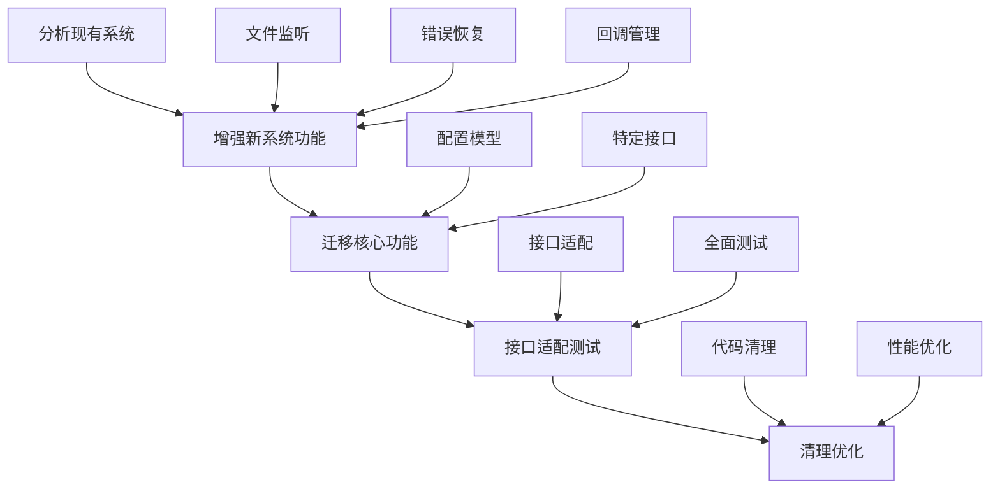

# 配置系统迁移分析报告

## 概述

本文档分析了从现有配置系统（`src/infrastructure/config/`）迁移到新架构配置系统（`src/core/config/`）的完整方案。通过对比新旧系统的功能差异，制定了分阶段的迁移策略和实施步骤。

## 1. 现有配置系统分析

### 1.1 核心功能模块

**配置系统核心类**：`ConfigSystem` (`src/infrastructure/config/config_system.py:30`)

**主要功能模块**：
- **配置加载和缓存**：使用 `ConfigCache` 进行配置缓存
- **环境变量解析**：`EnvResolver` 解析 `${VAR:DEFAULT}` 格式
- **配置继承处理**：通过 `ConfigLoader` 处理 `inherits_from` 字段
- **文件变化监听**：`FileWatcher` 监控配置文件变化
- **错误恢复机制**：`ConfigErrorRecovery` 处理配置加载失败
- **回调管理系统**：全局回调管理器支持

### 1.2 特定配置类型支持

- `load_global_config()` - 全局配置加载
- `load_llm_config()` - LLM配置加载
- `load_tool_config()` - 工具配置加载
- `load_token_counter_config()` - Token计数器配置
- `load_task_groups_config()` - 任务组配置

## 2. 新架构配置系统分析

### 2.1 模块化架构

**核心模块**：
- **配置管理器**：`ConfigManager` (`src/core/config/config_manager.py:29`)
- **配置加载器**：`ConfigLoader` (`src/core/config/config_loader.py:19`)
- **配置处理器**：`ConfigProcessor` (`src/core/config/config_processor.py:19`)
- **基础配置模型**：`BaseConfig` (`src/core/config/base.py:45`)

### 2.2 功能特性

- 统一配置管理入口
- 类型安全的配置模型（Pydantic）
- 配置注册表管理
- 配置处理流程：加载 → 继承 → 环境变量 → 验证

## 3. 功能差异对比

| 功能模块 | 现有系统 | 新系统 | 状态 |
|---------|---------|--------|------|
| 配置加载和缓存 | ✅ | ✅ | 已实现 |
| 环境变量解析 | ✅ | ✅ | 已实现 |
| 配置继承处理 | ✅ | ✅ | 已实现 |
| 基础配置验证 | ✅ | ✅ | 已实现 |
| 文件变化监听 | ✅ | ❌ | **需要迁移** |
| 错误恢复机制 | ✅ | ❌ | **需要迁移** |
| 回调管理系统 | ✅ |  ❌ | **需要迁移** |
| 特定配置接口 | ✅ |  ❌ | **需要迁移** |

## 4. 迁移策略

### 4.1 分阶段迁移策略

**第一阶段：增强新系统功能**（高优先级）
- 文件监听功能集成
- 错误恢复机制集成
- 回调管理系统集成

**第二阶段：核心功能迁移**（中优先级）
- 配置模型迁移
- 特定配置接口迁移

**第三阶段：接口适配和测试**（中优先级）
- 接口适配
- 全面测试

**第四阶段：清理和优化**（低优先级）
- 代码清理
- 性能优化

### 4.2 优先级矩阵

| 功能模块 | 优先级 | 工作量 | 风险 | 依赖关系 |
|---------|--------|--------|------|----------|
| 文件监听 | 高 | 中等 | 低 | 独立功能 |
| 错误恢复 | 高 | 中等 | 低 | 配置加载 |
| 回调管理 | 中 | 中等 | 中 | 事件系统 |
| 配置模型 | 中 | 高 | 高 | 全系统 |
| 特定接口 | 中 | 低 | 低 | 便捷功能 |
| 接口适配 | 低 | 高 | 高 | 兼容性 |

## 5. 详细实施步骤

### 5.1 第一阶段：增强新系统功能

**步骤1.1：文件监听功能迁移**
1. 将 `src/infrastructure/config/file_watcher.py` 复制到 `src/core/config/file_watcher.py`
2. 更新导入路径和依赖
3. 在 `ConfigManager` 中添加文件监听支持
4. 实现 `watch_for_changes()` 和 `stop_watching()` 方法
5. 编写单元测试验证功能

**步骤1.2：错误恢复机制集成**
1. 迁移 `ConfigErrorRecovery` 到核心层
2. 集成到 `ConfigProcessor.process()` 方法
3. 添加配置验证失败处理逻辑
4. 测试各种错误场景的恢复能力

**步骤1.3：回调管理系统集成**
1. 创建 `src/core/config/callback_manager.py`
2. 实现多订阅者回调模式
3. 集成到配置变化处理流程
4. 测试事件通知机制

### 5.2 第二阶段：核心功能迁移

**步骤2.1：配置模型迁移**
1. 将现有配置模型类迁移到 `BaseConfig` 继承
2. 更新模型字段定义和验证规则
3. 测试模型序列化和反序列化
4. 更新全系统的模型导入路径

**步骤2.2：特定配置接口迁移**
1. 在 `config_manager.py` 中添加便捷函数
2. 实现 `load_llm_config()`, `load_tool_config()` 等方法
3. 确保向后兼容现有调用代码
4. 更新相关文档和示例

### 5.3 第三阶段：接口适配和测试

**步骤3.1：接口适配**
1. 创建 `ConfigSystemAdapter` 类
2. 实现 `IConfigSystem` 所有方法
3. 测试适配器功能完整性
4. 更新依赖注入配置

**步骤3.2：全面测试**
1. 为所有新功能编写单元测试
2. 创建集成测试验证配置加载流程
3. 进行性能测试确保缓存效率
4. 验证与现有代码的兼容性

### 5.4 第四阶段：清理和优化

**步骤4.1：代码清理**
1. 移除 `src/infrastructure/config/` 目录
2. 清理不再使用的导入和依赖
3. 更新配置系统使用文档
4. 验证所有功能正常工作

**步骤4.2：性能优化**
1. 分析配置加载性能
2. 优化缓存命中率
3. 改进文件监听性能
4. 进行内存使用优化

## 6. 迁移流程图

## 7. 风险评估和缓解措施

### 7.1 高风险项目
- **配置模型迁移**：可能影响现有配置加载
- **缓解措施**：分阶段迁移，充分测试，保持向后兼容

### 7.2 中风险项目
- **回调管理系统**：事件处理复杂性
- **缓解措施**：简化设计，逐步集成，充分测试

### 7.3 低风险项目
- **文件监听功能**：相对独立
- **缓解措施**：独立测试验证，逐步集成

## 8. 预期成果

### 8.1 功能改进
- 统一的配置管理入口
- 更好的类型安全性
- 改进的错误处理
- 实时配置重载支持

### 8.2 架构改进
- 符合新架构规范（Core层实现）
- 清晰的职责分离
- 更好的可测试性
- 改进的性能和可维护性

## 9. 后续工作建议

1. **持续监控**：监控迁移后的系统性能和稳定性
2. **用户反馈**：收集用户对新配置系统的使用反馈
3. **文档更新**：持续更新配置系统使用文档和示例
4. **性能优化**：根据实际使用情况进行性能调优

## 10. 结论

配置系统迁移是一个复杂的工程任务，需要分阶段、有计划地实施。通过本文档分析的迁移策略和实施步骤，可以确保迁移过程平稳有序，最大程度降低对现有系统的影响，同时实现架构改进和功能增强的目标。

迁移完成后，配置系统将更加符合新架构的设计理念，提供更好的可维护性、可测试性和用户体验。