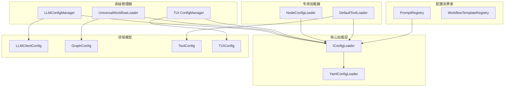

# 配置加载器架构文档

## 概述

本文档详细描述了项目中所有配置加载器的架构、职责和相互关系。经过重构，配置系统现在遵循统一的架构模式，实现了高度的代码复用和一致性。

## 架构层次

配置系统采用四层架构设计，从底层到高层依次为：

### 1. 核心加载层
- **组件**: `YamlConfigLoader` (实现), `IConfigLoader` (接口)
- **文件**: `src/infrastructure/config_loader.py`, `src/infrastructure/config_interfaces.py`
- **职责**: 
  - 唯一的物理I/O入口点
  - 处理YAML文件读取和解析
  - 环境变量替换 (`${VAR:default}`)
  - 配置继承处理
  - 配置缓存
  - 文件监控和热重载

### 2. 通用契约与验证层
- **组件**: Pydantic配置模型
- **文件**: `src/infrastructure/config_models.py`
- **职责**:
  - 定义配置数据契约
  - 提供类型安全和验证
  - 支持配置序列化/反序列化

### 3. 领域特定配置模型层
- **组件**: 各模块的专用配置类
- **文件**: 
  - `src/infrastructure/llm/config.py`
  - `src/infrastructure/graph/config.py`
  - `src/infrastructure/tools/config.py`
  - `src/domain/checkpoint/config.py`
  - `src/presentation/tui/config.py`
- **职责**:
  - 将通用配置适配为模块专用对象
  - 提供业务逻辑相关的辅助方法

### 4. 高级管理与编排层
- **组件**: 各模块的配置管理器
- **文件**:
  - `src/infrastructure/llm/config_manager.py`
  - `src/application/workflow/universal_loader.py`
  - `src/presentation/tui/config.py`
- **职责**:
  - 组合和编排下层组件
  - 提供模块特定的配置服务
  - 实现高级功能（如验证、缓存）

## 配置加载器详细说明

### 核心加载器

#### YamlConfigLoader
```python
class YamlConfigLoader(IConfigLoader, ILifecycleAware):
    """YAML配置加载器实现"""
```
- **类型**: 核心实现
- **依赖**: 无
- **功能**:
  - 加载YAML配置文件
  - 环境变量替换
  - 配置继承处理
  - 热重监控
  - 配置缓存
- **使用方式**: 通过依赖注入容器注册，供其他组件使用

#### IConfigLoader
```python
class IConfigLoader(ABC):
    """配置加载器接口"""
```
- **类型**: 抽象接口
- **方法**:
  - `load(config_path: str) -> Dict[str, Any]`
  - `reload() -> None`
  - `watch_for_changes(callback) -> None`
  - `resolve_env_vars(config) -> Dict[str, Any]`
  - `stop_watching() -> None`

### 高级管理器

#### LLMConfigManager
```python
class LLMConfigManager:
    """LLM配置管理器"""
    
    def __init__(self, config_loader: IConfigLoader, ...):
```
- **类型**: 高级管理器
- **依赖**: `IConfigLoader`
- **功能**:
  - 管理LLM客户端配置
  - 配置验证
  - 热重回调处理
  - 配置缓存
- **重构改进**:
  - 移除重复的文件I/O逻辑
  - 委托所有底层操作给 `IConfigLoader`
  - 保留LLM特定的验证逻辑

#### UniversalWorkflowLoader
```python
class UniversalWorkflowLoader:
    """通用工作流加载器"""
    
    def __init__(self, config_loader: Optional[IConfigLoader], ...):
```
- **类型**: 高级管理器/门面
- **依赖**: `IConfigLoader`
- **功能**:
  - 加载工作流配置
  - 函数注册管理
  - 工作流实例创建
  - 配置验证
- **重构改进**:
  - 移除直接的YAML文件读取
  - 使用 `IConfigLoader` 加载配置
  - 保持工作流特定的功能

#### TUI ConfigManager
```python
class ConfigManager:
    """配置管理器"""
    
    def __init__(self, config_loader: Optional[IConfigLoader], ...):
```
- **类型**: 高级管理器
- **依赖**: `IConfigLoader` (可选)
- **功能**:
  - 管理TUI界面配置
  - 支持YAML和JSON格式
  - 用户目录配置处理
- **重构改进**:
  - 利用 `IConfigLoader` 处理环境变量
  - 保持用户目录的特殊处理
  - 支持向后兼容

### 专用加载器

#### NodeConfigLoader
```python
class NodeConfigLoader:
    """节点配置加载器"""
    
    def __init__(self, config_loader: Optional[IConfigLoader] = None):
```
- **类型**: 专用加载器
- **依赖**: `IConfigLoader` (可选)
- **功能**:
  - 加载节点默认配置
  - 合并运行时配置
  - 提供全局访问点
- **特点**: 已遵循最佳实践，无需重构

#### DefaultToolLoader
```python
class DefaultToolLoader(IToolLoader):
    """默认工具加载器实现"""
    
    def __init__(self, config_loader: IConfigLoader, logger: ILogger):
```
- **类型**: 专用加载器
- **依赖**: `IConfigLoader`
- **功能**:
  - 从配置目录加载工具配置
  - 解析工具配置
- **特点**: 已正确使用 `IConfigLoader`，无需重构

### 配置消费者

#### PromptRegistry
```python
class PromptRegistry(IPromptRegistry):
    """提示词注册表实现"""
    
    def __init__(self, config_loader: IConfigLoader):
```
- **类型**: 配置消费者
- **依赖**: `IConfigLoader`
- **功能**:
  - 加载提示词注册表配置
  - 管理提示词元数据
- **特点**: 优秀实现范例，正确使用依赖注入

#### WorkflowTemplateRegistry
```python
class WorkflowTemplateRegistry(IWorkflowTemplateRegistry):
    """工作流模板注册表实现"""
```
- **类型**: 纯内存注册表
- **依赖**: 无
- **功能**:
  - 管理工作流模板对象
  - 不涉及文件I/O
- **特点**: 设计职责清晰，无需配置加载

## 依赖关系图



## 数据流

1. **配置加载流程**:
   ```
   YAML文件 → YamlConfigLoader → Dict数据 → Pydantic模型 → 领域模型 → 应用代码
   ```

2. **热重载流程**:
   ```
   文件变更 → Watchdog → YamlConfigLoader → 回调函数 → 高级管理器 → 更新缓存
   ```

3. **依赖注入流程**:
   ```
   DI容器 → 注册服务 → 解析依赖 → 注入IConfigLoader → 创建管理器实例
   ```

## 设计模式应用

### 1. 依赖倒置原则 (DIP)
- 高层模块依赖于抽象接口 (`IConfigLoader`)
- 不依赖具体的实现细节

### 2. 单一职责原则 (SRP)
- 每个加载器职责明确
- `YamlConfigLoader` 只负责文件I/O
- 高级管理器只负责编排

### 3. 适配器模式
- `TUI ConfigManager` 适配用户目录配置
- 领域模型适配通用配置到专用对象

### 4. 门面模式
- `UniversalWorkflowLoader` 提供简化的工作流加载接口
- `LLMConfigManager` 提供统一的LLM配置管理

### 5. 观察者模式
- 热重载机制使用观察者模式
- 配置变更时通知所有订阅者

## 最佳实践

### 1. 依赖注入
- 所有管理器通过构造函数接收 `IConfigLoader`
- 使用DI容器管理服务生命周期

### 2. 错误处理
- 配置加载失败时提供有意义的错误信息
- 支持降级到默认配置

### 3. 测试策略
- 使用Mock对象模拟 `IConfigLoader`
- 验证管理器正确委托给核心加载器

### 4. 向后兼容
- 保留全局函数以支持现有代码
- 提供平滑的迁移路径

## 扩展指南

### 添加新的配置管理器

1. **创建管理器类**:
   ```python
   class NewConfigManager:
       def __init__(self, config_loader: IConfigLoader):
           self.config_loader = config_loader
   ```

2. **实现配置加载**:
   ```python
   def load_config(self):
       config_data = self.config_loader.load("config_path")
       return self.process_config(config_data)
   ```

3. **注册到DI容器**:
   ```python
   container.register_factory(
       NewConfigManager,
       lambda: NewConfigManager(container.get(IConfigLoader))
   )
   ```

### 添加新的配置格式支持

1. **实现IConfigLoader接口**:
   ```python
   class TomlConfigLoader(IConfigLoader):
       def load(self, config_path: str):
           # TOML加载逻辑
   ```

2. **注册到容器**:
   ```python
   container.register_instance(IConfigLoader, TomlConfigLoader())
   ```

## 总结

重构后的配置系统实现了：
- **统一性**: 所有配置加载通过核心组件
- **可维护性**: 清晰的职责分离
- **可扩展性**: 易于添加新的配置格式和管理器
- **可测试性**: 通过依赖注入简化测试
- **一致性**: 统一的配置行为和错误处理

这个架构为项目的配置管理提供了坚实的基础，支持未来的扩展和维护。