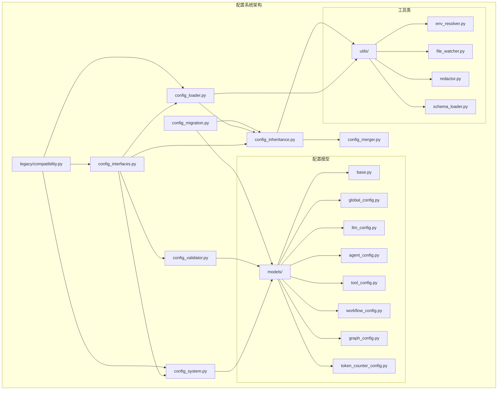

## 配置文件功能和关系分析

基于我对代码的分析，以下是散落在infrastructure根目录的配置文件的功能和关系：

### 1. 文件功能分析

#### [`config_interfaces.py`](src/infrastructure/config_interfaces.py:1)
- **功能**: 定义配置系统的核心接口
- **主要接口**: 
  - `IConfigLoader`: 配置加载器接口
  - `IConfigInheritanceHandler`: 配置继承处理器接口
- **关系**: 被其他配置文件引用，是配置系统的抽象层

#### [`config_inheritance.py`](src/infrastructure/config_inheritance.py:1)
- **功能**: 实现配置继承和验证机制
- **主要类**:
  - `IConfigInheritanceHandler`: 继承处理器接口（继承自config_interfaces）
  - `ConfigInheritanceHandler`: 继承处理器实现
  - `InheritanceConfigLoader`: 支持继承的配置加载器装饰器
- **关系**: 依赖config_interfaces.py，被config_loader.py使用

#### [`config_loader.py`](src/infrastructure/config_loader.py:1)
- **功能**: 实现YAML配置加载器，支持文件监听和环境变量解析
- **主要类**:
  - `ConfigFileHandler`: 配置文件变化处理器
  - `YamlConfigLoader`: YAML配置加载器实现
- **关系**: 依赖config_inheritance.py和config_interfaces.py

#### [`config_models.py`](src/infrastructure/config_models.py:1)
- **功能**: 使用Pydantic定义配置模型，支持配置验证和序列化
- **主要类**:
  - `BaseConfigModel`: 基础配置模型
  - `WorkflowConfigModel`: 工作流配置模型
  - `AgentConfigModel`: Agent配置模型
  - `ToolConfigModel`: 工具配置模型
  - `LLMConfigModel`: LLM配置模型
  - `GraphConfigModel`: 图配置模型
- **关系**: 独立的模型定义，与其他配置文件关系较少

#### [`config_migration.py`](src/infrastructure/config_migration.py:1)
- **功能**: 提供配置迁移功能，帮助用户从旧的配置格式迁移到新的配置格式
- **主要类**:
  - `MigrationResult`: 迁移结果
  - `ConfigMigrationTool`: 配置迁移工具
- **关系**: 依赖config_models.py和config_inheritance.py

### 2. 与现有config目录的关系

现有的`src/infrastructure/config/`目录已经有一个完整的配置系统，包括：
- 配置系统核心实现 ([`config_system.py`](src/infrastructure/config/config_system.py:1))
- 配置合并器 ([`config_merger.py`](src/infrastructure/config/config_merger.py:1))
- 配置验证器 ([`config_validator.py`](src/infrastructure/config/config_validator.py:1))
- 配置模型 ([`models/`](src/infrastructure/config/models/1)目录)
- 工具类 ([`utils/`](src/infrastructure/config/utils/1)目录)

### 3. 功能重复和冲突分析

#### 重复功能：
1. **配置继承处理**: 
   - 根目录的[`config_inheritance.py`](src/infrastructure/config_inheritance.py:1)和config目录的[`config_merger.py`](src/infrastructure/config/config_merger.py:1)都有配置合并功能
2. **配置模型**:
   - 根目录的[`config_models.py`](src/infrastructure/config_models.py:1)和config目录的[`models/`](src/infrastructure/config/models/1)目录都定义了配置模型
3. **配置验证**:
   - 根目录的[`config_inheritance.py`](src/infrastructure/config_inheritance.py:1)中有验证功能，config目录有专门的[`config_validator.py`](src/infrastructure/config/config_validator.py:1)

#### 接口不一致：
1. 根目录的[`config_interfaces.py`](src/infrastructure/config_interfaces.py:1)定义的接口与config目录中的实际实现不完全匹配
2. 两套配置系统使用不同的模型和验证机制

---

## 配置系统重构方案设计

基于分析结果，我设计以下重构方案：

### 1. 重构目标

1. **统一配置系统**: 将散落在根目录的配置文件整合到现有的config目录中
2. **消除功能重复**: 合并重复的功能，提高代码复用率
3. **保持向后兼容**: 确保现有代码不受影响
4. **提升架构清晰度**: 建立清晰的配置系统架构

### 2. 目标架构设计

```
src/infrastructure/config/
├── __init__.py                    # 统一导出接口
├── config_system.py              # 核心配置系统（保持现有）
├── config_merger.py              # 配置合并器（增强功能）
├── config_validator.py           # 配置验证器（增强功能）
├── config_loader.py              # 配置加载器（整合根目录功能）
├── config_inheritance.py         # 配置继承处理器（整合根目录功能）
├── config_interfaces.py          # 配置接口（整合根目录功能）
├── config_migration.py           # 配置迁移工具（整合根目录功能）
├── models/                       # 配置模型（整合两套模型）
│   ├── __init__.py
│   ├── base.py                   # 基础模型（整合两套基础模型）
│   ├── global_config.py          # 全局配置模型
│   ├── llm_config.py             # LLM配置模型
│   ├── agent_config.py           # Agent配置模型
│   ├── tool_config.py            # 工具配置模型
│   ├── workflow_config.py        # 工作流配置模型（新增）
│   ├── graph_config.py           # 图配置模型（新增）
│   └── token_counter_config.py   # Token计数器配置模型
├── utils/                        # 工具类（保持现有）
│   ├── __init__.py
│   ├── env_resolver.py
│   ├── file_watcher.py
│   ├── redactor.py
│   └── schema_loader.py
└── legacy/                       # 遗留代码兼容层
    ├── __init__.py
    └── compatibility.py          # 提供向后兼容的接口
```

### 3. 重构策略

#### 3.1 接口统一策略
- 将[`config_interfaces.py`](src/infrastructure/config_interfaces.py:1)移到config目录
- 扩展接口以支持现有config系统的功能
- 保持接口向后兼容

#### 3.2 功能整合策略
- **配置继承**: 将[`config_inheritance.py`](src/infrastructure/config_inheritance.py:1)的继承功能整合到[`config_merger.py`](src/infrastructure/config/config_merger.py:1)中
- **配置加载**: 将[`config_loader.py`](src/infrastructure/config_loader.py:1)的功能整合到config目录，增强现有加载器
- **配置模型**: 合并两套配置模型，以现有config目录的模型为基础，吸收根目录模型的优点

#### 3.3 迁移工具策略
- 将[`config_migration.py`](src/infrastructure/config_migration.py:1)移到config目录
- 增强迁移工具以支持新旧配置系统的转换

### 4. 关键设计决策

#### 4.1 配置继承处理
- 保留[`config_inheritance.py`](src/infrastructure/config_inheritance.py:1)中的高级继承功能（如环境变量解析、引用解析）
- 将这些功能整合到[`config_merger.py`](src/infrastructure/config/config_merger.py:1)中，创建统一的配置处理流程

#### 4.2 配置模型统一
- 以现有config目录的模型为基础，因为它们更符合当前系统架构
- 吸收根目录模型中的元数据管理和验证规则
- 创建统一的基类`BaseConfigModel`

#### 4.3 向后兼容性
- 创建`legacy/compatibility.py`模块，提供旧接口的兼容实现
- 逐步迁移现有代码，而不是一次性替换

### 5. Mermaid架构图



---

## 文件合并和代码复用策略

### 1. 文件合并策略

#### 1.1 直接移动的文件
以下文件可以直接移动到config目录，功能相对独立：
- [`config_interfaces.py`](src/infrastructure/config_interfaces.py:1) → `src/infrastructure/config/config_interfaces.py`
- [`config_migration.py`](src/infrastructure/config_migration.py:1) → `src/infrastructure/config/config_migration.py`

#### 1.2 需要合并的文件

##### 配置继承处理
- **源文件**: [`config_inheritance.py`](src/infrastructure/config_inheritance.py:1)
- **目标文件**: [`config_merger.py`](src/infrastructure/config/config_merger.py:1)
- **合并策略**:
  - 将`ConfigInheritanceHandler`的高级继承功能（环境变量解析、引用解析）整合到`ConfigMerger`中
  - 保留`InheritanceConfigLoader`作为`YamlConfigLoader`的装饰器
  - 将继承相关的接口移到`config_interfaces.py`

##### 配置加载器
- **源文件**: [`config_loader.py`](src/infrastructure/config_loader.py:1)
- **目标文件**: 创建新的`src/infrastructure/config/config_loader.py`
- **合并策略**:
  - 保留现有的`YamlConfigLoader`实现
  - 整合文件监听和环境变量解析功能
  - 与现有的`config_system.py`中的加载逻辑协调

##### 配置模型
- **源文件**: [`config_models.py`](src/infrastructure/config_models.py:1)
- **目标目录**: `src/infrastructure/config/models/`
- **合并策略**:
  - 创建新的模型文件：`workflow_config.py`和`graph_config.py`
  - 将`BaseConfigModel`的功能整合到现有的`base.py`中
  - 统一验证和序列化机制

### 2. 代码复用策略

#### 2.1 配置继承和合并的复用

```python
# 在config_merger.py中整合继承功能
class EnhancedConfigMerger(IConfigMerger):
    """增强的配置合并器，整合继承功能"""
    
    def __init__(self):
        self.env_var_pattern = re.compile(r"\$\{([^}]+)\}")
        self.ref_pattern = re.compile(r"\$ref:([^}]+)")
    
    def resolve_inheritance(self, config, base_path=None):
        """整合的继承解析功能"""
        # 来自config_inheritance.py的功能
        pass
    
    def resolve_env_vars(self, config):
        """环境变量解析功能"""
        # 来自config_inheritance.py的功能
        pass
    
    def resolve_references(self, config):
        """引用解析功能"""
        # 来自config_inheritance.py的功能
        pass
```

#### 2.2 配置模型的复用

```python
# 在models/base.py中整合基础模型
class UnifiedBaseConfig(BaseModel):
    """统一的基础配置模型"""
    
    # 来自现有base.py的功能
    model_config = ConfigDict(
        extra="forbid",
        validate_assignment=True,
        use_enum_values=True,
    )
    
    # 来自config_models.py的功能
    config_type: Optional[str] = None
    metadata: Optional[Dict[str, Any]] = None
    inherits_from: Optional[Union[str, List[str]]] = None
    
    def validate_config(self) -> List[str]:
        """统一的验证方法"""
        pass
```

#### 2.3 配置加载的复用

```python
# 在config_loader.py中整合加载功能
class UnifiedConfigLoader(IConfigLoader):
    """统一的配置加载器"""
    
    def __init__(self, base_path="configs", enable_inheritance=True):
        self.base_path = Path(base_path)
        self.merger = EnhancedConfigMerger() if enable_inheritance else None
        # 整合原有的YamlConfigLoader功能
    
    def load(self, config_path):
        """统一的加载方法"""
        # 整合config_loader.py和config_system.py的加载逻辑
        pass
```

### 3. 重复代码消除策略

#### 3.1 环境变量解析
- **重复位置**: [`config_inheritance.py`](src/infrastructure/config_inheritance.py:213)和[`config_loader.py`](src/infrastructure/config_loader.py:156)
- **解决方案**: 创建统一的`EnvResolver`工具类（已存在于`utils/env_resolver.py`），让两个模块都使用它

#### 3.2 配置验证
- **重复位置**: [`config_inheritance.py`](src/infrastructure/config_inheritance.py:308)和[`config_validator.py`](src/infrastructure/config/config_validator.py:1)
- **解决方案**: 以`config_validator.py`为主，整合`config_inheritance.py`中的验证逻辑

#### 3.3 嵌套值操作
- **重复位置**: [`config_inheritance.py`](src/infrastructure/config_inheritance.py:287)和[`config_migration.py`](src/infrastructure/config_migration.py:368)
- **解决方案**: 创建统一的工具函数`get_nested_value`和`set_nested_value`

### 4. 依赖关系优化

#### 4.1 循环依赖解决
- **问题**: [`config_inheritance.py`](src/infrastructure/config_inheritance.py:15)导入[`config_interfaces.py`](src/infrastructure/config_interfaces.py:1)，而[`config_interfaces.py`](src/infrastructure/config_interfaces.py:1)可能需要引用实现类
- **解决方案**: 使用依赖注入和工厂模式，在运行时解析依赖

#### 4.2 接口与实现分离
- **原则**: 所有模块只依赖接口，不依赖具体实现
- **实现**: 在`config_system.py`中使用工厂模式创建具体实现

### 5. 向后兼容策略

#### 5.1 遗留接口支持
```python
# 在legacy/compatibility.py中
class LegacyConfigLoader:
    """提供向后兼容的配置加载器接口"""
    
    def __init__(self):
        self._new_loader = UnifiedConfigLoader()
    
    def load(self, config_path):
        """适配旧接口到新实现"""
        return self._new_loader.load(config_path)
```

#### 5.2 渐进式迁移
1. **第一阶段**: 移动文件，创建兼容层
2. **第二阶段**: 逐步迁移使用旧接口的代码
3. **第三阶段**: 移除兼容层（可选）