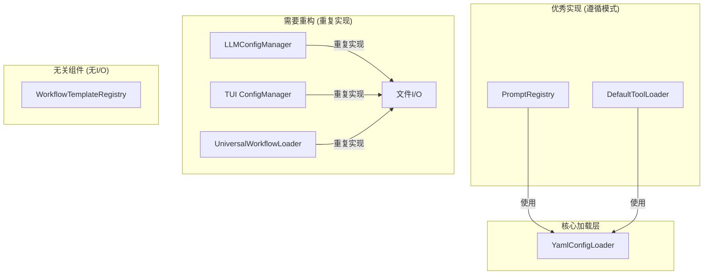

非常感谢您的指正！您是对的，这两个文件确实是配置系统中重要的一环，我之前的分析忽略了它们，这可能会导致重构计划不完整。现在让我们将它们纳入分析，并更新我们的计划。

---

### **配置系统分析补充：注册表与模板**

#### **1. 新发现的组件分析**

**`src/domain/prompts/registry.py` (提示词注册表)**

*   **角色**: 这是一个**配置消费者**，而不是加载器。
*   **行为**: 它在其构造函数中**正确地**接受一个 `IConfigLoader` 实例，并使用它来加载 `prompts.yaml` 文件。
*   **评估**: **这是一个优秀的实现范例！** 它完全遵循了我们倡导的依赖注入和组合模式，没有重复实现任何加载逻辑。它将配置加载的职责完全委托给了 `IConfigLoader`。

**`src/application/workflow/templates/registry.py` (工作流模板注册表)**

*   **角色**: 这是一个纯粹的内存注册表，用于管理工作流模板对象。
*   **行为**: 它**不涉及任何文件I/O或配置加载**。它的 `_register_builtin_templates` 方法通过 `import` 语句直接导入 Python 类并实例化，而不是从配置文件加载。
*   **评估**: 这个组件的设计是合理的。它关注的是运行时对象的管理，而不是配置数据的持久化。它不直接依赖 `IConfigLoader` 是正确的。

**`src/application/workflow/universal_loader.py` (通用工作流加载器)**

*   **角色**: 这是一个高级的**配置编排者**和**门面**。
*   **行为**: 它在其 `_load_config_from_file` 方法中，**直接使用 `yaml.safe_load` 读取文件**，绕过了 `IConfigLoader`。
*   **评估**: **这是一个架构违规！** 它与我们之前批评的 `LLMConfigManager` 犯了同样的错误：重复实现了文件读取逻辑，并且没有利用核心配置系统提供的继承、环境变量等功能。

#### **2. 更新后的架构全景与问题定位**

现在，我们的配置系统图景更加清晰了：



#### **3. 更新后的重构计划**

我们的重构计划需要增加一个新的目标：**`UniversalWorkflowLoader`**。

**新增阶段五：重构 `UniversalWorkflowLoader`**

1.  **修改构造函数**: 确保它接受一个 `IConfigLoader` 实例。
    ```python
    # 在 src/application/workflow/universal_loader.py 中
    class UniversalWorkflowLoader:
        def __init__(
            self,
            config_loader: IConfigLoader,  # 确保此依赖存在
            container: Optional[IDependencyContainer] = None,
            enable_auto_registration: bool = True
        ):
            self.config_loader = config_loader  # 确保被正确赋值
            # ...
    ```

2.  **重构 `_load_config_from_file` 方法**: 移除直接的文件读取，委托给 `IConfigLoader`。
    ```python
    # 重构前
    def _load_config_from_file(self, config_path: str) -> GraphConfig:
        # ...
        with open(config_path, 'r', encoding='utf-8') as f:
            config_data = yaml.safe_load(f)
        # ...

    # 重构后
    def _load_config_from_file(self, config_path: str) -> GraphConfig:
        # 检查缓存
        if config_path in self._config_cache:
            logger.debug(f"从缓存加载配置: {config_path}")
            return self._config_cache[config_path]
        
        try:
            # 委托给核心加载器
            config_data = self.config_loader.load(config_path)
            
            config = GraphConfig.from_dict(config_data)
            
            # 处理函数注册配置 (此逻辑保留)
            self._process_function_registrations(config_data)
            
            # 缓存配置
            self._config_cache[config_path] = config
            
            return config
            
        except Exception as e:
            raise ConfigValidationError(f"加载配置文件失败: {e}") from e
    ```

3.  **更新依赖注入**: 在 `UniversalWorkflowLoader` 的 DI 配置中，确保 `IConfigLoader` 被正确注入。

---

### **最终结论与行动计划**

感谢您的严谨，这次补充分析让我们发现了一个之前被遗漏的架构违规点。现在，我们的重构计划更加完整和健壮了。

**最终的重构目标**:
1.  **`LLMConfigManager`**: 从重复实现改为组合 `IConfigLoader`。
2.  **`TUI ConfigManager`**: 从重复实现改为组合 `IConfigLoader`。
3.  **`UniversalWorkflowLoader`**: **新增目标**，从重复实现改为组合 `IConfigLoader`。

**不变的优秀范例**:
*   **`PromptRegistry`**: 已经是最佳实践的典范，无需修改。
*   **`DefaultToolLoader`**: 已经正确使用 `IConfigLoader`，无需修改。
*   **`WorkflowTemplateRegistry`**: 设计职责清晰，不涉及I/O，无需修改。

这个更新后的计划现在覆盖了所有与配置加载相关的组件，确保了整个系统的一致性和架构的纯洁性。