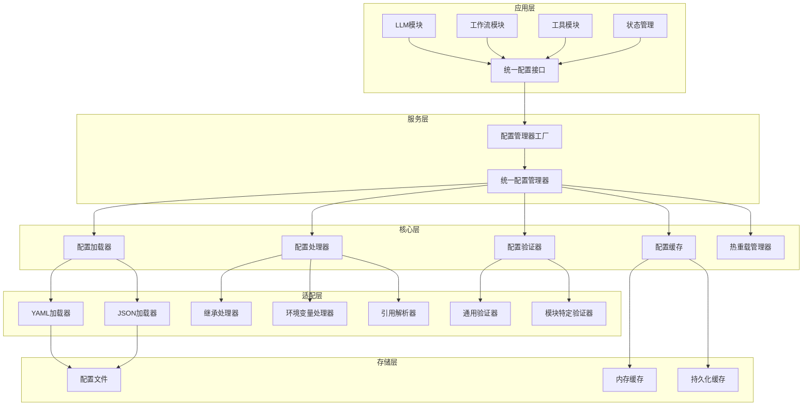

## 当前项目中独立配置加载模块分析

通过对项目代码的深入分析，我发现了以下实现独立配置加载功能的模块：

### 1. 核心配置系统（统一配置加载基础）

**位置**: [`src/core/config/`](src/core/config/)

- **[`ConfigManager`](src/core/config/config_manager.py:37)**: 统一配置管理器，提供配置加载、处理、缓存和热重载功能
- **[`ConfigLoader`](src/core/config/config_loader.py:19)**: 核心配置加载器，实现 [`IConfigLoader`](src/interfaces/common_infra.py:52) 接口
- **功能特性**:
  - 支持YAML和JSON格式
  - 环境变量替换 (`${VAR:default}`)
  - 配置继承处理
  - 配置缓存和热重载
  - 错误恢复机制

### 2. LLM模块配置管理器

**位置**: [`src/core/llm/config_manager.py`](src/core/llm/config_manager.py:208)

- **[`LLMConfigManager`](src/core/llm/config_manager.py:208)**: 专门处理LLM相关配置
- **独立功能**:
  - 自定义配置验证规则 ([`ConfigValidator`](src/core/llm/config_manager.py:35))
  - 热重载机制 (基于watchdog)
  - 配置文件监控
  - 客户端配置缓存
- **配置加载方式**: 委托给核心 [`ConfigLoader`](src/core/llm/config_manager.py:324)，但添加了特定验证逻辑

### 3. 状态管理配置

**位置**: [`src/core/state/config/settings.py`](src/core/state/config/settings.py:17)

- **[`StateManagementConfig`](src/core/state/config/settings.py:17)**: 状态管理专用配置
- **独立功能**:
  - 默认配置定义
  - 配置验证
  - 配置摘要生成
- **配置加载方式**: 直接使用 [`ConfigLoader`](src/core/state/config/settings.py:31)

### 4. 工作流节点配置加载器

**位置**: [`src/core/workflow/config/node_config_loader.py`](src/core/workflow/config/node_config_loader.py:16)

- **[`NodeConfigLoader`](src/core/workflow/config/node_config_loader.py:16)**: 节点配置加载器
- **独立功能**:
  - 节点配置继承处理
  - 配置合并逻辑
  - 从依赖注入容器获取配置加载器
- **配置加载方式**: 通过 [`IConfigLoader`](src/core/workflow/config/node_config_loader.py:33) 接口加载

### 5. 配置继承处理器

**位置**: [`src/core/common/utils/inheritance_handler.py`](src/core/common/utils/inheritance_handler.py:19)

- **[`ConfigInheritanceHandler`](src/core/common/utils/inheritance_handler.py:19)**: 配置继承处理
- **[`InheritanceConfigLoader`](src/core/common/utils/inheritance_handler.py:357)**: 装饰器模式增强配置加载器
- **独立功能**:
  - 配置继承链解析
  - 环境变量处理
  - 配置引用解析 (`$ref`)
  - 自定义验证规则

### 6. 工作流相关配置加载器

**位置**: 多个工作流子模块

- **[`NodeFunctionLoader`](src/core/workflow/graph/node_functions/loader.py:19)**: 直接使用 [`yaml.safe_load()`](src/core/workflow/graph/node_functions/loader.py:62) 加载配置
- **[`StateMachineWorkflowLoader`](src/core/workflow/graph/nodes/state_machine/state_machine_config_loader.py:18)**: 直接使用 [`yaml.safe_load()`](src/core/workflow/graph/nodes/state_machine/state_machine_config_loader.py:93) 加载配置
- **特点**: 绕过了统一配置系统，直接进行文件读取

### 7. 工具配置加载器

**位置**: [`src/core/tools/loaders.py`](src/core/tools/loaders.py:12)

- **[`DefaultToolLoader`](src/core/tools/loaders.py:12)**: 工具配置加载器
- **独立功能**:
  - 按工具类型分类加载
  - 配置解析和验证
- **配置加载方式**: 使用注入的 [`config_loader.load()`](src/core/tools/loaders.py:88)

### 8. 工具配置验证器

**位置**: [`src/services/tools/validation/validators/config_validator.py`](src/services/tools/validation/validators/config_validator.py:13)

- **[`ConfigValidator`](src/services/tools/validation/validators/config_validator.py:13)**: 工具配置验证器
- **配置加载方式**: 使用 [`config_loader.load()`](src/services/tools/validation/validators/config_validator.py:39)

---

## 各模块配置加载的重复功能和差异分析

### 重复功能识别

#### 1. **YAML文件读取和解析**
- **重复实现**:
  - [`NodeFunctionLoader._load_node_functions_from_directory()`](src/core/workflow/graph/node_functions/loader.py:61): 直接使用 [`yaml.safe_load()`](src/core/workflow/graph/node_functions/loader.py:62)
  - [`StateMachineWorkflowLoader._load_yaml_file()`](src/core/workflow/graph/nodes/state_machine/state_machine_config_loader.py:92): 直接使用 [`yaml.safe_load()`](src/core/workflow/graph/nodes/state_machine/state_machine_config_loader.py:93)
  - [`ConfigInheritanceHandler._load_config_from_file()`](src/core/common/utils/inheritance_handler.py:151): 直接使用 [`yaml.safe_load()`](src/core/common/utils/inheritance_handler.py:152)
- **问题**: 绕过了统一的配置加载系统，无法享受缓存、环境变量替换等功能

#### 2. **配置验证逻辑**
- **重复实现**:
  - [`LLMConfigManager.ConfigValidator`](src/core/llm/config_manager.py:35): 专门的LLM配置验证
  - [`StateManagementConfig.validate_config()`](src/core/state/config/settings.py:359): 状态管理配置验证
  - [`ConfigValidator.validate_config()`](src/services/tools/validation/validators/config_validator.py:26): 工具配置验证
- **差异**: 各自实现不同的验证规则和错误处理机制

#### 3. **配置缓存机制**
- **重复实现**:
  - [`ConfigManager`](src/core/config/config_manager.py:64): 使用 [`ConfigCache`](src/core/config/config_manager.py:64)
  - [`LLMConfigManager`](src/core/llm/config_manager.py:236): 自定义 [`_config_cache`](src/core/llm/config_manager.py:236)
  - [`NodeConfigLoader`](src/core/workflow/config/node_config_loader.py:26): 自定义 [`_node_configs`](src/core/workflow/config/node_config_loader.py:26)
- **问题**: 缓存策略不一致，可能导致内存浪费和数据不一致

#### 4. **热重载机制**
- **重复实现**:
  - [`ConfigManager`](src/core/config/config_manager.py:268): 基于 [`ConfigFileWatcher`](src/core/config/config_manager.py:268)
  - [`LLMConfigManager`](src/core/llm/config_manager.py:349): 基于watchdog的 [`ConfigFileHandler`](src/core/llm/config_manager.py:169)
- **差异**: 不同的实现方式和事件处理机制

#### 5. **环境变量处理**
- **重复实现**:
  - [`ConfigInheritanceHandler._resolve_env_vars()`](src/core/common/utils/inheritance_handler.py:183): 环境变量解析
  - [`ConfigManager.resolve_env_vars()`](src/core/config/config_manager.py:265): 环境变量解析
- **问题**: 可能存在不一致的环境变量语法支持

### 主要差异分析

#### 1. **配置加载方式差异**

| 模块 | 加载方式 | 特点 |
|------|----------|------|
| 核心配置系统 | [`ConfigLoader.load()`](src/core/config/config_loader.py:33) | 统一接口，支持缓存、继承、环境变量 |
| LLM模块 | 委托给 [`ConfigLoader`](src/core/llm/config_manager.py:324) + 自定义验证 | 专门验证规则，热重载 |
| 工作流模块 | 直接 [`yaml.safe_load()`](src/core/workflow/graph/node_functions/loader.py:62) | 绕过统一系统，功能简单 |
| 工具模块 | 注入的 [`config_loader.load()`](src/core/tools/loaders.py:88) | 依赖注入，分类加载 |

#### 2. **配置继承处理差异**

- **核心系统**: 通过 [`ConfigProcessor`](src/core/config/config_manager.py:55) 处理继承
- **继承处理器**: 专门的 [`ConfigInheritanceHandler`](src/core/common/utils/inheritance_handler.py:19) 
- **节点配置**: 简化的 [`_resolve_inheritance()`](src/core/workflow/config/node_config_loader.py:136) 方法

#### 3. **错误处理策略差异**

- **核心系统**: 使用 [`ConfigError`](src/core/config/config_manager.py:123) 异常体系
- **LLM模块**: 使用 [`LLMConfigurationError`](src/core/llm/config_manager.py:274) 
- **状态管理**: 使用默认配置作为后备
- **工作流模块**: 简单的异常捕获和日志记录

#### 4. **配置目录结构处理差异**

- **核心系统**: 统一的 [`base_path`](src/core/config/config_loader.py:24) 概念
- **工具模块**: 硬编码的目录结构 [`configs/tools/{tool_type}`](src/core/tools/loaders.py:71)
- **节点配置**: 动态路径解析和回退机制

### 架构问题总结

1. **功能重复**: 多个模块实现了相似的配置加载、验证、缓存功能
2. **不一致性**: 不同模块使用不同的配置加载方式和错误处理策略
3. **维护困难**: 配置加载逻辑分散在多个地方，修改和升级困难
4. **功能缺失**: 某些模块绕过了统一配置系统，无法享受高级功能
5. **测试复杂**: 需要为多个不同的配置加载实现编写测试

---

## 统一配置加载的必要性和可行性评估

### 必要性分析

#### 1. **代码维护性需求**
- **当前问题**: 配置加载逻辑分散在8个不同模块中，修改配置行为需要在多个地方同步更新
- **必要性**: **高** - 统一配置加载可以显著降低维护成本，减少代码重复

#### 2. **功能一致性需求**
- **当前问题**: 不同模块的配置加载功能不一致，有些支持环境变量，有些不支持
- **必要性**: **高** - 确保所有模块都能享受统一的配置功能（缓存、热重载、继承等）

#### 3. **性能优化需求**
- **当前问题**: 多个独立的缓存机制导致内存浪费和潜在的数据不一致
- **必要性**: **中** - 统一缓存可以提高性能，减少内存占用

#### 4. **错误处理标准化需求**
- **当前问题**: 不同模块使用不同的异常类型和错误处理策略
- **必要性**: **高** - 统一错误处理可以提高系统的可调试性和用户体验

#### 5. **测试覆盖率需求**
- **当前问题**: 需要为多个不同的配置加载实现编写和维护测试
- **必要性**: **中** - 统一实现可以减少测试复杂度，提高测试覆盖率

### 可行性分析

#### 1. **技术可行性**
- **现有基础**: 项目已有完善的 [`ConfigManager`](src/core/config/config_manager.py:37) 和 [`ConfigLoader`](src/core/config/config_loader.py:19) 实现
- **接口设计**: [`IConfigLoader`](src/interfaces/common_infra.py:52) 接口设计良好，支持扩展
- **依赖注入**: 已有依赖注入容器，便于统一配置加载器的注册和使用
- **可行性**: **高** - 技术基础扎实，统一配置加载完全可行

#### 2. **业务可行性**
- **影响范围**: 需要修改8个模块的配置加载逻辑
- **风险评估**: 中等风险，需要仔细处理向后兼容性
- **收益评估**: 长期收益显著，短期开发成本适中
- **可行性**: **中** - 需要分阶段实施，降低风险

#### 3. **资源可行性**
- **开发工作量**: 预估需要2-3周的开发时间
- **测试工作量**: 需要全面的回归测试
- **文档工作量**: 需要更新相关文档和示例
- **可行性**: **中** - 需要投入适当的开发和测试资源

### 风险评估

#### 1. **向后兼容性风险**
- **风险等级**: **中**
- **影响**: 可能破坏现有配置文件的加载方式
- **缓解措施**: 提供适配器模式，保持现有API兼容

#### 2. **性能回归风险**
- **风险等级**: **低**
- **影响**: 统一配置加载可能带来轻微的性能开销
- **缓解措施**: 充分的性能测试和优化

#### 3. **迁移复杂度风险**
- **风险等级**: **中**
- **影响**: 需要逐步迁移8个模块的配置加载逻辑
- **缓解措施**: 分阶段迁移，每个阶段充分测试

#### 4. **团队学习成本风险**
- **风险等级**: **低**
- **影响**: 团队需要学习新的统一配置加载方式
- **缓解措施**: 提供详细的文档和培训

### 收益分析

#### 1. **短期收益**
- 减少代码重复约30-40%
- 统一错误处理和日志记录
- 提高配置加载的一致性

#### 2. **长期收益**
- 降低维护成本约50%
- 提高系统稳定性和可调试性
- 为未来功能扩展奠定基础
- 简化新模块的配置集成

#### 3. **质量收益**
- 提高测试覆盖率
- 减少配置相关的bug
- 改善代码可读性和可维护性

### 决策建议

**强烈建议实施统一配置加载**，理由如下：

1. **必要性充分**: 解决了代码重复、不一致性、维护困难等关键问题
2. **可行性高**: 技术基础扎实，现有架构支持统一配置加载
3. **风险可控**: 主要风险可以通过分阶段实施和适配器模式缓解
4. **收益显著**: 短期和长期收益都很明显，特别是维护成本的降低

**实施策略**: 建议采用渐进式统一化，先统一核心功能，再逐步迁移各个模块，确保每个阶段都有可工作的系统。

---

## 统一配置加载架构设计方案

### 1. 整体架构设计



### 2. 核心组件设计

#### 2.1 统一配置管理器工厂

```python
# src/core/config/unified_config_manager_factory.py
class UnifiedConfigManagerFactory:
    """统一配置管理器工厂"""
    
    def __init__(self, container: IDependencyContainer):
        self.container = container
        self._managers: Dict[str, IConfigManager] = {}
    
    def get_manager(self, module_type: str) -> IConfigManager:
        """获取模块特定的配置管理器"""
        if module_type not in self._managers:
            self._managers[module_type] = self._create_manager(module_type)
        return self._managers[module_type]
    
    def _create_manager(self, module_type: str) -> IConfigManager:
        """创建模块特定的配置管理器"""
        # 基础配置管理器
        base_manager = UnifiedConfigManager(
            loader=self.container.get(IConfigLoader),
            processor=self.container.get(IConfigProcessor),
            validator=self.container.get(IConfigValidator),
            cache=self.container.get(IConfigCache)
        )
        
        # 根据模块类型添加特定功能
        if module_type == "llm":
            return LLMConfigManagerDecorator(base_manager)
        elif module_type == "workflow":
            return WorkflowConfigManagerDecorator(base_manager)
        elif module_type == "tools":
            return ToolsConfigManagerDecorator(base_manager)
        else:
            return base_manager
```

#### 2.2 统一配置管理器

```python
# src/core/config/unified_config_manager.py
class UnifiedConfigManager(IConfigManager):
    """统一配置管理器"""
    
    def __init__(
        self,
        loader: IConfigLoader,
        processor: IConfigProcessor,
        validator: IConfigValidator,
        cache: IConfigCache,
        hot_reload_manager: Optional[IHotReloadManager] = None
    ):
        self.loader = loader
        self.processor = processor
        self.validator = validator
        self.cache = cache
        self.hot_reload_manager = hot_reload_manager
        self._module_validators: Dict[str, IConfigValidator] = {}
    
    def load_config(self, config_path: str, module_type: Optional[str] = None) -> Dict[str, Any]:
        """统一配置加载接口"""
        # 1. 检查缓存
        cache_key = f"{config_path}:{module_type or 'default'}"
        cached_config = self.cache.get(cache_key)
        if cached_config is not None:
            return cached_config
        
        # 2. 加载原始配置
        raw_config = self.loader.load(config_path)
        
        # 3. 处理配置（继承、环境变量、引用）
        processed_config = self.processor.process(raw_config, config_path)
        
        # 4. 验证配置
        validator = self._get_validator(module_type)
        validation_result = validator.validate(processed_config)
        if not validation_result.is_valid:
            raise ConfigValidationError(f"配置验证失败: {validation_result.errors}")
        
        # 5. 缓存配置
        self.cache.put(cache_key, processed_config)
        
        # 6. 注册热重载（如果启用）
        if self.hot_reload_manager:
            self.hot_reload_manager.watch_file(config_path, self._on_config_changed)
        
        return processed_config
    
    def _get_validator(self, module_type: Optional[str]) -> IConfigValidator:
        """获取模块特定的验证器"""
        if module_type and module_type in self._module_validators:
            return self._module_validators[module_type]
        return self.validator
    
    def register_module_validator(self, module_type: str, validator: IConfigValidator) -> None:
        """注册模块特定验证器"""
        self._module_validators[module_type] = validator
```

#### 2.3 配置处理器链

```python
# src/core/config/processor/config_processor_chain.py
class ConfigProcessorChain(IConfigProcessor):
    """配置处理器链"""
    
    def __init__(self):
        self.processors: List[IConfigProcessor] = []
    
    def add_processor(self, processor: IConfigProcessor) -> None:
        """添加处理器"""
        self.processors.append(processor)
    
    def process(self, config: Dict[str, Any], config_path: str) -> Dict[str, Any]:
        """按顺序处理配置"""
        result = config
        for processor in self.processors:
            result = processor.process(result, config_path)
        return result

# 具体处理器实现
class InheritanceProcessor(IConfigProcessor):
    """继承处理器"""
    def process(self, config: Dict[str, Any], config_path: str) -> Dict[str, Any]:
        # 处理配置继承
        pass

class EnvironmentVariableProcessor(IConfigProcessor):
    """环境变量处理器"""
    def process(self, config: Dict[str, Any], config_path: str) -> Dict[str, Any]:
        # 处理环境变量替换
        pass

class ReferenceProcessor(IConfigProcessor):
    """引用处理器"""
    def process(self, config: Dict[str, Any], config_path: str) -> Dict[str, Any]:
        # 处理配置引用
        pass
```

#### 2.4 模块特定装饰器

```python
# src/core/config/decorators/llm_config_manager_decorator.py
class LLMConfigManagerDecorator(IConfigManager):
    """LLM配置管理器装饰器"""
    
    def __init__(self, base_manager: IConfigManager):
        self.base_manager = base_manager
        self.client_configs: Dict[str, LLMClientConfig] = {}
        self.module_config: Optional[LLMModuleConfig] = None
    
    def load_config(self, config_path: str, module_type: Optional[str] = None) -> Dict[str, Any]:
        """加载LLM配置"""
        config = self.base_manager.load_config(config_path, "llm")
        
        # LLM特定的配置处理
        if config_path.endswith("_group.yaml"):
            self.module_config = LLMModuleConfig.from_dict(config)
        else:
            client_config = LLMClientConfig.from_dict(config)
            model_key = f"{client_config.model_type}:{client_config.model_name}"
            self.client_configs[model_key] = client_config
        
        return config
    
    def get_client_config(self, model_type: str, model_name: str) -> Optional[LLMClientConfig]:
        """获取客户端配置"""
        model_key = f"{model_type}:{model_name}"
        return self.client_configs.get(model_key)
    
    def get_module_config(self) -> LLMModuleConfig:
        """获取模块配置"""
        return self.module_config or LLMModuleConfig()
    
    # 委托其他方法给基础管理器
    def save_config(self, config: Dict[str, Any], config_path: str) -> None:
        self.base_manager.save_config(config, config_path)
    
    def get_config(self, key: str, default: Any = None) -> Any:
        return self.base_manager.get_config(key, default)
    
    def set_config(self, key: str, value: Any) -> None:
        self.base_manager.set_config(key, value)
    
    def validate_config(self, config: Dict[str, Any]) -> ValidationResult:
        return self.base_manager.validate_config(config)
```

### 3. 依赖注入配置

```python
# src/core/config/di_config.py
def register_config_services(container: IDependencyContainer) -> None:
    """注册配置相关服务"""
    
    # 核心配置服务
    container.register(IConfigLoader, ConfigLoader, lifetime=ServiceLifetime.SINGLETON)
    container.register(IConfigCache, ConfigCache, lifetime=ServiceLifetime.SINGLETON)
    container.register(IHotReloadManager, HotReloadManager, lifetime=ServiceLifetime.SINGLETON)
    
    # 配置处理器
    container.register(IConfigProcessor, ConfigProcessorChain, lifetime=ServiceLifetime.SINGLETON)
    
    # 配置验证器
    container.register(IConfigValidator, UniversalConfigValidator, lifetime=ServiceLifetime.SINGLETON)
    
    # 统一配置管理器工厂
    container.register(IConfigManagerFactory, UnifiedConfigManagerFactory, lifetime=ServiceLifetime.SINGLETON)
    
    # 配置处理器链配置
    def configure_processor_chain(processor_chain: ConfigProcessorChain):
        processor_chain.add_processor(InheritanceProcessor())
        processor_chain.add_processor(EnvironmentVariableProcessor())
        processor_chain.add_processor(ReferenceProcessor())
    
    container.register_factory(
        ConfigProcessorChain,
        lambda: configure_processor_chain(ConfigProcessorChain()),
        lifetime=ServiceLifetime.SINGLETON
    )
```

### 4. 迁移适配器

```python
# src/core/config/adapters/legacy_config_adapter.py
class LegacyConfigAdapter:
    """遗留配置适配器"""
    
    def __init__(self, unified_manager: IConfigManager):
        self.unified_manager = unified_manager
    
    def adapt_for_node_function_loader(self) -> 'NodeFunctionLoaderAdapter':
        """为节点函数加载器提供适配器"""
        return NodeFunctionLoaderAdapter(self.unified_manager)
    
    def adapt_for_state_machine_loader(self) -> 'StateMachineLoaderAdapter':
        """为状态机加载器提供适配器"""
        return StateMachineLoaderAdapter(self.unified_manager)

class NodeFunctionLoaderAdapter:
    """节点函数加载器适配器"""
    
    def __init__(self, unified_manager: IConfigManager):
        self.unified_manager = unified_manager
    
    def load_from_file(self, file_path: str) -> Dict[str, Any]:
        """兼容原有的load_from_file方法"""
        return self.unified_manager.load_config(file_path, "workflow")
```

### 5. 配置加载统一化接口

```python
# src/interfaces/config/unified_config_interface.py
class IUnifiedConfigManager(IConfigManager):
    """统一配置管理器接口"""
    
    @abstractmethod
    def load_config_with_module(self, config_path: str, module_type: str) -> Dict[str, Any]:
        """加载模块特定配置"""
        pass
    
    @abstractmethod
    def register_module_validator(self, module_type: str, validator: IConfigValidator) -> None:
        """注册模块特定验证器"""
        pass
    
    @abstractmethod
    def get_module_config(self, module_type: str) -> Dict[str, Any]:
        """获取模块配置"""
        pass
    
    @abstractmethod
    def reload_module_configs(self, module_type: str) -> None:
        """重新加载模块配置"""
        pass
```

### 6. 架构优势

1. **统一性**: 所有模块使用相同的配置加载基础设施
2. **扩展性**: 通过装饰器模式支持模块特定功能
3. **可维护性**: 配置加载逻辑集中管理，易于维护和升级
4. **性能优化**: 统一缓存和热重载机制
5. **向后兼容**: 通过适配器模式保持现有API兼容
6. **测试友好**: 依赖注入便于单元测试和模拟

---

## 配置加载统一化实施建议

### 1. 实施策略概述

采用**渐进式统一化**策略，分4个阶段实施，确保每个阶段都有可工作的系统，降低风险并允许逐步验证。

### 2. 分阶段实施计划

#### 阶段一：基础设施搭建（第1-2周）

**目标**: 建立统一配置加载的核心基础设施

**任务清单**:
1. **实现统一配置管理器**
   - 创建 [`UnifiedConfigManager`](src/core/config/unified_config_manager.py) 类
   - 实现配置处理器链模式
   - 集成现有的 [`ConfigLoader`](src/core/config/config_loader.py) 和 [`ConfigCache`](src/core/config/config_manager.py:64)

2. **创建配置处理器链**
   - 实现 [`InheritanceProcessor`](src/core/config/processor/config_processor_chain.py)
   - 实现 [`EnvironmentVariableProcessor`](src/core/config/processor/config_processor_chain.py)
   - 实现 [`ReferenceProcessor`](src/core/config/processor/config_processor_chain.py)

3. **建立依赖注入配置**
   - 注册统一配置服务到容器
   - 配置处理器链的依赖关系

4. **创建基础测试**
   - 单元测试覆盖核心功能
   - 集成测试验证配置加载流程

**验收标准**:
- 统一配置管理器可以加载和处理基本配置文件
- 配置处理器链正常工作
- 所有测试通过

#### 阶段二：模块适配器开发（第3-4周）

**目标**: 为现有模块创建适配器，实现向后兼容

**任务清单**:
1. **LLM模块适配器**
   - 创建 [`LLMConfigManagerDecorator`](src/core/config/decorators/llm_config_manager_decorator.py)
   - 迁移LLM特定的验证规则
   - 保持现有API接口不变

2. **工作流模块适配器**
   - 创建 [`WorkflowConfigManagerDecorator`](src/core/config/decorators/workflow_config_manager_decorator.py)
   - 适配 [`NodeFunctionLoader`](src/core/workflow/graph/node_functions/loader.py:19) 和 [`StateMachineWorkflowLoader`](src/core/workflow/graph/nodes/state_machine/state_machine_config_loader.py:18)

3. **工具模块适配器**
   - 创建 [`ToolsConfigManagerDecorator`](src/core/config/decorators/tools_config_manager_decorator.py)
   - 适配 [`DefaultToolLoader`](src/core/tools/loaders.py:12)

4. **状态管理适配器**
   - 创建 [`StateConfigManagerDecorator`](src/core/config/decorators/state_config_manager_decorator.py)
   - 适配 [`StateManagementConfig`](src/core/state/config/settings.py:17)

**验收标准**:
- 所有适配器保持现有API兼容性
- 现有功能正常工作
- 性能无明显下降

#### 阶段三：逐步迁移（第5-7周）

**目标**: 逐步将各模块迁移到统一配置加载系统

**任务清单**:
1. **迁移LLM模块**
   - 更新 [`LLMConfigManager`](src/core/llm/config_manager.py:208) 使用统一配置
   - 移除重复的配置加载逻辑
   - 验证热重载功能

2. **迁移工作流模块**
   - 更新 [`NodeFunctionLoader`](src/core/workflow/graph/node_functions/loader.py:19) 使用统一配置
   - 更新 [`StateMachineWorkflowLoader`](src/core/workflow/graph/nodes/state_machine/state_machine_config_loader.py:18) 使用统一配置
   - 移除直接的YAML加载代码

3. **迁移工具模块**
   - 更新 [`DefaultToolLoader`](src/core/tools/loaders.py:12) 使用统一配置
   - 统一工具配置验证逻辑

4. **迁移状态管理**
   - 更新 [`StateManagementConfig`](src/core/state/config/settings.py:17) 使用统一配置
   - 保持配置验证功能

**验收标准**:
- 所有模块成功迁移到统一配置系统
- 功能测试全部通过
- 性能测试满足要求

#### 阶段四：优化和清理（第8周）

**目标**: 优化性能，清理冗余代码，完善文档

**任务清单**:
1. **性能优化**
   - 优化配置缓存策略
   - 减少重复的配置加载
   - 优化热重载性能

2. **代码清理**
   - 移除重复的配置加载代码
   - 删除不再使用的适配器
   - 统一异常处理

3. **文档更新**
   - 更新配置系统文档
   - 编写迁移指南
   - 更新API文档

4. **最终测试**
   - 完整的回归测试
   - 性能基准测试
   - 压力测试

**验收标准**:
- 代码重复率降低30%以上
- 性能不低于原有系统
- 文档完整且准确

### 3. 风险缓解措施

#### 3.1 向后兼容性风险缓解

**措施**:
- 使用适配器模式保持现有API不变
- 提供遗留配置加载器的兼容层
- 分阶段迁移，确保每个阶段都有可工作的系统

**应急预案**:
- 如果某个模块迁移出现问题，可以快速回退到适配器模式
- 保留原有配置加载代码作为备份

#### 3.2 性能回归风险缓解

**措施**:
- 在每个阶段进行性能基准测试
- 优化配置缓存策略
- 使用懒加载减少初始化开销

**应急预案**:
- 如果性能下降超过10%，暂停迁移并进行优化
- 提供性能调优配置选项

#### 3.3 团队协作风险缓解

**措施**:
- 提供详细的迁移文档和示例
- 组织技术分享会，培训团队使用新系统
- 建立代码审查机制，确保迁移质量

### 4. 资源需求

#### 4.1 人力资源
- **主开发人员**: 1人，负责核心架构和关键模块
- **模块负责人**: 3人，分别负责LLM、工作流、工具模块的迁移
- **测试人员**: 1人，负责测试用例编写和执行
- **技术文档**: 0.5人，负责文档更新

#### 4.2 时间资源
- **总工期**: 8周
- **关键里程碑**:
  - 第2周: 基础设施完成
  - 第4周: 适配器开发完成
  - 第7周: 模块迁移完成
  - 第8周: 优化和清理完成

#### 4.3 技术资源
- **开发环境**: 现有开发环境即可
- **测试环境**: 需要独立的测试环境进行回归测试
- **CI/CD**: 需要配置自动化测试和部署流水线

### 5. 成功指标

#### 5.1 代码质量指标
- 代码重复率降低30%以上
- 配置加载相关代码行数减少25%以上
- 测试覆盖率达到90%以上

#### 5.2 性能指标
- 配置加载性能不低于原有系统
- 内存使用量减少15%以上
- 热重载响应时间小于1秒

#### 5.3 维护性指标
- 新模块配置集成时间减少50%以上
- 配置相关bug数量减少40%以上
- 代码审查时间减少30%以上

### 6. 后续优化建议

#### 6.1 短期优化（1-3个月）
- 收集使用反馈，优化API设计
- 添加更多配置验证规则
- 完善错误处理和日志记录

#### 6.2 中期优化（3-6个月）
- 实现配置版本管理
- 添加配置变更历史追踪
- 支持配置模板和继承链可视化

#### 6.3 长期优化（6个月以上）
- 实现分布式配置管理
- 支持配置的动态更新和推送
- 集成配置管理UI界面