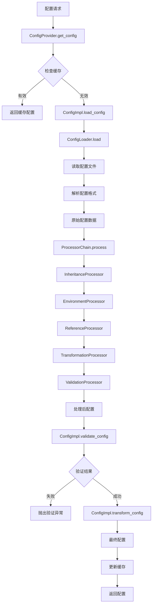
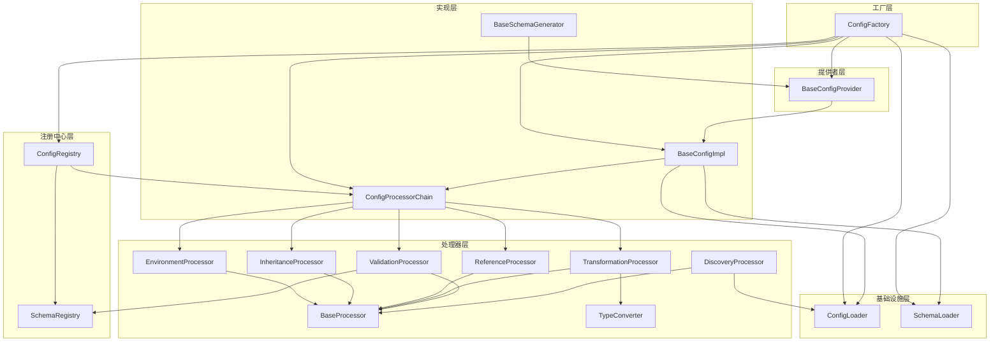
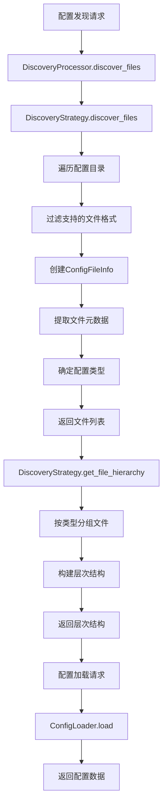
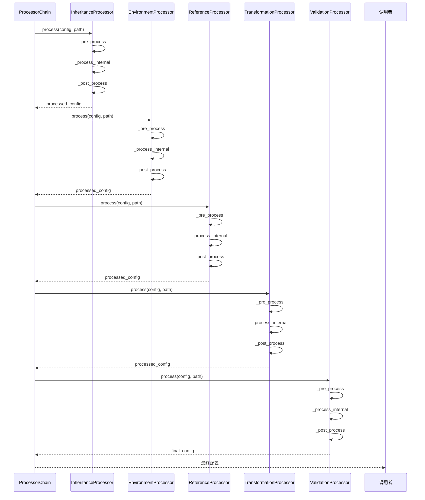
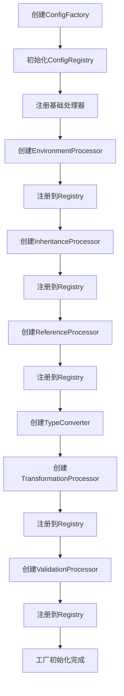
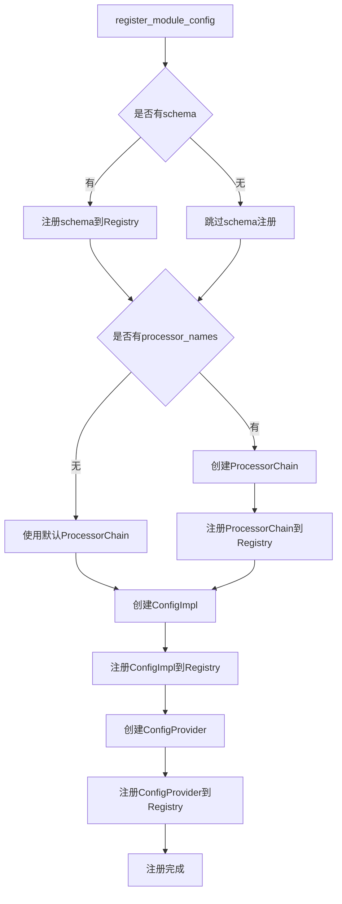
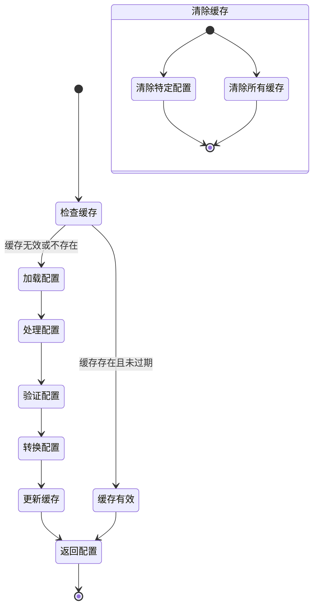
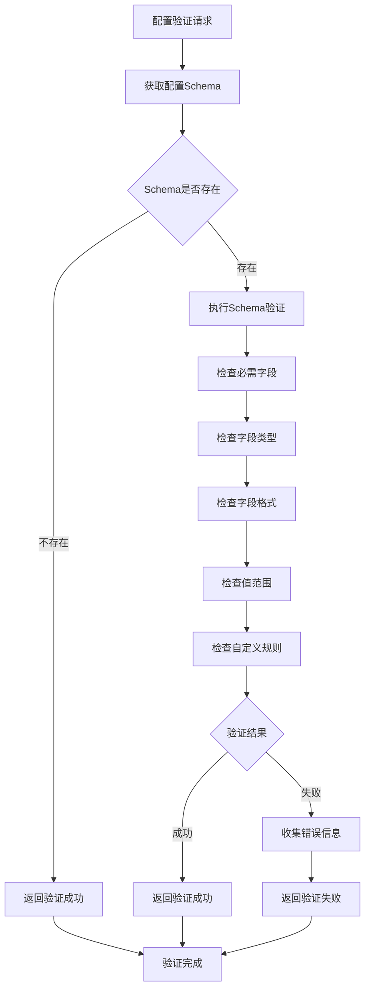
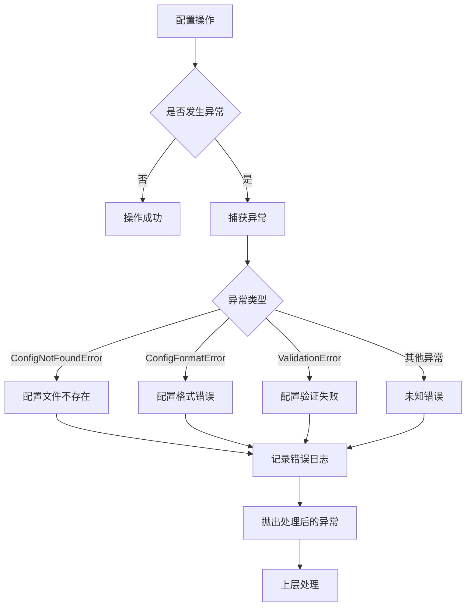
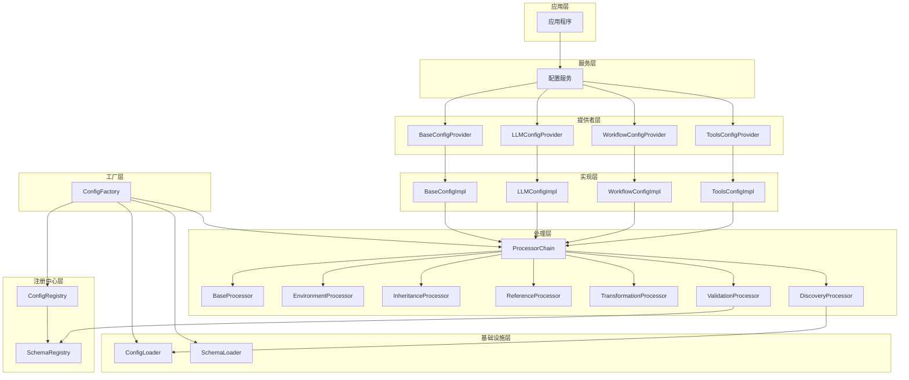

# 配置系统工作流图表

## 1. 配置加载完整工作流

## 2. 模块依赖关系图

## 3. 配置发现流程图

## 4. 处理器链执行流程

## 5. 配置工厂初始化流程

## 6. 模块配置注册流程

## 7. 配置缓存管理流程

## 8. 配置验证流程

## 9. 错误处理流程

## 10. 配置系统架构层次图

这些图表清晰地展示了配置系统的各个工作流程和模块关系，有助于理解系统的整体架构和运行机制。