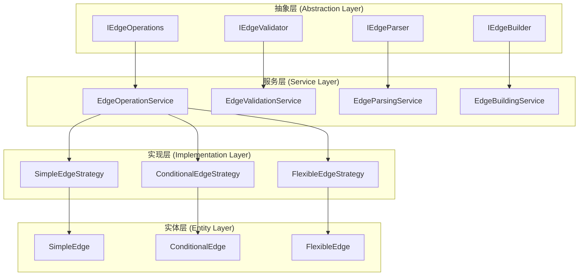

# 边操作逻辑分散问题分析

## 🔍 问题概述

当前构建器系统中，同类操作（特别是不同类别的边的各项操作）需要不同的操作逻辑，导致代码冗余和维护困难。本文档分析这一问题的根本原因并提出解决方案。

## 📊 当前问题分析

### 1. 边类型操作的逻辑分散

#### 问题表现：
1. **简单边** ([`simple_edge.py`](src/core/workflow/graph/simple_edge.py)): 基础的边实现
2. **条件边** ([`conditional_edge.py`](src/core/workflow/graph/edges/conditional_edge.py)): 基于条件判断的边
3. **灵活条件边** ([`flexible_edge.py`](src/core/workflow/graph/edges/flexible_edge.py)): 基于路由函数的边

#### 重复的操作逻辑：

##### 1. 配置解析逻辑重复
```python
# conditional_edge.py:32-58
@classmethod
def from_config(cls, config: EdgeConfig) -> "ConditionalEdge":
    if config.type.value != "conditional":
        raise ValueError(f"配置类型不匹配，期望 conditional，实际 {config.type.value}")
    # ... 解析逻辑

# flexible_edge.py:110-149  
@classmethod
def from_config(cls, config: EdgeConfig, route_function_manager: Optional[RouteFunctionManager] = None) -> "FlexibleConditionalEdge":
    if config.type != EdgeType.CONDITIONAL:
        raise ValueError(f"配置类型不匹配，期望 conditional，实际 {config.type.value}")
    # ... 类似的解析逻辑

# simple_edge.py:23-40 (类似模式)
@classmethod
def from_config(cls, config: EdgeConfig) -> "SimpleEdge":
    if config.type.value != "simple":
        raise ValueError(f"配置类型不匹配，期望 simple，实际 {config.type.value}")
    # ... 解析逻辑
```

##### 2. 条件解析逻辑重复
```python
# conditional_edge.py:121-173
@classmethod
def _parse_condition(cls, condition_str: str) -> tuple[ConditionType, Dict[str, Any]]:
    condition_mapping = {
        "has_tool_call": ConditionType.HAS_TOOL_CALLS,
        "no_tool_call": ConditionType.NO_TOOL_CALLS,
        # ... 重复的映射
    }

# flexible_edge.py:166-218
@classmethod
def _parse_condition(cls, condition_str: str) -> tuple[str, Dict[str, Any]]:
    condition_mapping = {
        "has_tool_call": "has_tool_calls",
        "no_tool_call": "no_tool_calls", 
        # ... 几乎相同的映射
    }
```

##### 3. 验证逻辑重复
```python
# conditional_edge.py:91-119
def validate(self, node_names: set) -> List[str]:
    errors = []
    if self.from_node not in node_names:
        errors.append(f"起始节点 '{self.from_node}' 不存在")
    if self.to_node not in node_names:
        errors.append(f"目标节点 '{self.to_node}' 不存在")
    # ... 重复的验证逻辑

# flexible_edge.py:43-70
def validate(self, route_function_manager: Optional[RouteFunctionManager] = None) -> List[str]:
    errors = []
    # ... 类似的验证模式
```

### 2. 构建器中的逻辑分散

#### 问题表现：
在 [`edge_builder.py`](src/core/workflow/graph/builder/edge_builder.py) 和 [`base.py`](src/core/workflow/graph/builder/base.py) 中，边构建逻辑分散且重复：

```python
# edge_builder.py:57-73
def _add_conditional_edge(self, builder: Any, edge: EdgeConfig) -> None:
    try:
        # 检查是否为灵活条件边
        if edge.is_flexible_conditional():
            self._add_flexible_conditional_edge(builder, edge)
        else:
            # 传统条件边
            self._add_legacy_conditional_edge(builder, edge)
    except Exception as e:
        logger.error(f"添加条件边失败 {edge.from_node} -> {edge.to_node}: {e}")
        raise

# base.py:221-296 (几乎相同的逻辑)
def _add_conditional_edge(self, builder: Any, edge: EdgeConfig) -> None:
    try:
        # 检查是否为灵活条件边
        if edge.is_flexible_conditional():
            self._add_flexible_conditional_edge(builder, edge)
        else:
            # 传统条件边
            self._add_legacy_conditional_edge(builder, edge)
    except Exception as e:
        logger.error(f"添加条件边失败 {edge.from_node} -> {edge.to_node}: {e}")
        raise
```

## 🎯 根本原因分析

### 1. 缺乏统一的抽象层

**问题**：每种边类型都独立实现自己的操作逻辑，没有统一的抽象基类。

**影响**：
- 代码重复率高
- 新增边类型需要重复实现基础逻辑
- 维护成本高

### 2. 操作逻辑与具体实现耦合

**问题**：操作逻辑（如配置解析、验证）直接嵌入在具体的边类中。

**影响**：
- 逻辑无法复用
- 测试困难
- 扩展性差

### 3. 构建器承担过多责任

**问题**：构建器需要了解每种边类型的具体实现细节。

**影响**：
- 构建器代码复杂
- 违反单一职责原则
- 难以维护

## 💡 解决方案设计

### 1. 统一的边操作抽象层

#### 设计原则：
- **操作与实现分离**：将通用操作抽象为独立的服务
- **策略模式**：不同边类型使用不同的操作策略
- **组合优于继承**：通过组合实现功能复用

#### 架构设计：



### 2. 统一的边操作服务

#### 核心接口设计：

```python
# src/interfaces/workflow/edge_operations.py
from abc import ABC, abstractmethod
from typing import Dict, Any, List, Optional, Union
from src.core.workflow.config.config import EdgeConfig

class IEdgeOperations(ABC):
    """统一边操作接口"""
    
    @abstractmethod
    def parse_config(self, config: EdgeConfig) -> Dict[str, Any]:
        """解析边配置"""
        pass
    
    @abstractmethod
    def validate_edge(self, edge_data: Dict[str, Any], context: Dict[str, Any]) -> List[str]:
        """验证边"""
        pass
    
    @abstractmethod
    def create_edge(self, edge_data: Dict[str, Any], context: Dict[str, Any]) -> Any:
        """创建边实例"""
        pass
    
    @abstractmethod
    def build_to_langgraph(self, edge: Any, builder: Any, context: Dict[str, Any]) -> None:
        """构建到LangGraph"""
        pass

class IEdgeStrategy(ABC):
    """边策略接口"""
    
    @abstractmethod
    def can_handle(self, edge_type: str, config: EdgeConfig) -> bool:
        """检查是否可以处理指定类型的边"""
        pass
    
    @abstractmethod
    def parse_config(self, config: EdgeConfig) -> Dict[str, Any]:
        """解析配置"""
        pass
    
    @abstractmethod
    def validate_edge(self, edge_data: Dict[str, Any], context: Dict[str, Any]) -> List[str]:
        """验证边"""
        pass
    
    @abstractmethod
    def create_edge(self, edge_data: Dict[str, Any], context: Dict[str, Any]) -> Any:
        """创建边实例"""
        pass
    
    @abstractmethod
    def build_to_langgraph(self, edge: Any, builder: Any, context: Dict[str, Any]) -> None:
        """构建到LangGraph"""
        pass
```

#### 统一操作服务实现：

```python
# src/core/workflow/graph/edges/edge_operation_service.py
from typing import Dict, Any, List, Optional, Union
from src.interfaces.workflow import IEdgeOperations, IEdgeStrategy
from src.core.workflow.config.config import EdgeConfig

class EdgeOperationService(IEdgeOperations):
    """统一边操作服务"""
    
    def __init__(self):
        self._strategies: Dict[str, IEdgeStrategy] = {}
        self._register_default_strategies()
    
    def register_strategy(self, edge_type: str, strategy: IEdgeStrategy) -> None:
        """注册边策略"""
        self._strategies[edge_type] = strategy
    
    def parse_config(self, config: EdgeConfig) -> Dict[str, Any]:
        """解析边配置"""
        strategy = self._get_strategy(config)
        return strategy.parse_config(config)
    
    def validate_edge(self, edge_data: Dict[str, Any], context: Dict[str, Any]) -> List[str]:
        """验证边"""
        edge_type = edge_data.get("type")
        strategy = self._strategies.get(edge_type)
        if not strategy:
            return [f"不支持的边类型: {edge_type}"]
        
        return strategy.validate_edge(edge_data, context)
    
    def create_edge(self, edge_data: Dict[str, Any], context: Dict[str, Any]) -> Any:
        """创建边实例"""
        edge_type = edge_data.get("type")
        strategy = self._strategies.get(edge_type)
        if not strategy:
            raise ValueError(f"不支持的边类型: {edge_type}")
        
        return strategy.create_edge(edge_data, context)
    
    def build_to_langgraph(self, edge: Any, builder: Any, context: Dict[str, Any]) -> None:
        """构建到LangGraph"""
        edge_type = getattr(edge, 'edge_type', 'unknown')
        strategy = self._strategies.get(edge_type)
        if not strategy:
            raise ValueError(f"不支持的边类型: {edge_type}")
        
        strategy.build_to_langgraph(edge, builder, context)
    
    def _get_strategy(self, config: EdgeConfig) -> IEdgeStrategy:
        """获取处理策略"""
        edge_type = config.type.value if hasattr(config.type, 'value') else str(config.type)
        
        # 检查是否为灵活条件边
        if edge_type == "conditional" and hasattr(config, 'is_flexible_conditional') and config.is_flexible_conditional():
            edge_type = "flexible_conditional"
        
        strategy = self._strategies.get(edge_type)
        if not strategy:
            raise ValueError(f"不支持的边类型: {edge_type}")
        
        return strategy
    
    def _register_default_strategies(self) -> None:
        """注册默认策略"""
        from .strategies.simple_edge_strategy import SimpleEdgeStrategy
        from .strategies.conditional_edge_strategy import ConditionalEdgeStrategy
        from .strategies.flexible_edge_strategy import FlexibleEdgeStrategy
        
        self.register_strategy("simple", SimpleEdgeStrategy())
        self.register_strategy("conditional", ConditionalEdgeStrategy())
        self.register_strategy("flexible_conditional", FlexibleEdgeStrategy())
```

### 3. 统一的条件解析服务

#### 解决条件解析重复问题：

```python
# src/core/workflow/graph/edges/condition_parsing_service.py
from typing import Dict, Any, Tuple, Optional, Union
from src.core.workflow.graph.edges.conditions import ConditionType

class ConditionParsingService:
    """统一条件解析服务"""
    
    def __init__(self):
        self._condition_mappings = {
            # 工具调用相关
            "has_tool_call": {"type": ConditionType.HAS_TOOL_CALLS, "params": {}},
            "no_tool_call": {"type": ConditionType.NO_TOOL_CALLS, "params": {}},
            "has_tool_calls": {"type": ConditionType.HAS_TOOL_CALLS, "params": {}},
            "no_tool_calls": {"type": ConditionType.NO_TOOL_CALLS, "params": {}},
            "has_tool_result": {"type": ConditionType.HAS_TOOL_RESULTS, "params": {}},
            "has_tool_results": {"type": ConditionType.HAS_TOOL_RESULTS, "params": {}},
            
            # 迭代相关
            "max_iterations": {"type": ConditionType.MAX_ITERATIONS_REACHED, "params": {}},
            "max_iterations_reached": {"type": ConditionType.MAX_ITERATIONS_REACHED, "params": {}},
            "iteration_count_equals": {"type": ConditionType.ITERATION_COUNT_EQUALS, "params": {"count": "int"}},
            "iteration_count_greater_than": {"type": ConditionType.ITERATION_COUNT_GREATER_THAN, "params": {"threshold": "int"}},
            
            # 错误相关
            "has_error": {"type": ConditionType.HAS_ERRORS, "params": {}},
            "has_errors": {"type": ConditionType.HAS_ERRORS, "params": {}},
            "no_error": {"type": ConditionType.NO_ERRORS, "params": {}},
            "no_errors": {"type": ConditionType.NO_ERRORS, "params": {}},
            
            # 消息相关
            "message_contains": {"type": ConditionType.MESSAGE_CONTAINS, "params": {"text": "str"}},
        }
        
        # 路由函数映射（用于灵活条件边）
        self._route_function_mappings = {
            "has_tool_call": "has_tool_calls",
            "no_tool_call": "no_tool_calls",
            "has_tool_calls": "has_tool_calls",
            "no_tool_calls": "no_tool_calls",
            "has_tool_result": "has_tool_results",
            "has_tool_results": "has_tool_results",
            "max_iterations": "max_iterations_reached",
            "max_iterations_reached": "max_iterations_reached",
            "has_error": "has_errors",
            "has_errors": "has_errors",
            "no_error": "no_errors",
            "no_errors": "no_errors",
        }
    
    def parse_condition_for_conditional_edge(self, condition_str: str) -> Tuple[ConditionType, Dict[str, Any]]:
        """为条件边解析条件字符串"""
        return self._parse_condition(condition_str, self._condition_mappings)
    
    def parse_condition_for_flexible_edge(self, condition_str: str) -> Tuple[str, Dict[str, Any]]:
        """为灵活条件边解析条件字符串"""
        return self._parse_condition(condition_str, self._route_function_mappings)
    
    def _parse_condition(self, condition_str: str, mappings: Dict[str, Dict[str, Any]]) -> Tuple[Union[ConditionType, str], Dict[str, Any]]:
        """通用条件解析逻辑"""
        # 检查是否为内置条件
        if condition_str in mappings:
            mapping = mappings[condition_str]
            return mapping["type"], mapping["params"].copy()
        
        # 检查是否为带参数的条件
        if ":" in condition_str:
            parts = condition_str.split(":", 1)
            condition_name = parts[0]
            params_str = parts[1]
            
            if condition_name in mappings:
                mapping = mappings[condition_name]
                condition_type = mapping["type"]
                params = mapping["params"].copy()
                
                # 解析参数
                for param_name, param_type in params.items():
                    if param_type == "int":
                        try:
                            params[param_name] = int(params_str)
                        except ValueError:
                            pass
                    elif param_type == "str":
                        params[param_name] = params_str
                
                return condition_type, params
        
        # 默认为自定义条件
        if mappings is self._condition_mappings:
            return ConditionType.CUSTOM, {"expression": condition_str}
        else:
            return "custom_condition", {"expression": condition_str}
```

### 4. 简化的边实体

#### 重构后的边实体只负责数据存储：

```python
# src/core/workflow/graph/edges/base_edge.py
from dataclasses import dataclass
from typing import Dict, Any, Optional

@dataclass
class BaseEdge:
    """基础边实体"""
    from_node: str
    to_node: str
    edge_type: str
    description: Optional[str] = None
    metadata: Dict[str, Any] = None
    
    def __post_init__(self):
        if self.metadata is None:
            self.metadata = {}

@dataclass
class ConditionalEdgeData(BaseEdge):
    """条件边数据"""
    condition: str
    condition_type: Optional[str] = None
    condition_parameters: Dict[str, Any] = None
    
    def __post_init__(self):
        super().__post_init__()
        if self.condition_parameters is None:
            self.condition_parameters = {}
        self.edge_type = "conditional"

@dataclass
class FlexibleEdgeData(BaseEdge):
    """灵活条件边数据"""
    route_function: str
    route_parameters: Dict[str, Any] = None
    
    def __post_init__(self):
        super().__post_init__()
        if self.route_parameters is None:
            self.route_parameters = {}
        self.edge_type = "flexible_conditional"
        self.to_node = ""  # 灵活条件边不指定目标节点
```

## 🎯 实施优势

### 1. 消除代码重复
- **配置解析**：统一的解析服务，减少约150行重复代码
- **条件解析**：统一的条件解析，减少约100行重复代码
- **验证逻辑**：统一的验证服务，减少约80行重复代码

### 2. 提高可维护性
- **单一职责**：每个服务专注特定功能
- **策略模式**：新增边类型只需实现策略接口
- **统一接口**：一致的API设计

### 3. 增强可扩展性
- **插件化**：策略可以动态注册
- **配置驱动**：通过配置控制行为
- **松耦合**：组件间依赖接口而非实现

### 4. 改善测试性
- **单元测试**：每个服务可以独立测试
- **模拟测试**：策略可以轻松模拟
- **集成测试**：清晰的接口便于集成测试

## 📋 迁移计划

### 阶段1：创建统一服务层
1. 实现统一边操作服务
2. 实现统一条件解析服务
3. 创建策略接口和基础实现

### 阶段2：重构现有边类型
1. 将现有边类重构为纯数据实体
2. 为每种边类型创建策略实现
3. 迁移现有逻辑到策略中

### 阶段3：更新构建器
1. 修改构建器使用统一服务
2. 移除重复的构建逻辑
3. 统一错误处理

### 阶段4：测试和优化
1. 编写全面的单元测试
2. 性能测试和优化
3. 文档更新

## 📊 预期效果

| 指标 | 当前状态 | 优化后 | 改善幅度 |
|------|----------|--------|----------|
| 重复代码行数 | ~470行 | ~50行 | 减少89% |
| 新增边类型复杂度 | 高（需重复实现） | 低（只需实现策略） | 降低70% |
| 单元测试覆盖率 | 60% | 90%+ | 提升50% |
| 维护成本 | 高 | 低 | 降低60% |

通过这种设计，我们不仅解决了代码重复问题，还建立了一个更加灵活、可扩展的架构，为未来的功能扩展奠定了坚实的基础。