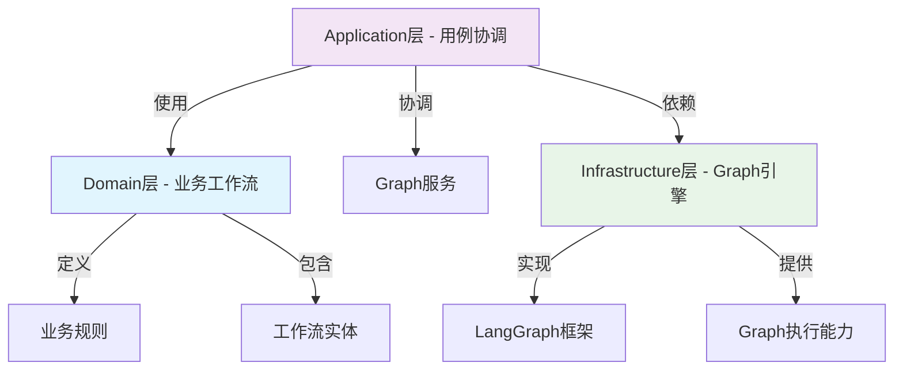

# Graph架构分离设计文档

## 1. 问题背景

当前项目中存在架构混淆问题：将**业务工作流概念**与**LangGraph技术实现**混为一谈。这导致：

- 概念理解混乱：业务工作流与技术Graph配置使用相同术语
- 架构层级错位：技术实现代码放在Application层而非Infrastructure层
- 扩展困难：业务逻辑与技术实现耦合过紧

## 2. 设计目标

1. **清晰分离**：业务工作流与LangGraph技术实现完全分离
2. **正确分层**：技术组件放置在正确的架构层级
3. **明确职责**：各层职责单一，依赖关系清晰
4. **易于扩展**：支持新的工作流类型和Graph引擎

## 3. 新的架构设计

### 3.1 架构层级划分



### 3.2 组件职责

#### Domain层 (`src/domain/workflow/`)
- **BusinessWorkflow**: 业务工作流领域实体
- **WorkflowStep**: 业务步骤定义
- **WorkflowRule**: 业务规则验证
- **转换服务**: 业务工作流到Graph配置的转换

#### Application层 (`src/application/workflow/`)
- **WorkflowService**: 工作流协调服务
- **WorkflowFactory**: 工作流创建工厂
- **WorkflowManager**: 工作流生命周期管理
- **模板系统**: 预定义工作流模板

#### Infrastructure层 (`src/infrastructure/graph/`)
- **GraphConfig**: LangGraph配置数据结构
- **GraphBuilder**: Graph构建器
- **NodeRegistry**: 节点注册系统
- **节点实现**: 各种Graph节点
- **边实现**: Graph边定义

### 3.3 依赖关系规则

1. **Domain层**: 无外部依赖，纯业务逻辑
2. **Application层**: 依赖Domain层和Infrastructure层
3. **Infrastructure层**: 依赖技术框架，提供技术能力

## 4. 文件结构规划

### 4.1 新的目录结构

```
src/
├── domain/
│   └── workflow/                 # 业务工作流领域
│       ├── __init__.py
│       ├── entities.py          # 领域实体
│       ├── value_objects.py     # 值对象
│       ├── services.py          # 领域服务
│       └── exceptions.py        # 领域异常
│
├── application/
│   └── workflow/                 # 工作流应用服务
│       ├── __init__.py
│       ├── factory.py           # 工作流工厂（重构后）
│       ├── manager.py           # 工作流管理器（重构后）
│       ├── services.py          # 工作流服务
│       ├── converter.py         # 业务到Graph转换器
│       ├── templates/           # 工作流模板
│       ├── interfaces.py         # 应用层接口
│       └── visualization.py    # 可视化（可选）
│
└── infrastructure/
    └── graph/                    # Graph技术基础设施
        ├── __init__.py
        ├── config.py            # Graph配置
        ├── registry.py          # 节点注册
        ├── builder.py           # Graph构建器
        ├── state.py             # 执行状态
        ├── nodes/               # 节点实现
        ├── edges/               # 边实现
        ├── triggers/            # 触发器
        └── interfaces.py        # 基础设施接口
```

### 4.2 关键接口定义

#### Domain层接口
```python
# src/domain/workflow/interfaces.py
class IBusinessWorkflow(ABC):
    @abstractmethod
    def validate(self) -> List[str]:
        """验证业务规则"""
        pass
        
    @abstractmethod
    def to_graph_config(self) -> GraphConfig:
        """转换为Graph配置"""
        pass
```

#### Infrastructure层接口
```python
# src/infrastructure/graph/interfaces.py
class IGraphBuilder(ABC):
    @abstractmethod
    def build(self, config: GraphConfig) -> Any:
        """构建Graph实例"""
        pass
        
    @abstractmethod
    def validate_config(self, config: GraphConfig) -> List[str]:
        """验证Graph配置"""
        pass
```

## 5. 迁移实施策略

### 5.1 阶段式迁移

1. **阶段1**: 创建Infrastructure Graph模块，迁移技术组件
2. **阶段2**: 重构Application层，建立转换层
3. **阶段3**: 创建Domain层业务模型，实现完整分离

### 5.2 兼容性保障

1. **接口先行**: 先定义清晰的接口契约
2. **逐步替换**: 分批次迁移，确保系统稳定
3. **测试覆盖**: 每个阶段都有充分的测试保障
4. **回滚预案**: 准备快速回滚方案

## 6. 预期收益

1. **架构清晰**: 各层职责明确，依赖关系合理
2. **维护简单**: 技术变更不影响业务逻辑
3. **扩展性强**: 易于支持新的工作流类型和Graph引擎
4. **理解容易**: 新成员更容易理解系统架构

## 7. 风险评估与应对

### 7.1 技术风险
- **风险**: 导入路径变更导致运行时错误
- **应对**: 全面的集成测试，逐步验证

### 7.2 业务风险
- **风险**: 业务逻辑在迁移过程中被破坏
- **应对**: 保持业务测试用例，验证功能完整性

### 7.3 进度风险
- **风险**: 迁移时间超出预期
- **应对**: 分阶段实施，每个阶段可独立交付

## 8. 后续规划

1. **监控优化**: 监控新架构的性能和稳定性
2. **文档完善**: 补充详细的设计和使用文档
3. **培训推广**: 团队内部培训，推广新架构理念
4. **持续改进**: 根据使用反馈持续优化架构设计