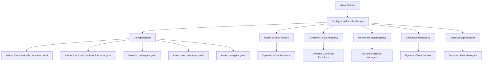

现在我来分析当前base.py中的硬编码问题，并设计一个完全基于外部配置的解决方案。

## 当前base.py中的硬编码问题分析

通过分析代码，我发现以下主要硬编码问题：

### 1. 内置节点函数硬编码
```python
# 第372-378行：硬编码的内置函数映射
builtin_functions = {
    "llm_node": self._create_llm_node,
    "tool_node": self._create_tool_node,
    "analysis_node": self._create_analysis_node,
    "condition_node": self._create_condition_node,
    "wait_node": self._create_wait_node,
}
```

### 2. 内置条件函数硬编码
```python
# 第438-442行：硬编码的条件函数映射
builtin_conditions = {
    "has_tool_calls": self._condition_has_tool_calls,
    "needs_more_info": self._condition_needs_more_info,
    "is_complete": self._condition_is_complete,
}
```

### 3. 检查点类型硬编码
```python
# 第610-617行：硬编码的检查点类型
if config.checkpointer == "memory":
    from langgraph.checkpoint.memory import InMemorySaver
    checkpointer = InMemorySaver()
elif config.checkpointer.startswith("sqlite:"):
    from langgraph.checkpoint.sqlite import SqliteSaver
    db_path = config.checkpointer[7:]
    checkpointer = SqliteSaver.from_conn_string(f"sqlite:///{db_path}")
```

### 4. 迭代管理器硬编码
```python
# 第974-1004行：硬编码的SimpleIterationManager类
class SimpleIterationManager:
    def __init__(self, config: GraphConfig):
        self.config = config
        self.max_iterations = getattr(config, 'max_iterations', 100)  # 硬编码默认值
```

### 5. 状态管理包装硬编码
```python
# 第472-495行：硬编码的协作适配器导入路径
collaboration_adapter_path = "src.adapters.workflow.collaboration_adapter"
from src.adapters.workflow.collaboration_adapter import CollaborationStateAdapter
```

## 设计基于配置的解决方案

基于现有的配置系统架构，我设计以下解决方案：

### 1. 配置驱动的内置函数加载系统

创建专门的配置文件来定义内置函数：

```yaml
# configs/builtin_functions/node_functions.yaml
node_functions:
  llm_node:
    class_path: "src.core.workflow.graph.builtin.nodes.llm_node:LLMNode"
    config_file: "configs/nodes/llm_node.yaml"
    enabled: true
    fallback_enabled: true
    
  tool_node:
    class_path: "src.core.workflow.graph.builtin.nodes.tool_node:ToolNode"
    config_file: "configs/nodes/tool_node.yaml"
    enabled: true
    fallback_enabled: true
```

```yaml
# configs/builtin_functions/condition_functions.yaml
condition_functions:
  has_tool_calls:
    class_path: "src.core.workflow.graph.builtin.conditions.tool_conditions:HasToolCalls"
    config_file: "configs/conditions/has_tool_calls.yaml"
    enabled: true
    fallback_enabled: true
```

### 2. 配置驱动的迭代管理系统

```yaml
# configs/iteration_managers.yaml
iteration_managers:
  simple:
    class_path: "src.core.workflow.iteration.simple_manager:SimpleIterationManager"
    default_config:
      max_iterations: 100
      enable_tracking: true
      enable_metrics: false
    
  advanced:
    class_path: "src.core.workflow.iteration.advanced_manager:AdvancedIterationManager"
    default_config:
      max_iterations: 1000
      enable_tracking: true
      enable_metrics: true
      enable_persistence: true

default_manager: "simple"
```

### 3. 配置驱动的检查点管理系统

```yaml
# configs/checkpoint_managers.yaml
checkpoint_managers:
  memory:
    class_path: "langgraph.checkpoint.memory:InMemorySaver"
    constructor_args: {}
    
  sqlite:
    class_path: "langgraph.checkpoint.sqlite:SqliteSaver"
    constructor_args:
      from_conn_string: "sqlite:///{db_path}"
    
  custom:
    class_path: "src.core.workflow.checkpoint.custom:CustomCheckpointer"
    constructor_args:
      backend: "redis"
      host: "${REDIS_HOST:localhost}"
      port: "${REDIS_PORT:6379}"

default_checkpointer: "memory"
```

### 4. 配置驱动的状态管理系统

```yaml
# configs/state_managers.yaml
state_managers:
  collaboration:
    class_path: "src.adapters.workflow.collaboration_adapter:CollaborationStateAdapter"
    enabled: true
    
  simple:
    class_path: "src.core.workflow.state.simple_adapter:SimpleStateAdapter"
    enabled: true
    
  advanced:
    class_path: "src.core.workflow.state.advanced_adapter:AdvancedStateAdapter"
    enabled: false

default_manager: "simple"
```

### 5. 配置驱动的函数工厂

创建一个统一的函数工厂，根据配置动态加载和创建函数：

```python
# src/core/workflow/factory/function_factory.py
class ConfigurableFunctionFactory:
    def __init__(self, config_manager: ConfigManager):
        self.config_manager = config_manager
        self._function_cache = {}
        
    def create_node_function(self, function_name: str, **kwargs) -> Callable:
        """根据配置创建节点函数"""
        
    def create_condition_function(self, condition_name: str, **kwargs) -> Callable:
        """根据配置创建条件函数"""
        
    def create_iteration_manager(self, manager_type: str, **kwargs) -> Any:
        """根据配置创建迭代管理器"""
        
    def create_checkpointer(self, checkpointer_type: str, **kwargs) -> Any:
        """根据配置创建检查点"""
```

## 实现架构图



## 配置文件结构设计

```
configs/
├── builtin_functions/
│   ├── __registry__.yaml
│   ├── node_functions.yaml
│   ├── condition_functions.yaml
│   └── edge_functions.yaml
├── iteration_managers.yaml
├── checkpoint_managers.yaml
├── state_managers.yaml
├── function_factory.yaml
└── workflow_builder.yaml
```

## 主要优势

1. **完全配置驱动**：所有内置功能都通过配置文件定义，无需修改代码即可扩展
2. **热插拔支持**：可以动态启用/禁用功能，支持运行时配置更新
3. **类型安全**：通过配置验证确保类型安全
4. **缓存优化**：支持函数实例缓存，提高性能
5. **向后兼容**：保持现有API不变，内部实现完全重构
6. **环境变量支持**：支持环境变量注入，便于部署配置

这个设计完全消除了base.py中的硬编码问题，使系统更加灵活、可扩展和可维护。