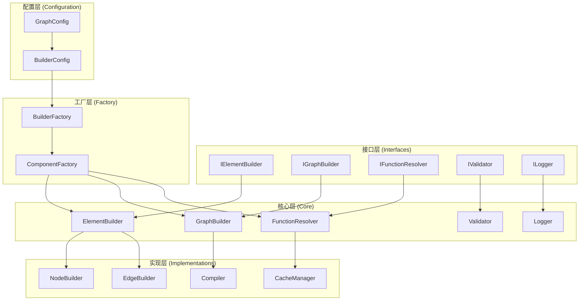

现在我将设计一个统一的构建器架构模式来解决这些问题。

## 🏗️ 统一构建器架构设计

### 核心设计原则

1. **单一职责原则**：每个组件只负责一个特定功能
2. **依赖倒置原则**：依赖抽象而非具体实现
3. **组合优于继承**：使用组合模式组织功能
4. **策略模式**：支持不同的构建策略
5. **工厂模式**：统一创建和配置组件

### 架构层次结构



### 1. 统一元素构建接口

```python
# src/interfaces/workflow/element_builder.py
from abc import ABC, abstractmethod
from typing import Any, Dict, List, Optional, Union
from src.core.workflow.config.config import NodeConfig, EdgeConfig

class IElementBuilder(ABC):
    """统一元素构建接口"""
    
    @abstractmethod
    def can_build(self, element_type: str) -> bool:
        """检查是否可以构建指定类型的元素"""
        pass
    
    @abstractmethod
    def build_element(self, config: Union[NodeConfig, EdgeConfig], context: Dict[str, Any]) -> Any:
        """构建元素"""
        pass
    
    @abstractmethod
    def validate_config(self, config: Union[NodeConfig, EdgeConfig]) -> List[str]:
        """验证配置"""
        pass
    
    @abstractmethod
    def get_supported_types(self) -> List[str]:
        """获取支持的元素类型"""
        pass
```

### 2. 统一函数解析接口

```python
# src/interfaces/workflow/function_resolver.py
from abc import ABC, abstractmethod
from typing import Any, Callable, Dict, Optional, Union

class IFunctionResolver(ABC):
    """统一函数解析接口"""
    
    @abstractmethod
    def resolve_function(self, function_name: str, function_type: str, context: Optional[Dict[str, Any]] = None) -> Optional[Callable]:
        """解析函数"""
        pass
    
    @abstractmethod
    def register_function(self, name: str, function: Callable, function_type: str) -> None:
        """注册函数"""
        pass
    
    @abstractmethod
    def get_supported_types(self) -> List[str]:
        """获取支持的函数类型"""
        pass
```

### 3. 统一构建器配置

```python
# src/core/workflow/config/builder_config.py
from dataclasses import dataclass, field
from typing import Dict, Any, Optional, List

@dataclass
class BuilderConfig:
    """构建器配置"""
    
    # 基础配置
    enable_caching: bool = True
    enable_validation: bool = True
    enable_logging: bool = True
    
    # 函数解析配置
    function_fallback_enabled: bool = True
    function_resolution_order: List[str] = field(default_factory=lambda: [
        "function_registry", "node_registry", "builtin_functions"
    ])
    
    # 构建策略配置
    node_building_strategy: str = "lazy"  # lazy, eager, cached
    edge_building_strategy: str = "optimized"  # optimized, sequential
    
    # 错误处理配置
    error_handling_strategy: str = "log_and_continue"  # fail_fast, log_and_continue
    max_retry_attempts: int = 3
    
    # 性能配置
    cache_size_limit: int = 1000
    parallel_building_enabled: bool = False
    max_parallel_workers: int = 4
    
    # 扩展配置
    custom_builders: Dict[str, str] = field(default_factory=dict)
    plugin_directories: List[str] = field(default_factory=list)
```

### 4. 统一构建器工厂

```python
# src/core/workflow/graph/builder/factory.py
from typing import Dict, Any, Optional, List
from src.interfaces.workflow import IElementBuilder, IFunctionResolver, IGraphBuilder
from src.core.workflow.config.builder_config import BuilderConfig

class BuilderFactory:
    """统一构建器工厂"""
    
    def __init__(self, config: BuilderConfig):
        self.config = config
        self._component_cache: Dict[str, Any] = {}
    
    def create_graph_builder(self, context: Optional[Dict[str, Any]] = None) -> IGraphBuilder:
        """创建图构建器"""
        if "graph_builder" not in self._component_cache:
            # 创建依赖组件
            function_resolver = self.create_function_resolver()
            element_builders = self.create_element_builders()
            validator = self.create_validator()
            logger = self.create_logger()
            
            # 创建图构建器
            from src.core.workflow.graph.builder.unified_graph_builder import UnifiedGraphBuilder
            self._component_cache["graph_builder"] = UnifiedGraphBuilder(
                function_resolver=function_resolver,
                element_builders=element_builders,
                validator=validator,
                logger=logger,
                config=self.config
            )
        
        return self._component_cache["graph_builder"]
    
    def create_function_resolver(self) -> IFunctionResolver:
        """创建函数解析器"""
        if "function_resolver" not in self._component_cache:
            from src.core.workflow.graph.builder.unified_function_resolver import UnifiedFunctionResolver
            self._component_cache["function_resolver"] = UnifiedFunctionResolver(
                config=self.config
            )
        
        return self._component_cache["function_resolver"]
    
    def create_element_builders(self) -> Dict[str, IElementBuilder]:
        """创建元素构建器"""
        if "element_builders" not in self._component_cache:
            builders = {}
            
            # 节点构建器
            from src.core.workflow.graph.builder.unified_node_builder import UnifiedNodeBuilder
            builders["node"] = UnifiedNodeBuilder(
                function_resolver=self.create_function_resolver(),
                config=self.config
            )
            
            # 边构建器
            from src.core.workflow.graph.builder.unified_edge_builder import UnifiedEdgeBuilder
            builders["edge"] = UnifiedEdgeBuilder(
                function_resolver=self.create_function_resolver(),
                config=self.config
            )
            
            self._component_cache["element_builders"] = builders
        
        return self._component_cache["element_builders"]
```

### 5. 统一图构建器

```python
# src/core/workflow/graph/builder/unified_graph_builder.py
from typing import Any, Dict, List, Optional
from src.interfaces.workflow import IGraphBuilder, IElementBuilder, IFunctionResolver, IValidator, ILogger
from src.core.workflow.config.config import GraphConfig
from src.core.workflow.config.builder_config import BuilderConfig

class UnifiedGraphBuilder(IGraphBuilder):
    """统一图构建器"""
    
    def __init__(
        self,
        function_resolver: IFunctionResolver,
        element_builders: Dict[str, IElementBuilder],
        validator: IValidator,
        logger: ILogger,
        config: BuilderConfig
    ):
        self.function_resolver = function_resolver
        self.element_builders = element_builders
        self.validator = validator
        self.logger = logger
        self.config = config
    
    def build_graph(self, config: GraphConfig, state_manager: Optional[Any] = None) -> Any:
        """构建图"""
        # 验证配置
        if self.config.enable_validation:
            validation_result = self.validate_config(config)
            if validation_result:
                raise ValueError(f"图配置验证失败: {validation_result}")
        
        # 创建构建上下文
        context = self._create_build_context(config, state_manager)
        
        # 创建LangGraph构建器
        builder = self._create_langgraph_builder(config)
        
        # 构建节点
        self._build_nodes(builder, config, context)
        
        # 构建边
        self._build_edges(builder, config, context)
        
        # 设置入口点
        self._set_entry_point(builder, config)
        
        # 编译图
        return self._compile_graph(builder, config)
    
    def _build_nodes(self, builder: Any, config: GraphConfig, context: Dict[str, Any]) -> None:
        """构建节点"""
        node_builder = self.element_builders["node"]
        
        for node_name, node_config in config.nodes.items():
            try:
                node_function = node_builder.build_element(node_config, context)
                if node_function:
                    builder.add_node(node_name, node_function)
                    self.logger.debug(f"成功添加节点: {node_name}")
                else:
                    self.logger.warning(f"无法构建节点函数: {node_config.function_name}")
            except Exception as e:
                self._handle_build_error("节点", node_name, e)
    
    def _build_edges(self, builder: Any, config: GraphConfig, context: Dict[str, Any]) -> None:
        """构建边"""
        edge_builder = self.element_builders["edge"]
        
        for edge_config in config.edges:
            try:
                edge_builder.build_element(edge_config, {"builder": builder, **context})
                self.logger.debug(f"成功添加边: {edge_config.from_node} -> {edge_config.to_node}")
            except Exception as e:
                self._handle_build_error("边", f"{edge_config.from_node}->{edge_config.to_node}", e)
```

### 6. 统一元素构建器基类

```python
# src/core/workflow/graph/builder/base_element_builder.py
from abc import ABC
from typing import Any, Dict, List, Optional, Union
from src.interfaces.workflow import IElementBuilder, IFunctionResolver, ILogger
from src.core.workflow.config.builder_config import BuilderConfig

class BaseElementBuilder(IElementBuilder, ABC):
    """统一元素构建器基类"""
    
    def __init__(
        self,
        function_resolver: IFunctionResolver,
        logger: ILogger,
        config: BuilderConfig
    ):
        self.function_resolver = function_resolver
        self.logger = logger
        self.config = config
        self._build_cache: Dict[str, Any] = {}
    
    def validate_config(self, config: Union[NodeConfig, EdgeConfig]) -> List[str]:
        """验证配置"""
        errors = []
        
        # 基础验证
        if not config:
            errors.append("配置不能为空")
        
        # 子类特定验证
        specific_errors = self._validate_specific_config(config)
        errors.extend(specific_errors)
        
        return errors
    
    def _get_cached_result(self, cache_key: str) -> Optional[Any]:
        """获取缓存结果"""
        if self.config.enable_caching and cache_key in self._build_cache:
            return self._build_cache[cache_key]
        return None
    
    def _cache_result(self, cache_key: str, result: Any) -> None:
        """缓存结果"""
        if self.config.enable_caching:
            self._build_cache[cache_key] = result
    
    def _handle_build_error(self, element_type: str, element_name: str, error: Exception) -> None:
        """处理构建错误"""
        error_msg = f"构建{element_type} {element_name} 失败: {str(error)}"
        
        if self.config.error_handling_strategy == "fail_fast":
            raise RuntimeError(error_msg) from error
        else:
            self.logger.error(error_msg)
    
    @abstractmethod
    def _validate_specific_config(self, config: Union[NodeConfig, EdgeConfig]) -> List[str]:
        """子类特定的配置验证"""
        pass
```

### 7. 统一函数解析器

```python
# src/core/workflow/graph/builder/unified_function_resolver.py
from typing import Any, Callable, Dict, List, Optional, Union
from src.interfaces.workflow import IFunctionResolver, ILogger
from src.core.workflow.config.builder_config import BuilderConfig

class UnifiedFunctionResolver(IFunctionResolver):
    """统一函数解析器"""
    
    def __init__(self, config: BuilderConfig, logger: Optional[ILogger] = None):
        self.config = config
        self.logger = logger
        self._function_registries: Dict[str, Any] = {}
        self._resolution_strategies: Dict[str, List[Callable]] = {}
        
        # 初始化解析策略
        self._initialize_resolution_strategies()
    
    def resolve_function(self, function_name: str, function_type: str, context: Optional[Dict[str, Any]] = None) -> Optional[Callable]:
        """解析函数"""
        # 检查缓存
        cache_key = f"{function_type}:{function_name}"
        if self.config.enable_caching and cache_key in self._function_cache:
            return self._function_cache[cache_key]
        
        # 按配置的顺序尝试解析
        resolution_order = self.config.function_resolution_order
        for strategy_name in resolution_order:
            if strategy_name in self._resolution_strategies:
                for strategy in self._resolution_strategies[strategy_name]:
                    function = strategy(function_name, function_type, context)
                    if function:
                        # 缓存结果
                        if self.config.enable_caching:
                            self._function_cache[cache_key] = function
                        return function
        
        # 如果启用回退，尝试内置函数
        if self.config.function_fallback_enabled:
            fallback_function = self._get_fallback_function(function_name, function_type)
            if fallback_function:
                if self.config.enable_caching:
                    self._function_cache[cache_key] = fallback_function
                return fallback_function
        
        self.logger.warning(f"无法解析函数: {function_name} (类型: {function_type})")
        return None
    
    def _initialize_resolution_strategies(self) -> None:
        """初始化解析策略"""
        # 函数注册表策略
        self._resolution_strategies["function_registry"] = [
            self._resolve_from_function_registry
        ]
        
        # 节点注册表策略
        self._resolution_strategies["node_registry"] = [
            self._resolve_from_node_registry
        ]
        
        # 内置函数策略
        self._resolution_strategies["builtin_functions"] = [
            self._resolve_from_builtin_functions
        ]
```

## 🎯 架构优势

1. **消除代码冗余**：通过统一的基类和接口，减少约470行重复代码
2. **提高可维护性**：单一职责原则，每个组件专注特定功能
3. **增强可扩展性**：通过策略模式支持新的解析和构建策略
4. **改善测试性**：依赖注入使得单元测试更容易
5. **统一配置管理**：集中的配置系统支持灵活的定制
6. **优化性能**：统一的缓存机制和可选的并行构建