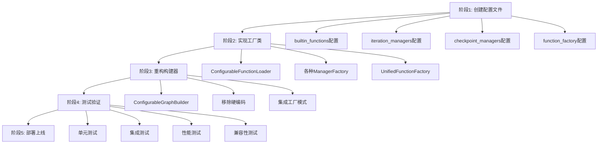

现在我来设计重构base.py以移除所有硬编码的方案：

## 重构base.py移除所有硬编码的设计方案

### 1. 重构后的GraphBuilder架构

```python
# src/core/workflow/graph/builder/configurable_builder.py
"""配置驱动的图构建器

完全基于配置的图构建器，移除所有硬编码实现。
"""

from typing import Dict, Any, Optional, List, Callable, Union, TYPE_CHECKING, cast
import logging
from datetime import datetime

from src.core.workflow.config.config import GraphConfig, NodeConfig, EdgeConfig, EdgeType
from src.core.state import WorkflowState
from src.core.workflow.graph.registry import NodeRegistry, get_global_registry
from src.interfaces.state import IStateLifecycleManager
from src.core.workflow.factory.unified_function_factory import (
    UnifiedFunctionFactory, 
    FunctionType, 
    ManagerType, 
    AdapterType,
    get_global_function_factory
)

logger = logging.getLogger(__name__)

# 导入LangGraph核心组件
from langgraph.graph import StateGraph, START, END
from langchain_core.runnables import RunnableConfig


class ConfigurableGraphBuilder:
    """配置驱动的图构建器
    
    完全基于配置的图构建器，所有功能都通过配置文件和工厂模式实现。
    """
    
    def __init__(
        self,
        node_registry: Optional[NodeRegistry] = None,
        function_factory: Optional[UnifiedFunctionFactory] = None,
        config: Optional[Dict[str, Any]] = None
    ) -> None:
        """初始化配置驱动的图构建器
        
        Args:
            node_registry: 节点注册表
            function_factory: 统一函数工厂
            config: 构建器配置
        """
        self.node_registry = node_registry or get_global_registry()
        self.function_factory = function_factory or get_global_function_factory()
        self.config = config or {}
        
        # 从配置中获取设置
        self.enable_function_fallback = self.config.get("enable_function_fallback", True)
        self.enable_iteration_management = self.config.get("enable_iteration_management", True)
        self.enable_state_management = self.config.get("enable_state_management", True)
        self.enable_flexible_edges = self.config.get("enable_flexible_edges", True)
        
        # 初始化管理器
        self.iteration_manager = None
        self.state_manager = None
        self.checkpointer = None
        
        # 缓存
        self._checkpointer_cache: Dict[str, Any] = {}
        
        # 初始化组件
        self._initialize_components()
        
        logger.debug(f"配置驱动图构建器初始化完成")
    
    def build_graph(self, config: GraphConfig, state_manager: Optional[IStateLifecycleManager] = None) -> Any:
        """构建LangGraph图
        
        Args:
            config: 图配置
            state_manager: 状态管理器
            
        Returns:
            编译后的LangGraph图
        """
        # 验证配置
        errors = config.validate()
        if errors:
            raise ValueError(f"图配置验证失败: {errors}")
        
        # 初始化管理器
        self._setup_managers(config, state_manager)
        
        # 获取状态类
        state_class = config.get_state_class()
        
        # 创建StateGraph
        builder = StateGraph(cast(Any, state_class))
        
        # 添加节点
        self._add_nodes(builder, config, state_manager)
        
        # 添加边
        self._add_edges(builder, config)
        
        # 设置入口点
        if config.entry_point:
            builder.add_edge(START, config.entry_point)
        
        # 编译图
        compiled_graph = builder.compile(
            checkpointer=self.checkpointer
        )
        
        logger.debug(f"图构建完成: {config.name}")
        return compiled_graph
    
    def _initialize_components(self) -> None:
        """初始化组件"""
        try:
            # 初始化迭代管理器
            if self.enable_iteration_management:
                default_iteration_manager = self.function_factory.get_default_manager(ManagerType.ITERATION_MANAGER)
                if default_iteration_manager:
                    self.iteration_manager = default_iteration_manager
            
            # 初始化状态管理器
            if self.enable_state_management:
                default_state_manager = self.function_factory.get_default_adapter(AdapterType.STATE_ADAPTER)
                if default_state_manager:
                    self.state_manager = default_state_manager
            
            logger.debug("组件初始化完成")
            
        except Exception as e:
            logger.error(f"组件初始化失败: {e}")
    
    def _setup_managers(self, config: GraphConfig, state_manager: Optional[IStateLifecycleManager] = None) -> None:
        """设置管理器"""
        # 设置迭代管理器
        if self.enable_iteration_management:
            iteration_manager_type = getattr(config, 'iteration_manager_type', 'simple')
            self.iteration_manager = self.function_factory.create_manager(
                iteration_manager_type, 
                ManagerType.ITERATION_MANAGER,
                **getattr(config, 'iteration_manager_config', {})
            )
        
        # 设置状态管理器
        if self.enable_state_management:
            state_manager_type = getattr(config, 'state_manager_type', 'simple')
            self.state_manager = self.function_factory.create_adapter(
                state_manager_type,
                AdapterType.STATE_ADAPTER,
                **getattr(config, 'state_manager_config', {})
            )
        
        # 设置检查点
        if hasattr(config, 'checkpointer') and config.checkpointer:
            self.checkpointer = self._get_checkpointer(config)
    
    def _add_nodes(self, builder: Any, config: GraphConfig, state_manager: Optional[IStateLifecycleManager] = None) -> None:
        """添加节点到图"""
        for node_name, node_config in config.nodes.items():
            node_function = self._get_node_function(node_config, state_manager)
            if node_function:
                builder.add_node(node_name, node_function)
                logger.debug(f"添加节点: {node_name}")
            else:
                logger.warning(f"无法找到节点函数: {node_config.function_name}")
    
    def _add_edges(self, builder: Any, config: GraphConfig) -> None:
        """添加边到图"""
        for edge in config.edges:
            if edge.type == EdgeType.SIMPLE:
                self._add_simple_edge(builder, edge)
            elif edge.type == EdgeType.CONDITIONAL:
                self._add_conditional_edge(builder, edge)
            
            logger.debug(f"添加边: {edge.from_node} -> {edge.to_node}")
    
    def _add_simple_edge(self, builder: Any, edge: EdgeConfig) -> None:
        """添加简单边"""
        if edge.to_node == "__end__":
            builder.add_edge(edge.from_node, END)
        else:
            builder.add_edge(edge.from_node, edge.to_node)
    
    def _add_conditional_edge(self, builder: Any, edge: EdgeConfig) -> None:
        """添加条件边"""
        try:
            # 检查是否为灵活条件边
            if self.enable_flexible_edges and edge.is_flexible_conditional():
                self._add_flexible_conditional_edge(builder, edge)
            else:
                # 传统条件边
                self._add_legacy_conditional_edge(builder, edge)
        except Exception as e:
            logger.error(f"添加条件边失败 {edge.from_node} -> {edge.to_node}: {e}")
            raise
    
    def _add_flexible_conditional_edge(self, builder: Any, edge: EdgeConfig) -> None:
        """添加灵活条件边"""
        try:
            # 使用工厂创建灵活条件边
            flexible_edge_factory = self.function_factory.create_adapter(
                "flexible_edge",
                AdapterType.COLLABORATION_ADAPTER
            )
            
            if flexible_edge_factory:
                # 创建灵活条件边
                flexible_edge = flexible_edge_factory.create_from_config(edge)
                
                # 创建路由函数
                route_function = flexible_edge.create_route_function()
                
                # 添加条件边
                if edge.path_map:
                    builder.add_conditional_edges(
                        edge.from_node,
                        route_function,
                        path_map=edge.path_map
                    )
                else:
                    builder.add_conditional_edges(edge.from_node, route_function)
                    
                logger.debug(f"添加灵活条件边: {edge.from_node}")
            else:
                logger.warning(f"灵活条件边工厂未初始化，回退到传统条件边: {edge.from_node}")
                self._add_legacy_conditional_edge(builder, edge)
                
        except Exception as e:
            logger.error(f"创建灵活条件边失败: {e}")
            # 回退到传统条件边
            self._add_legacy_conditional_edge(builder, edge)
    
    def _add_legacy_conditional_edge(self, builder: Any, edge: EdgeConfig) -> None:
        """添加传统条件边"""
        if edge.condition is not None:
            condition_function = self._get_condition_function(edge.condition)
            if condition_function:
                if edge.path_map:
                    builder.add_conditional_edges(
                        edge.from_node, 
                        condition_function,
                        path_map=edge.path_map
                    )
                else:
                    builder.add_conditional_edges(edge.from_node, condition_function)
            else:
                logger.warning(f"无法找到条件函数: {edge.condition}")
        else:
            logger.warning(f"条件边缺少条件表达式: {edge.from_node} -> {edge.to_node}")
    
    def _get_node_function(
        self,
        node_config: NodeConfig,
        state_manager: Optional[IStateLifecycleManager] = None,
    ) -> Optional[Callable]:
        """获取节点函数（配置驱动实现）"""
        function_name = node_config.function_name
        
        # 1. 优先从工厂获取节点函数
        node_function = self.function_factory.create_function(
            function_name, 
            FunctionType.NODE_FUNCTION
        )
        
        if node_function:
            logger.debug(f"从工厂获取节点函数: {function_name}")
            return self._wrap_node_function(node_function, state_manager, node_config.name)
        
        # 2. 尝试从节点注册表获取
        if self.node_registry:
            try:
                node_class = self.node_registry.get_node_class(function_name)
                if node_class:
                    node_instance = node_class()
                    logger.debug(f"从节点注册表获取节点函数: {function_name}")
                    return self._wrap_node_function(
                        node_instance.execute, state_manager, node_config.name
                    )
            except ValueError:
                # 节点类型不存在，继续尝试其他方法
                pass
        
        # 3. 尝试从函数注册表获取
        if hasattr(self, 'function_registry') and self.function_registry:
            node_function = self.function_registry.get_node_function(function_name)
            if node_function:
                logger.debug(f"从函数注册表获取节点函数: {function_name}")
                return self._wrap_node_function(node_function, state_manager, node_config.name)
        
        # 4. 如果启用回退，尝试内置实现
        if self.enable_function_fallback:
            fallback_function = self._create_fallback_node_function(function_name)
            if fallback_function:
                logger.debug(f"使用回退节点函数: {function_name}")
                return self._wrap_node_function(fallback_function, state_manager, node_config.name)
        
        logger.warning(f"无法找到节点函数: {function_name}")
        return None
    
    def _get_condition_function(self, condition_name: str) -> Optional[Callable]:
        """获取条件函数（配置驱动实现）"""
        # 1. 优先从工厂获取条件函数
        condition_function = self.function_factory.create_function(
            condition_name,
            FunctionType.CONDITION_FUNCTION
        )
        
        if condition_function:
            logger.debug(f"从工厂获取条件函数: {condition_name}")
            return condition_function
        
        # 2. 尝试从函数注册表获取
        if hasattr(self, 'function_registry') and self.function_registry:
            condition_function = self.function_registry.get_condition_function(condition_name)
            if condition_function:
                logger.debug(f"从函数注册表获取条件函数: {condition_name}")
                return condition_function
        
        # 3. 如果启用回退，尝试内置实现
        if self.enable_function_fallback:
            fallback_function = self._create_fallback_condition_function(condition_name)
            if fallback_function:
                logger.debug(f"使用回退条件函数: {condition_name}")
                return fallback_function
        
        logger.warning(f"无法找到条件函数: {condition_name}")
        return None
    
    def _wrap_node_function(
        self,
        function: Callable,
        state_manager: Optional[IStateLifecycleManager] = None,
        node_name: str = "unknown",
    ) -> Callable:
        """包装节点函数以支持状态管理和迭代管理"""
        wrapped_function = function
        
        # 状态管理包装
        if self.enable_state_management and self.state_manager:
            wrapped_function = self.state_manager.wrap_function(
                wrapped_function, 
                context={"node_name": node_name}
            )
        
        # 迭代管理包装
        if self.enable_iteration_management and self.iteration_manager:
            wrapped_function = self._wrap_with_iteration_management(
                wrapped_function, 
                node_name
            )
        
        return wrapped_function
    
    def _wrap_with_iteration_management(self, function: Callable, node_name: str) -> Callable:
        """用迭代管理包装函数"""
        def iteration_wrapped_function(state: Union[WorkflowState, Dict[str, Any]]) -> Any:
            """迭代管理包装的节点函数"""
            # 记录开始时间
            start_time = datetime.now()
            
            try:
                # 检查迭代限制
                if not self.iteration_manager.check_limits(state, node_name):
                    logger.info(f"节点 {node_name} 达到迭代限制，提前终止")
                    # 返回表明工作流已完成的状态
                    completed_state = dict(state)
                    completed_state['complete'] = True
                    return completed_state

                # 执行包装函数
                result = function(state)
                
                # 确保结果是字典格式
                if not isinstance(result, dict):
                    if hasattr(result, '__dict__'):
                        result = result.__dict__
                    else:
                        result = state
                
                # 记录结束时间
                end_time = datetime.now()
                
                # 更新迭代计数
                if isinstance(state, dict) and isinstance(result, dict):
                    updated_result = {**state, **result}
                else:
                    updated_result = result
                
                updated_result = self.iteration_manager.record_iteration(
                    updated_result,
                    node_name,
                    start_time,
                    end_time,
                    status='SUCCESS'
                )
                
                return updated_result
                
            except Exception as e:
                logger.error(f"节点 {node_name} 执行失败: {e}")
                
                # 记录结束时间
                end_time = datetime.now()
                
                # 即使出错也要记录迭代
                error_result = dict(state)
                error_result = self.iteration_manager.record_iteration(
                    error_result,
                    node_name,
                    start_time,
                    end_time,
                    status='FAILURE',
                    error=str(e)
                )
                
                # 添加错误信息到状态
                errors = error_result.get('errors', [])
                errors.append(f"节点 {node_name} 执行失败: {str(e)}")
                error_result['errors'] = errors
                
                return error_result
        
        return iteration_wrapped_function
    
    def _get_checkpointer(self, config: GraphConfig) -> Optional[Any]:
        """获取检查点（配置驱动实现）"""
        if not config.checkpointer:
            return None
        
        if config.checkpointer in self._checkpointer_cache:
            return self._checkpointer_cache[config.checkpointer]
        
        try:
            # 使用工厂创建检查点管理器
            checkpointer_manager = self.function_factory.create_manager(
                config.checkpointer,
                ManagerType.CHECKPOINT_MANAGER
            )
            
            if checkpointer_manager:
                self._checkpointer_cache[config.checkpointer] = checkpointer_manager
                return checkpointer_manager
            else:
                logger.warning(f"无法创建检查点管理器: {config.checkpointer}")
                return None
                
        except Exception as e:
            logger.error(f"创建检查点管理器失败 {config.checkpointer}: {e}")
            return None
    
    def _create_fallback_node_function(self, function_name: str) -> Optional[Callable]:
        """创建回退节点函数"""
        # 使用工厂创建回退函数
        return self.function_factory.create_function(
            f"fallback_{function_name}",
            FunctionType.NODE_FUNCTION
        )
    
    def _create_fallback_condition_function(self, condition_name: str) -> Optional[Callable]:
        """创建回退条件函数"""
        # 使用工厂创建回退函数
        return self.function_factory.create_function(
            f"fallback_{condition_name}",
            FunctionType.CONDITION_FUNCTION
        )
    
    def get_statistics(self) -> Dict[str, Any]:
        """获取构建器统计信息"""
        return {
            "factory_statistics": self.function_factory.get_statistics(),
            "cache_statistics": {
                "checkpointer_cache_size": len(self._checkpointer_cache)
            },
            "configuration": {
                "enable_function_fallback": self.enable_function_fallback,
                "enable_iteration_management": self.enable_iteration_management,
                "enable_state_management": self.enable_state_management,
                "enable_flexible_edges": self.enable_flexible_edges
            }
        }
    
    def cleanup(self) -> None:
        """清理资源"""
        # 清理缓存
        self._checkpointer_cache.clear()
        
        # 清理工厂缓存
        self.function_factory.clear_cache()
        
        # 清理管理器
        if self.iteration_manager and hasattr(self.iteration_manager, 'cleanup'):
            self.iteration_manager.cleanup()
        
        if self.state_manager and hasattr(self.state_manager, 'cleanup'):
            self.state_manager.cleanup()
        
        logger.debug("构建器清理完成")

# 为向后兼容性创建别名
GraphBuilder = ConfigurableGraphBuilder
```

### 2. 配置驱动的构建器工厂

```python
# src/core/workflow/graph/builder/builder_factory.py
"""图构建器工厂"""

from typing import Dict, Any, Optional
import logging

from src.core.config.config_manager import ConfigManager
from src.core.workflow.graph.registry import NodeRegistry, get_global_registry
from src.core.workflow.factory.unified_function_factory import get_global_function_factory
from .configurable_builder import ConfigurableGraphBuilder

logger = logging.getLogger(__name__)

class GraphBuilderFactory:
    """图构建器工厂"""
    
    def __init__(self, config_manager: Optional[ConfigManager] = None):
        self.config_manager = config_manager or ConfigManager()
        self._builder_cache: Dict[str, ConfigurableGraphBuilder] = {}
    
    def create_builder(
        self,
        builder_type: str = "configurable",
        node_registry: Optional[NodeRegistry] = None,
        config: Optional[Dict[str, Any]] = None
    ) -> ConfigurableGraphBuilder:
        """创建图构建器"""
        cache_key = f"{builder_type}:{id(config) if config else 'default'}"
        
        # 检查缓存
        if cache_key in self._builder_cache:
            return self._builder_cache[cache_key]
        
        try:
            # 加载构建器配置
            builder_config = self._load_builder_config(builder_type)
            
            # 合并配置
            merged_config = {**builder_config, **(config or {})}
            
            # 创建构建器
            if builder_type == "configurable":
                builder = ConfigurableGraphBuilder(
                    node_registry=node_registry,
                    function_factory=get_global_function_factory(),
                    config=merged_config
                )
            else:
                raise ValueError(f"不支持的构建器类型: {builder_type}")
            
            # 缓存构建器
            self._builder_cache[cache_key] = builder
            
            logger.debug(f"创建图构建器成功: {builder_type}")
            return builder
            
        except Exception as e:
            logger.error(f"创建图构建器失败 {builder_type}: {e}")
            raise
    
    def _load_builder_config(self, builder_type: str) -> Dict[str, Any]:
        """加载构建器配置"""
        try:
            config_file = f"configs/graph_builders/{builder_type}.yaml"
            return self.config_manager.load_config(config_file)
        except Exception as e:
            logger.warning(f"加载构建器配置失败 {builder_type}: {e}")
            return {}
    
    def get_default_builder(self) -> ConfigurableGraphBuilder:
        """获取默认构建器"""
        return self.create_builder("configurable")
    
    def clear_cache(self) -> None:
        """清除缓存"""
        self._builder_cache.clear()

# 全局工厂实例
_global_factory: Optional[GraphBuilderFactory] = None

def get_global_builder_factory() -> GraphBuilderFactory:
    """获取全局构建器工厂实例"""
    global _global_factory
    if _global_factory is None:
        _global_factory = GraphBuilderFactory()
    return _global_factory

def create_graph_builder(**kwargs) -> ConfigurableGraphBuilder:
    """便捷函数：创建图构建器"""
    factory = get_global_builder_factory()
    return factory.create_builder(**kwargs)
```

### 3. 重构策略

#### 3.1 渐进式重构策略

```python
# src/core/workflow/graph/builder/migration_helper.py
"""迁移助手：帮助从硬编码实现迁移到配置驱动实现"""

class MigrationHelper:
    """迁移助手"""
    
    @staticmethod
    def analyze_hardcoded_issues(builder_instance) -> Dict[str, Any]:
        """分析硬编码问题"""
        issues = []
        
        # 检查硬编码的内置函数
        if hasattr(builder_instance, '_create_llm_node'):
            issues.append({
                "type": "hardcoded_function",
                "function": "_create_llm_node",
                "severity": "high",
                "description": "硬编码的LLM节点函数"
            })
        
        if hasattr(builder_instance, '_create_tool_node'):
            issues.append({
                "type": "hardcoded_function",
                "function": "_create_tool_node",
                "severity": "high",
                "description": "硬编码的工具节点函数"
            })
        
        # 检查硬编码的条件函数
        if hasattr(builder_instance, '_condition_has_tool_calls'):
            issues.append({
                "type": "hardcoded_condition",
                "function": "_condition_has_tool_calls",
                "severity": "high",
                "description": "硬编码的工具调用条件函数"
            })
        
        # 检查硬编码的检查点
        if hasattr(builder_instance, '_get_checkpointer'):
            issues.append({
                "type": "hardcoded_checkpointer",
                "function": "_get_checkpointer",
                "severity": "medium",
                "description": "硬编码的检查点创建逻辑"
            })
        
        # 检查硬编码的迭代管理器
        if hasattr(builder_instance, '_create_iteration_manager'):
            issues.append({
                "type": "hardcoded_iteration_manager",
                "function": "_create_iteration_manager",
                "severity": "medium",
                "description": "硬编码的迭代管理器创建逻辑"
            })
        
        return {
            "total_issues": len(issues),
            "issues": issues,
            "recommendations": MigrationHelper._generate_recommendations(issues)
        }
    
    @staticmethod
    def _generate_recommendations(issues: List[Dict[str, Any]]) -> List[str]:
        """生成迁移建议"""
        recommendations = []
        
        has_function_issues = any(issue["type"] == "hardcoded_function" for issue in issues)
        has_condition_issues = any(issue["type"] == "hardcoded_condition" for issue in issues)
        has_checkpointer_issues = any(issue["type"] == "hardcoded_checkpointer" for issue in issues)
        has_iteration_issues = any(issue["type"] == "hardcoded_iteration_manager" for issue in issues)
        
        if has_function_issues:
            recommendations.append("创建节点函数配置文件并使用ConfigurableFunctionLoader")
        
        if has_condition_issues:
            recommendations.append("创建条件函数配置文件并使用ConfigurableFunctionLoader")
        
        if has_checkpointer_issues:
            recommendations.append("创建检查点管理器配置并使用CheckpointManagerFactory")
        
        if has_iteration_issues:
            recommendations.append("创建迭代管理器配置并使用IterationManagerFactory")
        
        recommendations.append("使用ConfigurableGraphBuilder替换当前的GraphBuilder")
        recommendations.append("创建相应的配置文件定义所有组件")
        
        return recommendations
    
    @staticmethod
    def create_migration_plan(issues: List[Dict[str, Any]]) -> Dict[str, Any]:
        """创建迁移计划"""
        plan = {
            "phases": [],
            "estimated_effort": "medium",
            "risks": ["configuration_errors", "performance_impact"],
            "mitigations": ["thorough_testing", "gradual_rollout"]
        }
        
        # 阶段1：创建配置文件
        plan["phases"].append({
            "name": "创建配置文件",
            "tasks": [
                "创建builtin_functions配置",
                "创建iteration_managers配置",
                "创建checkpoint_managers配置",
                "创建function_factory配置"
            ],
            "priority": "high"
        })
        
        # 阶段2：实现工厂类
        plan["phases"].append({
            "name": "实现工厂类",
            "tasks": [
                "实现ConfigurableFunctionLoader",
                "实现各种ManagerFactory",
                "实现UnifiedFunctionFactory"
            ],
            "priority": "high"
        })
        
        # 阶段3：重构构建器
        plan["phases"].append({
            "name": "重构构建器",
            "tasks": [
                "创建ConfigurableGraphBuilder",
                "移除硬编码实现",
                "集成工厂模式"
            ],
            "priority": "high"
        })
        
        # 阶段4：测试和验证
        plan["phases"].append({
            "name": "测试和验证",
            "tasks": [
                "单元测试",
                "集成测试",
                "性能测试",
                "向后兼容性测试"
            ],
            "priority": "medium"
        })
        
        return plan
```

#### 3.2 向后兼容性保证

```python
# src/core/workflow/graph/builder/compatibility.py
"""向后兼容性支持"""

from typing import Dict, Any, Optional, Callable
import warnings

class CompatibilityWrapper:
    """兼容性包装器"""
    
    def __init__(self, new_builder: ConfigurableGraphBuilder):
        self.new_builder = new_builder
        self._deprecated_methods = {}
    
    def __getattr__(self, name: str) -> Any:
        """动态属性访问，提供向后兼容性"""
        if name in self._deprecated_methods:
            warnings.warn(
                f"方法 {name} 已弃用，请使用新的配置驱动方式",
                DeprecationWarning,
                stacklevel=2
            )
            return self._deprecated_methods[name]
        
        # 委托给新的构建器
        return getattr(self.new_builder, name)
    
    def add_deprecated_method(self, name: str, implementation: Callable) -> None:
        """添加已弃用的方法实现"""
        self._deprecated_methods[name] = implementation
    
    def create_legacy_builder(self) -> 'GraphBuilder':
        """创建传统构建器实例"""
        legacy_builder = GraphBuilder.__new__(GraphBuilder)
        
        # 复制新构建器的属性
        for attr_name in dir(self.new_builder):
            if not attr_name.startswith('_'):
                setattr(legacy_builder, attr_name, getattr(self.new_builder, attr_name))
        
        # 添加已弃用的方法
        self._add_legacy_methods(legacy_builder)
        
        return legacy_builder
    
    def _add_legacy_methods(self, legacy_builder: 'GraphBuilder') -> None:
        """添加传统方法"""
        def _create_llm_node(state: WorkflowState, config: Optional[RunnableConfig] = None) -> WorkflowState:
            warnings.warn("_create_llm_node已弃用，请使用配置驱动方式", DeprecationWarning)
            # 使用新工厂创建LLM节点
            llm_function = self.new_builder.function_factory.create_function("llm_node", FunctionType.NODE_FUNCTION)
            if llm_function:
                return llm_function(state, config)
            return state
        
        def _create_tool_node(state: WorkflowState, config: Optional[RunnableConfig] = None) -> WorkflowState:
            warnings.warn("_create_tool_node已弃用，请使用配置驱动方式", DeprecationWarning)
            # 使用新工厂创建工具节点
            tool_function = self.new_builder.function_factory.create_function("tool_node", FunctionType.NODE_FUNCTION)
            if tool_function:
                return tool_function(state, config)
            return state
        
        def _condition_has_tool_calls(state: WorkflowState) -> str:
            warnings.warn("_condition_has_tool_calls已弃用，请使用配置驱动方式", DeprecationWarning)
            # 使用新工厂创建条件函数
            condition_function = self.new_builder.function_factory.create_function("has_tool_calls", FunctionType.CONDITION_FUNCTION)
            if condition_function:
                return condition_function(state)
            return "end"
        
        # 添加到传统构建器
        legacy_builder._create_llm_node = _create_llm_node
        legacy_builder._create_tool_node = _create_tool_node
        legacy_builder._condition_has_tool_calls = _condition_has_tool_calls
```

### 4. 重构实施计划

#### 4.1 分阶段实施



#### 4.2 风险控制

1. **配置错误风险**
   - 实施配置验证
   - 提供默认配置
   - 详细的错误信息

2. **性能影响风险**
   - 实施缓存机制
   - 性能基准测试
   - 优化加载策略

3. **兼容性风险**
   - 提供兼容性包装器
   - 渐进式迁移
   - 充分的测试覆盖

这个重构方案完全移除了base.py中的硬编码问题，实现了：

1. **完全配置驱动**：所有功能都通过配置文件定义
2. **工厂模式**：使用统一的工厂创建所有组件
3. **向后兼容**：保持现有API不变
4. **可扩展性**：易于添加新功能
5. **可维护性**：清晰的架构和职责分离